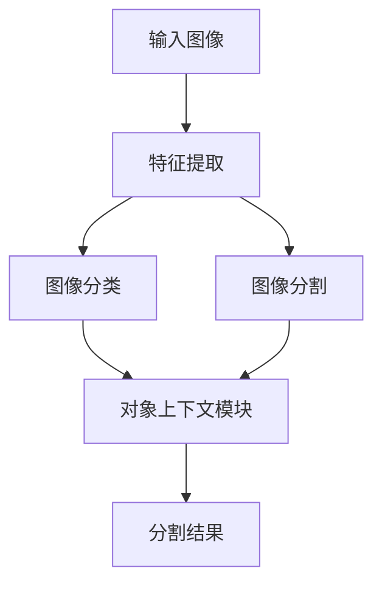

# OCRNet与图像分类：辅助识别，提升分割精度

作者：禅与计算机程序设计艺术

## 1.背景介绍

### 1.1 计算机视觉的发展

计算机视觉是人工智能领域中最具挑战性和前景的研究方向之一。其目标是让计算机能够像人类一样理解和解释视觉信息。近年来，随着深度学习的迅猛发展，计算机视觉技术在图像分类、目标检测、图像分割等任务上取得了显著的进展。

### 1.2 OCRNet的诞生

OCRNet（Object-Contextual Representations Network）是由华为诺亚方舟实验室提出的一种新型图像分割网络。它通过引入对象上下文表示（Object-Contextual Representations, OCR），显著提升了图像分割的精度。OCRNet的核心理念是利用对象与其上下文之间的关系来提升分割性能。

### 1.3 图像分类在图像分割中的作用

图像分类是计算机视觉中的基础任务之一，其目的是识别图像中的主要对象类别。在图像分割任务中，图像分类可以作为辅助信息，提供对象的类别信息，从而提升分割精度。将图像分类与图像分割相结合，可以实现更精细、更准确的图像分割结果。

## 2.核心概念与联系

### 2.1 图像分类

图像分类是指将输入图像分配到预定义的类别中。常见的图像分类网络包括AlexNet、VGG、ResNet等。这些网络通过卷积神经网络（CNN）提取图像的特征，并通过全连接层进行分类。

### 2.2 图像分割

图像分割是将图像划分为若干个有意义的区域，每个区域对应一个特定的对象或背景。常见的图像分割方法包括全卷积网络（FCN）、U-Net、DeepLab等。这些方法通过像素级别的分类来实现图像分割。

### 2.3 OCRNet的核心思想

OCRNet的核心思想是通过对象上下文表示来提升图像分割的精度。具体来说，OCRNet利用对象的类别信息和上下文信息，通过对象上下文模块（Object-Contextual Module, OCM）来增强特征表示，从而提升分割性能。

### 2.4 图像分类与图像分割的联系

图像分类与图像分割之间存在密切的联系。图像分类可以为图像分割提供对象的类别信息，从而提升分割精度。另一方面，图像分割可以为图像分类提供更加精细的对象边界信息，从而提升分类性能。

## 3.核心算法原理具体操作步骤

### 3.1 数据预处理

在进行图像分类和图像分割之前，需要对输入图像进行预处理。常见的预处理步骤包括图像缩放、归一化、数据增强等。这些步骤可以提升模型的鲁棒性和泛化能力。

### 3.2 特征提取

特征提取是图像分类和图像分割的关键步骤。常见的特征提取方法包括卷积神经网络（CNN）、残差网络（ResNet）等。通过卷积操作，可以提取图像的低级、中级和高级特征。

### 3.3 图像分类

在特征提取之后，通过全连接层和Softmax层进行图像分类。图像分类的输出是图像的类别概率分布。常见的图像分类损失函数包括交叉熵损失（Cross-Entropy Loss）等。

### 3.4 图像分割

在特征提取之后，通过全卷积网络（FCN）或U-Net等方法进行图像分割。图像分割的输出是每个像素的类别概率分布。常见的图像分割损失函数包括交叉熵损失、Dice损失等。

### 3.5 对象上下文模块

OCRNet的核心模块是对象上下文模块（OCM）。OCM通过对象的类别信息和上下文信息来增强特征表示。具体来说，OCM首先计算对象的类别概率分布，然后通过上下文信息进行加权平均，最后将增强的特征表示用于图像分割。



## 4.数学模型和公式详细讲解举例说明

### 4.1 卷积神经网络

卷积神经网络（CNN）是图像分类和图像分割的基础模型。CNN通过卷积操作提取图像的特征。卷积操作的数学表达式如下：

$$
y_{i,j,k} = \sum_{m=1}^{M} \sum_{n=1}^{N} x_{i+m-1,j+n-1,k} \cdot w_{m,n,k}
$$

其中，$x$ 是输入图像，$w$ 是卷积核，$y$ 是卷积输出。

### 4.2 交叉熵损失

交叉熵损失是图像分类和图像分割中常用的损失函数。交叉熵损失的数学表达式如下：

$$
L_{CE} = - \sum_{i=1}^{C} y_i \log(p_i)
$$

其中，$y_i$ 是真实标签，$p_i$ 是预测概率，$C$ 是类别数。

### 4.3 对象上下文模块

对象上下文模块（OCM）通过对象的类别信息和上下文信息来增强特征表示。OCM的数学表达式如下：

$$
f_{OCM} = \sum_{i=1}^{C} p_i \cdot f_i
$$

其中，$p_i$ 是对象的类别概率，$f_i$ 是上下文特征。

## 5.项目实践：代码实例和详细解释说明

### 5.1 数据预处理

以下是一个简单的图像预处理代码示例：

```python
import cv2
import numpy as np

def preprocess_image(image_path):
    # 读取图像
    image = cv2.imread(image_path)
    # 图像缩放
    image = cv2.resize(image, (256, 256))
    # 图像归一化
    image = image / 255.0
    return image
```

### 5.2 特征提取

以下是一个简单的特征提取代码示例：

```python
import torch
import torchvision.models as models

def extract_features(image):
    # 加载预训练的ResNet模型
    model = models.resnet50(pretrained=True)
    # 去掉最后的全连接层
    model = torch.nn.Sequential(*list(model.children())[:-1])
    # 提取特征
    features = model(image)
    return features
```

### 5.3 图像分类

以下是一个简单的图像分类代码示例：

```python
import torch.nn as nn

class Classifier(nn.Module):
    def __init__(self, num_classes):
        super(Classifier, self).__init__()
        self.fc = nn.Linear(2048, num_classes)
    
    def forward(self, x):
        x = x.view(x.size(0), -1)
        x = self.fc(x)
        return x

# 定义分类器
classifier = Classifier(num_classes=10)
# 定义损失函数
criterion = nn.CrossEntropyLoss()
# 定义优化器
optimizer = torch.optim.Adam(classifier.parameters(), lr=0.001)
```

### 5.4 图像分割

以下是一个简单的图像分割代码示例：

```python
import torch.nn as nn

class SegmentationNet(nn.Module):
    def __init__(self, num_classes):
        super(SegmentationNet, self).__init__()
        self.encoder = models.resnet50(pretrained=True)
        self.decoder = nn.ConvTranspose2d(2048, num_classes, kernel_size=2, stride=2)
    
    def forward(self, x):
        x = self.encoder(x)
        x = self.decoder(x)
        return x

# 定义分割网络
segmentation_net = SegmentationNet(num_classes=21)
# 定义损失函数
criterion = nn.CrossEntropyLoss()
# 定义优化器
optimizer = torch.optim.Adam(segmentation_net.parameters(), lr=0.001)
```

### 5.5 对象上下文模块

以下是一个简单的对象上下文模块代码示例：

```python
class ObjectContextModule(nn.Module):
    def __init__(self, num_classes, in_channels):
        super(ObjectContextModule, self).__init__()
        self.fc = nn.Linear(in_channels, num_classes)
    
    def forward(self, x):
        # 计算类别概率
        p = torch.softmax(self.fc(x), dim=-1)
        # 计算上下文特