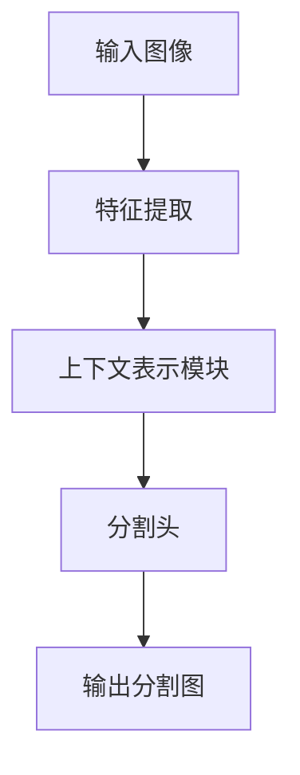

# OCRNet应用场景：从自动驾驶到医疗影像分析

## 1.背景介绍

### 1.1 什么是OCRNet？

OCRNet（Object-Contextual Representations Network）是一种用于图像分割的深度学习模型。它在语义分割任务中表现出色，主要得益于其独特的上下文表示学习能力。OCRNet通过捕捉对象与其上下文的关系，显著提升了分割精度。该模型在多个基准数据集上取得了领先的性能，成为了图像分割领域的重要工具。

### 1.2 为什么选择OCRNet？

在现代计算机视觉任务中，图像分割是一个关键问题。准确的图像分割可以为进一步的高层次任务（例如对象检测、场景理解和图像编辑）提供坚实的基础。OCRNet通过其创新的上下文表示学习机制，能够有效地处理复杂的场景和细节，使其在多个实际应用中具有广泛的潜力。

### 1.3 应用场景概述

OCRNet的应用场景非常广泛，包括但不限于自动驾驶、医疗影像分析、智能监控、遥感图像处理和增强现实等领域。本文将详细探讨OCRNet在自动驾驶和医疗影像分析中的应用，展示其在这些领域的优势和挑战。

## 2.核心概念与联系

### 2.1 语义分割概述

语义分割是计算机视觉中的一个重要任务，旨在将图像中的每一个像素分配给一个特定的类别。与对象检测不同，语义分割不仅识别对象，还精确地定位对象的边界。语义分割的结果通常用于进一步的图像分析和处理。

### 2.2 上下文表示学习

上下文表示学习是OCRNet的核心技术之一。它通过捕捉对象与其周围环境的关系，增强了模型对复杂场景的理解能力。上下文表示学习的关键在于如何有效地整合局部信息和全局信息，使模型能够在细节和整体之间取得平衡。

### 2.3 OCRNet的架构

OCRNet的架构主要包括三个部分：特征提取、上下文表示模块和分割头。特征提取部分通常使用预训练的卷积神经网络，如ResNet或HRNet。上下文表示模块通过多尺度特征融合和上下文聚合，生成丰富的上下文表示。分割头则根据这些上下文表示进行像素级别的分类。



## 3.核心算法原理具体操作步骤

### 3.1 特征提取

特征提取是OCRNet的第一步，通常使用预训练的卷积神经网络（CNN）来提取图像的多尺度特征。常用的特征提取网络包括ResNet和HRNet。特征提取的目的是将原始图像转换为具有丰富语义信息的特征图。

### 3.2 上下文表示模块

上下文表示模块是OCRNet的核心创新点。该模块通过多尺度特征融合和上下文聚合，生成对象的上下文表示。具体步骤如下：

1. **多尺度特征融合**：将不同尺度的特征图进行融合，生成多尺度特征表示。
2. **上下文聚合**：使用注意力机制或其他聚合方法，将多尺度特征进行上下文聚合，生成对象的上下文表示。

### 3.3 分割头

分割头根据上下文表示进行像素级别的分类。具体步骤如下：

1. **特征解码**：将上下文表示解码为高分辨率的特征图。
2. **像素分类**：使用全连接层或卷积层，对每个像素进行分类，生成最终的分割图。

## 4.数学模型和公式详细讲解举例说明

### 4.1 特征提取

假设输入图像为 \( I \)，经过特征提取网络 \( F \) 后，生成特征图 \( F(I) \)。对于ResNet来说，特征提取可以表示为：

$$
F(I) = \text{ResNet}(I)
$$

### 4.2 上下文表示

上下文表示模块通过多尺度特征融合和上下文聚合生成上下文表示。假设多尺度特征为 \( \{f_1, f_2, \ldots, f_n\} \)，上下文表示可以表示为：

$$
C = \text{ContextAggregation}(f_1, f_2, \ldots, f_n)
$$

### 4.3 分割头

分割头将上下文表示 \( C \) 解码为高分辨率特征图 \( D \)，并进行像素分类，生成分割图 \( S \)：

$$
D = \text{Decoder}(C)
$$

$$
S = \text{Classifier}(D)
$$

## 5.项目实践：代码实例和详细解释说明

### 5.1 环境准备

在开始代码实践之前，需要准备好开发环境。以下是所需的主要工具和库：

- Python 3.8+
- PyTorch 1.8+
- torchvision
- OpenCV

### 5.2 数据集准备

使用Cityscapes数据集进行自动驾驶场景的语义分割任务。数据集可以从[Cityscapes官网](https://www.cityscapes-dataset.com/)下载。

### 5.3 模型实现

以下是OCRNet的简要实现代码：

```python
import torch
import torch.nn as nn
import torchvision.models as models

class OCRNet(nn.Module):
    def __init__(self, num_classes):
        super(OCRNet, self).__init__()
        self.backbone = models.resnet50(pretrained=True)
        self.context_module = ContextModule()
        self.decoder = Decoder(num_classes)
    
    def forward(self, x):
        features = self.backbone(x)
        context = self.context_module(features)
        output = self.decoder(context)
        return output

class ContextModule(nn.Module):
    def __init__(self):
        super(ContextModule, self).__init__()
        # 定义上下文模块的层
        
    def forward(self, x):
        # 实现上下文聚合
        return x

class Decoder(nn.Module):
    def __init__(self, num_classes):
        super(Decoder, self).__init__()
        self.conv = nn.Conv2d(2048, num_classes, kernel_size=1)
    
    def forward(self, x):
        x = self.conv(x)
        return x

# 初始化模型
model = OCRNet(num_classes=19)  # Cityscapes有19个类别
```

### 5.4 训练和评估

```python
import torch.optim as optim
from torch.utils.data import DataLoader
from torchvision.datasets import Cityscapes
from torchvision.transforms import Compose, ToTensor, Normalize

# 数据预处理
transform = Compose([ToTensor(), Normalize((0.485, 0.456, 0.406), (0.229, 0.224, 0.225))])
train_dataset = Cityscapes(root='path_to_cityscapes', split='train', mode='fine', target_type='semantic', transform=transform)
train_loader = DataLoader(train_dataset, batch_size=8, shuffle=True)

# 定义损失函数和优化器
criterion = nn.CrossEntropyLoss()
optimizer = optim.Adam(model.parameters(), lr=0.001)

# 训练循环
for epoch in range(10):
    model.train()
    for images, targets in train_loader:
        optimizer.zero_grad()
        outputs = model(images)
        loss = criterion(outputs, targets)
        loss.backward()
        optimizer.step()
    
    print(f'Epoch {epoch+1}, Loss: {loss.item()}')

# 模型评估
model.eval()
# 在验证集上评估模型性能
```

## 6.实际应用场景

### 6.1 自动驾驶

在自动驾驶领域，OCRNet可以用于道路场景的语义分割，帮助车辆识别车道线、行人、车辆、交通标志等。通过精确的图像分割，自动驾驶系统能够更好地理解周围环境，提高行车安全性。

### 6.2 医疗影像分析

在医疗影像分析中，OCRNet可以用于分割医学图像中的不同组织和器官，例如CT和MRI图像中的肿瘤分割。通过精确的分割，医生可以更好地诊断和治疗疾病，提高医疗服务的质量。

### 6.3 智能监控

OCRNet在智能监控系统中也有广泛的应用。它可以用于实时视频监控中的对象检测和跟踪，帮助安全人员及时发现异常情况，提高公共安全。

### 6.4 遥感图像处理

在遥感图像处理领域，OCRNet可以用于地物分类和变化检测。例如，分割