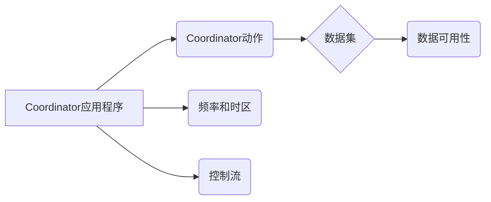

##  Oozie Coordinator原理与代码实例讲解

Oozie Coordinator是Apache Oozie工作流引擎的一部分，用于定义和管理基于时间依赖关系的工作流。它允许用户定义复杂的工作流调度逻辑，例如按日期、时间或数据可用性触发工作流。本文将深入探讨Oozie Coordinator的原理、关键概念、配置选项以及实际应用，并提供代码示例以帮助读者更好地理解和使用Oozie Coordinator。

## 1. 背景介绍

### 1.1 什么是工作流调度？

在数据密集型应用中，我们经常需要处理一系列相互依赖的任务，这些任务需要按照特定的顺序和时间执行。例如，一个典型的数据处理流程可能包括以下步骤：

1. 从数据源获取原始数据。
2. 对原始数据进行清洗和预处理。
3. 将预处理后的数据加载到数据仓库中。
4. 运行分析查询以生成报表。

这些任务之间存在着明显的依赖关系：步骤2必须在步骤1完成后才能开始，步骤3必须在步骤2完成后才能开始，等等。手动管理这些任务的执行顺序和时间安排是非常繁琐且容易出错的。因此，我们需要一个可靠的工具来自动化这个过程，这就是工作流调度器应运而生的原因。

### 1.2 Oozie简介

Apache Oozie是一个开源的工作流调度系统，专门用于管理Hadoop生态系统中的作业。它提供了一个基于XML的工作流定义语言，用于描述工作流的各个方面，包括：

* 工作流中的各个任务（Actions）。
* 任务之间的依赖关系。
* 任务的执行时间和频率。
* 任务的输入和输出数据。

Oozie支持多种类型的任务，包括：

* Hadoop MapReduce作业
* Hive查询
* Pig脚本
* Java程序
* Shell脚本

### 1.3 为什么需要Oozie Coordinator？

虽然Oozie Workflow可以定义和执行工作流，但它缺乏处理基于时间依赖关系的能力。例如，我们可能需要每天凌晨2点运行一个工作流，或者在特定文件到达HDFS时触发一个工作流。Oozie Coordinator正是为了解决这个问题而设计的。

## 2. 核心概念与联系

Oozie Coordinator引入了以下核心概念：

* **Coordinator应用程序：**定义了整个工作流的调度计划和依赖关系。
* **Coordinator动作：**表示工作流中的单个任务，对应于Oozie Workflow中的一个Workflow作业。
* **数据集：**表示输入数据或输出数据的逻辑集合。
* **数据可用性：**指定数据集何时可用以及如何检查其可用性。
* **频率和时区：**定义Coordinator应用程序的执行时间和频率。
* **控制流：**定义Coordinator动作之间的执行顺序和依赖关系。

下图展示了这些核心概念之间的关系：



## 3. 核心算法原理具体操作步骤

### 3.1 Coordinator应用程序的执行流程

1. Oozie Coordinator引擎定期检查Coordinator应用程序的定义，例如每分钟检查一次。
2. 对于每个Coordinator应用程序，引擎会根据其定义的频率和时区计算下一个预定的执行时间。
3. 如果下一个预定的执行时间已过，引擎会检查所有依赖项是否满足，包括：
    * 数据可用性检查：引擎会根据定义的数据集和数据可用性规则检查输入数据是否可用。
    * 控制流依赖：引擎会检查Coordinator动作之间的依赖关系是否满足。
4. 如果所有依赖项都满足，引擎会创建一个新的Coordinator动作实例，并将其提交给Oozie Workflow引擎执行。
5. Coordinator动作实例执行完成后，引擎会更新其状态，并根据定义的控制流触发后续动作的执行。

### 3.2 数据可用性检查

Oozie Coordinator支持多种数据可用性检查机制，包括：

* **基于时间的检查：**根据时间戳检查数据是否可用，例如检查文件是否在过去一小时内修改过。
* **基于大小的检查：**根据文件大小检查数据是否可用，例如检查文件大小是否大于1GB。
* **自定义检查：**允许用户编写自定义Java代码来执行数据可用性检查。

## 4. 数学模型和公式详细讲解举例说明

Oozie Coordinator没有涉及复杂的数学模型或公式。

## 5. 项目实践：代码实例和详细解释说明

### 5.1 示例场景

假设我们需要构建一个数据处理管道，该管道每天从FTP服务器下载数据文件，并将其加载到Hive表中。我们可以使用Oozie Coordinator来定义和调度这个管道。

### 5.2 Coordinator应用程序定义

```xml
<coordinator-app name="data_pipeline" frequency="${coord:days(1)}"
                 start="2024-05-24T00:00Z" end="2024-05-30T00:00Z"
                 timezone="UTC" xmlns="uri:oozie:coordinator:0.1">

  <datasets>
    <dataset name="input_data" frequency="${coord:days(1)}"
             initial-instance="2024-05-23T00:00Z" timezone="UTC">
      <uri-template>ftp://ftp.example.com/data/${YEAR}-${MONTH}-${DAY}</uri-template>
      <done-flag></done-flag>
    </dataset>

    <dataset name="output_data" frequency="${coord:days(1)}"
             initial-instance="2024-05-23T00:00Z" timezone="UTC">
      <uri-template>hdfs://namenode:8020/user/hive/warehouse/my_table/dt=${YEAR}-${MONTH}-${DAY}</uri-template>
      <done-flag></done-flag>
    </dataset>
  </datasets>

  <controls>
    <concurrency>1</concurrency>
  </controls>

  <action>
    <workflow>
      <app-path>hdfs://namenode:8020/user/oozie/workflows/data_load</app-path>
      <configuration>
        <property>
          <name>input_dir</name>
          <value>${coord:dataIn('input_data')}</value>
        </property>
        <property>
          <name>output_dir</name>
          <value>${coord:dataOut('output_data')}</value>
        </property>
      </configuration>
    </workflow>
  </action>

</coordinator-app>
```

### 5.3 代码解释

* **coordinator-app:** 定义Coordinator应用程序的根元素。
    * **name:** Coordinator应用程序的名称。
    * **frequency:** Coordinator应用程序的执行频率，这里设置为每天执行一次。
    * **start:** Coordinator应用程序的开始时间。
    * **end:** Coordinator应用程序的结束时间。
    * **timezone:** Coordinator应用程序使用的时区。
* **datasets:** 定义Coordinator应用程序使用的数据集。
    * **dataset:** 定义一个数据集。
        * **name:** 数据集的名称。
        * **frequency:** 数据集的频率，这里设置为每天生成一次。
        * **initial-instance:** 数据集的初始实例，用于计算后续实例的时间戳。
        * **timezone:** 数据集使用的时区。
        * **uri-template:** 数据集的URI模板，使用EL表达式动态生成数据路径。
        * **done-flag:** 数据集的完成标志，用于指示数据是否可用。
* **controls:** 定义Coordinator应用程序的控制流参数。
    * **concurrency:** 允许同时运行的Coordinator动作实例的最大数量。
* **action:** 定义Coordinator动作。
    * **workflow:** 指定要执行的Oozie Workflow应用程序。
        * **app-path:** Workflow应用程序的HDFS路径。
        * **configuration:** 传递给Workflow应用程序的配置参数。
            * **property:** 定义一个配置参数。
                * **name:** 参数名称。
                * **value:** 参数值，可以使用EL表达式引用数据集或Coordinator应用程序的属性。

## 6. 实际应用场景

Oozie Coordinator适用于各种需要基于时间依赖关系调度工作流的场景，例如：

* **数据仓库 ETL 流程:** 定期从源系统提取、转换和加载数据到数据仓库中。
* **报表生成:** 定期生成和分发业务报表。
* **日志分析:** 定期收集、处理和分析日志数据。
* **机器学习模型训练:** 定期训练和部署机器学习模型。

## 7. 工具和资源推荐

* **Apache Oozie 官方网站:** https://oozie.apache.org/
* **Oozie Coordinator 用户指南:** https://oozie.apache.org/docs/5.2.0/CoordinatorFunctionalSpec.html

## 8. 总结：未来发展趋势与挑战

Oozie Coordinator是一个功能强大的工作流调度工具，可以帮助用户轻松定义和管理基于时间依赖关系的工作流。未来，Oozie Coordinator可能会在以下方面继续发展：

* **更丰富的调度选项:** 支持更复杂的调度需求，例如基于事件的调度、基于资源的调度等。
* **更强大的数据可用性检查:** 支持更多类型的数据源和数据可用性检查机制。
* **更易用的用户界面:** 提供更直观、更易用的用户界面，简化工作流的定义和管理。

## 9. 附录：常见问题与解答

### 9.1 如何调试Oozie Coordinator应用程序？

可以使用Oozie Web UI或Oozie命令行工具来调试Coordinator应用程序。Oozie Web UI提供了详细的作业执行日志和状态信息，可以帮助用户快速定位问题。Oozie命令行工具提供了一组命令，用于管理和监控Oozie作业，例如查看作业日志、重新运行作业等。

### 9.2 如何处理Coordinator应用程序执行失败？

如果Coordinator应用程序执行失败，可以通过以下步骤进行故障排除：

1. 检查Oozie Web UI或Oozie命令行工具中的作业执行日志，以确定失败原因。
2. 检查Coordinator应用程序定义，确保所有配置参数正确无误。
3. 检查数据可用性，确保所有输入数据都可用。
4. 如果问题仍然存在，可以尝试重新运行Coordinator应用程序或联系Oozie社区寻求帮助。
