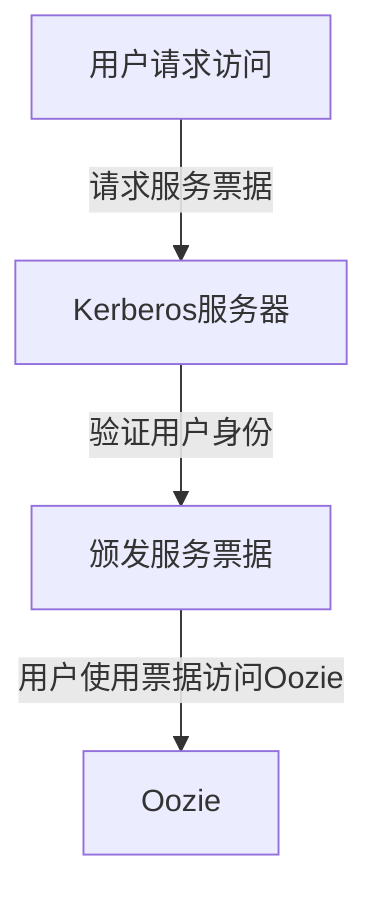

# OozieBundle安全管理：保护你的工作流和数据

作者：禅与计算机程序设计艺术

## 1. 背景介绍

### 1.1 大数据时代的安全挑战

在大数据时代，数据已经成为企业的核心资产。随着数据量的爆炸性增长，如何有效地管理和保护数据成为企业面临的重大挑战。Apache Oozie作为一个强大的工作流调度系统，广泛应用于大数据处理任务中。然而，Oozie本身的安全性问题不容忽视。如何确保OozieBundle的安全性，保护工作流和数据，成为大数据安全管理的重要课题。

### 1.2 Oozie的基本概述

Apache Oozie是一个工作流调度系统，专门用于管理Hadoop作业。Oozie允许用户定义一系列的任务，这些任务可以按顺序或并行执行。Oozie的工作流定义采用XML格式，支持时间和数据依赖性调度。OozieBundle是Oozie中的一个功能，允许用户将多个工作流和协调器作业组合在一起，形成一个更大的工作流单元。

### 1.3 OozieBundle的安全性问题

尽管Oozie在工作流管理方面表现出色，但其安全性问题一直受到关注。OozieBundle中涉及的多个工作流和协调器作业，可能会涉及到敏感数据的处理和传输。如果不采取适当的安全措施，这些数据可能会面临泄露、篡改等风险。因此，如何在OozieBundle中实现有效的安全管理，成为保障大数据处理安全性的关键。

## 2. 核心概念与联系

### 2.1 Oozie工作流

Oozie工作流是由一系列动作（Action）组成的有向无环图（DAG）。每个动作代表一个Hadoop作业或其他类型的任务，如MapReduce、Pig、Hive等。工作流定义文件采用XML格式，描述了任务的执行顺序和依赖关系。

### 2.2 Oozie协调器

Oozie协调器用于管理周期性和依赖性作业。协调器作业根据时间或数据的变化触发工作流执行。协调器定义文件同样采用XML格式，描述了触发条件和执行策略。

### 2.3 OozieBundle

OozieBundle是Oozie中的一个高级功能，允许用户将多个工作流和协调器作业组合在一起，形成一个更大的工作流单元。Bundle定义文件采用XML格式，描述了包含的工作流和协调器作业，以及它们之间的依赖关系。

### 2.4 安全管理的必要性

在OozieBundle中，涉及到多个工作流和协调器作业，可能会涉及到敏感数据的处理和传输。如果不采取适当的安全措施，这些数据可能会面临泄露、篡改等风险。因此，必须在OozieBundle中实现有效的安全管理，确保数据的机密性、完整性和可用性。

## 3. 核心算法原理具体操作步骤

### 3.1 身份验证与授权

#### 3.1.1 Kerberos身份验证

Kerberos是一种网络身份验证协议，广泛应用于Hadoop生态系统中。通过Kerberos，可以确保只有合法用户才能访问OozieBundle中的工作流和数据。



#### 3.1.2 细粒度授权

通过配置Oozie的ACL（访问控制列表），可以实现细粒度的授权管理。ACL允许管理员定义哪些用户或组可以访问特定的工作流或协调器作业。

### 3.2 数据加密

#### 3.2.1 传输层加密

在OozieBundle中，涉及到大量的数据传输。为了保护数据在传输过程中的安全性，可以采用传输层加密（TLS/SSL）。通过配置Oozie和Hadoop集群的TLS/SSL，可以确保数据在传输过程中不被窃听或篡改。

#### 3.2.2 存储层加密

为了保护存储在HDFS中的数据，可以采用存储层加密（HDFS加密）。通过配置HDFS加密区，可以确保数据在存储过程中保持加密状态，只有获得授权的用户才能解密访问。

### 3.3 日志管理与审计

#### 3.3.1 日志记录

在OozieBundle中，日志记录是安全管理的重要组成部分。通过配置Oozie的日志记录功能，可以记录所有的用户操作和系统事件，便于事后审计和分析。

#### 3.3.2 审计分析

通过分析日志记录，可以发现潜在的安全威胁和异常行为。可以采用大数据分析工具，如Apache Spark或Elasticsearch，对日志数据进行实时分析和监控。

## 4. 数学模型和公式详细讲解举例说明

### 4.1 身份验证模型

在OozieBundle的身份验证过程中，可以采用Kerberos协议。Kerberos协议的核心思想是基于对称加密和票据机制。其基本流程如下：

1. 用户向Kerberos认证服务器（AS）发送认证请求，包含用户ID和时间戳。
2. AS验证用户身份，并生成一个会话密钥和票据，返回给用户。
3. 用户使用会话密钥加密票据，并向服务服务器（SS）发送请求。
4. SS使用会话密钥解密票据，验证用户身份，并提供相应的服务。

数学上，可以用以下公式表示：

$$
\text{C} \rightarrow \text{AS} : \{ \text{ID}_\text{C}, \text{T}_\text{C} \}
$$

$$
\text{AS} \rightarrow \text{C} : \{ \text{K}_\text{C-TGS}, \text{T}_\text{TGS} \}_\text{K}_\text{C}
$$

$$
\text{C} \rightarrow \text{TGS} : \{ \text{T}_\text{TGS}, \text{ID}_\text{V}, \text{T}_\text{C} \}_\text{K}_\text{C-TGS}
$$

$$
\text{TGS} \rightarrow \text{C} : \{ \text{K}_\text{C-V}, \text{T}_\text{V} \}_\text{K}_\text{C-TGS}
$$

$$
\text{C} \rightarrow \text{V} : \{ \text{T}_\text{V}, \text{ID}_\text{C} \}_\text{K}_\text{C-V}
$$

### 4.2 数据加密模型

在OozieBundle的数据加密过程中，可以采用对称加密算法（如AES）和非对称加密算法（如RSA）。对称加密算法的基本原理是使用同一个密钥进行加密和解密。非对称加密算法的基本原理是使用一对密钥（公钥和私钥）进行加密和解密。

对称加密公式：

$$
\text{C} = \text{E}_\text{K}(\text{M})
$$

$$
\text{M} = \text{D}_\text{K}(\text{C})
$$

非对称加密公式：

$$
\text{C} = \text{E}_\text{K}_\text{pub}(\text{M})
$$

$$
\text{M} = \text{D}_\text{K}_\text{pri}(\text{C})
$$

## 5. 项目实践：代码实例和详细解释说明

### 5.1 配置Kerberos身份验证

#### 5.1.1 配置Kerberos服务器

首先，需要配置Kerberos服务器，生成服务票据和密钥表。以下是一个基本的配置示例：

```bash
[realms]
  EXAMPLE.COM = {
    kdc = kerberos.example.com
    admin_server = kerberos.example.com
  }

[domain_realm]
  .example.com = EXAMPLE.COM
  example.com = EXAMPLE.COM
```

#### 5.1.2 配置Oozie客户端

然后，需要配置Oozie客户端，启用Kerberos身份验证。以下是一个基本的配置示例：

```xml
<property>
  <name>oozie.authentication.type</name>
  <value>kerberos</value>
</property>
<property>
  <name>oozie.authentication.kerberos.principal</name>
  <value>oozie/_HOST@EXAMPLE.COM</value>
</property>
<property>
  <name>oozie.authentication.kerberos.keytab</name>
  <