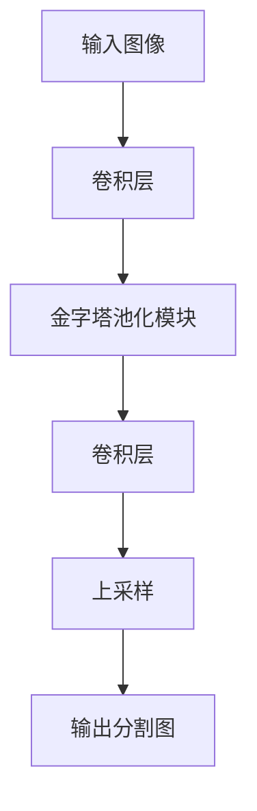

# PSPNet的边缘计算：将PSPNet部署到边缘设备

作者：禅与计算机程序设计艺术

## 1.背景介绍

### 1.1 边缘计算的兴起

近年来，随着物联网（IoT）设备的普及和数据量的爆炸性增长，边缘计算逐渐成为一种重要的计算范式。边缘计算通过将计算资源部署在网络边缘，减少了数据传输的延迟，提高了系统响应速度，并降低了带宽消耗。边缘计算的核心思想是将数据处理和分析任务从中心化的云端迁移到更靠近数据源的边缘节点。

### 1.2 PSPNet简介

PSPNet（Pyramid Scene Parsing Network）是一种用于图像分割的深度学习模型。它通过引入金字塔池化模块，能够有效捕捉图像中的全局上下文信息，从而提高分割精度。PSPNet在多个图像分割基准测试中表现出色，广泛应用于自动驾驶、医疗影像处理等领域。

### 1.3 部署PSPNet到边缘设备的挑战

尽管PSPNet在图像分割任务中表现优异，但其计算复杂度和资源消耗较高。将PSPNet部署到计算资源有限的边缘设备上，需要克服以下几个挑战：

- **计算资源有限**：边缘设备通常具有较低的计算能力和内存容量，难以直接运行复杂的深度学习模型。
- **实时性要求**：许多边缘计算应用对实时性有较高要求，需要在有限的时间内完成推理任务。
- **功耗限制**：边缘设备通常受限于电池供电，功耗是一个重要的考量因素。

## 2.核心概念与联系

### 2.1 边缘计算与云计算的关系

边缘计算和云计算并不是相互排斥的，而是互补的。云计算提供了强大的集中式计算资源和存储能力，适合处理大规模数据和复杂计算任务。而边缘计算则通过将部分计算任务下放到靠近数据源的边缘节点，降低了数据传输的延迟，提高了系统的响应速度。两者结合可以实现更高效的数据处理和分析。

### 2.2 PSPNet的基本原理

PSPNet通过引入金字塔池化模块（Pyramid Pooling Module, PPM），能够在不同尺度上捕捉图像的全局上下文信息。PPM将特征图划分为不同尺度的子区域，对每个子区域进行池化操作，然后将池化结果拼接在一起，形成包含多尺度信息的特征表示。PSPNet的基本结构如下图所示：

### 2.3 PSPNet与边缘计算的结合

将PSPNet部署到边缘设备上，可以充分利用边缘计算的优势，实现实时的图像分割。然而，由于PSPNet的计算复杂度较高，需要对模型进行优化，以适应边缘设备的计算资源限制。常见的优化方法包括模型压缩、量化和剪枝等。

## 3.核心算法原理具体操作步骤

### 3.1 PSPNet的网络结构

PSPNet的网络结构主要包括以下几个部分：

1. **基础卷积网络**：用于提取图像的基本特征，通常采用预训练的ResNet作为基础网络。
2. **金字塔池化模块**：通过引入多尺度池化操作，捕捉图像的全局上下文信息。
3. **卷积层**：对金字塔池化模块输出的特征进行进一步处理。
4. **上采样层**：将特征图恢复到与输入图像相同的分辨率，生成分割结果。

### 3.2 金字塔池化模块详解

金字塔池化模块是PSPNet的核心创新点。它通过将特征图划分为不同尺度的子区域，进行池化操作，从而捕捉多尺度的上下文信息。具体操作步骤如下：

1. **划分子区域**：将特征图划分为不同尺度的子区域。例如，划分为1×1、2×2、3×3和6×6的子区域。
2. **池化操作**：对每个子区域进行池化操作，得到固定大小的特征向量。
3. **特征拼接**：将所有尺度的池化结果拼接在一起，形成包含多尺度信息的特征表示。

### 3.3 模型压缩与优化

为了将PSPNet部署到边缘设备上，需要对模型进行压缩与优化。常见的方法包括：

1. **模型剪枝**：通过移除冗余的神经元和连接，减少模型的计算量和存储需求。
2. **模型量化**：将模型参数从浮点数转换为定点数，减少计算复杂度和存储需求。
3. **知识蒸馏**：通过训练一个较小的学生模型，使其学习大型教师模型的知识，从而实现模型压缩。

## 4.数学模型和公式详细讲解举例说明

### 4.1 卷积操作

卷积操作是卷积神经网络的基础。给定输入特征图 $X \in \mathbb{R}^{H \times W \times C}$ 和卷积核 $K \in \mathbb{R}^{kH \times kW \times C}$，卷积操作的输出 $Y \in \mathbb{R}^{H' \times W' \times C'}$ 计算公式如下：

$$
Y_{i,j,c'} = \sum_{m=0}^{kH-1} \sum_{n=0}^{kW-1} \sum_{c=0}^{C-1} X_{i+m, j+n, c} \cdot K_{m, n, c, c'}
$$

### 4.2 池化操作

池化操作用于下采样特征图，常见的池化操作包括最大池化和平均池化。给定输入特征图 $X \in \mathbb{R}^{H \times W \times C}$，池化操作的输出 $Y \in \mathbb{R}^{H' \times W' \times C}$ 计算公式如下：

最大池化：

$$
Y_{i,j,c} = \max_{m=0}^{kH-1} \max_{n=0}^{kW-1} X_{i+m, j+n, c}
$$

平均池化：

$$
Y_{i,j,c} = \frac{1}{kH \cdot kW} \sum_{m=0}^{kH-1} \sum_{n=0}^{kW-1} X_{i+m, j+n, c}
$$

### 4.3 金字塔池化模块

金字塔池化模块通过将特征图划分为不同尺度的子区域，进行池化操作，然后将池化结果拼接在一起。假设输入特征图为 $X \in \mathbb{R}^{H \times W \times C}$，金字塔池化模块的输出 $Y \in \mathbb{R}^{H \times W \times C'}$ 计算公式如下：

$$
Y = \text{concat}(P_1(X), P_2(X), P_3(X), P_4(X))
$$

其中，$P_i(X)$ 表示第 $i$ 个尺度的池化操作结果。

### 4.4 模型压缩与优化

模型剪枝、量化和知识蒸馏是常见的模型压缩与优化方法。以下是这些方法的数学公式：

模型剪枝：

$$
\hat{W} = W \cdot M
$$

其中，$W$ 是原始模型的权重矩阵，$M$ 是剪枝掩码矩阵。

模型量化：

$$
\hat{W} = \text{round}(W \cdot 2^n) \cdot 2^{-n}
$$

其中，$n$ 是量化位数。

知识蒸馏：

$$
L = \alpha L_{\text{CE}}(y, \hat{y}) + (1 - \alpha) L_{\text{KL}}(T(y), T(\hat{y}))
$$

其中，$L_{\text{CE}}$ 是交叉熵损失，$L_{\text{KL}}$ 是KL散度损失，$\alpha$ 是权重系数，$T$ 是温度参数。

## 4.项目实践：代码实例和详细解释说明

### 4.1 环境配置

在开始部署PSPNet之前，需要配置好开发环境。以下是所需的