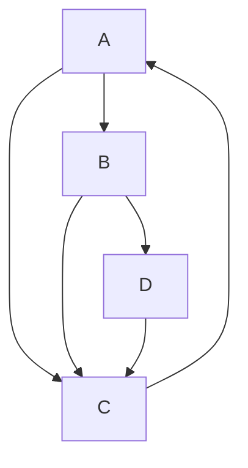

# PageRank 原理与代码实例讲解

作者：禅与计算机程序设计艺术

## 1.背景介绍

PageRank 是 Google 创始人 Larry Page 和 Sergey Brin 在 1996 年斯坦福大学求学期间提出的一个算法，它彻底改变了互联网搜索引擎的运作方式。PageRank 的核心思想是通过分析网页之间的链接关系来确定网页的重要性和排名。这个算法不仅在搜索引擎优化（SEO）领域产生了深远影响，还在社交网络分析、推荐系统等多个领域得到了广泛应用。

### 1.1 PageRank 的起源

在互联网的早期，搜索引擎主要依靠网页内容中的关键词来进行排名。然而，这种方法很容易被滥用，导致搜索结果质量下降。PageRank 算法通过引入网页链接的概念，从而提供了一种更为可靠的网页排名方法。Larry Page 和 Sergey Brin 通过研究学术论文的引用关系，发现被引用次数较多的论文往往更具影响力，这一思想被应用到网页链接分析中，形成了 PageRank 算法。

### 1.2 PageRank 的发展历程

自 PageRank 提出以来，它经历了多次改进和优化。最初的 PageRank 算法只考虑了网页之间的链接关系，但随着互联网的发展，PageRank 逐渐引入了更多的因素，如网页内容的质量、用户行为数据等。尽管 Google 的具体排名算法是商业机密，但 PageRank 作为其核心部分之一，依然发挥着重要作用。

### 1.3 PageRank 的应用领域

除了搜索引擎，PageRank 还在其他领域得到了广泛应用。例如，在社交网络分析中，PageRank 可以用来衡量节点的重要性；在推荐系统中，PageRank 可以帮助推荐用户可能感兴趣的内容。此外，PageRank 还被用于网络安全、数据挖掘等多个领域，显示了其广泛的应用前景。

## 2.核心概念与联系

为了深入理解 PageRank，我们需要掌握几个核心概念：链接分析、随机游走模型、转移矩阵和稳态分布。这些概念相互联系，共同构成了 PageRank 算法的理论基础。

### 2.1 链接分析

链接分析是 PageRank 的基础思想。一个网页的重要性不仅取决于它自身的内容，还取决于有多少其他网页链接到它。被更多重要网页链接的网页，其重要性也相应提高。链接分析通过构建网页之间的链接关系图，计算每个网页的 PageRank 值。

### 2.2 随机游走模型

PageRank 使用随机游走模型来模拟用户在网页之间的浏览行为。假设一个用户随机点击网页上的链接，每次点击都有一定概率跳转到另一个页面。通过模拟这种随机游走，可以计算出各个网页被访问的概率，这个概率就是 PageRank 值。

### 2.3 转移矩阵

转移矩阵是描述随机游走过程的数学工具。对于一个包含 $n$ 个网页的网络，转移矩阵是一个 $n \times n$ 的矩阵，矩阵中的每个元素表示从一个网页跳转到另一个网页的概率。通过对转移矩阵进行迭代计算，可以求得各个网页的 PageRank 值。

### 2.4 稳态分布

稳态分布是指在随机游走过程中，经过足够多次迭代后，各个网页被访问的概率趋于稳定的状态。PageRank 值就是这种稳态分布的概率。通过求解转移矩阵的特征向量，可以得到稳态分布，从而计算出各个网页的 PageRank 值。

## 3.核心算法原理具体操作步骤

PageRank 算法的核心思想是通过迭代计算网页之间的链接关系，最终得到各个网页的 PageRank 值。下面我们详细介绍 PageRank 算法的具体操作步骤。

### 3.1 初始化 PageRank 值

首先，为每个网页初始化一个 PageRank 值。通常情况下，所有网页的初始 PageRank 值相等，例如，对于 $n$ 个网页，每个网页的初始 PageRank 值为 $\frac{1}{n}$。

```markdown
$$
PR(i) = \frac{1}{n}, \quad \forall i \in \{1, 2, \ldots, n\}
$$
```

### 3.2 构建转移矩阵

接下来，构建转移矩阵。转移矩阵的元素表示从一个网页跳转到另一个网页的概率。假设网页 $i$ 有 $L_i$ 个出链，那么从网页 $i$ 跳转到每个出链的概率为 $\frac{1}{L_i}$。

```markdown
$$
M_{ij} = \begin{cases}
\frac{1}{L_i}, & \text{if } (i \rightarrow j) \\
0, & \text{otherwise}
\end{cases}
$$
```

### 3.3 引入阻尼因子

为了模拟用户随机跳转到任何网页的行为，PageRank 引入了阻尼因子（damping factor），通常取值为 0.85。阻尼因子表示用户继续点击链接的概率，而 $1 - d$ 表示用户随机跳转到任何网页的概率。

```markdown
$$
PR(i) = (1 - d) \frac{1}{n} + d \sum_{j \in B_i} \frac{PR(j)}{L_j}
$$
```

### 3.4 迭代计算 PageRank 值

通过迭代计算 PageRank 值，直到所有网页的 PageRank 值收敛到稳定状态。具体步骤如下：

1. 初始化 PageRank 值。
2. 构建转移矩阵并引入阻尼因子。
3. 进行迭代计算，更新每个网页的 PageRank 值。
4. 检查 PageRank 值是否收敛，如果收敛，则停止迭代；否则，继续迭代。

```markdown
$$
PR^{(k+1)}(i) = (1 - d) \frac{1}{n} + d \sum_{j \in B_i} \frac{PR^{(k)}(j)}{L_j}
$$
```

### 3.5 收敛条件

PageRank 值的收敛条件通常是指所有网页的 PageRank 值变化量小于一个预设的阈值 $\epsilon$。常用的收敛条件如下：

```markdown
$$
\sum_{i=1}^n \left| PR^{(k+1)}(i) - PR^{(k)}(i) \right| < \epsilon
$$
```

## 4.数学模型和公式详细讲解举例说明

为了更好地理解 PageRank 算法的数学模型和公式，我们通过一个具体的例子来详细讲解。

### 4.1 示例网络

假设我们有一个包含 4 个网页的网络，网页之间的链接关系如下：

- A 链接到 B 和 C
- B 链接到 C 和 D
- C 链接到 A
- D 链接到 C

我们可以用一个有向图来表示这个网络：



### 4.2 初始化 PageRank 值

首先，为每个网页初始化一个 PageRank 值。对于 4 个网页，每个网页的初始 PageRank 值为 $\frac{1}{4}$。

```markdown
$$
PR(A) = PR(B) = PR(C) = PR(D) = \frac{1}{4} = 0.25
$$
```

### 4.3 构建转移矩阵

接下来，构建转移矩阵。根据链接关系，转移矩阵 $M$ 如下：

```markdown
$$
M = \begin{pmatrix}
0 & 0 & 1 & 0 \\
\frac{1}{2} & 0 & 0 & 0 \\
\frac{1}{2} & \frac{1}{2} & 0 & 1 \\
0 & \frac{1}{2} & 0 & 0
\end{pmatrix}
$$
```

### 4.4 引入阻尼因子

引入阻尼因子 $d = 0.85$，我们得到新的转移矩阵 $M'$：

```markdown
$$
M' = dM + (1 - d) \frac{1}{n} E
$$

其中 $E$ 是一个全 1 矩阵：

$$
E = \begin{pmatrix}
1 & 1 & 1 & 1 \\
1 & 1 & 1 & 1 \\
1 & 1 & 1 & 1 \\
1 & 1 & 1 & 1
