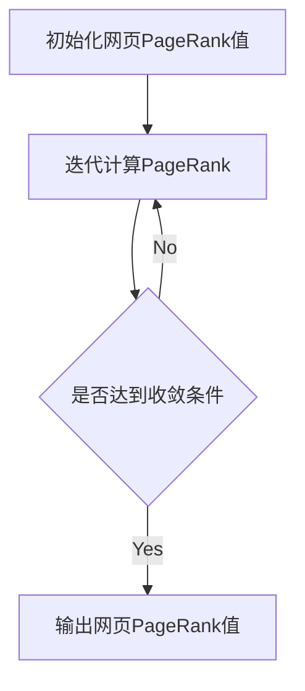

# PageRank原理与代码实例讲解

作者：禅与计算机程序设计艺术

## 1. 背景介绍
### 1.1 搜索引擎的发展历史
### 1.2 早期搜索算法的局限性
### 1.3 PageRank算法的诞生背景

## 2. 核心概念与联系
### 2.1 图论基础
#### 2.1.1 有向图与无向图
#### 2.1.2 节点、边与权重
#### 2.1.3 邻接矩阵表示法
### 2.2 马尔可夫链
#### 2.2.1 状态转移概率
#### 2.2.2 平稳分布
#### 2.2.3 PageRank与马尔可夫链的关系
### 2.3 PageRank的数学定义
#### 2.3.1 PageRank值的计算
#### 2.3.2 阻尼因子的引入
#### 2.3.3 PageRank算法的收敛性

## 3. 核心算法原理具体操作步骤
### 3.1 构建Web图模型
#### 3.1.1 抽取网页之间的链接关系
#### 3.1.2 去除导航链接等噪声
#### 3.1.3 构建有向图
### 3.2 计算初始PageRank值
#### 3.2.1 随机初始化
#### 3.2.2 利用网页先验信息初始化
### 3.3 迭代计算PageRank值
#### 3.3.1 同步迭代法
#### 3.3.2 异步迭代法
#### 3.3.3 迭代终止条件
### 3.4 处理等级泄露与等级沉没问题
#### 3.4.1 修正死链问题
#### 3.4.2 引入随机转移概率
### 3.5 算法复杂度分析

## 4. 数学模型和公式详细讲解举例说明 
### 4.1 PageRank值计算公式推导
#### 4.1.1 忽略阻尼因子的推导
#### 4.1.2 考虑阻尼因子的推导
### 4.2 公式中各项参数的物理意义
#### 4.2.1 PageRank值的意义
#### 4.2.2 阻尼因子的意义
### 4.3 计算实例演示
#### 4.3.1 简单有向图的PageRank计算
#### 4.3.2 复杂网络的PageRank计算

## 5. 项目实践：代码实例和详细解释说明
### 5.1 使用Python实现PageRank
#### 5.1.1 数据预处理
#### 5.1.2 构建邻接矩阵
#### 5.1.3 迭代计算PageRank值
### 5.2 使用Spark实现PageRank
#### 5.2.1 分布式图计算框架GraphX简介
#### 5.2.2 构建Spark GraphX图
#### 5.2.3 运行Pregel算法计算PageRank
### 5.3 PageRank的优化技巧
#### 5.3.1 利用稀疏矩阵存储优化内存占用
#### 5.3.2 分块计算降低迭代复杂度
#### 5.3.3 多线程并行计算加速收敛

## 6. 实际应用场景
### 6.1 搜索引擎排序
#### 6.1.1 将PageRank值作为排序信号之一
#### 6.1.2 与其他相关性信号结合排序
### 6.2 社交网络影响力分析
#### 6.2.1 用PageRank度量用户影响力
#### 6.2.2 使用PersonalRank挖掘兴趣圈
### 6.3 网页去重与镜像检测
#### 6.3.1 基于链接结构的网页相似度计算
#### 6.3.2 使用SimRank改进相似页面挖掘
### 6.4 其他领域的应用
#### 6.4.1 论文引用网络分析
#### 6.4.2 基因互作网络分析

## 7. 工具和资源推荐
### 7.1 开源工具
#### 7.1.1 PageRank实现库：NetworkX、iGraph、Gephi
#### 7.1.2 分布式图计算框架：GraphX、Giraph、GraphLab
### 7.2 相关论文
#### 7.2.1 原始PageRank论文
#### 7.2.2 Topic-Sensitive PageRank
#### 7.2.3 Random Walk with Restart
### 7.3 在线课程
#### 7.3.1 Mining Massive Datasets
#### 7.3.2 SocialNetwork Analysis

## 8. 总结：未来发展趋势与挑战
### 8.1 个性化与查询相关的 PageRank
### 8.2 面向流数据的增量式计算
### 8.3 考虑用户行为反馈的 PageRank
### 8.4 PageRank在知识图谱领域的应用

## 9. 附录：常见问题与解答  
### 9.1 PageRank收敛速度慢的原因与应对
### 9.2 如何处理PageRank值过于集中的问题 
### 9.3 Dead End与Spider Trap问题
### 9.4 PageRank能否用于社交网络影响力度量

## PageRank核心概念与计算公式
PageRank算法的核心思想是通过网页之间的链接关系来评估网页的重要性。如果一个网页被很多其他网页链接到的话说明这个网页比较重要，也就是PageRank值会相对较高。 

具体来说，PageRank值的计算可以表示为如下的公式：

$$PR(p_i)=\frac{1-d}{N} + d \sum_{p_j \in M(p_i)} \frac{PR(p_j)}{L(p_j)}$$

其中:
- $PR(p_i)$ 表示网页 $p_i$ 的PageRank值
- $N$ 表示所有网页的总数  
- $d$ 为阻尼系数,一般取值在0.85
- $M(p_i)$ 表示所有链接到网页 $p_i$ 的网页集合
- $L(p_j)$ 表示网页 $p_j$ 的出链数量

根据上面的公式,一个网页的PageRank值由两部分组成:
1. 所有网页都有一个基础值 $\frac{1-d}{N}$ 
2. 所有链接到该网页的其他网页贡献的PageRank值之和,每个网页 $p_j$ 贡献 $\frac{PR(p_j)}{L(p_j)}$。也就是 $p_j$ 将其 PageRank值均分给所有出链网页。

PageRank计算可以用迭代的方法进行,初始时假设所有网页的PageRank值相等,通过迭代计算多次后,PageRank值会收敛。

## PageRank算法流程图



上图展示了PageRank算法计算的基本流程:

1. 初始化所有网页的PageRank值,一般可以取相等的值
2. 根据PageRank计算公式迭代计算每个网页新的PageRank值
3. 判断是否满足收敛条件,如果不满足则重复步骤2
4. 输出计算得到的网页PageRank值

## PageRank算法的Python代码实现

下面给出了PageRank算法的一个简单Python实现:

```python
def pagerank(M, num_iterations=100, d=0.85):
    N = M.shape[1]
    v = np.ones(N) / N
    
    for _ in range(num_iterations):
        v_new = (1 - d) / N * np.ones(N) + d * M.T.dot(v)
        delta = np.linalg.norm(v_new - v, 1)
        v = v_new
        if delta < 1e-6:
            break
    return v
```

其中 M 为网页链接关系的邻接矩阵,如果网页 j 链接到网页 i,则 $M_{ij}=\frac{1}{L(p_j)}$,否则为0。num_iterations为最大迭代次数,v为存储PageRank值的向量。

在每次迭代时:
1. 根据上述PageRank公式计算新的PageRank向量v_new
2. 判断前后两次迭代的PageRank向量的差的L1范数是否小于阈值(如1e-6),如果小于则认为达到收敛
3. 更新v为v_new,进行下一轮迭代

最终返回收敛后的PageRank值向量v。

## PageRank算法应用案例

### 1.搜索引擎排序
PageRank算法是现代搜索引擎的核心算法之一,可以用来衡量网页的重要性和权威性。一般搜索引擎会将PageRank值与其他相关性指标(如文本相似度)进行加权融合,得到最终的网页排序。
  
### 2.社交网络影响力分析
在社交网络中,可以将用户看做网页,将用户之间的关注关系类比为网页链接,从而利用PageRank算法估算用户的影响力。影响力高的用户通常被更多其他用户关注,也更容易传播信息。

### 3.文献引用网络分析
在学术领域,论文之间的引用关系也可以构建一个有向图。引用次数多的论文通常质量和影响力比较高。PageRank算法可以用来挖掘高影响力的论文,辅助文献检索。

### 4.网页去重与镜像检测
互联网上存在大量内容重复或高度相似的网页,会影响搜索结果质量。我们可以基于网页链接关系计算网页之间的结构相似度,配合PageRank筛选出重复的镜像网页。

## 总结与展望
PageRank作为揭示网页结构性重要性的经典算法,在Web搜索、社交网络、推荐系统等领域都有广泛应用。未来PageRank算法的改进和拓展方向主要有:

1. 针对性和个性化,如Topic-Sensitive PageRank根据主题调整链接权重,Random Walk with Restart引入重启机制改进个性化。  
2. 引入用户行为数据,如根据浏览、点击等用户反馈动态调整PageRank。
3. 大规模图数据上的增量计算,提高PageRank计算效率。
4. 将PageRank从网页文档图扩展到知识图谱、异质网络、概念层面的分析。

相信通过学术界和工业界的共同努力,PageRank及其变种算法将在更多领域发挥重要作用。

## 参考文献

- Brin S, Page L. The anatomy of a large-scale hypertextual web search engine[J]. Computer Networks, 1998, 30(1–7): 107-117.
- Page L, Brin S, Motwani R, et al. The PageRank Citation Ranking: Bringing Order to the Web[R]. Stanford InfoLab, 1999.
- Haveliwala T H. Topic-sensitive pagerank[C]//Proceedings of the 11th international conference on World Wide Web. ACM, 2002: 517-526.
- Tong H, Faloutsos C, Pan J Y. Fast random walk with restart and its applications[C]//ICDM. 2006: 613-622.

以上就是关于PageRank原理与代码实例的讲解,希望对你理解和应用这一重要算法有所帮助。如果还有任何问题,欢迎继续交流探讨。