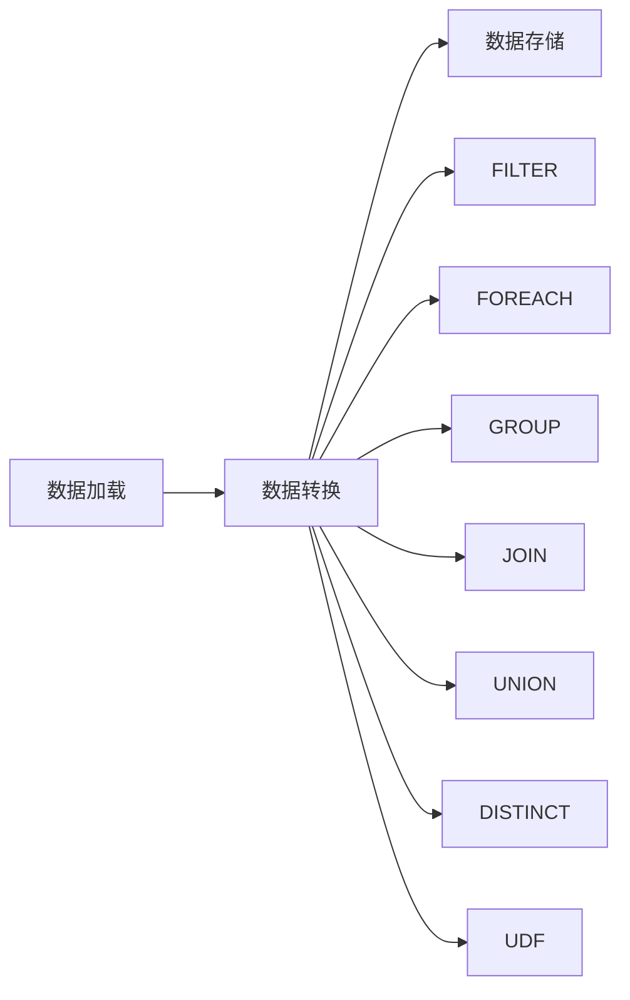

# Pig原理与代码实例讲解

作者：禅与计算机程序设计艺术


## 1. 背景介绍

### 1.1 大数据处理的挑战

随着互联网和移动设备的普及，全球数据量呈爆炸式增长，如何高效地处理海量数据成为了企业面临的巨大挑战。传统的数据库管理系统难以满足大规模数据处理的需求，分布式计算框架应运而生。

### 1.2 Hadoop生态系统与Pig的诞生

Hadoop作为开源的分布式计算框架，凭借其高可靠性、可扩展性和容错性，成为了大数据处理的基石。然而，Hadoop的编程模型较为复杂，需要开发者具备一定的Java编程基础。为了简化大数据处理流程，Yahoo! 开发了Pig，一种基于Hadoop的高级数据流语言。

### 1.3 Pig的优势与应用场景

Pig采用类似SQL的脚本语言，易于学习和使用，能够快速开发复杂的数据处理任务。Pig的优势主要体现在以下几个方面：

* **易用性:** Pig的语法简洁易懂，即使没有编程经验的用户也能快速上手。
* **可扩展性:** Pig运行在Hadoop集群上，可以轻松处理PB级别的数据。
* **丰富的操作符:** Pig提供了丰富的数据操作符，包括关系型代数操作符、自定义函数等，能够满足各种数据处理需求。
* **可移植性:** Pig脚本可以在不同的Hadoop平台上运行，例如Apache Hadoop、Cloudera CDH等。

Pig适用于各种大数据处理场景，例如：

* **数据清洗和预处理:** Pig可以用于清洗和转换原始数据，为后续的数据分析做好准备。
* **ETL (Extract, Transform, Load):** Pig可以从不同的数据源中抽取数据，进行转换后加载到目标数据仓库中。
* **数据分析和挖掘:** Pig可以与其他数据分析工具集成，例如Hive、Spark等，进行更深入的数据分析和挖掘。

## 2. 核心概念与联系

### 2.1 数据模型

Pig采用关系型数据模型，将数据组织成关系（Relation）。关系类似于数据库中的表，由行（Tuple）和列（Field）组成。

* **关系（Relation）：**  类似于数据库中的表，由一组具有相同结构的元组组成。
* **元组（Tuple）：** 关系中的一行数据，由多个字段组成，字段之间用逗号分隔。
* **字段（Field）：** 元组中的一个数据项，可以是基本数据类型，也可以是复杂数据类型。

### 2.2 Pig Latin脚本

Pig Latin是Pig的脚本语言，用于描述数据处理流程。Pig Latin脚本由一系列语句组成，每个语句执行一个特定的数据操作。

### 2.3 Pig执行流程

Pig的执行流程可以分为以下几个步骤：

1. **解析:** Pig解析器将Pig Latin脚本解析成抽象语法树（AST）。
2. **优化:** Pig优化器对AST进行优化，例如谓词下推、列裁剪等。
3. **编译:** Pig编译器将优化后的AST编译成MapReduce作业。
4. **执行:** Hadoop集群执行MapReduce作业，并将结果输出到指定位置。

### 2.4 核心概念关系图

```mermaid
graph LR
    Relation --> Tuple
    Tuple --> Field
    Pig Latin脚本 --> 解析 --> 优化 --> 编译 --> 执行 --> 结果
```

## 3. 核心算法原理具体操作步骤

### 3.1 数据加载与存储

Pig提供了多种数据加载和存储方式，例如：

* **加载文本文件:** 使用`LOAD`操作符加载文本文件，例如：

```pig
data = LOAD '/path/to/data.txt' USING PigStorage(',');
```

* **加载结构化数据:** 使用`LOAD`操作符加载结构化数据，例如：

```pig
data = LOAD '/path/to/data.json' USING JsonLoader('id:int, name:chararray');
```

* **存储数据:** 使用`STORE`操作符将数据存储到指定位置，例如：

```pig
STORE data INTO '/path/to/output' USING PigStorage(',');
```

### 3.2 数据转换

Pig提供了丰富的数据转换操作符，例如：

* **FILTER:**  根据条件过滤数据。
* **FOREACH:** 遍历关系中的每个元组，并对每个元组进行操作。
* **GROUP:**  根据指定的字段对数据进行分组。
* **JOIN:**  连接两个关系。
* **UNION:**  合并两个关系。
* **DISTINCT:** 去除重复数据。

### 3.3 用户自定义函数 (UDF)

Pig支持用户自定义函数 (UDF)，可以使用Java或Python编写UDF，扩展Pig的功能。

### 3.4 核心算法流程图



## 4. 数学模型和公式详细讲解举例说明

### 4.1 词频统计

词频统计是大数据处理中的经典案例，可以使用Pig轻松实现。

**输入数据:**

```
hello world
world count
pig latin
```

**Pig Latin脚本:**

```pig
-- 加载数据
lines = LOAD 'input.txt' AS (line:chararray);

-- 将每行文本分割成单词
words = FOREACH lines GENERATE FLATTEN(TOKENIZE(line)) AS word;

-- 统计每个单词出现的次数
word_counts = GROUP words BY word;
counts = FOREACH word_counts GENERATE group, COUNT(words);

-- 输出结果
STORE counts INTO 'output' USING PigStorage(',');
```

**输出结果:**

```
hello,1
world,2
count,1
pig,1
latin,1
```

**公式:**

```
word_count = count(word)
```

### 4.2 PageRank算法

PageRank算法是Google用于衡量网页重要性的算法，也可以使用Pig实现。

**输入数据:**

```
1,2
1,3
2,1
2,3
3,1
```

**Pig Latin脚本:**

```pig
-- 加载数据
links = LOAD 'input.txt' AS (from:int, to:int);

-- 初始化每个页面的PageRank值为1/N，其中N为页面总数
num_pages = NUMBER_OF_DISTINCT(links.from);
init_rank = FOREACH links GENERATE from, 1.0/num_pages AS rank;

-- 迭代计算PageRank值
ITERATE 10 {
    -- 计算每个页面传递的PageRank值
    rank_contributions = FOREACH links GENERATE from, rank/COUNT(links) AS contribution;

    -- 将每个页面接收到的PageRank值累加
    new_ranks = COGROUP rank_contributions BY to, init_rank BY from;
    new_ranks = FOREACH new_ranks GENERATE group, SUM(rank_contributions.contribution) AS rank;

    -- 更新PageRank值
    init_rank = new_ranks;
}

-- 输出结果
STORE init_rank INTO 'output' USING PigStorage(',');
```

**输出结果:**

```
1,0.39999999999999997
2,0.30000000000000004
3,0.3
```

**公式:**

```
PR(A) = (1-d) + d * sum(PR(T)/C(T))
```

其中：

* PR(A) 表示页面A的PageRank值
* d 是阻尼系数，通常设置为0.85
* T 表示链接到页面A的页面
* C(T) 表示页面T的出链数

## 5. 项目实践：代码实例和详细解释说明

### 5.1 数据清洗

**需求:** 从日志文件中提取访问时间、IP地址和访问URL，并过滤掉无效的IP地址。

**输入数据:**

```
2024-05-23 11:21:56 192.168.1.1 /index.html
2024-05-23 11:22:00 127.0.0.1 /
2024-05-23 11:22:05 192.168.1.2 /about.html
2024-05-23 11:22:10 invalid_ip /contact.html
```

**Pig Latin脚本:**

```pig
-- 加载数据
logs = LOAD 'input.txt' AS (line:chararray);

-- 提取访问时间、IP地址和访问URL
log_fields = FOREACH logs GENERATE 
    SUBSTRING(line, 1, 19) AS timestamp,
    REGEX_EXTRACT(line, '\\s(\\d{1,3}\\.\\d{1,3}\\.\\d{1,3}\\.\\d{1,3})\\s', 1) AS ip,
    REGEX_EXTRACT(line, '\\s(\\S+)$', 1) AS url;

-- 过滤掉无效的IP地址
valid_logs = FILTER log_fields BY ip IS NOT NULL;

-- 输出结果
STORE valid_logs INTO 'output' USING PigStorage('\t');
```

**输出结果:**

```
2024-05-23 11:21:56	192.168.1.1	/index.html
2024-05-23 11:22:05	192.168.1.2	/about.html
```

### 5.2 数据分析

**需求:** 统计每个小时的访问量。

**输入数据:**

```
2024-05-23 11:21:56	192.168.1.1	/index.html
2024-05-23 11:22:05	192.168.1.2	/about.html
2024-05-23 12:00:00	192.168.1.3	/
```

**Pig Latin脚本:**

```pig
-- 加载数据
logs = LOAD 'input.txt' AS (timestamp:chararray, ip:chararray, url:chararray);

-- 提取小时信息
hourly_logs = FOREACH logs GENERATE
    SUBSTRING(timestamp, 1, 13) AS hour,
    ip,
    url;

-- 统计每个小时的访问量
hourly_counts = GROUP hourly_logs BY hour;
counts = FOREACH hourly_counts GENERATE group, COUNT(hourly_logs);

-- 输出结果
STORE counts INTO 'output' USING PigStorage(',');
```

**输出结果:**

```
2024-05-23 11,2
2024-05-23 12,1
```

## 6. 工具和资源推荐

### 6.1 开发工具

* **PigPen:** Apache Pig的交互式shell，方便用户进行代码调试。
* **Hue:** Cloudera开发的开源Web UI，提供了Pig脚本编辑、执行和监控功能。

### 6.2 学习资源

* **Apache Pig官方文档:** https://pig.apache.org/docs/
* **Pig Tutorial:** https://www.tutorialspoint.com/apache_pig/
* **Hadoop: The Definitive Guide:** Tom White 著

## 7. 总结：未来发展趋势与挑战

### 7.1 未来发展趋势

* **与Spark集成:** Pig可以与Spark集成，利用Spark的内存计算优势，提高数据处理效率。
* **SQL on Hadoop:** 随着SQL on Hadoop技术的兴起，Pig可能会逐渐被Hive、Spark SQL等工具取代。
* **机器学习:** Pig可以与机器学习库集成，用于特征工程和模型训练。

### 7.2 面临的挑战

* **性能优化:** Pig的性能优化是一个复杂的问题，需要考虑数据倾斜、数据格式等因素。
* **生态系统:** Pig的生态系统相对较小，与Spark、Hive等工具相比，可用的工具和库较少。
* **学习曲线:** 虽然Pig的语法相对简单，但是要熟练掌握Pig的各种功能和优化技巧，仍然需要一定的学习成本。

## 8. 附录：常见问题与解答

### 8.1 如何处理数据倾斜？

数据倾斜是指某些key的值过多，导致MapReduce任务执行时间过长。可以使用以下方法解决数据倾斜：

* **使用Combiner:** Combiner可以在Map阶段对数据进行局部聚合，减少数据传输量。
* **设置reduce数量:** 可以根据数据量和集群规模，适当增加reduce的数量，将数据均匀分布到不同的reduce节点上。
* **使用随机数:** 可以为每个key添加一个随机数，将数据分散到不同的reduce节点上。

### 8.2 如何调试Pig脚本？

可以使用PigPen或Hue调试Pig脚本。可以使用`DESCRIBE`语句查看关系的schema，使用`DUMP`语句查看关系的数据。

### 8.3 Pig与Hive的区别？

* **语言:** Pig使用Pig Latin脚本语言，Hive使用类SQL语言。
* **执行引擎:** Pig使用MapReduce作为执行引擎，Hive可以使用MapReduce、Tez或Spark作为执行引擎。
* **数据模型:** Pig和Hive都采用关系型数据模型。
* **应用场景:** Pig适用于数据流处理，Hive适用于数据仓库和BI分析。
