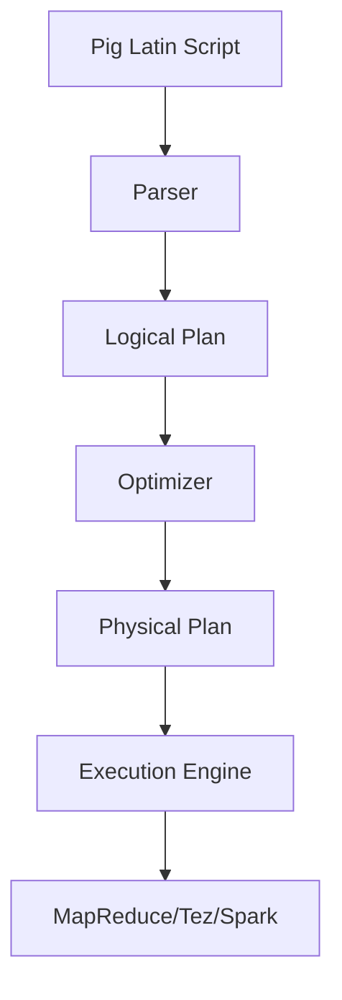

# Pig安装与环境配置：快速上手指南

## 1.背景介绍

### 1.1 什么是Pig

Apache Pig是一种用于并行计算的高级数据流语言和执行框架,最初由Yahoo!研究院开发。它是一种类SQL的脚本语言,用于探索大型数据集。Pig可以在Apache Hadoop集群上运行,利用Hadoop的并行计算能力来处理大型数据集。

Pig的设计目标是提供一种简单且高效的方式来分析大数据。它允许用户使用类似SQL的语言(Pig Latin)来表达数据转换,而不必学习复杂的Java MapReduce API。Pig自动优化和执行这些数据转换。

### 1.2 为什么要使用Pig

使用Pig有以下几个主要优势:

1. **易于编程**: Pig Latin语言简洁易学,减少了MapReduce编程的复杂性。

2. **优化执行**: Pig可以自动优化数据转换流程,提高执行效率。

3. **可扩展性**: Pig可以在Hadoop集群上运行,利用分布式并行处理能力处理海量数据。

4. **丰富数据类型**: Pig支持多种数据类型,包括嵌套和复杂类型。

5. **操作员丰富**: Pig提供了170多个内置操作符,涵盖常见的数据处理需求。

6. **可扩展性**: 开发人员可以使用Java,Python等语言编写自定义函数(UDF)扩展Pig。

7. **调试工具**: Pig提供了良好的调试工具,如explain计划可视化等。

## 2.核心概念与联系  

### 2.1 Pig架构

Pig由以下几个核心组件组成:



1. **Pig Latin Script**: 用户使用Pig Latin语言编写的脚本,描述数据转换流程。

2. **Parser**: 解析Pig Latin脚本,生成逻辑执行计划(Logical Plan)。

3. **Logical Plan**: 表示数据转换的逻辑视图,是一系列关系操作符的有向无环图。

4. **Optimizer**: 优化器对逻辑执行计划进行优化,如过滤投影下推、合并连接等。

5. **Physical Plan**: 优化后的物理执行计划,描述了如何在集群上并行执行。

6. **Execution Engine**: 执行引擎,负责调用底层计算框架(MapReduce/Tez/Spark)执行物理计划。

7. **MapReduce/Tez/Spark**: Pig可以在Hadoop的MapReduce,Tez或Spark上执行作业。

### 2.2 Pig数据模型

Pig使用自己的数据模型来表示数据,主要包括:

1. **Bag**: 一个Bag{T}是一个元组(Tuple)的集合,类似于关系数据库中的表。

2. **Tuple**: 一个Tuple{..}是一个原子值的有序集合,类似于关系数据库中的一行记录。

3. **Map**: 一个Map[]是键值对的集合,可以用于表示嵌套数据。

4. **原子类型**: 如int、long、float、double、chararray等基本数据类型。

Pig的数据模型支持嵌套和复杂类型,非常灵活。例如,可以有Bag{Tuple{int,Map[]}}等复杂类型。

## 3.核心算法原理具体操作步骤

Pig的核心是它的执行引擎,主要包括以下几个步骤:

### 3.1 解析Pig Latin脚本

用户编写的Pig Latin脚本首先被Parser解析,生成一个逻辑执行计划(Logical Plan)。逻辑计划是一系列关系代数操作符的有向无环图。

例如,下面是一个简单的脚本及其对应的逻辑计划:

```pig
-- 脚本
A = LOAD 'data' AS (x:int, y:int); 
B = GROUP A BY x;
C = FOREACH B GENERATE group, COUNT(A);

-- 逻辑计划  
Foreach-->GroupBy-->Load
```

### 3.2 逻辑计划优化

优化器(Optimizer)对逻辑计划进行一系列优化,以提高执行效率。主要优化策略包括:

1. **投影下推**: 尽可能早地过滤掉不需要的列。
2. **合并连接**: 将多个连接操作合并为一个操作。
3. **添加拆分**: 自动添加拆分操作以利用并行。
4. **合并过滤**: 将多个过滤操作合并。
5. **常量折叠**: 预计算常量表达式。

优化后的逻辑计划示例:

```
Foreach-->GroupBy-->Filter-->Load
```

### 3.3 生成物理计划

优化器基于优化后的逻辑计划生成物理执行计划,描述了如何使用底层计算框架(MapReduce/Tez/Spark)并行执行。物理计划包括:

- 如何划分输入数据
- 每个MapReduce作业的输入/输出
- 计算每个MapReduce作业所需的资源

### 3.4 执行物理计划

执行引擎根据物理计划,调用底层计算框架在集群上并行执行作业。每个MapReduce作业会生成一系列临时文件,最终结果会写入HDFS。

Pig为了提高效率,会尽可能地组装多个MapReduce作业为一个作业,减少作业启动开销。

## 4.数学模型和公式详细讲解举例说明 

虽然Pig是一种高级数据流语言,但在执行某些复杂操作时,如聚合、采样等,仍需要使用一些数学模型和公式。下面我们介绍几个常见的例子。

### 4.1 COUNT聚合

COUNT是一个常见的聚合操作,用于计算一个Bag中元组的个数。在单机情况下,COUNT的计算公式很简单:

$$
COUNT(Bag) = \sum_{tuple \in Bag} 1
$$

但是在分布式环境下,需要先在每个Map端计算本地Count,然后在Reduce端将所有Map的Count值累加,得到最终结果。

Map端:
$$
partial\_count_i = \sum_{tuple \in local\_bag} 1
$$

Reduce端:
$$
COUNT(Bag) = \sum_{i}^{n}partial\_count_i  
$$

其中n是Map任务的个数。

### 4.2 SAMPLE采样

SAMPLE是Pig中的一个采样操作,常用于从大数据集中抽取一个代表性的子集进行分析。Pig使用了基于reservoir sampling的算法。

在每个Map端,我们维护一个reservoir,初始为空。对于第i个记录,有$\frac{k}{i}$的概率被选中加入reservoir,这里k是期望的采样大小。

具体来说,在Map端的采样过程如下:

```python
def reservoirSampling(stream, k):
    reservoir = []
    for i, item in enumerate(stream):
        j = random.randint(0, i)
        if j < k:
            reservoir[j] = item
    return reservoir
```

在Reduce端,我们将所有Map端的采样结果进行合并,即可得到最终的采样结果。

### 4.3 数据分桶

在进行数据分区(GROUP/COGROUP)操作时,Pig需要决定如何对数据进行分桶(bucketing),以确保相关的记录会发送到同一个Reducer。

最常见的分桶策略是对分组键进行哈希,然后对哈希值取模:

$$
bucket_id = hash(key) \% num\_buckets
$$

其中num_buckets是分桶的个数,通常等于Reducer的个数。这种策略可以较好地实现负载均衡。

## 4.项目实践:代码实例和详细解释说明

让我们通过一个简单的例子来演示如何使用Pig进行数据处理。我们将使用Pig Latin对网站日志数据进行一些统计分析。

假设我们有一个网站日志文件log.txt,格式如下:

```
192.168.1.1,/index.html,404
192.168.1.2,/about.html,200  
192.168.1.1,/products.html,200
...
```

每行记录包括IP地址、请求URL和HTTP状态码。我们想统计每个IP访问次数,以及各状态码出现的次数。

### 4.1 加载数据

首先,我们需要加载数据到Pig中:

```pig
-- 加载数据,指定字段名和类型
logs = LOAD 'log.txt' AS (ip:chararray, url:chararray, status:int);

-- 查看一些记录
DUMP logs;
```

### 4.2 按IP统计访问次数

```pig
-- 按IP分组
grouped = GROUP logs BY ip;  

-- 计算每个分组的记录数
ip_counts = FOREACH grouped GENERATE group, COUNT(logs);

-- 查看结果
DUMP ip_counts;
```

输出示例:

```
(192.168.1.1,2)
(192.168.1.2,1)
...
```

### 4.3 统计HTTP状态码

```pig 
-- 按状态码分组并计数
status_counts = FOREACH (GROUP logs BY status) GENERATE group, COUNT(logs);

-- 查看结果 
DUMP status_counts;
```

输出示例:

```
(404,1)
(200,3)
...
```

### 4.4 结果存储

最后,我们可以将分析结果存储到HDFS:

```pig
STORE ip_counts INTO 'output/ip_counts.txt';
STORE status_counts INTO 'output/status_counts.txt';
```

通过这个例子,我们可以看到Pig Latin语言的简洁性和可读性。它使得在Hadoop上进行数据分析变得非常简单和高效。

## 5.实际应用场景

Pig广泛应用于各种大数据分析场景,包括但不限于:

1. **网络日志分析**: 分析Web服务器、应用服务器等各种日志,用于网站优化、安全分析等。

2. **用户行为分析**: 分析用户在网站、移动应用等场景下的行为数据,用于个性化推荐、用户细分等。

3. **广告分析**: 分析广告点击流数据,优化广告投放策略。  

4. **电商分析**: 分析电商平台的订单、交易、物流等数据,改善用户体验。

5. **金融分析**: 分析银行交易、欺诈检测等数据,进行风险控制。

6. **生物信息学分析**: 分析基因、蛋白质等生物数据。

7. **社交网络分析**: 分析社交网络中的人际关系网络数据。

总之,任何需要处理大规模半结构化或非结构化数据的场景,都可以考虑使用Pig进行高效的并行分析。

## 6.工具和资源推荐

学习和使用Pig时,有许多不错的工具和资源可以参考:

1. **Pig官网**: https://pig.apache.org/ - 包含官方文档、教程、发布版本等。

2. **Pig Book**: https://github.com/apache/pig/blob/trunk/PIG.txt - Pig的权威指南。

3. **Pig运行模式**:
   - **本地模式**: 适合学习和测试,无需部署Hadoop集群。
   - **MapReduce模式**: 在Hadoop MapReduce上运行Pig作业。  
   - **Tez模式**: 在Tez上运行,性能更好。
   - **Spark模式**: 在Spark上运行,支持内存计算。

4. **Pig UI**: Pig自带的基于Web的UI,方便查看作业进度和执行计划。

5. **Pig UDFs**: 用户可以编写自定义函数(UDF)来扩展Pig。

6. **Pig HCatalog集成**: 允许Pig直接访问Hive的元数据和数据。

7. **Pig编程书籍**:
   - Data Analytics with Hadoop (Ben Whaley)
   - Programming Pig (Alan Gates)

8. **在线社区**: 如Apache邮件列表、Stack Overflow等,可以寻求帮助和分享经验。

掌握这些工具和资源,可以让你更高效地使用Pig进行大数据分析。

## 7.总结:未来发展趋势与挑战

Pig作为一种高级数据流语言,使大数据分析变得更加简单和高效。但是,随着大数据场景的不断发展,Pig也面临一些新的挑战和发展方向。

### 7.1 性能优化

虽然Pig已经内置了一些优化策略,但在处理超大规模数据时,性能仍然是一个瓶颈。未来需要进一步优化执行引擎,提高并行度、内存利用率等。同时,也需要更智能的优化器,能够自动选择最优的执行计划。

### 7.2 实时和流式处理

目前Pig主要面向的是批处理场景。但是越来越多的应用需要实时或准实时处理数据流,如社交媒体分析、物联