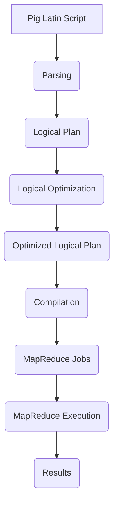

# Pig自然语言处理：利用Pig分析文本数据

## 1.背景介绍

### 1.1 自然语言处理概述

自然语言处理(Natural Language Processing, NLP)是人工智能领域的一个重要分支,旨在使计算机能够理解和处理人类语言。它涉及多个领域,包括计算机科学、语言学和认知科学等。自然语言处理的应用广泛,包括机器翻译、问答系统、文本挖掘、情感分析等。

随着大数据时代的到来,海量的非结构化文本数据激增,对于高效分析和处理这些数据提出了新的挑战。传统的自然语言处理工具和框架在处理大规模数据集时往往存在性能瓶颈。因此,需要一种能够高效处理大规模文本数据的解决方案。

### 1.2 Pig简介

Apache Pig是一种用于大规模数据分析的高级数据流语言和执行框架。它基于Hadoop MapReduce,提供了一种更高层次的数据处理抽象,使程序员无需编写复杂的MapReduce代码即可进行数据处理和分析。

Pig的主要优势在于:

- 高级数据流语言(Pig Latin),类似于SQL,易于编写和维护
- 优化器自动优化Pig脚本,提高执行效率
- 支持多种数据格式,包括结构化和非结构化数据
- 可扩展性强,能够在大规模数据集上运行
- 与Hadoop生态系统无缝集成

由于其简洁性和可扩展性,Pig非常适合用于自然语言处理任务,尤其是在处理大规模文本数据时。

## 2.核心概念与联系  

### 2.1 Pig与MapReduce

虽然Pig是建立在Hadoop MapReduce之上的,但它提供了更高层次的抽象,使得编写数据分析程序变得更加容易。在Pig中,我们使用Pig Latin语言来描述数据转换过程,而不是直接编写MapReduce代码。

Pig会将Pig Latin脚本翻译成一系列的MapReduce作业,并在Hadoop集群上执行。Pig的优化器会自动优化这些作业,以提高执行效率。

### 2.2 Pig数据模型

Pig采用了关系模型,数据被组织为数据集(dataset)。每个数据集包含元组(tuple),元组由多个字段(field)组成。这与关系数据库中的表、行和列的概念类似。

Pig支持多种数据格式,包括结构化数据(如CSV文件)和非结构化数据(如文本文件)。它还提供了用户自定义函数(UDF)的功能,允许用户扩展Pig以满足特定的需求。

### 2.3 Pig Latin语言

Pig Latin是Pig的核心,它是一种类似于SQL的数据流语言。Pig Latin脚本由一系列的关系运算符(如LOAD、FILTER、GROUP等)组成,用于描述数据的转换过程。

以下是一个简单的Pig Latin示例,用于计算每个单词在文本文件中出现的次数:

```pig
-- 加载数据
lines = LOAD 'input.txt' AS (line:chararray);

-- 拆分每一行为单词
words = FOREACH lines GENERATE FLATTEN(TOKENIZE(line)) AS word;

-- 计算每个单词出现的次数
word_counts = GROUP words BY word;
result = FOREACH word_counts GENERATE group, COUNT(words);

-- 存储结果
STORE result INTO 'output' USING PigStorage(',');
```

## 3.核心算法原理具体操作步骤

### 3.1 Pig执行流程

当我们运行一个Pig Latin脚本时,Pig会经历以下几个主要步骤:

1. **解析(Parsing)**: Pig解析器将Pig Latin脚本转换为一个逻辑计划(Logical Plan)。

2. **逻辑优化(Logical Optimization)**: Pig优化器对逻辑计划进行优化,如投影剪裁、过滤器推送等。

3. **编译(Compilation)**: 逻辑计划被编译为一系列的MapReduce作业。

4. **MapReduce执行(MapReduce Execution)**: 编译后的MapReduce作业在Hadoop集群上执行。

5. **获取结果(Fetching Results)**: 最终结果被存储在HDFS或其他存储系统中。



### 3.2 数据流模型

Pig采用了数据流编程模型。在Pig Latin中,我们使用一系列的关系运算符来描述数据的转换过程,就像水流经过一个个小池塘一样。

每个关系运算符接收一个或多个数据集作为输入,并产生一个新的数据集作为输出。运算符之间通过数据流连接,形成一个数据处理管道。

这种数据流模型使得Pig程序更加模块化和可组合,同时也为并行执行和优化提供了机会。

### 3.3 并行执行

Pig能够充分利用Hadoop的并行计算能力。在编译阶段,Pig会将Pig Latin脚本转换为一系列的MapReduce作业。每个MapReduce作业都可以在多个节点上并行执行,从而提高处理速度。

Pig的优化器会自动优化这些MapReduce作业,例如合并相邻的作业、重新分区数据等,以减少数据的shuffling开销。

### 3.4 用户自定义函数(UDF)

Pig提供了用户自定义函数(User Defined Function, UDF)的功能,允许用户扩展Pig以满足特定的需求。UDF可以用多种语言编写,如Java、Python、JavaScript等。

UDF可以在Pig Latin脚本中调用,就像内置函数一样。它们可以用于实现自定义的数据转换、过滤或聚合操作。

在自然语言处理领域,UDF可以用于实现各种文本处理算法,如词干提取、词性标注、命名实体识别等。

## 4.数学模型和公式详细讲解举例说明

自然语言处理中有许多涉及到数学模型和公式的算法,如下我们以文本分类为例,介绍一些常用的模型和公式。

### 4.1 文本表示

在进行文本分类之前,我们需要将文本转换为计算机可理解的数值向量表示。一种常用的方法是词袋(Bag of Words)模型。

在词袋模型中,每个文本被表示为一个向量,其中每个维度对应一个词,向量的值表示该词在文本中出现的次数。假设我们有一个词汇表$V=\{w_1, w_2, \ldots, w_n\}$,那么一个文本$d$可以表示为:

$$\vec{d} = (x_1, x_2, \ldots, x_n)$$

其中$x_i$表示词$w_i$在文本$d$中出现的次数。

虽然简单,但词袋模型忽略了词与词之间的顺序和语义信息。一种更高级的表示方法是Word Embedding,它将每个词映射到一个低维的连续向量空间,保留了一定的语义信息。

### 4.2 朴素贝叶斯分类器

朴素贝叶斯分类器是一种简单但有效的概率分类模型,常用于文本分类任务。它基于贝叶斯定理,假设每个特征(词)相互独立。

给定一个文本$d$和一个类别$c$,我们根据贝叶斯定理计算$P(c|d)$:

$$P(c|d) = \frac{P(d|c)P(c)}{P(d)}$$

由于分母$P(d)$对于所有类别都是相同的,我们只需要最大化$P(d|c)P(c)$。根据特征独立性假设,我们有:

$$P(d|c) = \prod_{i=1}^n P(x_i|c)$$

其中$x_i$是文本$d$中第$i$个词的出现次数。

在训练阶段,我们从训练数据中估计每个$P(x_i|c)$和$P(c)$的值。在预测阶段,我们计算每个类别的$P(d|c)P(c)$,并选择概率最大的类别作为预测结果。

### 4.3 逻辑回归

逻辑回归是另一种常用的文本分类模型。它将文本表示为一个特征向量$\vec{x}$,并学习一个权重向量$\vec{w}$,使得$\vec{w}^T\vec{x}$的值能够很好地分隔不同类别。

对于二分类问题,我们定义$y \in \{0, 1\}$为类别标签。逻辑回归模型的目标是最小化以下损失函数:

$$J(\vec{w}) = -\frac{1}{m}\sum_{i=1}^m \left[y^{(i)}\log h(\vec{x}^{(i)}) + (1-y^{(i)})\log(1-h(\vec{x}^{(i)})) \right]$$

其中$h(\vec{x})$是sigmoid函数:

$$h(\vec{x}) = \frac{1}{1 + e^{-\vec{w}^T\vec{x}}}$$

通过梯度下降等优化算法,我们可以找到最优的$\vec{w}$,使得$h(\vec{x})$能够很好地预测类别标签。

在实践中,我们通常会添加正则化项(如L1或L2范数)到损失函数中,以防止过拟合。

## 4.项目实践:代码实例和详细解释说明

下面我们通过一个实例,演示如何使用Pig进行自然语言处理任务。我们将使用Pig对一个文本语料库进行处理,计算每个单词在语料库中出现的次数。

### 4.1 准备数据

假设我们有一个文本文件`corpus.txt`,每行是一个句子。我们将把它加载到HDFS上,作为Pig的输入数据。

```bash
hdfs dfs -put corpus.txt /user/myname/input
```

### 4.2 Pig Latin脚本

接下来,我们编写一个Pig Latin脚本`word_count.pig`来处理数据:

```pig
-- 加载数据
lines = LOAD '/user/myname/input/corpus.txt' AS (line:chararray);

-- 拆分每一行为单词
words = FOREACH lines GENERATE FLATTEN(TOKENIZE(line)) AS word;

-- 去除标点符号和数字
cleaned_words = FOREACH words GENERATE REPLACE(LOWER(word), '[^a-zA-Z]', '') AS word;
filtered_words = FILTER cleaned_words BY word != '';

-- 计算每个单词出现的次数
word_counts = GROUP filtered_words BY word;
result = FOREACH word_counts GENERATE group, COUNT(filtered_words);

-- 存储结果
STORE result INTO '/user/myname/output' USING PigStorage(',');
```

让我们逐步解释这个脚本:

1. 我们使用`LOAD`操作符加载输入文件`corpus.txt`。每一行被视为一个`chararray`(字符串)。

2. 使用`FOREACH ... GENERATE FLATTEN(TOKENIZE(line))`将每一行拆分为单词。`TOKENIZE`是Pig内置的一个用于分词的函数。

3. 使用另一个`FOREACH`表达式去除标点符号和数字。我们首先将单词转换为小写,然后使用`REPLACE`函数去除非字母字符。`FILTER`操作符用于过滤掉空字符串。

4. `GROUP ... BY`操作符根据单词对过滤后的单词流进行分组。`FOREACH ... GENERATE COUNT(...)`计算每个组(即每个单词)的计数。

5. 最后,我们使用`STORE`操作符将结果存储到HDFS上的`/user/myname/output`路径,使用逗号作为分隔符。

### 4.3 运行Pig脚本

要运行这个Pig脚本,我们可以使用`pig`命令:

```bash
pig -x mapreduce word_count.pig
```

`-x mapreduce`选项告诉Pig使用MapReduce执行引擎。

运行完成后,结果将存储在`/user/myname/output`路径下。我们可以使用以下命令查看结果:

```bash
hdfs dfs -cat /user/myname/output/part-r-00000
```

输出应该类似于:

```
the,5678
a,4321
...
```

每一行显示了一个单词及其在语料库中出现的次数。

## 5.实际应用场景

自然语言处理在现实世界中有着广泛的应用,下面列举了一些典型的场景:

### 5.1 文本分类

文本分类是自然语言处理的一个核心任务,旨在将文本文档自动分配到预定义的类别中。它在垃圾邮件检测、新闻分类、情感分析等领域