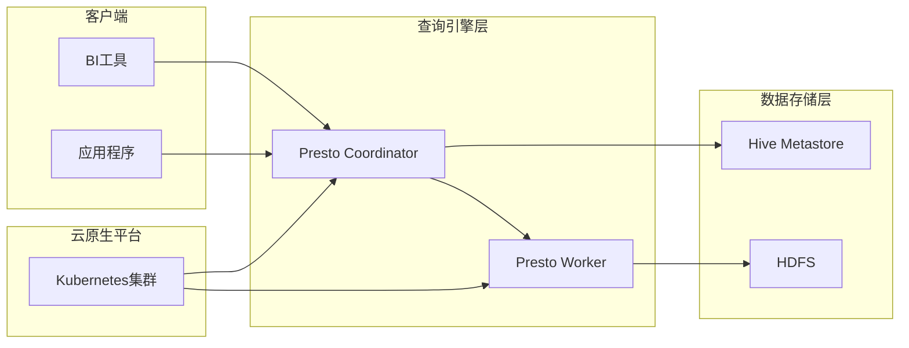

## Presto-Hive整合的云原生架构

作者：禅与计算机程序设计艺术

## 1. 背景介绍

### 1.1 大数据分析的挑战

随着互联网和物联网的快速发展，全球数据量呈爆炸式增长，企业需要处理和分析的数据量也越来越大。传统的数据库和数据仓库系统已经无法满足海量数据的存储和分析需求，大数据技术应运而生。在大数据分析领域，Hadoop生态系统凭借其开源、可扩展性强等优势，成为了主流的大数据处理平台之一。

### 1.2 Hive和Presto的优势与局限性

Hive是Hadoop生态系统中一个基于Hadoop的数据仓库工具，它提供了一种类似于SQL的查询语言HiveQL，用户可以通过HiveQL语句轻松地对存储在Hadoop上的海量数据进行查询和分析。Hive具有以下优点：

* **易用性：** Hive提供了类似于SQL的查询语言，易于学习和使用。
* **可扩展性：** Hive可以运行在大型Hadoop集群上，处理PB级别的数据。
* **成本效益高：** Hive构建在Hadoop之上，可以利用Hadoop的低成本存储和计算资源。

然而，Hive也存在一些局限性：

* **查询延迟高：** Hive的查询引擎基于MapReduce，查询延迟较高，不适合实时查询场景。
* **不支持事务：** Hive不支持事务，无法保证数据的一致性。

Presto是Facebook开源的一个分布式SQL查询引擎，它专为高速、交互式查询而设计。Presto具有以下优点：

* **高性能：** Presto采用基于内存的查询执行模型，查询速度非常快，可以满足实时查询需求。
* **可扩展性：** Presto可以运行在大型集群上，支持PB级别的数据查询。
* **支持多种数据源：** Presto可以连接到多种数据源，包括Hive、MySQL、PostgreSQL等。

然而，Presto也存在一些局限性：

* **不支持数据存储：** Presto只是一个查询引擎，不提供数据存储功能。
* **生态系统相对较小：** Presto的生态系统相对较小，与Hive相比，可用的工具和资源较少。

### 1.3 云原生架构的优势

云原生架构是一种设计和构建应用程序的方法，它充分利用了云计算的优势，例如弹性、可扩展性和按需付费等。云原生架构的优势包括：

* **更高的资源利用率：** 云原生架构可以根据应用程序的实际需求动态地分配和释放资源，提高了资源利用率。
* **更快的部署速度：** 云原生架构采用容器化技术，可以快速地部署和更新应用程序。
* **更高的可靠性和可用性：** 云原生架构采用分布式设计，可以提高应用程序的可靠性和可用性。

### 1.4 Presto-Hive整合的云原生架构

为了克服Hive和Presto的局限性，并充分利用云原生架构的优势，我们可以将Presto和Hive整合到一个云原生架构中。在这个架构中，Hive作为数据仓库，负责存储海量数据；Presto作为查询引擎，负责提供高速、交互式的查询服务。

## 2. 核心概念与联系

### 2.1 云原生架构核心组件

云原生架构通常包含以下核心组件：

* **容器化：** 使用容器技术，例如Docker和Kubernetes，将应用程序及其依赖项打包到一个独立的单元中，以便于部署和管理。
* **微服务：** 将应用程序拆分成多个小型、独立的服务，每个服务负责一个特定的功能，服务之间通过API进行通信。
* **持续交付：** 自动化应用程序的构建、测试和部署过程，以实现快速、可靠的软件交付。
* **DevOps：** 将开发和运维团队整合在一起，以提高协作效率和软件交付速度。

### 2.2 Presto-Hive整合架构

Presto-Hive整合的云原生架构如下图所示：



**架构说明：**

* **数据存储层：** Hive Metastore存储Hive表的元数据信息，HDFS存储Hive表的数据文件。
* **查询引擎层：** Presto Coordinator负责接收客户端的查询请求，并将查询任务分解成多个子任务，分配给Presto Worker执行。Presto Worker负责读取HDFS上的数据文件，执行查询任务，并将结果返回给Presto Coordinator。
* **云原生平台：** Kubernetes集群负责管理和调度Presto Coordinator和Worker节点，并提供服务发现、负载均衡、自动伸缩等功能。
* **客户端：** BI工具和应用程序可以通过Presto JDBC或ODBC驱动程序连接到Presto Coordinator，提交查询请求。

### 2.3 组件之间的联系

* Presto Coordinator通过Hive Metastore获取Hive表的元数据信息，例如表的schema、数据文件的位置等。
* Presto Worker根据Presto Coordinator下发的查询任务，读取HDFS上的数据文件，执行查询操作。
* Kubernetes集群负责监控Presto Coordinator和Worker节点的运行状态，并根据负载情况动态地添加或删除节点，以确保查询性能。

## 3. 核心算法原理具体操作步骤

### 3.1 Presto查询执行流程

Presto的查询执行流程如下：

1. 客户端提交查询请求到Presto Coordinator。
2. Presto Coordinator解析查询语句，生成查询计划。
3. Presto Coordinator将查询计划分解成多个子任务，并根据数据本地性原则将子任务分配给不同的Presto Worker节点。
4. Presto Worker节点读取HDFS上的数据文件，执行查询子任务。
5. Presto Worker节点将查询结果返回给Presto Coordinator。
6. Presto Coordinator汇总所有Worker节点的查询结果，并将最终结果返回给客户端。

### 3.2 数据本地性原则

Presto在分配查询子任务时，会尽量将子任务分配到数据所在的节点上，以减少数据传输成本，提高查询性能。Presto支持三种数据本地性级别：

* **NODE：** 子任务必须在数据所在的节点上执行。
* **RACK：** 子任务必须在数据所在机架上的节点上执行。
* **ANY：** 子任务可以在任何节点上执行。

### 3.3 查询优化

Presto提供了多种查询优化技术，例如：

* **列式存储：** Presto支持列式存储格式，例如ORC和Parquet，可以减少磁盘IO，提高查询性能。
* **谓词下推：** Presto可以将查询条件下推到数据源，例如Hive，以减少数据传输量。
* **数据缓存：** Presto可以将查询结果缓存到内存中，以加速后续查询。

## 4. 数学模型和公式详细讲解举例说明

### 4.1 数据倾斜问题

在大数据分析中，数据倾斜是一个常见问题。数据倾斜是指某些键的值出现的频率远远高于其他键，导致某些节点的负载过高，而其他节点的负载很低，从而影响查询性能。

### 4.2 数据倾斜的解决方法

Presto提供了一些解决数据倾斜问题的方法，例如：

* **数据预处理：** 在数据加载到Hive之前，对数据进行预处理，例如对倾斜键进行分桶或散列。
* **动态分区裁剪：** Presto可以根据查询条件动态地裁剪分区，以减少数据读取量。
* **调整连接策略：** Presto支持多种连接策略，例如广播连接和排序合并连接，可以根据数据倾斜情况选择合适的连接策略。

### 4.3 数据倾斜的案例分析

假设有一个Hive表，包含以下数据：

| 用户ID | 商品ID | 购买数量 |
|---|---|---|
| 1 | 1001 | 10 |
| 1 | 1002 | 5 |
| 2 | 1001 | 2 |
| 3 | 1003 | 1 |
| ... | ... | ... |

其中，用户ID为1的用户购买了很多商品，导致数据倾斜。如果使用Presto查询该表，例如查询所有用户购买商品1001的数量，那么Presto Worker节点1的负载会非常高，而其他节点的负载很低。

为了解决这个问题，我们可以使用数据预处理的方法，例如对用户ID进行分桶。假设我们将用户ID分成10个桶，那么用户ID为1的用户的数据会被分配到不同的桶中，从而减轻Presto Worker节点1的负载。

## 5. 项目实践：代码实例和详细解释说明

### 5.1 构建Presto-Hive云原生架构

以下是一个简单的Presto-Hive云原生架构的构建步骤：

1. **创建Kubernetes集群：** 可以使用AWS、Azure、GCP等云平台提供的Kubernetes服务，或者使用minikube等工具在本地搭建Kubernetes集群。
2. **部署Hive Metastore和HDFS：** 可以使用Kubernetes的Deployment和Service资源对象部署Hive Metastore和HDFS服务。
3. **部署Presto Coordinator和Worker：** 可以使用Kubernetes的Deployment和Service资源对象部署Presto Coordinator和Worker服务，并将Presto Coordinator的配置指向Hive Metastore和HDFS。
4. **创建Presto连接信息：** 创建Presto连接信息，包括Presto Coordinator的地址、端口、用户名、密码等。
5. **使用Presto客户端连接到Presto集群：** 可以使用Presto CLI、JDBC或ODBC驱动程序连接到Presto集群，提交查询请求。

### 5.2 代码实例

以下是一个简单的Presto查询Hive表的代码实例：

```sql
-- 连接到Presto集群
presto> connector hive

-- 查询Hive表
presto> select * from hive.default.test_table;
```

### 5.3 详细解释说明

* `connector hive` 命令用于连接到Hive数据源。
* `hive.default.test_table` 是Hive表的完整表名，包括数据库名、表名和分区信息。

## 6. 实际应用场景

### 6.1 实时报表分析

Presto可以与BI工具（例如Tableau、Power BI）集成，提供实时报表分析功能。例如，可以使用Presto查询Hive中的用户行为数据，生成实时的用户行为报表。

### 6.2 数据探索和分析

Presto可以用于数据探索和分析，例如查询Hive中的数据，发现数据中的模式和趋势。

### 6.3 ETL流程

Presto可以作为ETL流程的一部分，用于从不同的数据源中提取、转换和加载数据。例如，可以使用Presto从MySQL数据库中提取数据，然后将数据加载到Hive中。

## 7. 总结：未来发展趋势与挑战

### 7.1 未来发展趋势

* **云原生化：** Presto-Hive整合架构将更加云原生化，例如使用Kubernetes Operator管理Presto集群，使用云存储服务存储Hive数据等。
* **更强大的查询优化器：** Presto将继续改进查询优化器，以支持更复杂的查询场景和更大的数据集。
* **更广泛的数据源支持：** Presto将支持更多的数据源，例如NoSQL数据库、消息队列等。

### 7.2 面临的挑战

* **数据安全：** 云原生架构的安全性是一个重要问题，需要采取措施保护Presto-Hive整合架构的安全性。
* **数据一致性：** Presto不支持事务，需要采取措施保证数据的一致性。
* **运维管理：** 云原生架构的运维管理比传统架构更加复杂，需要专业的运维团队。

## 8. 附录：常见问题与解答

### 8.1 如何配置Presto连接Hive Metastore？

在Presto Coordinator的配置文件中，配置Hive Metastore的连接信息，例如：

```
hive.metastore.uri=thrift://hive-metastore:9060
```

### 8.2 如何解决Presto查询Hive表时出现的数据倾斜问题？

可以使用数据预处理、动态分区裁剪、调整连接策略等方法解决数据倾斜问题。

### 8.3 如何监控Presto集群的性能？

可以使用Presto提供的监控指标，例如查询延迟、CPU使用率、内存使用率等，监控Presto集群的性能。