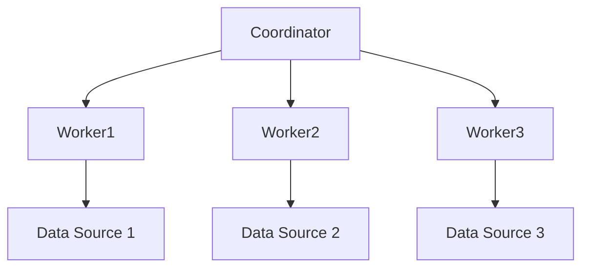
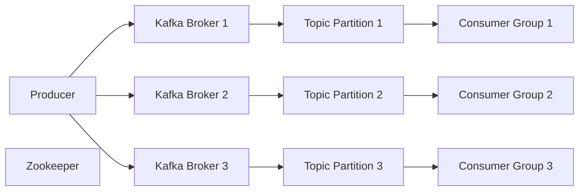
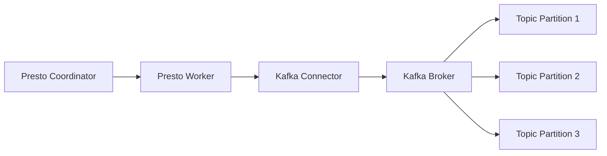

# Presto与Kafka：实时数据分析，捕捉瞬息万变

## 1.背景介绍

### 1.1 大数据时代的到来
在当今时代，数据已经成为了推动商业和科技发展的关键驱动力。随着互联网、物联网、移动设备和社交媒体的快速普及，海量的数据正以前所未有的速度被生成和收集。这些数据不仅包括结构化的数据,如交易记录和日志文件,还包括非结构化的数据,如图像、视频和社交媒体内容。

### 1.2 实时数据分析的重要性
在这种数据爆炸的背景下,实时数据分析变得前所未有的重要。企业和组织需要能够快速地从这些海量数据中提取有价值的见解,以支持实时决策和优化业务流程。传统的批处理数据分析方法已经无法满足这种实时需求,因为它们通常需要较长的时间来收集、存储和处理数据。

### 1.3 Presto和Kafka的融合
Presto和Kafka是解决实时数据分析挑战的两种强大工具。Presto是一种开源的分布式SQL查询引擎,专门设计用于交互式分析查询。它能够快速查询各种数据源,包括Hadoop、AWS S3、Cassandra等。而Kafka则是一个分布式流处理平台,能够可靠地传输和持久化大量的实时数据流。

通过将Presto与Kafka相结合,我们可以构建一个强大的实时数据分析管道。Kafka可以作为数据的入口,从各种来源收集实时数据流,而Presto则可以直接查询Kafka中的数据,实现对实时数据的快速分析。这种架构不仅能够满足实时分析的需求,还能够提供高可扩展性和容错能力。

## 2.核心概念与联系  

### 2.1 Presto概念
#### 2.1.1 Presto架构
Presto采用主从架构,包括一个协调器(Coordinator)和多个工作节点(Worker)。协调器负责解析SQL查询,制定查询计划并将任务分发给工作节点。工作节点则负责实际执行查询任务,从数据源读取数据并进行计算。

#### 2.1.2 查询执行
Presto查询的执行过程包括以下几个主要阶段:

1. 查询解析和优化
2. 分布式计划
3. 任务调度
4. 数据处理和传输
5. 结果归并

在执行查询时,Presto会尽可能地将计算推送到数据源端,以减少数据传输量并提高查询效率。

#### 2.1.3 连接器(Connector)
Presto支持通过连接器(Connector)连接各种数据源,包括Hive、Cassandra、MySQL、Kafka等。连接器负责将底层数据源的数据映射到Presto的逻辑表示,使Presto可以像查询本地表一样查询外部数据源。

### 2.2 Kafka概念
#### 2.2.1 Kafka架构
Kafka是一个分布式的流处理平台,主要由以下几个组件组成:

- Producer: 生产者,用于向Kafka发送数据流
- Consumer: 消费者,用于从Kafka订阅并消费数据流
- Broker: Kafka实例,负责存储和管理数据流
- Topic: 数据流的逻辑分区,Producer和Consumer通过Topic进行数据的发送和接收
- Partition: Topic的物理分区,用于提高并行度和容错能力
- Zookeeper: 用于协调Kafka集群中的节点和元数据管理

#### 2.2.2 数据持久化和复制
Kafka将数据流持久化到磁盘,并通过复制机制实现容错和高可用。每个Partition可以配置多个副本,分布在不同的Broker上,以防止单点故障。

#### 2.2.3 消费模式
Kafka支持两种消费模式:队列模式和发布-订阅模式。在队列模式下,每条消息只能被一个消费者组内的一个消费者实例消费。而在发布-订阅模式下,每条消息可以被多个消费者组内的所有消费者实例消费。

### 2.3 Presto与Kafka的集成
Presto通过Kafka连接器可以直接查询Kafka中的数据流。Presto将Kafka Topic映射为逻辑表,并将Partition映射为分区。通过SQL查询,Presto可以读取Kafka中的实时数据,并对其进行各种分析和转换操作。

通过这种集成,我们可以构建一个端到端的实时数据分析管道,将来自各种来源的实时数据流首先发送到Kafka,然后由Presto直接查询和分析这些数据流,实现真正的实时数据分析。

## 3.核心算法原理具体操作步骤

### 3.1 Presto查询执行流程
Presto查询的执行过程包括以下几个主要步骤:

1. **查询解析和优化**

   Presto首先将SQL查询解析为抽象语法树(AST),然后对AST进行逻辑优化,如谓词下推、投影剪裁等。优化后的AST被转换为分布式执行计划。

2. **分布式计划**

   Presto协调器根据数据源的位置和查询的特征,制定分布式执行计划。计划包括多个阶段(Stage),每个阶段由多个任务(Task)组成。

3. **任务调度**

   协调器将任务分发给工作节点执行。工作节点根据任务的依赖关系,按顺序执行各个任务。

4. **数据处理和传输**

   工作节点从数据源读取数据,执行相应的计算和转换操作。中间结果通过高效的数据传输机制在节点之间传输。

5. **结果归并**

   最终结果由协调器从工作节点收集并合并,形成完整的查询结果集。

### 3.2 Kafka数据流处理
Kafka Producer和Consumer通过以下步骤实现数据流的生产和消费:

1. **生产者(Producer)**
   - 选择Topic
   - 对消息进行序列化
   -将消息发送到指定的Topic的Partition

2. **Broker**
   - 将消息持久化到磁盘
   - 维护消费位移(Offset)
   - 复制消息到其他Broker以实现容错

3. **消费者(Consumer)**
   - 订阅Topic
   - 获取当前消费位移
   - 从指定位移开始消费消息
   - 处理消息
   - 提交新的消费位移

### 3.3 Presto查询Kafka数据流
当Presto查询Kafka中的数据流时,会执行以下步骤:

1. **元数据查询**

   Presto查询Kafka的元数据,获取Topic、Partition和消费位移信息。

2. **生成查询计划**

   根据元数据信息,Presto生成分布式查询计划,包括从Kafka读取数据的任务。

3. **任务调度和执行**

   Presto协调器将读取任务分发给工作节点执行。工作节点启动Kafka Consumer,从指定位移开始消费数据流。

4. **数据处理和传输**

   工作节点对消费的数据流执行查询操作,如过滤、投影、聚合等。中间结果在节点间传输。

5. **结果归并**

   协调器收集并合并工作节点的结果,形成最终的查询结果集。

通过这种方式,Presto可以实现对Kafka中实时数据流的低延迟查询和分析,满足实时数据分析的需求。

## 4.数学模型和公式详细讲解举例说明

在实时数据分析中,常常需要对数据流进行各种统计和分析操作,这些操作往往涉及到一些数学模型和公式。下面我们将介绍一些常见的数学模型和公式,并详细讲解它们在实时数据分析中的应用。

### 4.1 滑动窗口模型
滑动窗口模型是实时数据分析中一种常用的技术,用于对数据流进行时间窗口聚合和分析。它将数据流划分为一个个重叠或不重叠的时间窗口,并对每个窗口内的数据进行聚合计算。

滑动窗口模型可以用以下公式表示:

$$
y_t = f(x_{t-w+1}, x_{t-w+2}, \ldots, x_t)
$$

其中:
- $y_t$是时间$t$的窗口聚合结果
- $f$是聚合函数,如sum、avg等
- $w$是窗口大小
- $x_i$是时间$i$的数据点

滑动窗口模型可以分为以下几种类型:

1. **滚动窗口(Tumbling Window)**

   窗口之间没有重叠,每个数据点只属于一个窗口。

   $$
   y_t = f(x_{t-w+1}, x_{t-w+2}, \ldots, x_t)\\
   y_{t+1} = f(x_{t-w+2}, x_{t-w+3}, \ldots, x_{t+1})
   $$

2. **滑动窗口(Sliding Window)**

   窗口之间有重叠,每个数据点可能属于多个窗口。

   $$
   y_t = f(x_{t-w+1}, x_{t-w+2}, \ldots, x_t)\\
   y_{t+1} = f(x_{t-w+2}, x_{t-w+3}, \ldots, x_{t+1})
   $$

3. **会话窗口(Session Window)**

   根据数据点之间的时间间隔动态确定窗口边界。

滑动窗口模型在实时数据分析中有广泛的应用,例如网络流量监控、在线广告点击分析、传感器数据处理等。通过设置合适的窗口大小和聚合函数,我们可以从数据流中提取出有价值的时间序列模式和统计信息。

### 4.2 指数加权移动平均模型
指数加权移动平均模型(Exponential Weighted Moving Average, EWMA)是一种常用的时间序列平滑模型,可以用于实时数据流的异常检测和趋势分析。

EWMA模型的公式如下:

$$
S_t = \alpha x_t + (1 - \alpha) S_{t-1}
$$

其中:
- $S_t$是时间$t$的EWMA值
- $x_t$是时间$t$的原始数据点
- $\alpha$是平滑系数,取值范围为$(0, 1)$
- $S_{t-1}$是时间$t-1$的EWMA值

EWMA模型具有以下特点:

1. 更多地关注最近的数据点,对旧数据点的影响逐渐衰减。
2. 平滑系数$\alpha$决定了对新数据点和旧数据点的权重分配。
3. 当$\alpha$较大时,模型对新数据点更加敏感;当$\alpha$较小时,模型对新数据点的反应更加平滑。

在实时数据分析中,EWMA模型可以用于以下场景:

1. **异常检测**

   通过计算原始数据点与EWMA值之间的差异,可以检测出数据流中的异常值。

   $$
   e_t = x_t - S_t
   $$

   如果$|e_t|$超过一定阈值,则认为该数据点是异常值。

2. **趋势分析**

   EWMA值可以反映数据流的整体趋势,可用于预测未来的数据变化。

3. **基线估计**

   EWMA值可以作为数据流的基线,用于数据标准化和异常分数计算。

EWMA模型的优点是计算简单、内存占用小,适合用于实时数据流的在线分析。但它也存在一些局限性,如对突变和周期性模式不太敏感。在实际应用中,我们可以根据具体场景选择合适的平滑系数和异常阈值。

### 4.3