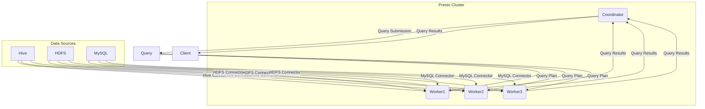
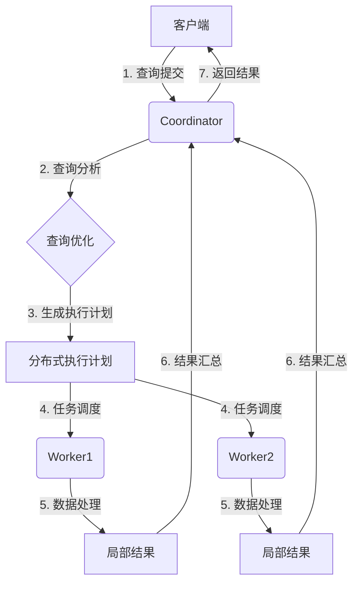
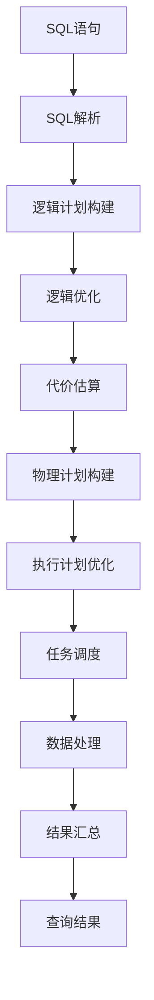

# Presto原理与代码实例讲解

## 1.背景介绍

### 1.1 什么是Presto

Presto是一种开源的分布式SQL查询引擎,最初由FaceBook公司开发,现在由Presto软件基金会维护。Presto旨在查询来自多个不同数据源的大数据,并以高性能和低延迟的方式返回结果。它支持在线分析处理(OLAP)查询,可用于数据分析、业务智能和数据探索等场景。

### 1.2 Presto的特点

- **高性能**:Presto采用分布式并行查询执行引擎,可高效利用集群资源,实现亚秒级查询响应。
- **统一数据视图**:Presto通过连接器(Connector)技术,提供了对多种异构数据源(如HDFS、Hive、Cassandra、MySQL等)的统一查询能力。
- **开放生态**:Presto基于Apache许可证开源,拥有活跃的社区和丰富的文档,可灵活定制和扩展。
- **ANSI SQL标准**:支持ANSI SQL标准,降低学习成本,易于数据分析人员使用。

### 1.3 Presto的应用场景

- **交互式分析**:Presto支持亚秒级查询响应,非常适合交互式数据探索和数据分析。
- **统一大数据查询**:通过连接器技术,Presto可以统一查询来自Hive、HDFS、NoSQL等异构数据源的海量数据。
- **ETL工作负载**:Presto可以高效执行数据抽取、转换和加载(ETL)任务。
- **机器学习特征工程**:Presto可以高效处理机器学习中的数据准备和特征工程工作负载。

## 2.核心概念与联系

### 2.1 Presto架构概览

Presto采用主从(Master-Worker)架构,由以下几个主要组件组成:

- **Coordinator**:接收客户端查询请求,管理查询执行,协调各节点资源分配。
- **Worker**:执行具体的查询计划任务,处理数据并返回结果给Coordinator。
- **Catalog**:元数据目录服务,管理数据源的模式(Schema)信息。
- **Connector**:连接各种数据源,解析数据,响应查询请求。

### 2.2 Presto查询执行流程

1. **查询提交**:客户端向Coordinator节点提交查询语句。
2. **查询分析**:Coordinator对SQL语句进行语法分析、逻辑优化和代价估算。
3. **查询计划生成**:根据优化后的逻辑查询计划,生成分布式物理执行计划。
4. **任务调度**:Coordinator将查询任务分发给Worker节点执行。
5. **数据处理**:Worker通过Connector从数据源读取数据,并执行查询计划中的各种操作(如过滤、聚合等)。
6. **结果汇总**:各Worker将局部结果传回Coordinator进行汇总。
7. **查询结果返回**:Coordinator将最终结果返回给客户端。

### 2.3 Presto内存管理

Presto采用基于池(Pool)的内存管理策略,将集群内存划分为多个内存池,并通过配置内存池属性来控制内存的使用和分配。主要内存池包括:

- **Reserved Pool**:用于执行一些关键的内部操作,如管理内存。
- **User Pool**:为用户查询分配内存资源,可配置最大内存使用量。
- **Revocable Pool**:一种弹性内存池,为用户查询提供额外内存。

通过合理配置内存池的大小比例和属性,可以有效避免内存不足或内存浪费,提高内存资源利用率。

### 2.4 Presto交换(Spill)机制

当查询所需内存超出配额时,Presto会将部分内存数据写入磁盘,以避免查询失败。这个过程称为交换(Spill)。Presto支持以下几种交换策略:

- **内存映射交换(Memory Mapped Spill)**:将内存数据映射到磁盘文件。
- **文件交换(File Spill)**:将内存数据直接写入磁盘文件。
- **内存合并交换(Merge Spill)**:对内存数据进行排序和合并后再写入磁盘。

交换虽然可避免内存不足导致的查询失败,但会降低查询性能。因此,需要合理配置内存池大小,并优化查询,尽量减少交换发生。

## 3.核心算法原理具体操作步骤

### 3.1 Presto查询处理流程

Presto查询处理流程主要包括以下几个阶段:

1. **SQL解析**:将SQL语句解析为抽象语法树(AST)。
2. **逻辑计划构建**:基于AST构建逻辑查询计划。
3. **逻辑优化**:对逻辑计划进行一系列优化,如投影剪裁、谓词下推等。
4. **代价估算**:估算每个逻辑计划的执行代价,作为物理计划选择的依据。
5. **物理计划构建**:根据优化后的逻辑计划,生成分布式的物理执行计划。
6. **执行计划优化**:对物理计划进行优化,如并行化、Broadcast Join等。
7. **任务调度**:将物理计划分解为多个Stage和Task,分发给Worker节点执行。
8. **数据处理**:Worker节点执行具体的数据处理操作,如扫描、过滤、聚合等。
9. **结果汇总**:Worker将局部结果传回Coordinator,进行全局汇总和处理。

### 3.2 Presto查询优化策略

为了提高查询性能,Presto在查询处理流程中采用了多种优化策略,包括:

1. **谓词下推**:将过滤条件(WHERE、JOIN等)下推到数据源,尽早过滤掉不需要的数据。
2. **投影剪裁**:仅读取所需的列,减少数据传输和内存使用。
3. **常量折叠**:预计算常量表达式,减少运行时开销。
4. **分区剪裁**:根据过滤条件,仅读取所需的数据分区。
5. **自动重写**:自动重写SQL,转换成更高效的等价形式。
6. **统计信息使用**:利用数据统计信息进行代价估算和计划选择。
7. **Join重排序**:优化Join顺序,减少中间结果大小。
8. **并行化**:自动将查询计划并行化,充分利用集群资源。
9. **Broadcast Join**:对于小表,采用Broadcast Join算法,提高Join效率。
10. **动态过滤**:在Join过程中动态生成和传播过滤条件,减少不必要的数据处理。

### 3.3 Presto Exchange算子

Exchange算子是Presto中重要的数据重分区(Repartition)和数据传输操作,用于在查询执行过程中实现数据重分布和并行化。主要有以下几种类型:

1. **Repartition**:根据分区键对数据进行重新分区,实现数据重分布。
2. **Replicated**:将数据广播到所有节点,用于实现Broadcast Join等操作。
3. **Gathered**:收集所有节点的数据,用于实现最终结果的汇总。
4. **Partitioned**:根据分区键将数据分配给不同节点,实现并行处理。
5. **Local**:在单个节点内重新分配数据,用于本地并行处理。

Exchange算子通过数据重分区和数据传输,实现了Presto查询计划的并行化执行,提高了查询性能。

## 4.数学模型和公式详细讲解举例说明

### 4.1 成本模型与优化

Presto在查询优化过程中,需要对每个候选执行计划进行代价估算,选择最优的执行计划。代价估算通常基于一些成本模型和统计信息。

常用的成本模型包括:

- **基于卡路里斯(Cardinalit)的模型**
- **基于向量化(Vectorization)的模型**
- **基于代数(Algebra)的模型**

以基于卡路里斯的模型为例,代价估算公式如下:

$$
Cost = \sum_{i=1}^{n}Rows_i \times CPU_i + \sum_{i=1}^{n}Rows_i \times Network_i + \sum_{i=1}^{n}Rows_i \times IO_i
$$

其中:
- $n$为执行计划中操作符的数量
- $Rows_i$为第i个操作符输出的行数(基于统计信息估算)
- $CPU_i$为第i个操作符的CPU代价
- $Network_i$为第i个操作符的网络传输代价
- $IO_i$为第i个操作符的I/O代价

通过估算每个操作符的代价,并对所有操作符代价求和,即可获得整个执行计划的总代价,作为选择的依据。

### 4.2 Join重排序优化

Join重排序是Presto的一项重要优化策略。对于包含多个Join操作的查询,Join的执行顺序会影响中间结果的大小,进而影响整个查询的性能。

一种常见的Join重排序策略是基于表大小和选择率的启发式算法:

1. 根据表大小从小到大对Join操作进行排序。
2. 计算每个Join操作的选择率,即输出行数与输入行数的比值。
3. 将选择率较小的Join操作放在前面,以尽早减小中间结果大小。

假设有4个表A、B、C、D,分别包含1000万、1亿、1千万和1万行,Join顺序为A⋈B⋈C⋈D。

如果按照传统顺序执行,中间结果大小为:
(1000万) ⋈ (1亿) = 1000亿 ⋈ (1千万) = 1万亿 ⋈ (1万) = 1万亿

而经过Join重排序优化后的执行顺序为:
(1万) ⋈ (1000万) = 1000万 ⋈ (1千万) = 1亿 ⋈ (1亿) = 1万亿

可见,Join重排序可以显著减小中间结果大小,提高查询性能。

## 4.项目实践:代码实例和详细解释说明

### 4.1 Presto连接器实现示例

Presto通过连接器(Connector)技术支持访问多种异构数据源。以HDFS连接器为例,其核心实现包括:

1. **MetadataFactory**:创建处理元数据的工厂类。
2. **HdfsMetadata**:管理HDFS数据源的模式和表元数据信息。
3. **HdfsRecordCursor**:从HDFS读取数据,实现游标(Cursor)接口。
4. **HdfsPageSourceProvider**:创建HdfsRecordCursor提供数据给查询引擎。
5. **HdfsConnector**:连接器主类,封装上述组件,对外提供服务