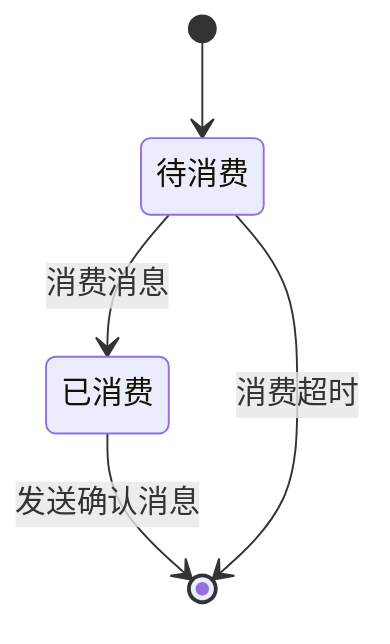

# Pulsar消息重复数据去重及修复实践

作者：禅与计算机程序设计艺术

## 1. 背景介绍

### 1.1 消息队列与数据一致性挑战

在现代分布式系统中，消息队列已经成为不可或缺的基础组件，承担着应用解耦、异步处理、流量削峰等重要职责。然而，消息队列在带来便利的同时，也引入了数据一致性方面的挑战。消息重复是其中一个常见问题，它可能导致数据错误、资源浪费以及系统性能下降。

### 1.2 Pulsar：下一代云原生消息平台

Apache Pulsar 是一款由 Yahoo! 开发的下一代云原生消息平台，具有高性能、高可扩展性、高可靠性等特点。Pulsar 支持多种消息模型，包括队列、主题和流，能够满足不同场景下的消息传递需求。然而，即使是像 Pulsar 这样强大的消息平台，也不能完全避免消息重复的问题。

### 1.3 本文目标

本文旨在深入探讨 Pulsar 消息重复问题产生的原因、解决方案以及实际应用案例。我们将介绍 Pulsar 的消息去重机制，并结合代码实例演示如何实现可靠的消息去重。此外，我们还将分享一些在实际项目中遇到的问题和解决方案，帮助读者更好地理解和应对 Pulsar 消息重复问题。

## 2. 核心概念与联系

### 2.1 消息重复的定义与类型

消息重复是指同一条消息被多次投递到消费者，导致消费者对该消息进行多次处理。消息重复可以分为以下几种类型：

* **生产者重复发送：** 生产者在发送消息后，由于网络抖动或其他原因，没有收到 Broker 的确认，导致生产者误以为消息发送失败，从而进行重试，最终导致消息重复。
* **Broker 内部重复：** Broker 在接收到消息后，由于内部机制问题，例如消息复制过程中出现异常，导致同一条消息被持久化多次。
* **消费者重复消费：** 消费者在消费消息后，由于网络抖动或其他原因，没有及时提交消费位移，导致 Broker 误以为消息未被消费，从而将该消息再次投递给消费者。

### 2.2 Pulsar 消息去重机制

Pulsar 提供了两种主要的消息去重机制：

* **生产者幂等性：** 生产者可以通过设置 `MessageId` 字段来保证消息的唯一性，从而实现消息去重。当生产者发送一条消息时，会为该消息生成一个唯一的 `MessageId`。如果生产者因为某种原因需要重试发送该消息，那么可以使用相同的 `MessageId`。Broker 在接收到消息后，会根据 `MessageId` 判断该消息是否已经存在，如果已经存在，则丢弃该消息。
* **消费者消息确认机制：** 消费者可以通过手动或自动确认机制来确保消息只被消费一次。当消费者成功处理完一条消息后，需要向 Broker 发送确认消息，告知 Broker 该消息已经被消费。如果消费者因为某种原因没有发送确认消息，那么 Broker 会认为该消息未被消费，从而将该消息再次投递给其他消费者。

### 2.3 消息去重与消息顺序的关系

消息去重和消息顺序是两个密切相关的概念。在某些应用场景下，我们需要保证消息的顺序，例如：

* **金融交易系统：** 交易操作必须按照顺序执行，以确保数据的一致性。
* **日志系统：** 日志消息必须按照时间顺序记录，以便于问题排查。

如果消息去重机制不能保证消息的顺序，那么可能会导致数据错误。例如，如果一条消息被重复消费，并且这两条消息的处理顺序相反，那么就可能会导致数据不一致。

## 3. 核心算法原理具体操作步骤

### 3.1 生产者幂等性实现

#### 3.1.1 使用 `MessageId` 保证消息唯一性

```java
// 创建 Producer
PulsarClient client = PulsarClient.builder()
        .serviceUrl("pulsar://localhost:6650")
        .build();
Producer<byte[]> producer = client.newProducer()
        .topic("my-topic")
        .create();

// 发送消息
MessageId messageId = producer.newMessage()
        .key("my-key")
        .value("my-message".getBytes())
        .send();

// 重试发送消息
producer.newMessage()
        .key("my-key")
        .value("my-message".getBytes())
        .messageId(messageId) // 设置相同的 MessageId
        .send();

// 关闭 Producer
producer.close();
client.close();
```

在上面的代码中，我们首先创建了一个 `Producer` 对象，并设置了消息的主题。然后，我们使用 `newMessage()` 方法创建了一条消息，并设置了消息的键和值。在发送消息时，我们使用 `messageId()` 方法设置了消息的 `MessageId`。如果需要重试发送该消息，我们只需要使用相同的 `MessageId` 即可。

#### 3.1.2 自定义 `MessageId` 生成策略

Pulsar 默认使用雪花算法生成 `MessageId`，也可以自定义 `MessageId` 生成策略。例如，可以使用数据库的自增 ID 作为 `MessageId`：

```java
// 自定义 MessageId 生成器
class MyMessageIdGenerator implements MessageIdGenerator {
    private final AtomicInteger counter = new AtomicInteger(0);

    @Override
    public MessageId getNextMessageId() {
        return MessageId.fromByteArray(ByteBuffer.allocate(4).putInt(counter.incrementAndGet()).array());
    }
}

// 创建 Producer
PulsarClient client = PulsarClient.builder()
        .serviceUrl("pulsar://localhost:6650")
        .build();
Producer<byte[]> producer = client.newProducer()
        .topic("my-topic")
        .messageIdGenerator(new MyMessageIdGenerator()) // 设置自定义 MessageId 生成器
        .create();

// 发送消息
MessageId messageId = producer.send("my-message".getBytes());

// 关闭 Producer
producer.close();
client.close();
```

在上面的代码中，我们自定义了一个 `MyMessageIdGenerator` 类，实现了 `MessageIdGenerator` 接口。在 `getNextMessageId()` 方法中，我们使用 `AtomicInteger` 生成自增 ID，并将其转换为字节数组作为 `MessageId`。

### 3.2 消费者消息确认机制实现

#### 3.2.1 手动确认机制

```java
// 创建 Consumer
PulsarClient client = PulsarClient.builder()
        .serviceUrl("pulsar://localhost:6650")
        .build();
Consumer<byte[]> consumer = client.newConsumer()
        .topic("my-topic")
        .subscriptionName("my-subscription")
        .subscriptionType(SubscriptionType.Shared)
        .ackTimeout(1, TimeUnit.MINUTES) // 设置确认超时时间
        .subscribe();

// 消费消息
while (true) {
    Message<byte[]> message = consumer.receive();
    try {
        // 处理消息
        System.out.println("Received message: " + new String(message.getData()));

        // 确认消息
        consumer.acknowledge(message);
    } catch (Exception e) {
        // 处理异常
        consumer.negativeAcknowledge(message);
    }
}

// 关闭 Consumer
consumer.close();
client.close();
```

在上面的代码中，我们首先创建了一个 `Consumer` 对象，并设置了消息的主题、订阅名称、订阅类型和确认超时时间。然后，我们使用 `receive()` 方法接收消息。在处理完消息后，我们使用 `acknowledge()` 方法确认消息。如果处理消息过程中出现异常，我们使用 `negativeAcknowledge()` 方法拒绝消息。

#### 3.2.2 自动确认机制

```java
// 创建 Consumer
PulsarClient client = PulsarClient.builder()
        .serviceUrl("pulsar://localhost:6650")
        .build();
Consumer<byte[]> consumer = client.newConsumer()
        .topic("my-topic")
        .subscriptionName("my-subscription")
        .subscriptionType(SubscriptionType.Shared)
        .ackTimeout(1, TimeUnit.MINUTES) // 设置确认超时时间
        .receiverQueueSize(100) // 设置接收队列大小
        .acknowledgmentGroupTime(0, TimeUnit.MILLISECONDS) // 设置自动确认时间间隔
        .subscribe();

// 消费消息
while (true) {
    Message<byte[]> message = consumer.receive();
    try {
        // 处理消息
        System.out.println("Received message: " + new String(message.getData()));
    } catch (Exception e) {
        // 处理异常
    }
}

// 关闭 Consumer
consumer.close();
client.close();
```

在上面的代码中，我们设置了 `receiverQueueSize` 和 `acknowledgmentGroupTime` 参数。`receiverQueueSize` 参数指定了消费者接收队列的大小，`acknowledgmentGroupTime` 参数指定了自动确认的时间间隔。当接收队列已满或达到自动确认时间间隔时，消费者会自动确认所有已消费的消息。

## 4. 数学模型和公式详细讲解举例说明

### 4.1 幂等性

幂等性是指一个操作，无论执行多少次，产生的效果都与第一次执行相同。在消息队列中，消息的幂等性是指同一条消息被多次投递到消费者，消费者对该消息进行多次处理，最终得到的结果与只处理一次相同。

#### 4.1.1 举例说明

假设有一个银行转账系统，用户 A 需要向用户 B 转账 100 元。用户 A 发起转账请求后，由于网络原因，该请求被发送了两次。如果转账操作不具备幂等性，那么用户 B 的账户会被重复加款 100 元，导致数据错误。

#### 4.1.2 数学模型

幂等性可以用数学公式表示为：

```
f(f(x)) = f(x)
```

其中，`f(x)` 表示对 `x` 进行操作。该公式表示对 `x` 进行两次相同的操作，得到的结果与只进行一次操作相同。

### 4.2 消息确认机制

消息确认机制是指消费者在消费完消息后，需要向 Broker 发送确认消息，告知 Broker 该消息已经被消费。

#### 4.2.1 举例说明

假设有一个电商系统，用户 A 下单购买了一件商品。订单系统将订单信息发送到消息队列，由库存系统消费该消息并扣减库存。如果库存系统在扣减库存后，没有及时发送确认消息，那么订单系统会认为该订单未被处理，从而导致用户 A 无法购买该商品。

#### 4.2.2 数学模型

消息确认机制可以用状态机模型表示：



在该模型中，消息有两种状态：待消费和已消费。当消费者消费完消息后，消息状态变为已消费。消费者需要向 Broker 发送确认消息，告知 Broker 该消息已经被消费。如果消费者在指定时间内没有发送确认消息，那么 Broker 会认为该消息消费失败，并将该消息重新投递给其他消费者。


## 5. 项目实践：代码实例和详细解释说明

### 5.1 场景描述

假设我们正在开发一个电商平台，用户可以通过该平台浏览商品、下单购买商品。在下单过程中，需要记录用户的操作日志，例如：

* 用户浏览了哪些商品
* 用户将哪些商品加入了购物车
* 用户下单购买了哪些商品

为了保证操作日志的完整性和可靠性，我们需要将操作日志存储到消息队列中，并确保每条日志只被记录一次。

### 5.2 代码实现

#### 5.2.1 生产者代码

```java
import org.apache.pulsar.client.api.*;

import java.util.concurrent.TimeUnit;

public class UserActionLogProducer {

    public static void main(String[] args) throws Exception {
        // 创建 Pulsar 客户端
        PulsarClient client = PulsarClient.builder()
                .serviceUrl("pulsar://localhost:6650")
                .build();

        // 创建生产者
        Producer<String> producer = client.newProducer(Schema.STRING)
                .topic("user-action-log")
                .enableBatching(false) // 禁用批量发送
                .producerName("user-action-log-producer")
                .sendTimeout(10, TimeUnit.SECONDS)
                .blockIfQueueFull(true)
                .create();

        // 模拟用户操作
        for (int i = 1; i <= 10; i++) {
            String message = "用户 " + i + " 浏览了商品 " + i;
            MessageId messageId = producer.newMessage()
                    .key(String.valueOf(i)) // 设置消息键
                    .value(message)
                    .send();
            System.out.println("发送消息成功：" + messageId);
        }

        // 关闭生产者和客户端
        producer.close();
        client.close();
    }
}
```

在上面的代码中，我们首先创建了一个 `PulsarClient` 对象，并设置了 Pulsar 集群的地址。然后，我们使用 `newProducer()` 方法创建了一个 `Producer` 对象，并设置了消息的主题、生产者名称、发送超时时间等参数。

在发送消息时，我们使用 `newMessage()` 方法创建了一条消息，并设置了消息的键和值。为了保证消息的幂等性，我们设置了消息的键，并禁用了批量发送功能。

#### 5.2.2 消费者代码

```java
import org.apache.pulsar.client.api.*;

public class UserActionLogConsumer {

    public static void main(String[] args) throws Exception {
        // 创建 Pulsar 客户端
        PulsarClient client = PulsarClient.builder()
                .serviceUrl("pulsar://localhost:6650")
                .build();

        // 创建消费者
        Consumer<String> consumer = client.newConsumer(Schema.STRING)
                .topic("user-action-log")
                .subscriptionName("user-action-log-subscription")
                .subscriptionType(SubscriptionType.Key_Shared) // 设置订阅类型为 Key_Shared
                .subscribe();

        // 消费消息
        while (true) {
            Message<String> message = consumer.receive();
            try {
                System.out.println("接收到消息：" + message.getValue() + "，消息 ID：" + message.getMessageId());
                // 处理消息
                // ...

                // 确认消息
                consumer.acknowledge(message);
            } catch (Exception e) {
                // 处理异常
                consumer.negativeAcknowledge(message);
            }
        }
    }
}
```

在上面的代码中，我们首先创建了一个 `PulsarClient` 对象，并设置了 Pulsar 集群的地址。然后，我们使用 `newConsumer()` 方法创建了一个 `Consumer` 对象，并设置了消息的主题、订阅名称、订阅类型等参数。

为了保证消息只被消费一次，我们设置了订阅类型为 `Key_Shared`。`Key_Shared` 订阅类型可以保证同一个 Key 的消息只会被同一个消费者消费一次。

在消费消息时，我们使用 `receive()` 方法接收消息。在处理完消息后，我们使用 `acknowledge()` 方法确认消息。如果处理消息过程中出现异常，我们使用 `negativeAcknowledge()` 方法拒绝消息。

## 6. 实际应用场景

### 6.1 数据同步

在分布式系统中，数据同步是一个常见的需求。例如，我们需要将数据库中的数据同步到 Elasticsearch 中，以便于进行搜索。可以使用 Pulsar 实现可靠的数据同步：

* 数据库作为生产者，将数据变更信息发送到 Pulsar。
* Elasticsearch 作为消费者，从 Pulsar 消费数据变更信息，并更新 Elasticsearch 索引。

为了保证数据同步的可靠性，我们需要：

* 保证消息的幂等性，避免数据重复同步。
* 保证消息的顺序，避免数据不一致。

### 6.2 事件溯源

事件溯源是一种持久化数据的方式，它将数据的每次变更都记录下来，形成一个事件流。可以使用 Pulsar 实现可靠的事件溯源：

* 应用系统作为生产者，将事件发送到 Pulsar。
* 事件处理器作为消费者，从 Pulsar 消费事件，并更新系统状态。

为了保证事件溯源的可靠性，我们需要：

* 保证消息的幂等性，避免事件重复处理。
* 保证消息的顺序，避免事件处理顺序错误。

## 7. 工具和资源推荐

### 7.1 Pulsar 客户端库

Pulsar 提供了多种语言的客户端库，例如 Java、Python、Go 等。可以使用这些客户端库方便地接入 Pulsar。

* Java 客户端库：https://pulsar.apache.org/docs/en/client-libraries-java/
* Python 客户端库：https://pulsar.apache.org/docs/en/client-libraries-python/
* Go 客户端库：https://pulsar.apache.org/docs/en/client-libraries-go/

### 7.2 Pulsar Manager

Pulsar Manager 是 Pulsar 的图形化管理界面，可以方便地管理 Pulsar 集群、主题、订阅等。

* Pulsar Manager：https://pulsar.apache.org/docs/en/pulsar-manager/

## 8. 总结：未来发展趋势与挑战

消息队列在现代分布式系统中扮演着越来越重要的角色。随着云计算、大数据、人工智能等技术的快速发展，消息队列将会面临更多的挑战和机遇。

### 8.1 未来发展趋势

* **云原生化：** 越来越多的消息队列将会采用云原生架构，以提供更高的可扩展性、可靠性和弹性。
* **多模态化：** 消息队列将会支持更多类型的数据，例如文本、图片、视频等。
* **流批一体化：** 消息队列将会整合流处理和批处理能力，以满足实时和离线数据处理需求。

### 8.2 面临的挑战

* **消息去重：** 随着消息规模的不断增长，消息去重将会变得更加困难。
* **消息顺序：** 在某些应用场景下，保证消息的顺序至关重要，但实现起来却比较困难。
* **消息一致性：** 在分布