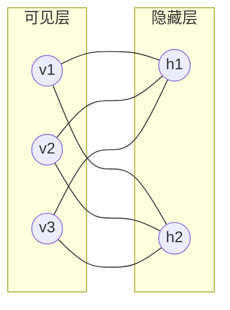
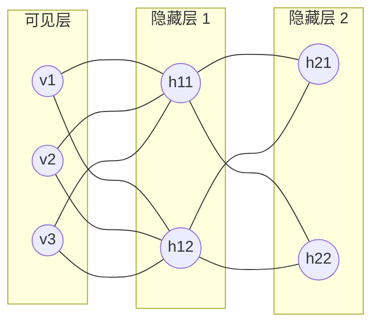

# Python深度学习实践：深度信念网络（DBN）的理论与实践

作者：禅与计算机程序设计艺术

## 1. 背景介绍

### 1.1 人工智能与深度学习的兴起

近年来，人工智能（AI）技术取得了突破性进展，其中深度学习作为其重要分支，在图像识别、语音处理、自然语言处理等领域展现出惊人的能力。深度学习的成功得益于其强大的特征学习能力，能够从海量数据中自动学习复杂的数据表示，从而实现对复杂任务的建模。

### 1.2 深度信念网络：深度学习的基石

深度信念网络（Deep Belief Network，DBN）作为一种经典的深度学习模型，在深度学习的发展历程中扮演着重要的角色。它是由多个受限玻尔兹曼机（Restricted Boltzmann Machine，RBM）堆叠而成的概率生成模型，能够有效地学习数据的层次化表示。

### 1.3 本文目标与结构

本文旨在深入浅出地介绍深度信念网络的理论基础、算法原理以及实践应用。首先，我们将回顾深度学习和深度信念网络的发展背景；然后，详细阐述深度信念网络的核心概念、模型结构以及训练算法；接着，结合 Python 代码实例，展示深度信念网络在实际项目中的应用方法；最后，探讨深度信念网络的未来发展趋势和挑战。

## 2. 核心概念与联系

### 2.1 受限玻尔兹曼机（RBM）

受限玻尔兹曼机是深度信念网络的基本组成单元，它是一种基于能量的概率模型，由可见层和隐藏层组成。

#### 2.1.1 模型结构

RBM 的模型结构如下图所示：



- 可见层：用于接收输入数据，每个节点代表一个输入特征。
- 隐藏层：用于学习数据的抽象表示，每个节点代表一个潜在特征。
- 连接权重：连接可见层和隐藏层之间的权重，表示两个节点之间的连接强度。

#### 2.1.2 能量函数与概率分布

RBM 使用能量函数来衡量模型的状态，其能量函数定义为：

$$
E(v, h) = -\sum_{i=1}^{n_v} \sum_{j=1}^{n_h} w_{ij} v_i h_j - \sum_{i=1}^{n_v} b_i v_i - \sum_{j=1}^{n_h} c_j h_j
$$

其中：

- $v$ 表示可见层的状态向量
- $h$ 表示隐藏层的状态向量
- $w_{ij}$ 表示连接可见层节点 $i$ 和隐藏层节点 $j$ 的权重
- $b_i$ 表示可见层节点 $i$ 的偏置
- $c_j$ 表示隐藏层节点 $j$ 的偏置
- $n_v$ 表示可见层节点数
- $n_h$ 表示隐藏层节点数

RBM 的联合概率分布由能量函数定义：

$$
P(v, h) = \frac{1}{Z} exp(-E(v, h))
$$

其中：

- $Z$ 是归一化常数，也称为配分函数

#### 2.1.3 训练算法：对比散度（CD）

RBM 的训练目标是学习模型的参数，使得模型能够很好地拟合训练数据。常用的训练算法是对比散度（Contrastive Divergence，CD）算法。

CD 算法的基本思想是通过 Gibbs 采样，构造正负样本对，然后通过最大化正样本对的概率和最小化负样本对的概率来更新模型参数。

### 2.2 深度信念网络（DBN）

深度信念网络是由多个 RBM 堆叠而成的概率生成模型，其结构如下图所示：



DBN 的训练过程可以分为两个阶段：

1. **预训练阶段:**  逐层训练每个 RBM，将前一个 RBM 的隐藏层输出作为下一个 RBM 的输入。
2. **微调阶段:**  使用有监督学习算法（如反向传播算法）对整个网络进行微调，以优化模型的性能。

## 3. 核心算法原理具体操作步骤

### 3.1 RBM 训练算法：对比散度（CD）

CD 算法的具体操作步骤如下：

1. 初始化模型参数：随机初始化连接权重和偏置。
2. **正相:**
   - 将训练样本输入可见层。
   - 根据当前模型参数，计算隐藏层节点的激活概率。
   - 根据激活概率，随机采样隐藏层节点的状态。
   - 计算正样本对的梯度。
3. **负相:**
   - 从隐藏层节点的状态出发，根据当前模型参数，计算可见层节点的激活概率。
   - 根据激活概率，随机采样可见层节点的状态。
   - 将采样得到的可见层节点状态作为新的输入，重复步骤 2，得到新的隐藏层节点状态。
   - 计算负样本对的梯度。
4. 更新模型参数：根据正负样本对的梯度，更新连接权重和偏置。
5. 重复步骤 2-4，直到模型收敛。

### 3.2 DBN 训练算法

DBN 的训练算法包括预训练和微调两个阶段：

#### 3.2.1 预训练阶段

1. 将第一个 RBM 的可见层与输入数据相连，训练第一个 RBM。
2. 将第一个 RBM 的隐藏层输出作为第二个 RBM 的可见层输入，训练第二个 RBM。
3. 重复步骤 2，直到所有 RBM 都训练完成。

#### 3.2.2 微调阶段

1. 将所有 RBM 堆叠在一起，形成一个深度信念网络。
2. 在 DBN 的最后一层添加一个输出层，用于具体的任务（如分类或回归）。
3. 使用有监督学习算法（如反向传播算法）对整个网络进行微调，以优化模型的性能。

## 4. 数学模型和公式详细讲解举例说明

### 4.1 RBM 能量函数推导

RBM 的能量函数定义为：

$$
E(v, h) = -\sum_{i=1}^{n_v} \sum_{j=1}^{n_h} w_{ij} v_i h_j - \sum_{i=1}^{n_v} b_i v_i - \sum_{j=1}^{n_h} c_j h_j
$$

该能量函数可以理解为：

- 第一项表示可见层和隐藏层之间的交互能量，连接权重 $w_{ij}$ 越大，两个节点之间的连接强度越强，交互能量越低。
- 第二项表示可见层的自身能量，偏置 $b_i$ 越大，节点 $i$ 处于激活状态的概率越高，自身能量越低。
- 第三项表示隐藏层的自身能量，偏置 $c_j$ 越大，节点 $j$ 处于激活状态的概率越高，自身能量越低。

### 4.2 RBM 联合概率分布推导

RBM 的联合概率分布由能量函数定义：

$$
P(v, h) = \frac{1}{Z} exp(-E(v, h))
$$

其中：

- $Z$ 是归一化常数，也称为配分函数，用于保证概率分布的归一化：

$$
Z = \sum_{v} \sum_{h} exp(-E(v, h))
$$

### 4.3 CD 算法梯度推导

CD 算法的梯度推导比较复杂，这里不做详细介绍。感兴趣的读者可以参考 Hinton 的论文 "A Practical Guide to Training Restricted Boltzmann Machines"。

## 5. 项目实践：代码实例和详细解释说明

### 5.1 MNIST 手写数字识别

本节将使用 Python 和深度学习库 TensorFlow 实现一个简单的 DBN 模型，用于识别 MNIST 手写数字。

#### 5.1.1 数据集介绍

MNIST 数据集是一个包含 70000 张手写数字图片的数据集，每张图片大小为 28x28 像素，其中 60000 张图片用于训练，10000 张图片用于测试。

#### 5.1.2 代码实现

```python
import tensorflow as tf
from tensorflow.examples.tutorials.mnist import input_data

# 加载 MNIST 数据集
mnist = input_data.read_data_sets("MNIST_data/", one_hot=True)

# 定义 DBN 模型参数
n_visible = 784  # 可见层节点数
n_hidden_1 = 500  # 隐藏层 1 节点数
n_hidden_2 = 200  # 隐藏层 2 节点数
n_classes = 10  # 类别数

# 定义 DBN 模型
class DBN(object):
    def __init__(self, n_visible, n_hidden_1, n_hidden_2, n_classes):
        self.n_visible = n_visible
        self.n_hidden_1 = n_hidden_1
        self.n_hidden_2 = n_hidden_2
        self.n_classes = n_classes

        # 定义模型参数
        self.W1 = tf.Variable(tf.random_normal([n_visible, n_hidden_1], stddev=0.1))
        self.b1 = tf.Variable(tf.zeros([n_hidden_1]))
        self.W2 = tf.Variable(tf.random_normal([n_hidden_1, n_hidden_2], stddev=0.1))
        self.b2 = tf.Variable(tf.zeros([n_hidden_2]))
        self.W3 = tf.Variable(tf.random_normal([n_hidden_2, n_classes], stddev=0.1))
        self.b3 = tf.Variable(tf.zeros([n_classes]))

    # 定义模型前向传播过程
    def forward(self, x):
        h1 = tf.nn.sigmoid(tf.matmul(x, self.W1) + self.b1)
        h2 = tf.nn.sigmoid(tf.matmul(h1, self.W2) + self.b2)
        y = tf.matmul(h2, self.W3) + self.b3
        return y

# 创建 DBN 模型实例
dbn = DBN(n_visible, n_hidden_1, n_hidden_2, n_classes)

# 定义模型输入和输出
x = tf.placeholder(tf.float32, [None, n_visible])
y_ = tf.placeholder(tf.float32, [None, n_classes])

# 定义损失函数和优化器
y = dbn.forward(x)
cross_entropy = tf.reduce_mean(tf.nn.softmax_cross_entropy_with_logits(labels=y_, logits=y))
train_step = tf.train.GradientDescentOptimizer(0.5).minimize(cross_entropy)

# 创建 TensorFlow 会话
sess = tf.InteractiveSession()
tf.global_variables_initializer().run()

# 训练模型
for i in range(10000):
    batch_xs, batch_ys = mnist.train.next_batch(100)
    sess.run(train_step, feed_dict={x: batch_xs, y_: batch_ys})

# 测试模型
correct_prediction = tf.equal(tf.argmax(y, 1), tf.argmax(y_, 1))
accuracy = tf.reduce_mean(tf.cast(correct_prediction, tf.float32))
print(sess.run(accuracy, feed_dict={x: mnist.test.images, y_: mnist.test.labels}))
```

#### 5.1.3 代码解释

- 首先，加载 MNIST 数据集，并定义 DBN 模型参数。
- 然后，定义 DBN 模型类，包括模型参数、前向传播过程等。
- 接着，创建 DBN 模型实例，定义模型输入和输出，并定义损失函数和优化器。
- 最后，创建 TensorFlow 会话，训练模型，并测试模型的准确率。

### 5.2 其他应用场景

除了手写数字识别，DBN 还可以应用于其他领域，例如：

- 图像分类
- 语音识别
- 自然语言处理
- 推荐系统

## 6. 工具和资源推荐

### 6.1 深度学习框架

- TensorFlow
- PyTorch
- Keras

### 6.2 数据集

- MNIST
- CIFAR-10
- ImageNet

### 6.3 学习资源

- Deep Learning by Ian Goodfellow, Yoshua Bengio and Aaron Courville
- Neural Networks and Deep Learning by Michael Nielsen
- Stanford CS231n: Convolutional Neural Networks for Visual Recognition

## 7. 总结：未来发展趋势与挑战

### 7.1 未来发展趋势

- 更深的网络结构
- 更高效的训练算法
- 与其他技术的结合

### 7.2 挑战

- 模型的可解释性
- 数据的稀疏性和噪声
- 计算资源的限制

## 8. 附录：常见问题与解答

### 8.1 什么是深度信念网络？

深度信念网络是一种概率生成模型，由多个受限玻尔兹曼机堆叠而成，能够有效地学习数据的层次化表示。

### 8.2 DBN 如何训练？

DBN 的训练过程包括预训练和微调两个阶段。预训练阶段逐层训练每个 RBM，微调阶段使用有监督学习算法对整个网络进行微调。

### 8.3 DBN 的应用场景有哪些？

DBN 可以应用于图像分类、语音识别、自然语言处理、推荐系统等领域。
