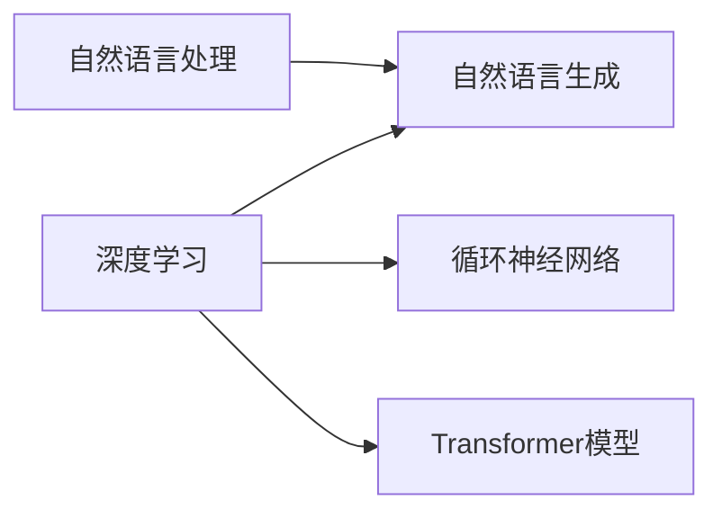

# Python深度学习实践：运用自然语言生成编写故事

作者：禅与计算机程序设计艺术

## 1. 背景介绍

### 1.1 人工智能与文学创作的融合

   人工智能（AI）正在以前所未有的速度改变着我们的世界，其应用领域涵盖了从自动驾驶汽车到医疗诊断等各个方面。近年来，AI在文学创作领域的应用也日益受到关注。自然语言生成（NLG）作为人工智能的一个重要分支，致力于让计算机能够像人类一样理解和生成自然语言，这为文学创作带来了全新的可能性。

### 1.2 自然语言生成技术的发展

   自然语言生成技术经历了从基于规则的系统到统计机器学习模型，再到如今的深度学习模型的演变过程。早期的基于规则的系统依赖于人工制定的语法和词汇规则，生成文本的质量有限。统计机器学习模型的出现，使得NLG系统能够从大量的文本数据中学习语言模式，生成更加自然流畅的文本。近年来，深度学习模型，特别是循环神经网络（RNN）和Transformer模型的出现，极大地提升了NLG系统的生成能力，使得生成高质量、富有创意的文本成为可能。

### 1.3 Python与深度学习在自然语言生成中的优势

   Python作为一门简洁易用且功能强大的编程语言，已经成为深度学习领域最受欢迎的语言之一。Python拥有丰富的深度学习库和框架，例如TensorFlow、Keras和PyTorch，这些库和框架提供了高效的深度学习模型构建、训练和部署工具。同时，Python还拥有丰富的自然语言处理库，例如NLTK和SpaCy，这些库提供了文本预处理、特征提取和分析等功能，为自然语言生成提供了强大的支持。

## 2. 核心概念与联系

### 2.1  自然语言处理（NLP）

   自然语言处理是人工智能领域的一个重要分支，旨在使计算机能够理解和处理人类语言。NLP涵盖了众多任务，例如：

   * **文本预处理：** 分词、词干提取、停用词去除等。
   * **词性标注：**  识别句子中每个词的词性，例如名词、动词、形容词等。
   * **命名实体识别：** 识别文本中的人名、地名、机构名等实体。
   * **句法分析：** 分析句子的语法结构，例如主谓宾等。
   * **语义分析：** 理解句子的含义。

### 2.2  自然语言生成（NLG）

   自然语言生成是NLP的一个子领域，旨在使计算机能够生成自然流畅的文本。NLG的应用场景包括：

   * **机器翻译：** 将一种语言的文本翻译成另一种语言。
   * **文本摘要：** 从一篇长文本中提取出关键信息，生成简短的摘要。
   * **对话系统：**  构建能够与人类进行自然对话的系统。
   * **故事创作：** 生成具有情节、人物和场景的完整故事。

### 2.3 深度学习

   深度学习是一种机器学习方法，它使用多层神经网络来学习数据的复杂表示。深度学习模型在图像识别、语音识别和自然语言处理等领域取得了突破性进展。

### 2.4 循环神经网络（RNN）

   循环神经网络是一种专门处理序列数据的神经网络，例如文本、语音和时间序列数据。RNN的结构允许信息在网络中循环流动，这使得RNN能够学习到序列数据中的长期依赖关系。

### 2.5 Transformer模型

   Transformer模型是一种基于自注意力机制的神经网络，它在处理长序列数据方面表现出色。Transformer模型在机器翻译、文本摘要和对话系统等领域取得了显著成果。

### 2.6  概念联系图

## 3. 核心算法原理具体操作步骤

### 3.1 基于循环神经网络的故事生成模型

#### 3.1.1 模型结构

   基于循环神经网络的故事生成模型通常使用长短期记忆网络（LSTM）或门控循环单元（GRU）作为基本单元。模型的输入是一个单词序列，输出是下一个单词的概率分布。模型的训练目标是最大化生成故事的概率。

#### 3.1.2 训练过程

   1. 数据预处理：对文本数据进行分词、词干提取、构建词汇表等操作。
   2. 模型构建：使用LSTM或GRU构建循环神经网络模型。
   3. 模型训练：使用训练数据对模型进行训练，调整模型参数以最小化损失函数。
   4. 模型评估：使用测试数据评估模型的性能，例如困惑度（Perplexity）和BLEU分数。

#### 3.1.3  文本生成过程

   1. 输入种子文本：提供一个初始的单词序列作为模型的输入。
   2. 模型预测：模型根据输入的单词序列预测下一个单词的概率分布。
   3. 采样生成：根据概率分布随机选择一个单词作为下一个单词。
   4. 重复步骤2和3，直到生成完整的故事。

### 3.2 基于Transformer模型的故事生成模型

#### 3.2.1 模型结构

   基于Transformer模型的故事生成模型使用Transformer的编码器-解码器结构。编码器负责将输入的单词序列编码成一个上下文向量，解码器根据上下文向量生成目标单词序列。

#### 3.2.2 训练过程

   1. 数据预处理：与RNN模型类似，对文本数据进行预处理。
   2. 模型构建：使用Transformer模型构建编码器-解码器结构。
   3. 模型训练：使用训练数据对模型进行训练，调整模型参数以最小化损失函数。
   4. 模型评估：使用测试数据评估模型的性能。

#### 3.2.3  文本生成过程

   1. 输入种子文本：提供一个初始的单词序列作为模型的输入。
   2. 编码器编码：编码器将输入的单词序列编码成一个上下文向量。
   3. 解码器生成：解码器根据上下文向量生成目标单词序列。
   4. 重复步骤3，直到生成完整的故事。

## 4. 数学模型和公式详细讲解举例说明

### 4.1 循环神经网络（RNN）

#### 4.1.1  模型结构

   循环神经网络（RNN）是一种专门处理序列数据的神经网络，其结构允许信息在网络中循环流动，这使得RNN能够学习到序列数据中的长期依赖关系。RNN的基本单元是循环单元，它接收当前时刻的输入和上一时刻的隐藏状态作为输入，输出当前时刻的隐藏状态和输出。

   RNN的数学模型可以表示为：

   $$
   \begin{aligned}
   h_t &= f(W_{xh} x_t + W_{hh} h_{t-1} + b_h) \\
   y_t &= g(W_{hy} h_t + b_y)
   \end{aligned}
   $$

   其中：

   * $x_t$ 是时刻 $t$ 的输入向量。
   * $h_t$ 是时刻 $t$ 的隐藏状态向量。
   * $y_t$ 是时刻 $t$ 的输出向量。
   * $W_{xh}$、$W_{hh}$ 和 $W_{hy}$ 是权重矩阵。
   * $b_h$ 和 $b_y$ 是偏置向量。
   * $f$ 和 $g$ 是激活函数。

#### 4.1.2  长短期记忆网络（LSTM）

   长短期记忆网络（LSTM）是一种特殊的RNN，它通过引入门控机制来解决RNN的梯度消失问题，从而能够学习到更长的依赖关系。LSTM单元包含三个门：输入门、遗忘门和输出门。

   LSTM的数学模型可以表示为：

   $$
   \begin{aligned}
   i_t &= \sigma(W_{xi} x_t + W_{hi} h_{t-1} + b_i) \\
   f_t &= \sigma(W_{xf} x_t + W_{hf} h_{