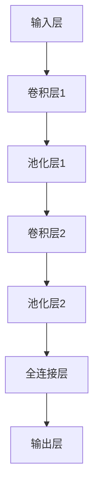
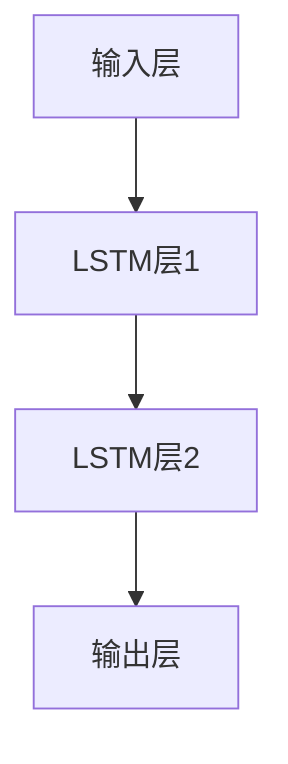
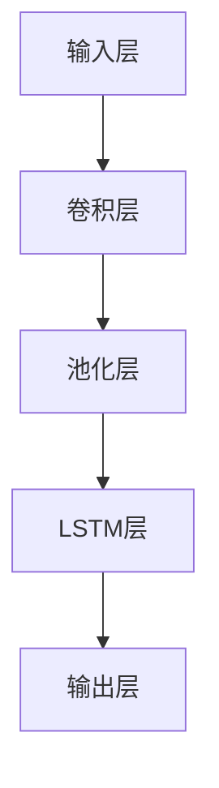

# Python深度学习实践：通过深度学习提高天气预测准确性

作者：禅与计算机程序设计艺术

## 1. 背景介绍

### 1.1 天气预测的重要性

天气预测对于农业、航空、航海、能源管理和灾害预警等多个领域至关重要。准确的天气预测可以帮助减少灾害损失，提高农业产量，优化能源使用，并保障交通运输的安全。然而，由于大气系统的复杂性和不确定性，天气预测一直是一个具有挑战性的任务。

### 1.2 传统天气预测方法的局限性

传统的天气预测方法主要依赖于数值天气预报（NWP）模型。这些模型基于物理定律和大气动力学方程，通过数值模拟来预测天气。然而，NWP模型存在以下几个局限性：

- **计算成本高**：NWP模型需要大量的计算资源和时间，特别是在高分辨率的情况下。
- **数据依赖性强**：NWP模型对初始条件和边界条件的依赖性很强，任何小的误差都会在预测过程中被放大。
- **非线性问题**：大气系统的非线性特性使得预测结果容易受到初始条件和模型参数的影响，导致预测的不确定性。

### 1.3 深度学习在天气预测中的应用潜力

近年来，随着深度学习技术的快速发展，越来越多的研究者开始探索其在天气预测中的应用。深度学习模型，特别是卷积神经网络（CNN）和长短时记忆网络（LSTM），在处理高维度数据和时间序列数据方面表现出色。深度学习在天气预测中的潜力主要体现在以下几个方面：

- **自动特征提取**：深度学习模型可以从原始数据中自动提取有用的特征，而不需要人为设计特征。
- **处理非线性关系**：深度学习模型能够有效捕捉数据中的非线性关系，提高预测的准确性。
- **高效的计算能力**：现代深度学习框架和硬件加速技术使得深度学习模型的训练和推断速度大大提升。

## 2. 核心概念与联系

### 2.1 深度学习基础

#### 2.1.1 神经网络

神经网络是深度学习的基础结构。一个典型的神经网络由多个层组成，包括输入层、隐藏层和输出层。每一层由若干个神经元组成，神经元之间通过权重连接。神经网络通过调整这些权重来学习数据中的模式。

#### 2.1.2 卷积神经网络（CNN）

卷积神经网络（CNN）主要用于处理图像数据。CNN通过卷积层、池化层和全连接层来提取图像中的特征。卷积层使用卷积核对输入数据进行卷积操作，提取局部特征；池化层通过降采样减少数据的维度；全连接层将特征映射到输出空间。

#### 2.1.3 长短时记忆网络（LSTM）

长短时记忆网络（LSTM）是一种特殊的递归神经网络（RNN），用于处理时间序列数据。LSTM通过引入记忆单元和门控机制，解决了传统RNN在长时间依赖问题上的梯度消失和梯度爆炸问题。LSTM能够有效捕捉数据中的时间依赖关系。

### 2.2 天气预测中的数据类型

#### 2.2.1 气象数据

气象数据包括温度、湿度、气压、风速、风向、降水量等。这些数据通常通过地面站、气象卫星、气象雷达等设备采集。

#### 2.2.2 历史天气数据

历史天气数据是指过去的气象观测数据。这些数据可以用来训练深度学习模型，使其能够学习到天气变化的规律。

#### 2.2.3 数值天气预报数据

数值天气预报数据是通过NWP模型生成的预测数据。这些数据可以作为深度学习模型的输入，进一步提高预测的准确性。

### 2.3 深度学习与天气预测的结合

深度学习与天气预测的结合主要体现在以下几个方面：

- **数据预处理**：将气象数据和历史天气数据进行预处理，使其适合深度学习模型的输入要求。
- **模型设计**：设计适合天气预测任务的深度学习模型，如CNN、LSTM或混合模型。
- **模型训练**：使用大规模的气象数据和历史天气数据训练深度学习模型。
- **模型评估**：评估模型的预测性能，并进行优化和调整。

## 3. 核心算法原理具体操作步骤

### 3.1 数据预处理

#### 3.1.1 数据收集

收集气象数据和历史天气数据。常用的数据来源包括气象站、气象卫星、气象雷达和数值天气预报模型。

#### 3.1.2 数据清洗

对收集到的数据进行清洗，包括处理缺失值、异常值和重复值。常用的方法有插值法、均值填充和删除异常值等。

#### 3.1.3 数据标准化

对数据进行标准化处理，使其符合模型的输入要求。常用的方法有归一化和标准化。

### 3.2 模型设计

#### 3.2.1 卷积神经网络（CNN）

设计一个卷积神经网络，用于提取气象数据中的空间特征。CNN的结构包括卷积层、池化层和全连接层。

#### 3.2.2 长短时记忆网络（LSTM）

设计一个长短时记忆网络，用于捕捉气象数据中的时间依赖关系。LSTM的结构包括输入层、LSTM层和输出层。

#### 3.2.3 混合模型

设计一个混合模型，将CNN和LSTM结合起来，既能提取空间特征，又能捕捉时间依赖关系。

### 3.3 模型训练

#### 3.3.1 数据划分

将数据划分为训练集、验证集和测试集。常用的划分比例是70%训练集，15%验证集，15%测试集。

#### 3.3.2 模型训练

使用训练集数据训练深度学习模型。常用的优化算法有随机梯度下降（SGD）、Adam等。

#### 3.3.3 模型评估

使用验证集数据评估模型的性能。常用的评估指标有均方误差（MSE）、平均绝对误差（MAE）等。

### 3.4 模型优化

#### 3.4.1 超参数调优

通过调整模型的超参数，如学习率、批量大小、网络层数等，优化模型的性能。常用的方法有网格搜索和随机搜索。

#### 3.4.2 正则化

通过正则化方法，如L1正则化、L2正则化和Dropout，防止模型过拟合。

## 4. 数学模型和公式详细讲解举例说明

### 4.1 卷积神经网络（CNN）数学模型

#### 4.1.1 卷积运算

卷积层的核心操作是卷积运算。假设输入数据为 $X$，卷积核为 $K$，卷积运算的输出 $Y$ 可以表示为：

$$
Y[i, j] = \sum_{m} \sum_{n} X[i+m, j+n] \cdot K[m, n]
$$

#### 4.1.2 池化运算

池化层的核心操作是池化运算。常用的池化方法有最大池化和平均池化。假设输入数据为 $X$，池化窗口大小为 $k \times k$，最大池化的输出 $Y$ 可以表示为：

$$
Y[i, j] = \max_{0 \leq m < k, 0 \leq n < k} X[i+m, j+n]
$$

### 4.2 长短时记忆网络（LSTM）数学模型

#### 4.2.1