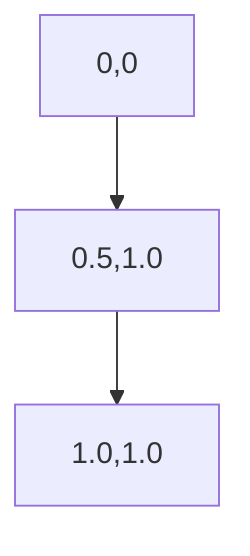

# ROC曲线与统计假设检验：科学验证

作者：禅与计算机程序设计艺术

## 1. 背景介绍

### 1.1 什么是ROC曲线

ROC（Receiver Operating Characteristic）曲线是评估分类模型性能的工具。它通过绘制真阳性率（TPR）与假阳性率（FPR）的关系来展示模型在不同阈值下的表现。ROC曲线最初在信号检测理论中用于雷达系统的评估，现已广泛应用于医学诊断、机器学习和统计学等领域。

### 1.2 什么是统计假设检验

统计假设检验是一种用于判断数据是否支持某个假设的统计方法。通过定义零假设（H0）和备择假设（H1），并计算检验统计量和P值，研究人员可以在一定的显著性水平下决定是否拒绝零假设。

### 1.3 为什么要结合ROC曲线与统计假设检验

ROC曲线可以帮助我们评估分类模型的性能，而统计假设检验则可以提供对模型性能的定量验证。将两者结合起来，可以从定性和定量两个角度全面评估模型的有效性和可靠性。

## 2. 核心概念与联系

### 2.1 ROC曲线的基本概念

#### 2.1.1 真阳性率（TPR）

真阳性率（True Positive Rate, TPR）也称为灵敏度（Sensitivity），表示在所有实际为正的样本中，被正确预测为正的比例。公式如下：

$$
\text{TPR} = \frac{TP}{TP + FN}
$$

其中，TP为真阳性样本数，FN为假阴性样本数。

#### 2.1.2 假阳性率（FPR）

假阳性率（False Positive Rate, FPR）表示在所有实际为负的样本中，被错误预测为正的比例。公式如下：

$$
\text{FPR} = \frac{FP}{FP + TN}
$$

其中，FP为假阳性样本数，TN为真阴性样本数。

#### 2.1.3 ROC曲线的绘制

ROC曲线通过在不同的阈值下计算TPR和FPR，并将这些点绘制在二维坐标系中，形成一条曲线。理想的ROC曲线应尽可能靠近左上角，这表示模型具有较高的灵敏度和较低的假阳性率。

### 2.2 统计假设检验的基本概念

#### 2.2.1 零假设与备择假设

零假设（Null Hypothesis, H0）通常表示没有效应或差异，而备择假设（Alternative Hypothesis, H1）表示存在效应或差异。例如，在评估一个分类模型时，零假设可以表示模型的性能与随机猜测无异，而备择假设则表示模型的性能优于随机猜测。

#### 2.2.2 P值与显著性水平

P值表示在零假设为真的情况下，观察到的结果或更极端结果的概率。显著性水平（Significance Level, α）是预设的阈值，通常为0.05。如果P值小于显著性水平，则拒绝零假设，认为结果具有统计显著性。

#### 2.2.3 检验统计量

检验统计量是根据样本数据计算的，用于判断是否拒绝零假设的数值。不同的假设检验方法有不同的检验统计量，例如t检验中的t值，卡方检验中的χ²值等。

### 2.3 ROC曲线与统计假设检验的联系

ROC曲线可以直观展示分类模型在不同阈值下的性能，而统计假设检验则可以定量评估模型的性能是否显著优于基线模型。通过结合两者，可以更全面地评估模型的有效性。例如，可以使用ROC曲线下的面积（AUC）作为性能指标，并通过假设检验来判断AUC是否显著大于0.5（随机猜测的AUC）。

## 3. 核心算法原理具体操作步骤

### 3.1 ROC曲线的计算步骤

#### 3.1.1 准备数据

首先，需要准备好实际标签和模型预测的概率分数。假设我们有以下数据：

| 样本 | 实际标签 | 预测概率 |
|------|----------|----------|
| 1    | 1        | 0.9      |
| 2    | 0        | 0.7      |
| 3    | 1        | 0.8      |
| 4    | 0        | 0.4      |
| 5    | 1        | 0.6      |

#### 3.1.2 确定阈值

选择一系列阈值，从0到1，以0.1为步长。例如，阈值可以是0, 0.1, 0.2, ..., 1。

#### 3.1.3 计算TPR和FPR

对于每个阈值，计算对应的TPR和FPR。以阈值0.5为例，预测概率大于等于0.5的样本被预测为正，否则为负。计算得到的TPR和FPR如下：

| 阈值 | TPR   | FPR   |
|------|-------|-------|
| 0.5  | 1.0   | 0.5   |

#### 3.1.4 绘制ROC曲线

将不同阈值下的TPR和FPR绘制在二维坐标系中，连接这些点形成ROC曲线。

### 3.2 统计假设检验的计算步骤

#### 3.2.1 选择检验方法

根据问题的性质选择合适的假设检验方法。例如，对于比较两个分类模型的AUC，可以使用DeLong检验。

#### 3.2.2 计算检验统计量

根据样本数据计算检验统计量。例如，DeLong检验的统计量可以通过计算两个模型的AUC差异及其标准误来获得。

#### 3.2.3 计算P值

根据检验统计量和相应的分布计算P值。对于DeLong检验，可以使用标准正态分布计算P值。

#### 3.2.4 判断显著性

将P值与显著性水平进行比较，判断是否拒绝零假设。如果P值小于显著性水平，则认为两个模型的性能有显著差异。

## 4. 数学模型和公式详细讲解举例说明

### 4.1 ROC曲线的数学模型

#### 4.1.1 TPR和FPR的计算公式

$$
\text{TPR} = \frac{TP}{TP + FN}
$$

$$
\text{FPR} = \frac{FP}{FP + TN}
$$

#### 4.1.2 AUC的计算公式

AUC（Area Under Curve）是ROC曲线下的面积，表示模型在不同阈值下的综合性能。AUC的计算可以通过数值积分方法实现，例如梯形法。

$$
\text{AUC} = \int_{0}^{1} \text{TPR}(t) d\text{FPR}(t)
$$

### 4.2 统计假设检验的数学模型

#### 4.2.1 零假设与备择假设的定义

假设我们要比较两个分类模型的AUC，零假设和备择假设可以定义如下：

$$
H_0: \text{AUC}_1 = \text{AUC}_2
$$

$$
H_1: \text{AUC}_1 \neq \text{AUC}_2
$$

#### 4.2.2 检验统计量的计算公式

DeLong检验的统计量可以表示为：

$$
Z = \frac{\text{AUC}_1 - \text{AUC}_2}{\sqrt{\text{Var}(\text{AUC}_1 - \text{AUC}_2)}}
$$

其中，$\text{Var}(\text{AUC}_1 - \text{AUC}_2)$表示两个AUC差异的方差。

#### 4.2.3 P值的计算公式

根据标准正态分布，P值可以表示为：

$$
P = 2 \times (1 - \Phi(|Z|))
$$

其中，$\Phi$表示标准正态分布的累积分布函数。

### 4.3 举例说明

假设我们有两个分类模型，模型A和模型B，其AUC分别为0.85和0.