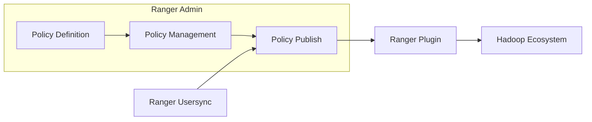

## 1. 背景介绍

### 1.1 大数据时代下的数据一致性挑战

随着大数据时代的到来，分布式系统已经成为处理海量数据的必然选择。然而，分布式系统的引入也带来了新的挑战，其中之一就是数据一致性问题。在分布式系统中，数据通常会被复制到多个节点上，以提高系统的可用性和容错性。然而，数据的多副本存储也使得数据一致性的维护变得更加困难。

### 1.2 Ranger的诞生背景与意义

为了解决分布式系统中的数据一致性问题，各种解决方案应运而生，其中 Apache Ranger 就是一个备受关注的开源项目。Ranger 提供了一个集中式的安全管理平台，用于管理 Hadoop 生态系统中的数据访问权限。它可以与 Hadoop 生态系统中的各种组件集成，例如 HDFS、Hive、HBase 等，从而实现对数据的细粒度访问控制。

## 2. 核心概念与联系

### 2.1 Ranger架构概述

Ranger 采用典型的 Master/Slave 架构，主要由以下三个组件构成：

- **Ranger Admin:** 负责策略的定义、管理和发布。
- **Ranger Usersync:** 负责同步用户和组信息。
- **Ranger Plugin:** 负责与具体的 Hadoop 组件进行集成，并执行访问控制策略。

下图展示了 Ranger 的架构图：



### 2.2 关键概念解析

- **Policy:** 策略是 Ranger 中最核心的概念，它定义了哪些用户或组可以访问哪些资源，以及可以执行哪些操作。
- **Resource:** 资源是指需要进行访问控制的对象，例如 HDFS 文件、Hive 表、HBase 列族等。
- **Repository:** 存储库是 Ranger 用于存储策略和其他配置信息的数据库。
- **Service:** 服务是指需要进行访问控制的 Hadoop 组件，例如 HDFS、Hive、HBase 等。

## 3. 核心算法原理具体操作步骤

### 3.1 策略定义与管理

Ranger 提供了基于角色的访问控制 (RBAC) 模型，用户可以通过 Ranger Admin 界面或 REST API 来定义和管理策略。策略定义主要包括以下步骤：

1. **选择服务:** 选择需要进行访问控制的 Hadoop 服务。
2. **定义资源:** 定义需要进行访问控制的资源，例如 HDFS 文件路径、Hive 数据库名和表名等。
3. **选择用户或组:** 选择可以访问该资源的用户或组。
4. **设置权限:** 设置用户或组对该资源的访问权限，例如读、写、执行等。

### 3.2 策略发布与同步

策略定义完成后，需要将其发布到 Ranger Plugin，以便 Ranger Plugin 可以根据策略来执行访问控制。策略发布可以通过 Ranger Admin 界面或 REST API 来完成。

### 3.3 访问控制流程

当用户尝试访问 Hadoop 集群中的资源时，Ranger Plugin 会拦截该请求，并执行以下操作：

1. **获取用户信息:** Ranger Plugin 会从 Hadoop 集群中获取用户的身份信息，例如用户名、组信息等。
2. **获取策略:** Ranger Plugin 会从 Ranger Admin 中获取最新的策略信息。
3. **策略匹配:** Ranger Plugin 会将用户的身份信息和资源信息与策略进行匹配，判断用户是否拥有访问该资源的权限。
4. **执行访问控制:** 如果用户拥有访问该资源的权限，则 Ranger Plugin 会允许该请求通过；否则，Ranger Plugin 会拒绝该请求。

## 4. 数学模型和公式详细讲解举例说明

Ranger 的核心算法是基于策略匹配的访问控制算法。该算法可以简单地描述为以下公式：

```
Access = f(User, Resource, Policy)
```

其中：

- **Access:** 表示用户是否拥有访问该资源的权限，取值为 True 或 False。
- **User:** 表示用户的身份信息，例如用户名、组信息等。
- **Resource:** 表示需要进行访问控制的资源，例如 HDFS 文件路径、Hive 数据库名和表名等。
- **Policy:** 表示 Ranger Admin 中定义的策略信息。

例如，假设我们定义了一条策略，允许用户 "bob" 对 HDFS 目录 "/user/bob" 拥有读写权限。当用户 "bob" 尝试读取文件 "/user/bob/data.txt" 时，Ranger Plugin 会执行以下操作：

1. 获取用户信息: 用户名为 "bob"。
2. 获取策略: 允许用户 "bob" 对 HDFS 目录 "/user/bob" 拥有读写权限。
3. 策略匹配: 用户名 "bob" 匹配策略中的用户 "bob"，资源路径 "/user/bob/data.txt" 是策略中资源路径 "/user/bob" 的子路径，因此策略匹配成功。
4. 执行访问控制: 允许用户 "bob" 读取文件 "/user/bob/data.txt"。

## 5. 项目实践：代码实例和详细解释说明

### 5.1 安装和配置 Ranger

```
# 下载 Ranger 安装包
wget https://downloads.apache.org/ranger/ranger-2.1.0/ranger-2.1.0-admin.tar.gz

# 解压安装包
tar -xzvf ranger-2.1.0-admin.tar.gz

# 修改配置文件
cd ranger-2.1.0-admin/conf
cp ranger-admin-default-site.xml ranger-admin-site.xml
# 修改 ranger-admin-site.xml 中的数据库连接信息等配置

# 初始化数据库
sqlplus / as sysdba << EOF
CREATE USER ranger IDENTIFIED BY ranger;
GRANT ALL PRIVILEGES TO ranger;
EXIT;
EOF
sqlplus ranger/ranger @create_db.sql

# 启动 Ranger Admin
cd ../ews/webapp
./setup.sh
./start-ranger-admin.sh
```

### 5.2 创建策略

```
# 登录 Ranger Admin 界面
# 点击 "Add New Policy" 按钮
# 选择服务: HDFS
# 定义资源: /user/bob
# 选择用户或组: bob
# 设置权限: Read, Write
# 点击 "Create" 按钮
```

### 5.3 测试访问控制

```
# 使用用户 "bob" 登录 Hadoop 集群
su - bob

# 尝试读取文件
hdfs dfs -cat /user/bob/data.txt

# 尝试写入文件
echo "Hello, world!" | hdfs dfs -put - /user/bob/test.txt
```

## 6. 实际应用场景

Ranger 在实际应用中可以用于以下场景：

- **数据安全审计:** Ranger 可以记录所有数据访问操作，方便管理员进行安全审计。
- **数据泄露防护:** Ranger 可以防止敏感数据被未授权用户访问，从而降低数据泄露的风险。
- **合规性要求:** Ranger 可以帮助企业满足 GDPR、HIPAA 等合规性要求。

## 7. 总结：未来发展趋势与挑战

随着大数据和云计算技术的不断发展，数据安全问题日益突出。Ranger 作为一款优秀的开源数据安全管理平台，未来将面临以下挑战和发展趋势：

- **支持更多的 Hadoop 组件:** Ranger 目前已经支持了 Hadoop 生态系统中的大部分组件，未来需要继续扩展对其他组件的支持。
- **更细粒度的访问控制:** Ranger 目前主要支持基于文件、表、列级别的访问控制，未来需要支持更细粒度的访问控制，例如基于行、字段级别的访问控制。
- **更高的性能和可扩展性:** 随着数据量的不断增长，Ranger 需要具备更高的性能和可扩展性，以满足海量数据处理的需求。

## 8. 附录：常见问题与解答

### 8.1 Ranger 与 Kerberos 的区别是什么？

Kerberos 是一种网络身份验证协议，而 Ranger 是一种数据访问控制工具。Kerberos 主要用于验证用户的身份，而 Ranger 主要用于控制用户对数据的访问权限。

### 8.2 Ranger 如何与 Hive 集成？

Ranger 可以通过 Hive Plugin 与 Hive 集成。Hive Plugin 会拦截 Hive Server2 的请求，并根据 Ranger Admin 中定义的策略来执行访问控制。

### 8.3 Ranger 支持哪些数据库？

Ranger 支持多种数据库作为其存储库，包括 MySQL、PostgreSQL、Oracle 等。
