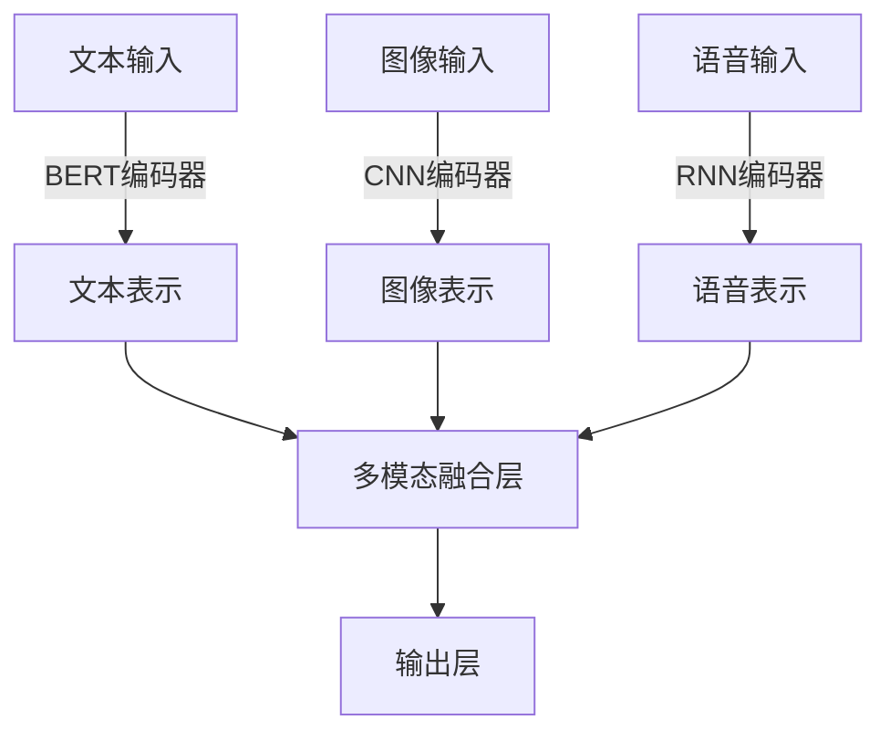

# RoBERTa的多模态扩展:融合图像、语音等信息的前沿进展

作者：禅与计算机程序设计艺术

## 1. 背景介绍

### 1.1 自然语言处理的进化

自然语言处理（NLP）领域经历了从简单的统计模型到复杂的深度学习模型的巨大变革。自从Transformer架构的引入，尤其是BERT（Bidirectional Encoder Representations from Transformers）模型的发布，NLP取得了显著进展。然而，随着研究的深入，研究人员发现单模态的语言模型在处理多模态任务时存在局限性。

### 1.2 多模态数据的需求

多模态数据包括文本、图像、语音、视频等多种形式的信息。随着互联网和数字媒体的普及，多模态数据变得越来越重要。例如，在社交媒体平台上，用户发布的内容往往包含文本、图片和视频。为了更好地理解和处理这些数据，NLP模型需要扩展到多模态领域。

### 1.3 RoBERTa模型简介

RoBERTa（Robustly optimized BERT approach）是BERT模型的改进版本，通过更大的数据集和更长的训练时间，显著提高了模型的性能。RoBERTa在多个NLP任务中取得了领先的成绩，但其核心仍然是单模态的文本处理。

## 2. 核心概念与联系

### 2.1 多模态学习的定义

多模态学习是指利用多种类型的数据源（如文本、图像、语音等）进行模型训练和推理的过程。这种方法可以提供更丰富的信息，提高模型的准确性和鲁棒性。

### 2.2 多模态数据的融合方式

多模态数据的融合主要有以下几种方式：
- **早期融合**：在模型的输入层之前，将多模态数据进行融合。
- **中期融合**：在模型的中间层进行融合。
- **晚期融合**：在模型的输出层之后进行融合。

### 2.3 RoBERTa的多模态扩展

RoBERTa的多模态扩展旨在将图像、语音等信息与文本数据结合，以提升模型在多模态任务中的表现。这种扩展涉及到模型架构的调整、数据预处理的改进以及训练策略的优化。

## 3. 核心算法原理具体操作步骤

### 3.1 数据预处理

#### 3.1.1 文本数据预处理

文本数据的预处理包括分词、去停用词、词嵌入等步骤。对于RoBERTa模型，通常使用BPE（Byte-Pair Encoding）进行分词，并将文本转换为模型可以接受的输入格式。

#### 3.1.2 图像数据预处理

图像数据的预处理包括缩放、归一化、数据增强等步骤。这些步骤可以提高模型的泛化能力，减少过拟合的风险。

#### 3.1.3 语音数据预处理

语音数据的预处理包括降噪、特征提取（如MFCC、梅尔频谱图）等步骤。通过这些步骤，可以将语音信号转换为模型可以处理的特征向量。

### 3.2 模型架构设计

#### 3.2.1 多模态输入层

在多模态扩展中，模型的输入层需要能够接受多种类型的数据。可以使用专门的编码器（如CNN编码器处理图像，RNN编码器处理语音）将不同模态的数据转换为统一的表示。



#### 3.2.2 多模态融合层

多模态融合层负责将不同模态的数据进行融合。常见的方法包括注意力机制、加权平均、拼接等。

#### 3.2.3 输出层

输出层根据具体任务的需求进行设计。例如，对于分类任务，输出层可以是一个全连接层加上Softmax激活函数。

### 3.3 模型训练

#### 3.3.1 损失函数设计

多模态模型的损失函数需要考虑不同模态数据的特点。常见的损失函数包括交叉熵损失、均方误差损失等。

#### 3.3.2 优化算法

常用的优化算法包括Adam、SGD等。为了提高训练效率，可以使用学习率调度、梯度裁剪等技术。

#### 3.3.3 数据增强

数据增强可以通过增加训练数据的多样性，提高模型的泛化能力。常见的数据增强方法包括翻转、旋转、裁剪等。

## 4. 数学模型和公式详细讲解举例说明

### 4.1 RoBERTa的核心公式

RoBERTa的核心公式与BERT类似，主要包括自注意力机制和前馈神经网络。

#### 4.1.1 自注意力机制

自注意力机制的计算公式如下：

$$
\text{Attention}(Q, K, V) = \text{softmax}\left(\frac{QK^T}{\sqrt{d_k}}\right)V
$$

其中，$Q$、$K$、$V$分别表示查询、键和值矩阵，$d_k$表示键的维度。

#### 4.1.2 前馈神经网络

前馈神经网络由两个线性变换和一个激活函数组成：

$$
\text{FFN}(x) = \text{ReLU}(xW_1 + b_1)W_2 + b_2
$$

其中，$W_1$、$W_2$为权重矩阵，$b_1$、$b_2$为偏置向量。

### 4.2 多模态扩展的数学模型

多模态扩展涉及到多个模态的融合，常见的融合方法包括加权平均、拼接等。

#### 4.2.1 加权平均

加权平均的公式如下：

$$
\text{Fusion}(x_1, x_2, \ldots, x_n) = \sum_{i=1}^n \alpha_i x_i
$$

其中，$x_i$表示第$i$个模态的表示，$\alpha_i$表示对应的权重。

#### 4.2.2 拼接

拼接的公式如下：

$$
\text{Fusion}(x_1, x_2, \ldots, x_n) = [x_1; x_2; \ldots; x_n]
$$

其中，$[;]$表示向量的拼接操作。

### 4.3 示例：文本和图像的融合

假设我们有一个文本表示$x_t$和一个图像表示$x_i$，可以使用加权平均的方法进行融合：

$$
\text{Fusion}(x_t, x_i) = \alpha x_t + \beta x_i
$$

其中，$\alpha$和$\beta$为可学习的权重参数。

## 5. 项目实践：代码实例和详细解释说明

### 5.1 数据预处理

#### 5.1.1 文本数据预处理

```python
from transformers import RobertaTokenizer

tokenizer = RobertaTokenizer.from_pretrained('roberta-base')
text = "这是一个示例文本。"
inputs = tokenizer(text, return_tensors='pt')
```

#### 5.1.2 图像数据预处理

```python
from PIL import Image
from torchvision import transforms

image = Image.open('example.jpg')
transform = transforms.Compose([
    transforms.Resize((224, 224)),
    transforms.ToTensor(),
    transforms.Normalize(mean=[0.485, 0.456, 0.406], std=[0.229, 0.224, 0.225]),
])
image_tensor = transform(image).unsqueeze(0)
```

#### 5.1.3 语音数据预处理

```python
import torchaudio

waveform, sample_rate = torchaudio.load('example.wav')
transform = torchaudio.transforms.MFCC(sample_rate=sample_rate)
mfcc = transform(waveform)
```

### 5.2 模型架构设计

#### 5.2.1 多模态输入层

```python
import torch
import torch.nn as nn
from transformers import RobertaModel

class MultiModalModel(nn.Module):
    def __init__(self):
        super(MultiModalModel, self).__init__()
        self.text_model = RobertaModel.from_pretrained('roberta-base')
        self.image_model = nn.Sequential(
            nn.Conv2d(3, 64, kernel_size=3, stride=1, padding=1),
            nn.Re