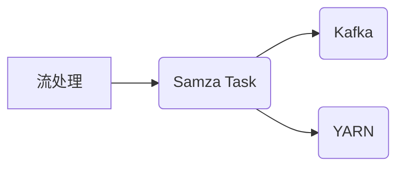

# SamzaTask在游戏数据处理中的应用

作者：禅与计算机程序设计艺术

## 1. 背景介绍

### 1.1 游戏数据处理的挑战

随着游戏产业的蓬勃发展，游戏数据规模呈爆炸式增长。海量的游戏数据为游戏开发者带来了前所未有的机遇，同时也带来了巨大的挑战。如何高效地处理、分析和利用这些数据，已成为游戏行业亟需解决的关键问题。

#### 1.1.1 数据规模庞大
现代游戏通常拥有数百万甚至数千万的日活跃用户，产生TB级别的数据量。传统的数据库和数据处理工具难以应对如此庞大的数据规模。

#### 1.1.2 数据类型多样
游戏数据涵盖了玩家行为、游戏日志、社交互动、交易记录等多种类型，每种数据类型都有其独特的结构和特征，需要采用不同的处理方法。

#### 1.1.3 实时性要求高
许多游戏应用场景，例如实时排行榜、反作弊系统、个性化推荐等，都需要对数据进行实时或近实时处理，这对数据处理系统的性能提出了更高的要求。

### 1.2 Samza：一款分布式流处理框架

为了应对上述挑战，许多游戏公司开始采用分布式流处理技术来构建游戏数据处理平台。Samza作为一款开源的分布式流处理框架，凭借其高吞吐量、低延迟、高可靠性等优势，在游戏数据处理领域得到了广泛应用。

#### 1.2.1 Samza的特点
* **高吞吐量：** Samza能够处理每秒数百万条消息，满足游戏数据处理的高并发需求。
* **低延迟：** Samza能够在毫秒级别内完成数据处理，满足实时游戏应用场景的需求。
* **高可靠性：** Samza基于Apache Kafka构建，具有数据持久化和容错机制，保证数据处理的可靠性。
* **易于使用：** Samza提供了简洁易用的API，方便开发者快速构建数据处理应用。

## 2. 核心概念与联系

### 2.1 流处理（Stream Processing）

流处理是一种数据处理模式，它将数据视为连续不断的数据流，并对数据进行实时或近实时的处理。与传统的批处理模式相比，流处理具有以下优势：

* **实时性：** 数据一旦到达即可进行处理，无需等待整个数据集加载完成。
* **持续性：** 数据处理过程持续进行，无需人工干预。
* **增量性：** 只需处理新到达的数据，无需重复处理历史数据。

### 2.2 Samza Task

Samza Task是Samza中最小的处理单元，负责处理数据流中的单个消息。每个Samza Task都是一个独立的进程，可以并行执行，从而实现高吞吐量的数据处理。

### 2.3 Kafka

Apache Kafka是一个分布式发布-订阅消息系统，为Samza提供高吞吐量、低延迟的消息传递服务。Samza使用Kafka作为数据源和数据接收器，实现数据流的输入和输出。

### 2.4 YARN

Apache Hadoop YARN是一个资源管理系统，负责为Samza Task分配计算资源。Samza运行在YARN集群上，可以充分利用集群的计算资源。

### 2.5 核心概念关系图



## 3. 核心算法原理具体操作步骤

### 3.1 Samza Task生命周期

Samza Task的生命周期包括以下阶段：

1. **初始化阶段：** Samza Task读取配置文件，初始化数据结构和连接。
2. **处理阶段：** Samza Task从Kafka读取数据，进行业务逻辑处理，并将结果写入Kafka。
3. **关闭阶段：** Samza Task关闭连接，释放资源。

### 3.2 Samza Task并行处理

Samza通过数据分区和任务并行来实现高吞吐量的数据处理。

#### 3.2.1 数据分区

Samza将数据流划分为多个分区，每个分区由一个或多个Samza Task处理。

#### 3.2.2 任务并行

Samza可以启动多个Samza Task实例来并行处理同一个分区的数据。

### 3.3 Samza状态管理

Samza提供了状态管理功能，允许Samza Task在处理数据流时维护状态信息。

#### 3.3.1 本地状态

Samza Task可以将状态信息存储在本地磁盘上。

#### 3.3.2 远程状态

Samza Task可以将状态信息存储在外部数据库或缓存中。

## 4. 数学模型和公式详细讲解举例说明

### 4.1 吞吐量计算

Samza的吞吐量取决于以下因素：

* **消息大小：** 消息越小，吞吐量越高。
* **分区数量：** 分区越多，吞吐量越高。
* **任务并行度：** 任务并行度越高，吞吐量越高。

假设每个分区每秒可以处理 $M$ 条消息，分区数量为 $P$，任务并行度为 $T$，则Samza的总吞吐量为：

$$
Throughput = M * P * T
$$

### 4.2 延迟计算

Samza的延迟取决于以下因素：

* **消息大小：** 消息越大，延迟越高。
* **网络延迟：** 网络延迟越高，延迟越高。
* **处理逻辑复杂度：** 处理逻辑越复杂，延迟越高。

假设消息大小为 $S$，网络延迟为 $N$，处理逻辑延迟为 $L$，则Samza的总延迟为：

$$
Latency = S + N + L
$$


## 5. 项目实践：代码实例和详细解释说明

### 5.1 需求描述

假设我们需要开发一个游戏数据处理系统，用于实时统计玩家的游戏时长。

### 5.2 代码实现

```java
import org.apache.samza.application.StreamApplication;
import org.apache.samza.config.Config;
import org.apache.samza.operators.KV;
import org.apache.samza.operators.MessageStream;
import org.apache.samza.operators.OutputStream;
import org.apache.samza.operators.StreamGraph;
import org.apache.samza.operators.functions.MapFunction;
import org.apache.samza.operators.windows.WindowPane;
import org.apache.samza.operators.windows.Windows;

import java.time.Duration;

public class GameDurationStatistics implements StreamApplication {

    @Override
    public void init(StreamGraph graph, Config config) {
        // 输入数据流，格式为 <玩家ID, 游戏开始时间>
        MessageStream<KV<String, Long>> inputStream = graph.getInputStream("input-stream");

        // 对数据流进行窗口聚合，统计每个玩家每小时的游戏时长
        OutputStream<KV<String, Long>> outputStream = inputStream
                .window(Windows.keyedTumblingWindow(
                        KV::getKey,
                        Duration.ofHours(1),
                        (m, k, collector, timestamp) -> collector.send(KV.of(k, m.getValue() - timestamp))), "window")
                .map((MapFunction<WindowPane<String, Long>, KV<String, Long>>) windowPane -> {
                    long totalDuration = windowPane.getMessage().getValue();
                    return KV.of(windowPane.getKey(), totalDuration);
                });

        // 将结果写入输出数据流
        outputStream.sendTo("output-stream");
    }
}
```

### 5.3 代码解释

* `inputStream`：定义输入数据流，格式为 `<玩家ID, 游戏开始时间>`。
* `window`：使用 `Windows.keyedTumblingWindow()` 方法对数据流进行窗口聚合，按玩家 ID 分组，每小时统计一次游戏时长。
* `map`：对窗口聚合后的结果进行转换，计算每个玩家每小时的游戏时长。
* `outputStream`：定义输出数据流，将统计结果写入该数据流。

## 6. 实际应用场景

### 6.1 实时排行榜

Samza可以用于构建实时排行榜系统，例如根据玩家的游戏时长、积分等指标对玩家进行排名。

### 6.2 反作弊系统

Samza可以用于构建反作弊系统，例如检测玩家是否使用外挂、是否存在刷分行为等。

### 6.3 个性化推荐

Samza可以用于构建个性化推荐系统，例如根据玩家的游戏偏好推荐游戏道具、装备等。

## 7. 工具和资源推荐

### 7.1 Apache Samza官网

https://samza.apache.org/

### 7.2 Apache Kafka官网

https://kafka.apache.org/

### 7.3 Apache Hadoop YARN官网

https://hadoop.apache.org/yarn/

## 8. 总结：未来发展趋势与挑战

### 8.1 未来发展趋势

* **更低的延迟：** 随着游戏对实时性要求的不断提高，未来流处理技术将朝着更低的延迟方向发展。
* **更强大的功能：** 流处理技术将集成更多功能，例如机器学习、人工智能等，以满足更复杂的应用场景需求。
* **更易于使用：** 流处理技术将更加易于使用，降低开发门槛，方便更多开发者使用。

### 8.2 面临的挑战

* **数据一致性：** 在分布式环境下保证数据一致性是一个挑战。
* **容错性：** 流处理系统需要具备高容错性，以保证数据处理的可靠性。
* **性能优化：** 随着数据规模的不断增长，如何优化流处理系统的性能是一个挑战。


## 9. 附录：常见问题与解答

### 9.1 Samza和Flink的区别是什么？

Samza和Flink都是开源的分布式流处理框架，但它们在设计理念和功能特性上有所区别。

* **设计理念：** Samza的设计理念是简单易用，而Flink的设计理念是功能强大。
* **状态管理：** Samza支持本地状态和远程状态，而Flink只支持本地状态。
* **时间语义：** Samza支持事件时间和处理时间，而Flink只支持事件时间。

### 9.2 Samza如何保证数据一致性？

Samza通过以下机制保证数据一致性：

* **数据分区：** Samza将数据流划分为多个分区，每个分区由一个或多个Samza Task处理，保证每个分区的数据一致性。
* **状态管理：** Samza提供了状态管理功能，允许Samza Task在处理数据流时维护状态信息，保证状态信息的一致性。

### 9.3 Samza如何实现容错？

Samza通过以下机制实现容错：

* **Kafka数据持久化：** Samza使用Kafka作为数据源和数据接收器，Kafka具有数据持久化机制，保证数据不丢失。
* **YARN任务重启：** 当Samza Task实例失败时，YARN会自动重启该实例，保证数据处理的连续性。
