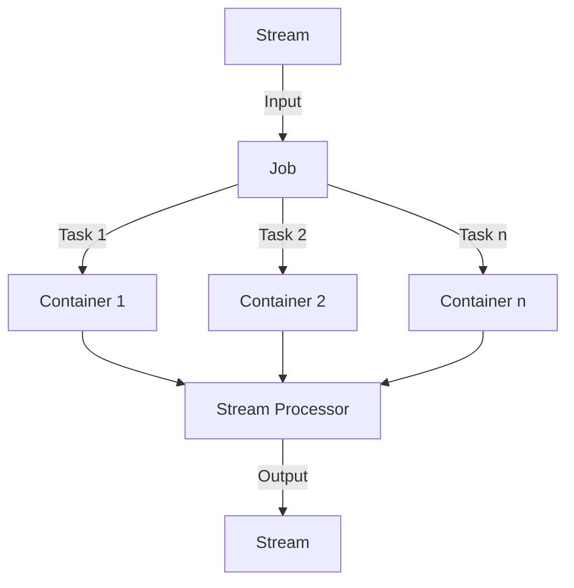

# Samza应用开发：从入门到精通

作者：禅与计算机程序设计艺术

## 1. 背景介绍

### 1.1 流处理的兴起

随着大数据时代的到来，数据处理的需求变得越来越复杂和多样化。传统的批处理系统已经无法满足实时数据处理的需求，流处理系统应运而生。流处理的核心在于能够实时处理和分析数据流，从而提供及时的决策支持和业务洞察。

### 1.2 Apache Samza的诞生

Apache Samza是由LinkedIn开发并捐赠给Apache基金会的分布式流处理框架。它基于Apache Kafka和Apache Hadoop，旨在提供一个高效、可扩展且易于使用的流处理平台。Samza的设计初衷是解决LinkedIn在实时数据处理中的挑战，现已成为业界广泛使用的流处理工具之一。

### 1.3 Samza的独特之处

Samza与其他流处理框架（如Apache Storm、Apache Flink）相比，具有以下独特之处：

- **简单性**：Samza的API设计简洁明了，易于上手。
- **容错性**：通过与Kafka的紧密集成，Samza能够提供强大的容错机制。
- **可扩展性**：Samza能够轻松扩展以处理大规模数据流。

## 2. 核心概念与联系

### 2.1 Stream（流）

流是Samza中的基本数据单元，表示一系列有序的数据记录。数据流可以是Kafka主题、文件系统中的文件、数据库中的表等。流的核心特点是数据是连续不断地到达的，且具有时间顺序。

### 2.2 Job（作业）

作业是Samza中的基本处理单元，表示一个独立的数据处理任务。每个作业包含一个或多个流处理器，用于处理输入流并生成输出流。作业可以部署在分布式环境中，利用多台机器的计算资源来处理大规模数据流。

### 2.3 Task（任务）

任务是作业的具体执行实例，负责处理一部分输入流。每个任务在独立的进程中运行，彼此之间相互独立。任务的并行度由输入流的分区数决定。

### 2.4 Container（容器）

容器是Samza中运行任务的基本单位，类似于YARN中的Container或Docker中的容器。每个容器可以运行一个或多个任务，负责管理任务的生命周期和资源分配。

### 2.5 Stream Processor（流处理器）

流处理器是Samza中的核心组件，负责处理输入流并生成输出流。流处理器可以是简单的映射操作、过滤操作，也可以是复杂的窗口操作、聚合操作等。

### 2.6 State（状态）

状态是Samza中的一个重要概念，用于保存流处理过程中产生的中间结果。状态可以是内存中的数据结构，也可以是外部存储系统（如RocksDB、HBase）中的数据。状态的管理是流处理系统的核心挑战之一，Samza通过高效的状态管理机制提供了强大的容错性和一致性保证。



## 3. 核心算法原理具体操作步骤

### 3.1 数据分区与分配

在Samza中，输入流通常被分为多个分区，每个分区对应一个独立的数据子集。分区的目的是为了实现数据的并行处理，提高处理效率。Samza通过Kafka的分区机制实现数据的分区与分配，每个任务处理一个或多个分区的数据。

### 3.2 流处理器的工作流程

流处理器是Samza中的核心组件，负责处理输入流并生成输出流。流处理器的工作流程如下：

1. **读取输入流**：从Kafka或其他数据源读取输入流的数据。
2. **处理数据**：对输入数据进行处理，包括映射、过滤、窗口操作、聚合等。
3. **生成输出流**：将处理后的数据写入输出流。

### 3.3 状态管理

状态管理是流处理系统的核心挑战之一，Samza通过高效的状态管理机制提供了强大的容错性和一致性保证。状态管理的核心步骤如下：

1. **状态初始化**：在流处理器启动时，从外部存储系统（如RocksDB、HBase）中加载初始状态。
2. **状态更新**：在数据处理过程中，根据处理逻辑对状态进行更新。
3. **状态持久化**：定期将状态写入外部存储系统，以保证状态的一致性和持久性。

### 3.4 容错机制

Samza通过与Kafka的紧密集成，提供了强大的容错机制。容错机制的核心步骤如下：

1. **数据重放**：在任务失败时，从Kafka中重新读取输入数据，重新处理失败的数据。
2. **状态恢复**：在任务失败时，从外部存储系统中加载最新的状态，恢复到失败前的状态。
3. **任务重启**：在任务失败时，重新启动失败的任务，继续处理数据。

## 4. 数学模型和公式详细讲解举例说明

### 4.1 数据流模型

数据流模型是流处理系统的核心数学模型，用于描述数据流的结构和处理方式。数据流模型可以表示为一个有向无环图（DAG），其中每个节点表示一个数据处理单元，每条边表示数据流的传递。

$$
G = (V, E)
$$

其中，$V$ 表示数据处理单元的集合，$E$ 表示数据流的传递关系。

### 4.2 窗口操作

窗口操作是流处理系统中的一种重要操作，用于对连续数据流进行分段处理。窗口操作可以表示为一个时间窗口函数：

$$
W(t) = \{x \in S \mid t - T \leq x.time \leq t\}
$$

其中，$W(t)$ 表示时间窗口，$S$ 表示数据流，$T$ 表示窗口长度，$x.time$ 表示数据记录的时间戳。

### 4.3 聚合操作

聚合操作是流处理系统中的一种常见操作，用于对数据流进行汇总计算。聚合操作可以表示为一个聚合函数：

$$
A(W) = \sum_{x \in W} x.value
$$

其中，$A(W)$ 表示聚合结果，$W$ 表示时间窗口，$x.value$ 表示数据记录的值。

### 4.4 状态管理

状态管理是流处理系统的核心挑战之一，用于保存流处理过程中产生的中间结果。状态管理可以表示为一个状态转移函数：

$$
S(t) = f(S(t-1), x)
$$

其中，$S(t)$ 表示时间$t$的状态，$f$ 表示状态转移函数，$x$ 表示输入数据。

## 5. 项目实践：代码实例和详细解释说明

### 5.1 环境搭建

在开始Samza应用开发之前，需要搭建开发环境。以下是环境搭建的步骤：

1. **安装Java**：Samza基于Java开发，需要安装Java开发环境。
2. **安装Kafka**：Samza依赖Kafka作为数据源，需要安装Kafka。
3. **安装Samza**：从Samza官网下载并安装Samza。

### 5.2 创建Samza项目

创建一个新的Samza项目，以下是项目的基本结构：

```
my-samza-app/
├── config/
│   ├── job.properties
├── src/
│   ├── main/
│   │   ├── java/
│   │   │   ├── MyStreamTask.java
```

### 5.3 编写Stream Task

编写一个简单的Stream Task，用于处理输入流并生成输出流。以下是代码示例：

```java
package my.samza.app;

import org.apache.samza.config.Config;
import org.apache.samza.task.MessageCollector;
import org.apache.samza.task.StreamTask;
import org.apache.samza.task.TaskCoordinator;
import org.apache.samza.system.IncomingMessageEnvelope;
import org.apache.samza.system.OutgoingMessageEnvelope;
import org.apache.samza.system.SystemStream;

public class MyStreamTask implements StreamTask {
  private static final SystemStream OUTPUT_STREAM = new SystemStream("kafka", "output-topic");

  @Override
  public void process(IncomingMessageEnvelope envelope, MessageCollector collector, TaskCoordinator coordinator) {
    String message = (String) envelope.getMessage();
    String processedMessage = processMessage(message