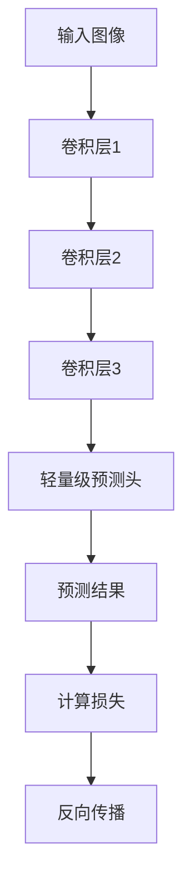

# SimMIM原理与代码实例讲解

作者：禅与计算机程序设计艺术

## 1.背景介绍

### 1.1 自监督学习的崛起

自监督学习近年来在人工智能领域取得了显著的进展。它通过利用未标注数据进行训练，从而减少了对大量标注数据的依赖。自监督学习的核心思想是通过设计代理任务，让模型在解决这些任务的过程中学习到有用的特征表示。

### 1.2 Masked Image Modeling (MIM) 的发展

Masked Image Modeling (MIM) 是一种自监督学习方法，它通过遮盖图像的一部分，然后让模型预测被遮盖部分的内容，从而使模型学习到图像的全局和局部特征。MIM 方法的成功在于其简单有效的设计，使其在各种视觉任务中表现出色。

### 1.3 SimMIM 的提出

SimMIM（Simple Masked Image Modeling）是微软研究院提出的一种简化的 MIM 方法。与其他复杂的 MIM 方法相比，SimMIM 通过简化模型结构和训练过程，实现了更高的效率和性能。SimMIM 在多个视觉任务中表现出色，成为了自监督学习领域的一个重要里程碑。

## 2.核心概念与联系

### 2.1 自监督学习的基本概念

自监督学习是一种机器学习方法，它通过设计代理任务，从未标注数据中学习有用的特征表示。自监督学习的目标是让模型在解决代理任务的过程中，学习到能够泛化到其他任务的特征表示。

### 2.2 Masked Image Modeling 的基本原理

Masked Image Modeling 的核心思想是通过遮盖图像的一部分，然后让模型预测被遮盖部分的内容。这样，模型在训练过程中需要学习到图像的全局和局部特征，从而提高其特征表示能力。

### 2.3 SimMIM 的创新点

SimMIM 的主要创新点在于其简单高效的设计。与其他复杂的 MIM 方法相比，SimMIM 通过简化模型结构和训练过程，实现了更高的效率和性能。具体来说，SimMIM 使用了一个简单的卷积神经网络（CNN）作为基础模型，并采用了一个轻量级的预测头来预测被遮盖部分的内容。

## 3.核心算法原理具体操作步骤

### 3.1 数据预处理

在 SimMIM 中，数据预处理主要包括图像的遮盖和归一化。具体步骤如下：

1. 随机选择图像的一部分进行遮盖。
2. 对图像进行归一化处理，使其像素值在 [0, 1] 范围内。

### 3.2 模型架构

SimMIM 使用了一个简单的卷积神经网络（CNN）作为基础模型，并采用了一个轻量级的预测头来预测被遮盖部分的内容。模型架构如下：

1. 输入图像通过多个卷积层进行特征提取。
2. 提取到的特征通过一个轻量级的预测头进行预测。
3. 预测结果与真实的被遮盖部分进行比较，计算损失。

以下是 SimMIM 模型架构的 Mermaid 流程图：



### 3.3 损失函数

SimMIM 使用均方误差（MSE）作为损失函数。损失函数的计算公式如下：

$$
L = \frac{1}{N} \sum_{i=1}^{N} (y_i - \hat{y}_i)^2
$$

其中，$y_i$ 是真实的被遮盖部分的像素值，$\hat{y}_i$ 是模型预测的像素值，$N$ 是被遮盖部分的像素数量。

### 3.4 训练过程

SimMIM 的训练过程包括以下步骤：

1. 从训练集中随机选择一张图像。
2. 对图像进行遮盖和归一化处理。
3. 将处理后的图像输入模型，得到预测结果。
4. 计算预测结果与真实被遮盖部分的损失。
5. 反向传播损失，更新模型参数。

## 4.数学模型和公式详细讲解举例说明

### 4.1 卷积神经网络（CNN）的基本原理

卷积神经网络（CNN）是一种专门用于处理图像数据的神经网络。CNN 通过卷积层、池化层和全连接层的组合，实现了对图像的特征提取和分类。卷积层的作用是通过卷积核对图像进行局部特征提取，池化层的作用是对特征图进行降维，全连接层的作用是将提取到的特征进行分类。

### 4.2 SimMIM 中的卷积层

在 SimMIM 中，卷积层的作用是对输入图像进行特征提取。卷积层的计算公式如下：

$$
y_{i,j} = \sum_{m=0}^{M-1} \sum_{n=0}^{N-1} x_{i+m,j+n} \cdot w_{m,n} + b
$$

其中，$y_{i,j}$ 是卷积层的输出，$x_{i,j}$ 是输入图像的像素值，$w_{m,n}$ 是卷积核的权重，$b$ 是偏置项，$M$ 和 $N$ 是卷积核的大小。

### 4.3 SimMIM 中的轻量级预测头

在 SimMIM 中，轻量级预测头的作用是对卷积层提取到的特征进行预测。轻量级预测头的计算公式如下：

$$
y = \sigma(W \cdot x + b)
$$

其中，$y$ 是预测结果，$W$ 是权重矩阵，$x$ 是卷积层提取到的特征，$b$ 是偏置项，$\sigma$ 是激活函数。

### 4.4 损失函数的计算

SimMIM 使用均方误差（MSE）作为损失函数。损失函数的计算公式如下：

$$
L = \frac{1}{N} \sum_{i=1}^{N} (y_i - \hat{y}_i)^2
$$

其中，$y_i$ 是真实的被遮盖部分的像素值，$\hat{y}_i$ 是模型预测的像素值，$N$ 是被遮盖部分的像素数量。

### 4.5 数学模型举例说明

假设输入图像为 $X$，遮盖部分的像素值为 $Y$，模型的预测结果为 $\hat{Y}$。具体步骤如下：

1. 输入图像 $X$ 通过卷积层进行特征提取，得到特征图 $F$。
2. 特征图 $F$ 通过轻量级预测头进行预测，得到预测结果 $\hat{Y}$。
3. 计算预测结果 $\hat{Y}$ 与真实被遮盖部分 $Y$ 的损失 $L$。
4. 反向传播损失 $L$，更新模型参数。

## 5.项目实践：代码实例和详细解释说明

### 5.1 数据预处理代码示例

以下是数据预处理的代码示例，包括图像的遮盖和归一化处理：

```python
import numpy as np
import cv2

def preprocess_image(image, mask_ratio=0.15):
    # 随机选择图像的一部分进行遮盖
    h, w, _ = image.shape
    mask_h = int(h * mask_ratio)
    mask_w = int(w * mask_ratio)
    mask_x = np.random.randint(0, h - mask_h)
    mask_y = np.random.randint(0, w - mask_w)
    image[mask_x:mask_x + mask_h, mask_y:mask_y + mask_w] = 0
    
    # 对图像进行归一化处理
    image = image / 255.0
    return image

# 示例图像
image = cv2.imread('example.jpg')
preprocessed_image = preprocess_image(image)
```

### 5.2 模型架构代码示例

以下是 SimMIM 模型架构的代码示例，包括卷积层和轻量级预测头的实现：

```python
import torch
import torch.nn as nn

class SimMIM(nn.Module):
    def __init__(self, in_channels=3, out_channels=3):
        super(SimMIM, self).__init__()
        self.conv1 = nn.Conv2d(in_channels, 64, kernel_size=3, stride=1, padding=1)
        self.conv2 = nn.Conv2d(64, 128,