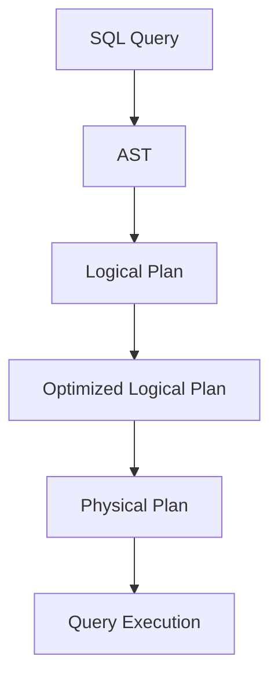

# Spark SQL原理与代码实例讲解

作者：禅与计算机程序设计艺术

## 1.背景介绍

### 1.1 大数据时代的挑战

在大数据时代，数据的规模和复杂性不断增长。传统的数据库系统和数据处理工具在处理大规模数据时面临着性能瓶颈和扩展性问题。为了应对这些挑战，Apache Spark应运而生。作为一个快速、通用的集群计算系统，Spark提供了丰富的API和工具，能够高效地处理大数据。

### 1.2 Spark SQL的诞生与发展

Spark SQL是Spark生态系统中的一个重要组件，旨在提供结构化数据的处理能力。它结合了SQL查询的简洁性和Spark强大的分布式计算能力，使得用户能够方便地进行数据分析和处理。自从Spark 1.0发布以来，Spark SQL不断发展和完善，已经成为大数据处理领域的重要工具。

### 1.3 Spark SQL的核心优势

Spark SQL的核心优势包括：

- **高性能**：通过优化的查询执行引擎和内存计算，Spark SQL能够提供高效的数据处理性能。
- **易用性**：支持标准的SQL语法，用户可以使用熟悉的SQL查询语言进行数据操作。
- **与Spark的无缝集成**：可以与Spark的其他组件（如Spark Streaming、MLlib等）无缝集成，提供统一的数据处理平台。
- **支持多种数据源**：能够读取和写入多种数据源，如Hive、HDFS、Cassandra、JDBC等。

## 2.核心概念与联系

### 2.1 DataFrame与Dataset

Spark SQL的核心数据结构是DataFrame和Dataset。DataFrame是一个分布式的、以列为单位的数据集合，类似于关系数据库中的表。Dataset是一个强类型的、分布式的数据集合，提供了更好的类型安全性和编译时检查。DataFrame实际上是Dataset的一种特例，即Dataset[Row]。

### 2.2 Catalyst优化器

Catalyst优化器是Spark SQL的查询优化引擎。它通过一系列的规则和策略，将用户的SQL查询转换为高效的执行计划。Catalyst优化器的设计目标是灵活性和可扩展性，允许用户自定义优化规则和策略，从而实现更高效的查询执行。

### 2.3 Tungsten执行引擎

Tungsten是Spark SQL的底层执行引擎，旨在充分利用现代硬件的性能，通过内存管理、代码生成和缓存机制来提高查询执行的效率。Tungsten执行引擎的引入，使得Spark SQL在处理大规模数据时能够提供更高的性能和更低的延迟。

## 3.核心算法原理具体操作步骤

### 3.1 查询解析与分析

Spark SQL的查询执行过程包括以下几个步骤：

1. **查询解析**：将用户的SQL查询解析为抽象语法树（AST）。
2. **查询分析**：对AST进行语义分析，验证查询的合法性，并将其转换为逻辑计划。
3. **逻辑优化**：通过Catalyst优化器对逻辑计划进行优化，包括谓词下推、投影剪裁等。
4. **物理计划生成**：将优化后的逻辑计划转换为物理计划，选择合适的执行策略。
5. **查询执行**：通过Tungsten执行引擎执行物理计划，生成最终的查询结果。



### 3.2 Catalyst优化器的工作原理

Catalyst优化器的工作原理包括以下几个方面：

- **规则驱动的优化**：通过一系列的优化规则，对逻辑计划进行反复的模式匹配和转换，生成更高效的执行计划。
- **基于代价的优化**：通过统计信息和代价模型，选择最优的执行策略。
- **扩展性**：允许用户自定义优化规则和策略，满足特定的查询优化需求。

### 3.3 Tungsten执行引擎的优化策略

Tungsten执行引擎的优化策略包括：

- **内存管理**：通过内存池和内存分页机制，提高内存利用率和查询执行的稳定性。
- **代码生成**：通过动态代码生成，减少解释执行的开销，提高查询执行效率。
- **缓存机制**：通过缓存中间结果，减少重复计算，提高查询执行的性能。

## 4.数学模型和公式详细讲解举例说明

### 4.1 查询优化中的代价模型

在查询优化过程中，代价模型用于评估不同执行策略的代价，从而选择最优的执行策略。代价模型通常包括以下几个方面：

- **I/O代价**：数据读写的代价。
- **计算代价**：数据处理和计算的代价。
- **内存代价**：内存使用的代价。

假设有一个简单的查询：

```sql
SELECT * FROM table WHERE column = 'value'
```

在进行查询优化时，代价模型需要评估不同执行策略的代价，例如：

- **全表扫描**：读取整个表的数据，然后进行过滤。
- **索引扫描**：通过索引快速定位满足条件的记录。

代价模型可以通过以下公式进行计算：

$$
\text{Total Cost} = \text{I/O Cost} + \text{Computation Cost} + \text{Memory Cost}
$$

### 4.2 Catalyst优化器的规则匹配

Catalyst优化器通过模式匹配和转换规则，对逻辑计划进行优化。假设有一个逻辑计划：

```plaintext
Filter(condition)
  Project(columns)
    Scan(table)
```

Catalyst优化器可以应用谓词下推优化规则，将过滤操作下推到扫描操作之前，从而减少数据处理的开销：

```plaintext
Project(columns)
  Filter(condition)
    Scan(table)
```

这种优化可以通过以下公式表示：

$$
\text{Optimized Plan} = \text{PushDown}(\text{Filter(condition)}, \text{Scan(table)})
$$

## 5.项目实践：代码实例和详细解释说明

### 5.1 环境准备

在开始代码实例之前，我们需要准备好开发环境。以下是所需的主要工具和资源：

- **Apache Spark**：可以通过官网下载并安装。
- **Scala或Python**：用于编写Spark应用程序。
- **IDE**：推荐使用IntelliJ IDEA或PyCharm进行开发。

### 5.2 数据加载与转换

以下是一个简单的Spark SQL应用示例，演示如何加载数据并进行转换操作。

#### 5.2.1 Scala示例

```scala
import org.apache.spark.sql.SparkSession

// 创建SparkSession
val spark = SparkSession.builder
  .appName("Spark SQL Example")
  .config("spark.some.config.option", "some-value")
  .getOrCreate()

// 加载数据
val df = spark.read.json("path/to/json/file")

// 注册临时视图
df.createOrReplaceTempView("table")

// 执行SQL查询
val result = spark.sql("SELECT * FROM table WHERE column = 'value'")

// 显示结果
result.show()
```

#### 5.2.2 Python示例

```python
from pyspark.sql import SparkSession

# 创建SparkSession
spark = SparkSession.builder \
    .appName("Spark SQL Example") \
    .config("spark.some.config.option", "some-value") \
    .getOrCreate()

# 加载数据
df = spark.read.json("path/to/json/file")

# 注册临时视图
df.createOrReplaceTempView("table")

# 执行SQL查询
result = spark.sql("SELECT * FROM table WHERE column = 'value'")

# 显示结果
result.show()
```

### 5.3 数据分析与处理

在实际应用中，我们通常需要对数据进行复杂的分析和处理操作。以下是一个示例，演示如何使用Spark SQL进行数据聚合和分析。

#### 5.3.1 Scala示例

```scala
import org.apache.spark.sql.functions._

// 加载数据
val df = spark.read.json("path/to/json/file")

// 注册临时视图
df.createOrReplaceTempView("table")

// 执行聚合查询
val result = spark.sql("SELECT column, COUNT(*) AS count FROM table GROUP BY column")

// 显示结果
result.show()
```

#### 5.3.2 Python示例

```python
from pyspark.sql.functions import *

# 加载数据
df = spark.read.json("path/to/json/file")

# 注册临时视图
df.createOrReplaceTempView("table")

# 执行聚合查询
result = spark.sql("SELECT column, COUNT(*) AS count FROM table GROUP BY column")

# 显示结果
result.show()
```

## 6.实际应用场景

### 6.1 数据仓库与BI

Spark SQL在数据仓库和