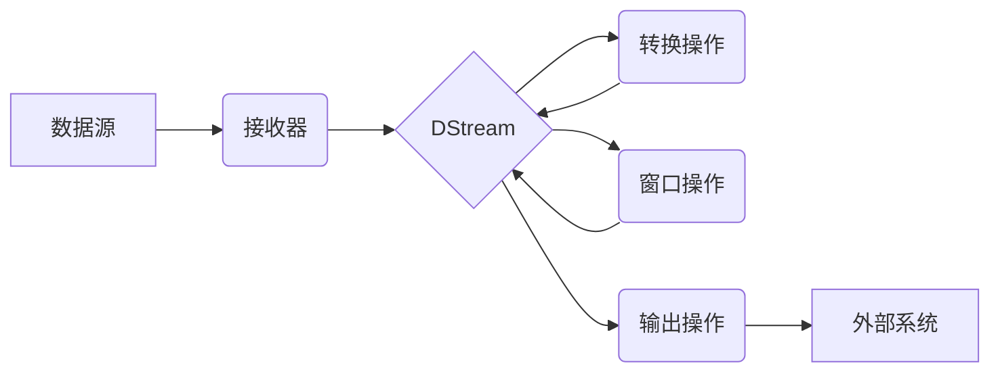

## 1. 背景介绍

### 1.1 大数据时代的实时流处理需求

随着互联网和物联网技术的飞速发展，全球数据量呈爆炸式增长。传统的批处理系统已经难以满足实时性要求越来越高的应用场景，例如：

* **实时监控与报警**:  例如，网站流量监控、服务器性能监控、网络安全监控等，需要实时分析数据流，并在异常发生时及时发出警报。
* **实时推荐**:  例如，电商网站根据用户实时浏览和购买行为推荐商品，社交平台根据用户实时互动推荐好友和内容等。
* **实时欺诈检测**:  例如，金融机构需要实时分析交易数据，识别潜在的欺诈行为。

为了应对这些挑战，实时流处理技术应运而生。

### 1.2  Spark Streaming的诞生与优势

Spark Streaming是 Apache Spark 框架中的一个核心组件，用于构建可扩展、高吞吐量、容错的实时流处理应用程序。它于 2013 年开源，并迅速成为最受欢迎的流处理引擎之一。

相比于其他流处理框架，Spark Streaming 具有以下优势：

* **易用性**:  Spark Streaming 提供了简洁易懂的高级 API，用户可以使用 Scala、Java、Python 等语言快速开发流处理应用程序。
* **高性能**:  Spark Streaming 基于内存计算模型，能够实现毫秒级的延迟和高吞吐量的处理能力。
* **可扩展性**:  Spark Streaming 可以运行在独立模式、YARN、Mesos 等多种集群管理器上，并支持动态资源分配，可以轻松扩展到数千个节点。
* **容错性**:  Spark Streaming 继承了 Spark 框架的容错机制，能够在节点故障时自动恢复数据和计算。
* **与 Spark 生态系统集成**:  Spark Streaming 可以与 Spark SQL、Spark MLlib 等其他 Spark 组件无缝集成，方便用户构建端到端的  大数据处理流水线。

## 2. 核心概念与联系

### 2.1  DStream：离散化数据流

DStream（Discretized Stream）是 Spark Streaming 中对数据流的抽象表示，它代表了一个连续不断的数据流，被划分为一系列连续的时间间隔，称为批次（batch）。每个批次包含一定时间范围内的数据，Spark Streaming 会对每个批次的数据进行计算处理。

### 2.2  输入源与接收器

Spark Streaming 支持从多种数据源接收数据流，例如：

* **消息队列**:  例如，Kafka、Flume、Kinesis 等。
* **文件系统**:  例如，HDFS、S3 等。
* **套接字**:  例如，TCP、UDP 等。

Spark Streaming 使用接收器（Receiver）从这些数据源接收数据流，并将其转换为 DStream。

### 2.3  转换操作与输出操作

Spark Streaming 提供了丰富的转换操作和输出操作，用于对 DStream 进行处理：

* **转换操作**:  例如，map、filter、reduceByKey 等，用于对 DStream 中的每个元素进行操作，生成新的 DStream。
* **输出操作**:  例如，print、saveAsTextFiles、foreachRDD 等，用于将 DStream 中的数据输出到外部系统或进行其他操作。

### 2.4  窗口操作

Spark Streaming 支持窗口操作，可以对 DStream 中的一段时间范围内的数据进行聚合计算。例如，可以使用窗口操作计算过去 1 分钟内的平均值、最大值、最小值等。

### 2.5  关系图：核心概念之间的联系



## 3. 核心算法原理具体操作步骤

### 3.1  Spark Streaming 的工作流程

Spark Streaming 的工作流程可以概括为以下几个步骤：

1. **接收数据**:  Spark Streaming 应用程序启动后，接收器会持续从数据源接收数据流，并将其缓存到内存中。
2. **划分批次**:  Spark Streaming 会将接收到的数据流按照预先设定的时间间隔（批次间隔）划分为一个个批次。
3. **生成 RDD**:  每个批次的数据会被封装成一个 RDD（Resilient Distributed Dataset）。
4. **执行计算**:  Spark Streaming 会将定义好的转换操作和输出操作应用到 RDD 上，执行计算逻辑。
5. **输出结果**:  计算结果会被输出到外部系统或进行其他操作。

### 3.2  接收器的工作机制

Spark Streaming 支持两种类型的接收器：

* **可靠接收器**:  可靠接收器会将接收到的数据写入预写日志（Write Ahead Log），并在数据成功处理后更新偏移量。这样可以保证数据在节点故障时不会丢失。
* **非可靠接收器**:  非可靠接收器不会将数据写入预写日志，因此在节点故障时可能会丢失数据。

### 3.3  批次间隔与窗口大小的选择

* **批次间隔**:  批次间隔越小，数据处理的延迟越低，但同时也会增加系统的负载。
* **窗口大小**:  窗口大小决定了对多长时间范围内的数据进行聚合计算。窗口大小越大，计算结果越平滑，但同时也会增加计算延迟。

### 3.4  状态管理

Spark Streaming 支持状态管理，可以将历史数据存储在内存或磁盘中，用于后续计算。例如，可以使用状态管理实现计数器、窗口聚合等功能。

## 4. 数学模型和公式详细讲解举例说明

### 4.1  滑动窗口模型

滑动窗口模型是一种常用的时间窗口模型，它定义了一个固定大小的窗口，并在数据流上滑动。例如，一个 1 分钟的滑动窗口，每 10 秒钟滑动一次，可以用来计算过去 1 分钟内的平均值。

滑动窗口模型可以使用以下公式表示：

```
window(t) = { data(t-w+1), data(t-w+2), ..., data(t) }
```

其中：

* `t` 表示当前时间
* `w` 表示窗口大小

### 4.2  指数加权移动平均模型

指数加权移动平均模型是一种常用的时间序列分析模型，它对历史数据进行加权平均，权重随着时间的推移呈指数递减。例如，可以使用指数加权移动平均模型预测股票价格走势。

指数加权移动平均模型可以使用以下公式表示：

```
EMA(t) = α * data(t) + (1-α) * EMA(t-1)
```

其中：

* `t` 表示当前时间
* `α` 表示平滑因子，取值范围为 0 到 1，值越大，对当前数据的权重越大

### 4.3  举例说明

假设我们有一个网站流量数据流，每秒钟记录一次访问量。我们想要计算每分钟的平均访问量和过去 10 分钟内的指数加权移动平均访问量。

**使用滑动窗口模型计算每分钟的平均访问量**:

* 窗口大小：60 秒
* 滑动步长：60 秒

```
// 每分钟的平均访问量
val avgTrafficPerMinute = trafficStream.window(60, 60).reduce(_ + _) / 60
```

**使用指数加权移动平均模型计算过去 10 分钟内的指数加权移动平均访问量**:

* 窗口大小：600 秒
* 平滑因子：0.9

```
// 过去 10 分钟内的指数加权移动平均访问量
val ewmaTraffic = trafficStream.window(600, 1).reduce(
  (acc, value) => 0.9 * value + 0.1 * acc
)
```

## 5. 项目实践：代码实例和详细解释说明

### 5.1  实时统计网站访问量

本节将演示如何使用 Spark Streaming 实时统计网站访问量。

**需求分析**:

* 数据源：网站访问日志，每条日志包含访问时间、IP 地址、访问页面等信息。
* 处理逻辑：
    * 统计每分钟的访问量
    * 统计每个页面的访问量排名
* 输出：将结果输出到控制台

**代码实现**:

```scala
import org.apache.spark.SparkConf
import org.apache.spark.streaming.{Seconds, StreamingContext}

object WebsiteTrafficAnalyzer {

  def main(args: Array[String]): Unit = {

    // 创建 Spark 配置
    val conf = new SparkConf().setAppName("WebsiteTrafficAnalyzer").setMaster("local[*]")

    // 创建 Streaming 上下文
    val ssc = new StreamingContext(conf, Seconds(1))

    // 设置检查点目录
    ssc.checkpoint("checkpoint")

    // 创建 DStream，从 socket 接收数据
    val lines = ssc.socketTextStream("localhost", 9999)

    // 解析日志数据
    val accessLogs = lines.map(_.split(" "))
      .map(x => (x(0), x(1), x(2))) // (时间戳, IP 地址, 访问页面)

    // 统计每分钟的访问量
    val trafficPerMinute = accessLogs.map(x => (x._1.substring(0, 12), 1)) // (分钟, 1)
      .reduceByKey(_ + _)

    // 统计每个页面的访问量排名
    val pageViewRanking = accessLogs.map(x => (x._3, 1)) // (访问页面, 1)
      .reduceByKey(_ + _)
      .transform(_.sortBy(_._2, ascending = false))
      .take(10)

    // 输出结果
    trafficPerMinute.print()
    pageViewRanking.print()

    // 启动 Streaming 上下文
    ssc.start()
    ssc.awaitTermination()
  }
}
```

**代码解释**:

1. 首先，我们创建了一个 SparkConf 对象，用于配置 Spark 应用程序。
2. 然后，我们创建了一个 StreamingContext 对象，用于创建和管理 DStream。
3. 我们使用 `ssc.socketTextStream` 方法创建了一个 DStream，从本地 9999 端口接收数据。
4. 我们使用 `map` 方法解析日志数据，提取时间戳、IP 地址和访问页面。
5. 我们使用 `map` 和 `reduceByKey` 方法统计每分钟的访问量。
6. 我们使用 `map`、`reduceByKey`、`transform` 和 `take` 方法统计每个页面的访问量排名。
7. 最后，我们使用 `print` 方法将结果输出到控制台。

### 5.2  实时情感分析

本节将演示如何使用 Spark Streaming 进行实时情感分析。

**需求分析**:

* 数据源：Twitter 数据流，每条推文包含文本内容、发布时间等信息。
* 处理逻辑：
    * 使用预训练的情感分析模型对每条推文进行情感分类（正面、负面、中性）。
    * 统计每分钟的正面、负面和中性推文数量。
* 输出：将结果输出到控制台。

**代码实现**:

```scala
import org.apache.spark.SparkConf
import org.apache.spark.streaming.{Seconds, StreamingContext}
import org.apache.spark.streaming.twitter.TwitterUtils

object TwitterSentimentAnalyzer {

  def main(args: Array[String]): Unit = {

    // 设置 Twitter API 密钥
    System.setProperty("twitter4j.oauth.consumerKey", "YOUR_CONSUMER_KEY")
    System.setProperty("twitter4j.oauth.consumerSecret", "YOUR_CONSUMER_SECRET")
    System.setProperty("twitter4j.oauth.accessToken", "YOUR_ACCESS_TOKEN")
    System.setProperty("twitter4j.oauth.accessTokenSecret", "YOUR_ACCESS_TOKEN_SECRET")

    // 创建 Spark 配置
    val conf = new SparkConf().setAppName("TwitterSentimentAnalyzer").setMaster("local[*]")

    // 创建 Streaming 上下文
    val ssc = new StreamingContext(conf, Seconds(1))

    // 创建 Twitter DStream
    val tweets = TwitterUtils.createStream(ssc, None)

    // 使用预训练的情感分析模型对每条推文进行情感分类
    val sentimentPredictions = tweets.map(tweet => {
      val text = tweet.getText
      // 调用情感分析模型进行预测
      val prediction = predictSentiment(text)
      (prediction, 1)
    })

    // 统计每分钟的正面、负面和中性推文数量
    val sentimentCounts = sentimentPredictions.reduceByKeyAndWindow(
      (x: Int, y: Int) => x + y,
      (x: Int, y: Int) => x - y,
      Seconds(60),
      Seconds(1)
    )

    // 输出结果
    sentimentCounts.print()

    // 启动 Streaming 上下文
    ssc.start()
    ssc.awaitTermination()
  }

  // 模拟情感分析模型
  def predictSentiment(text: String): String = {
    if (text.contains("happy") || text.contains("good")) {
      "positive"
    } else if (text.contains("sad") || text.contains("bad")) {
      "negative"
    } else {
      "neutral"
    }
  }
}
```

**代码解释**:

1. 首先，我们设置了 Twitter API 密钥，用于访问 Twitter 数据流。
2. 然后，我们创建了一个 SparkConf 对象和一个 StreamingContext 对象。
3. 我们使用 `TwitterUtils.createStream` 方法创建了一个 Twitter DStream。
4. 我们使用 `map` 方法对每条推文进行情感分类，这里使用了一个简单的模拟情感分析模型。
5. 我们使用 `reduceByKeyAndWindow` 方法统计每分钟的正面、负面和中性推文数量。
6. 最后，我们使用 `print` 方法将结果输出到控制台。

## 6. 实际应用场景

### 6.1  实时监控与报警

* **网站流量监控**:  实时监控网站流量变化，并在流量异常时发出警报。
* **服务器性能监控**:  实时监控服务器 CPU、内存、磁盘等指标，并在指标异常时发出警报。
* **网络安全监控**:  实时分析网络流量，识别潜在的攻击行为，并在攻击发生时发出警报。

### 6.2  实时推荐

* **电商网站**:  根据用户实时浏览和购买行为推荐商品。
* **社交平台**:  根据用户实时互动推荐好友和内容。
* **音乐平台**:  根据用户实时收听历史推荐歌曲。

### 6.3  实时欺诈检测

* **金融机构**:  实时分析交易数据，识别潜在的欺诈行为。
* **电商平台**:  实时分析用户行为，识别潜在的刷单行为。
* **社交平台**:  实时分析用户互动，识别潜在的虚假账号。

## 7. 工具和资源推荐

### 7.1  开发工具

* **Apache Spark**:  Spark Streaming 是 Apache Spark 框架中的一个核心组件。
* **IntelliJ IDEA**:  一款功能强大的 Java 集成开发环境，支持 Spark 开发。
* **Eclipse**:  另一款常用的 Java 集成开发环境，也支持 Spark 开发。

### 7.2  学习资源

* **Spark 官方文档**:  https://spark.apache.org/docs/latest/
* **Spark Streaming Programming Guide**:  https://spark.apache.org/docs/latest/streaming-programming-guide.html
* **Spark: The Definitive Guide**:  一本 comprehensive 的 Spark 书籍，涵盖了 Spark Streaming 的内容。

## 8. 总结：未来发展趋势与挑战

### 8.1  未来发展趋势

* **更低延迟**:  随着实时性要求越来越高，未来 Spark Streaming 将会朝着更低延迟的方向发展。
* **更强大功能**:  Spark Streaming 将会提供更丰富的功能，例如支持更多的数据源、更复杂的窗口操作等。
* **与机器学习集成**:  Spark Streaming 将会与机器学习技术更加紧密地集成，用于构建实时机器学习应用程序。

### 8.2  挑战

* **状态管理**:  随着数据量的增加，状态管理将会面临更大的挑战。
* **容错性**:  如何保证在节点故障时数据不丢失，是 Spark Streaming 需要解决的一个重要问题。
* **性能优化**:  如何提高 Spark Streaming 的性能，也是一个需要不断探索的问题。

## 9. 附录：常见问题与解答

### 9.1  Spark Streaming 与 Spark Structured Streaming 的区别？

Spark Streaming 和 Spark Structured Streaming 都是 Spark 框架中的流处理组件，但它们在设计理念和实现方式上有所不同。

| 特性 | Spark Streaming | Spark Structured Streaming |
|---|---|---|
| 数据抽象 | DStream | DataFrame/Dataset |
| 处理模型 | 微批处理 | 连续处理 |
| 容错性 | 基于 RDD 的容错机制 | 基于检查点的容错机制 |
| 状态管理 | 支持状态管理 | 支持状态管理 |
| API | 低级 API | 高级 API |

### 9.2  如何选择合适的批次间隔？

选择合适的批次间隔需要考虑以下因素：

* **数据量**:  数据量越大，批次间隔应该越大。
* **延迟要求**:  延迟要求越高，批次间隔应该越小。
* **计算资源**:  计算资源越充足，批次间隔可以越小。

### 9.3  如何保证 Spark Streaming 应用程序的容错性？

* **设置检查点**:  定期将应用程序的状态保存到检查点，以便在节点故障时恢复。
* **使用可靠接收器**:  使用可靠接收器可以保证数据在节点故障时不会丢失。
* **配置合适的副本数**:  配置合适的副本数可以提高数据的可用性。
