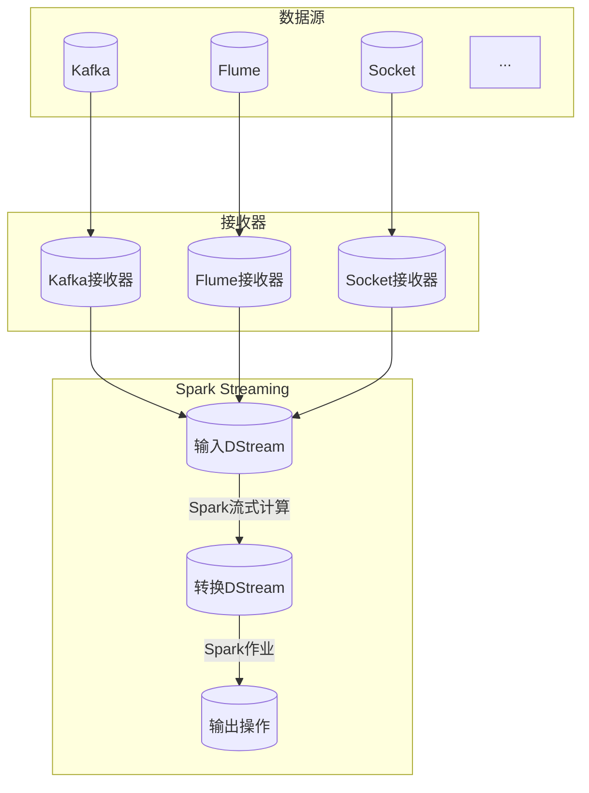
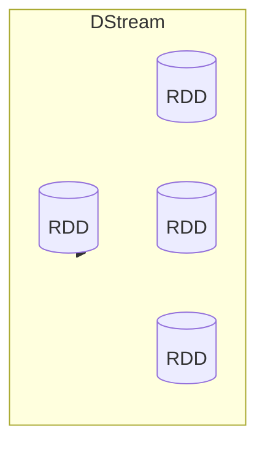
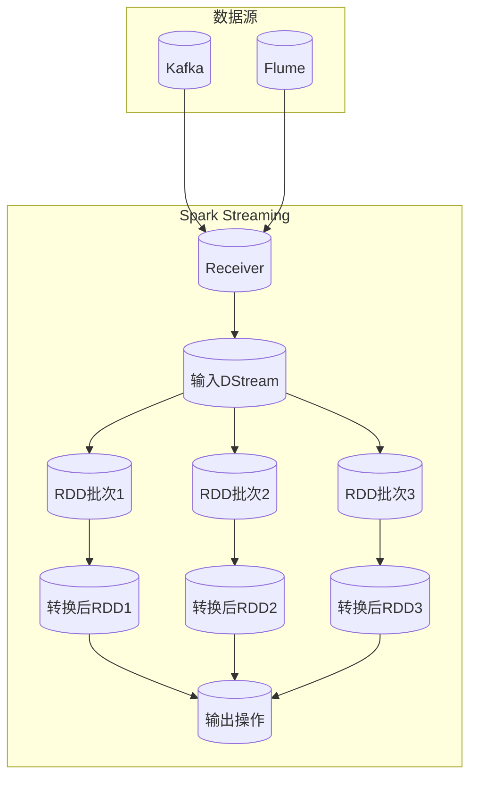

# SparkSQL：使用SparkStreaming进行流处理

## 1.背景介绍

### 1.1 大数据时代的到来

随着互联网、物联网、移动互联网等新兴技术的快速发展,数据呈现出爆炸式增长。根据国际数据公司(IDC)的预测,到2025年,全球数据总量将达到175ZB(1ZB=1万亿GB)。这种海量的数据不仅体现在数据量的大小上,而且还体现在数据的多样性(结构化数据、半结构化数据和非结构化数据)和数据产生的高速率上。传统的数据处理方式已经无法满足大数据时代的需求。

### 1.2 流式数据处理的需求

在大数据时代,很多应用场景都需要对持续不断产生的数据流进行实时处理和分析,例如:

- 金融交易监控:及时发现欺诈行为
- 网络安全监控:实时检测入侵行为
- 物联网数据处理:实时响应传感器数据
- 社交媒体分析:实时分析用户行为和舆情

这些场景都需要对大量不断产生的数据流进行实时处理,传统的基于磁盘的批处理系统无法满足这种需求。因此,流式数据处理应运而生。

### 1.3 Spark Streaming的引入

Apache Spark是一种通用的大数据处理框架,支持批处理、交互式查询和流处理等多种数据处理模式。Spark Streaming作为Spark生态系统中的一个组件,专门用于流式数据的实时处理。它支持从多种来源(如Kafka、Flume、Kinesis等)获取数据流,并使用Spark的高度容错的流处理引擎对数据流进行高吞吐量、容错的流处理。

Spark Streaming采用了微批处理(micro-batching)的架构,将流数据切分成一个个小批次,然后使用Spark引擎对每个批次进行处理。这种架构结合了传统批处理系统的高吞吐量和流处理系统的低延迟,为流数据处理提供了一种可扩展、高效的解决方案。

## 2.核心概念与联系

### 2.1 Spark Streaming架构概览

Spark Streaming的架构如下图所示:



Spark Streaming的核心概念包括:

1. **DStream(Discretized Stream)**: 代表一个连续的数据流,内部是由一系列的RDD(Resilient Distributed Dataset)组成。每个RDD包含一个指定时间间隔内的数据。

2. **输入DStream**: 从外部数据源(如Kafka、Flume等)获取数据流,创建输入DStream。

3. **转换DStream**: 对输入DStream应用各种转换操作(如map、flatMap、filter等),生成新的转换后的DStream。

4. **输出操作**: 将转换后的DStream写入外部系统(如HDFS、数据库等)或执行其他操作(如计算、推送)。

5. **接收器(Receiver)**: 用于从数据源获取数据并创建输入DStream的组件。

整个流程是:数据源产生数据流 -> 接收器接收数据 -> 创建输入DStream -> 对DStream进行转换 -> 执行输出操作。

### 2.2 DStream和RDD

DStream是Spark Streaming中最核心的抽象概念,它代表一个连续的数据流。但DStream内部并不是保存实际的数据,而是由一系列的RDD组成。每个RDD代表对应时间段内的实际数据。

RDD是Spark Core中的核心概念,代表一个不可变、分区的数据集合。Spark Streaming通过将流数据切分为一系列的RDD,并对每个RDD应用Spark Core中的各种转换操作,从而实现了高效的流处理。

DStream和RDD之间的关系如下图所示:



每个DStream由连续的RDD组成,每个RDD包含一个时间段内的数据。Spark Streaming将对DStream的转换操作实际转换为对RDD的操作。

### 2.3 DStream的转换操作

DStream支持各种转换操作,这些操作与Spark Core中的RDD转换操作类似,例如:

- **map**: 对DStream中的每个元素应用函数
- **flatMap**: 对DStream中的每个元素应用函数,并将结果扁平化
- **filter**: 过滤出DStream中满足条件的元素
- **reduceByKey**: 对DStream中的键值对执行reduce操作
- **join**: 对两个DStream执行join操作
- **window**: 基于窗口操作,返回一个新的DStream

这些操作可以组合使用,形成复杂的数据处理流水线。

## 3.核心算法原理具体操作步骤

### 3.1 Spark Streaming工作原理

Spark Streaming采用了微批处理(micro-batching)的架构,将流数据切分为一系列小批次,然后使用Spark引擎对每个批次进行处理。具体工作流程如下:

1. **数据接收**: Spark Streaming通过Receiver从数据源(如Kafka、Flume等)获取数据流,并创建输入DStream。

2. **批次划分**: Spark Streaming将输入DStream按照指定的批次间隔(如1秒)切分成一系列批次。每个批次对应一个RDD。

3. **RDD处理**: 对每个RDD执行Spark Core中的各种转换操作(如map、flatMap、filter等)和行动操作(如foreach、saveAsTextFile等)。

4. **输出**: 将处理结果输出到外部系统(如HDFS、数据库等)或执行其他操作。

整个过程如下图所示:



通过微批处理架构,Spark Streaming能够实现低延迟和高吞吐量的流处理,并且能够利用Spark强大的容错机制和调度能力。

### 3.2 Spark Streaming的容错机制

Spark Streaming的容错机制主要依赖于Spark Core提供的RDD容错机制。当发生故障时,Spark Streaming可以根据输入数据源的类型采取不同的恢复策略:

1. **可重放的数据源(如Kafka)**: Spark Streaming会从最新的检查点(checkpoint)位置重新获取数据,并重新处理丢失的批次。

2. **不可重放的数据源(如Socket)**: Spark Streaming无法重新获取丢失的数据,只能从最新的批次开始处理新的数据。

Spark Streaming还提供了检查点(Checkpoint)机制,可以定期将DStream的元数据信息保存到可靠的存储系统中(如HDFS),以便在发生故障时进行恢复。

### 3.3 Spark Streaming与Spark SQL集成

Spark SQL是Spark中用于结构化数据处理的模块,它提供了一种高级的、关系型的数据抽象,并支持SQL查询。Spark Streaming与Spark SQL的集成允许我们使用SQL语句对流数据进行查询和处理。

具体步骤如下:

1. 从输入DStream创建DataFrame或Dataset。

2. 在DataFrame或Dataset上注册临时视图。

3. 使用SQL语句查询流数据。

4. 对查询结果执行转换操作或输出操作。

以下是一个示例代码:

```scala
// 从socket获取输入DStream
val socketStreamingDF = spark.readStream
  .format("socket")
  .option("host", "localhost")
  .option("port", 9999)
  .load()

// 对输入DStream创建临时视图
socketStreamingDF.createOrReplaceTempView("streaming_logs")

// 使用SQL查询流数据
val queryDF = spark.sql("SELECT level, COUNT(*) as total FROM streaming_logs GROUP BY level")

// 对查询结果执行输出操作
val query = queryDF.writeStream
  .format("console")
  .outputMode("complete")
  .start()

query.awaitTermination()
```

通过与Spark SQL的集成,Spark Streaming可以更方便地处理结构化的流数据,并且可以使用SQL语言进行复杂的数据分析和处理。

## 4.数学模型和公式详细讲解举例说明

在流式数据处理中,常常需要对数据进行统计和分析,涉及到一些数学模型和公式。下面我们介绍几个常见的数学模型和公式。

### 4.1 滑动窗口模型

滑动窗口模型是流式数据处理中一种常见的技术,用于对数据流进行窗口化计算。它将数据流划分为一系列重叠或不重叠的窗口,然后对每个窗口内的数据执行计算。

滑动窗口模型可以分为三种类型:

1. **滚动窗口(Tumbling Window)**: 窗口之间没有重叠,每个窗口包含固定时间范围内的数据。

2. **滑动窗口(Sliding Window)**: 窗口之间存在重叠,每个窗口包含一定时间范围内的数据。

3. **会话窗口(Session Window)**: 根据数据之间的活动模式动态划分窗口,窗口的时间范围不固定。

滚动窗口和滑动窗口的公式如下:

$$
\begin{align*}
\text{滚动窗口:} &\quad W_i = [t_i, t_{i+1}) \\
\text{滑动窗口:} &\quad W_i = [t_i, t_{i+n})
\end{align*}
$$

其中:
- $W_i$表示第$i$个窗口
- $t_i$表示第$i$个窗口的开始时间
- $t_{i+1}$表示第$i+1$个窗口的开始时间
- $n$表示窗口滑动步长

例如,对于一个1小时的滚动窗口,窗口范围为$[0:00, 1:00)、[1:00, 2:00)、[2:00, 3:00)$等。对于一个30分钟的滑动窗口,窗口步长为10分钟,窗口范围为$[0:00, 0:30)、[0:10, 0:40)、[0:20, 0:50)$等。

### 4.2 指数加权移动平均模型

指数加权移动平均模型(Exponentially Weighted Moving Average, EWMA)是一种常用的时间序列分析模型,它对新的观测值赋予较高的权重,对旧的观测值赋予较低的权重,从而能够更好地捕捉数据的最新趋势。

EWMA的公式如下:

$$
\begin{align*}
S_t &= \alpha X_t + (1 - \alpha) S_{t-1} \\
     &= \alpha X_t + \alpha(1 - \alpha)X_{t-1} + \alpha(1 - \alpha)^2X_{t-2} + \cdots
\end{align*}
$$

其中:
- $S_t$表示时间$t$的EWMA值
- $X_t$表示时间$t$的实际观测值
- $\alpha$是一个介于0和1之间的平滑因子,用于控制新旧数据的