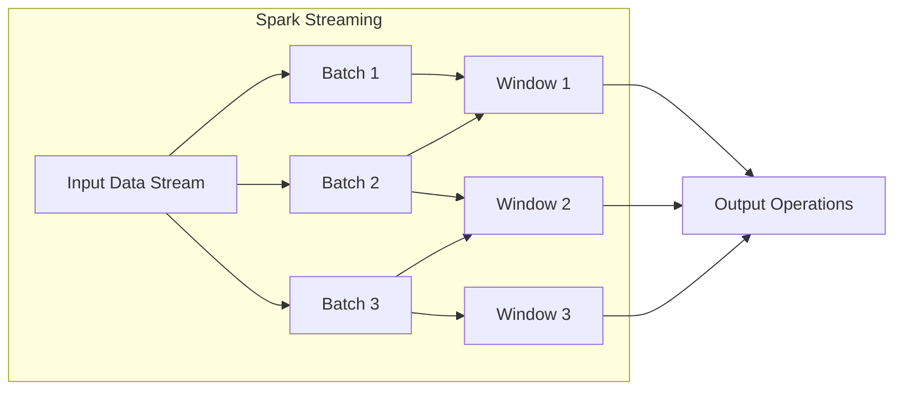

# SparkStreaming在能源行业的实时数据分析应用

## 1.背景介绍

### 1.1 能源行业面临的挑战

能源行业一直是现代社会的支柱产业之一。随着全球能源需求的不断增长和可再生能源的快速发展,能源行业正面临着前所未有的挑战和机遇。传统的能源生产和供应模式已经难以满足日益增长的需求,同时也面临着环境可持续发展的压力。

能源行业亟需采用先进的大数据分析技术来优化能源生产、输配和消费,提高能源利用效率,降低碳排放,实现可持续发展。然而,能源系统产生的数据量巨大、种类繁多、来源分散,给实时数据分析带来了巨大挑战。

### 1.2 实时数据分析的重要性

实时数据分析能够帮助能源企业:

1. 及时发现并响应能源系统中的异常情况,提高运营效率和安全性。
2. 实现精细化负载预测和需求响应,优化资源调度,减少浪费。
3. 分析用户用能模式,为用户提供个性化的节能方案。
4. 整合多源异构数据,为决策提供全面的数据支持。

因此,构建高效、可扩展的实时数据分析系统对能源企业的数字化转型至关重要。

### 1.3 SparkStreaming介绍

Apache SparkStreaming作为Apache Spark的流式计算模块,继承了Spark强大的内存计算能力,能够高效、可靠地对实时数据流进行分布式计算。SparkStreaming具有以下优势:

- 高吞吐量:能够以毫秒级别的延迟处理数百万条记录
- 容错性强:有状态数据的持久化和恢复机制
- 易于集成:与Spark生态圈无缝集成,代码复用
- 支持多种数据源:Kafka、Flume、Kinesis等

因此,SparkStreaming是能源行业实现实时大数据分析的理想选择。

## 2.核心概念与联系

### 2.1 流式计算模型

流式计算将数据流视为一系列不断到达的数据批次(micro-batches),每个批次中包含一段时间内的数据记录。SparkStreaming以micro-batch的方式处理数据流,如下图所示:



每个Window包含了一定时间范围内的数据批次,在Window上执行的操作(如聚合、连接、事件模式匹配等)可以获得Window范围内的结果。这种模型能够在低延迟和容错性之间达到平衡。

### 2.2 DStreams

在SparkStreaming中,数据流以离散化流(DStream)的形式表示,即一系列连续的数据批次。DStream提供了丰富的转换操作,如map、flatMap、filter等,支持与RDD(Spark的核心数据结构)相似的函数式编程方式。

```scala
val lines = ssc.socketTextStream("localhost", 9999)
val words = lines.flatMap(_.split(" "))
val pairs = words.map(word => (word, 1))
val wordCounts = pairs.reduceByKey(_ + _)
```

上例中,lines是一个DStream,表示从socket端口获取的文本数据流;words是对lines应用flatMap操作后的DStream;pairs是对words应用map操作后的DStream,表示单词及其计数对;wordCounts是对pairs应用reduceByKey操作后的DStream,表示各单词的计数结果。

### 2.3 Structured Streaming

从Spark 2.3开始,引入了基于Spark SQL的Structured Streaming模块,旨在统一批处理和流式计算。Structured Streaming将流式计算表示为一个无界的表,持续地执行增量查询并更新结果表。

```scala
val streamingDF = spark.readStream
  .format("kafka")
  .option("kafka.bootstrap.servers", "host1:port1,host2:port2")
  .option("subscribe", "topic1")
  .load()

val wordCounts = streamingDF
  .select(explode(split(value, " ")).alias("word"))
  .groupBy("word")
  .count()
  
val query = wordCounts.writeStream
  .outputMode("complete")
  .format("console")
  .start()
```

上例使用Structured Streaming从Kafka主题读取数据流,对流式DataFrame执行单词计数查询,并将结果输出到控制台。Structured Streaming提供了类似批处理的高级API,简化了流式应用的开发。

## 3.核心算法原理具体操作步骤

### 3.1 数据接收

SparkStreaming支持从多种数据源获取数据流,如Kafka、Flume、Kinesis、Socket等。以Kafka为例,具体步骤如下:

1. 创建StreamingContext对象,设置批处理间隔时间
2. 通过`KafkaUtils.createDirectStream`创建KafkaDirectDStream
3. 指定Kafka主题、消费者组等参数
4. 从KafkaDirectDStream获取Kafka数据流

```scala
import org.apache.spark.streaming.kafka010.LocatedCoder
import org.apache.spark.streaming.kafka010.ConsumerStrategies.Subscribe
import org.apache.spark.streaming.kafka010.KafkaUtils

val kafkaParams = Map(
  "bootstrap.servers" -> "host1:port1,host2:port2",
  "key.deserializer" -> classOf[StringDeserializer],
  "value.deserializer" -> classOf[StringDeserializer],
  "group.id" -> "example",
  "auto.offset.reset" -> "latest",
  "enable.auto.commit" -> (false: java.lang.Boolean)
)

val topics = Array("topic1", "topic2")
val stream = KafkaUtils.createDirectStream[String, String](
  streamingContext,
  LocationStrategies.PreferConsistent,
  ConsumerStrategies.Subscribe[String, String](topics, kafkaParams)
)
```

对于其他数据源,步骤类似,通过对应的工具类创建DStream即可。

### 3.2 数据处理

获取到数据流后,可以使用DStream的丰富转换操作对数据进行处理,如过滤、映射、聚合等。以单词计数为例:

```scala
val lines = stream.map(_.value)
val words = lines.flatMap(_.split(" "))
val wordCounts = words.map(x => (x, 1)).reduceByKey(_ + _)
```

- map:从Kafka消息中提取value部分
- flatMap:将每行文本拆分为单词
- map和reduceByKey:对单词计数

SparkStreaming还支持Window操作,可以在一个时间窗口范围内的批次上执行计算。

```scala
import org.apache.spark.streaming.{Seconds, StreamingContext}

wordCounts
  .reduceByKeyAndWindow((a:Int,b:Int) => a+b, (a:Int,b:Int) => a-b, Seconds(30), Seconds(10))
  .foreachRDD(rdd => {...})
```

上例计算30秒窗口内的单词计数,每10秒滑动一次。Window操作常用于时间序列分析等场景。

### 3.3 结果输出

计算完成后,可以通过多种方式输出结果,如保存到外部存储系统、发送到消息队列等。以打印到控制台为例:

```scala
wordCounts.print()
```

对于结构化的输出,可以使用`foreachRDD`对RDD应用操作:

```scala
wordCounts.foreachRDD(rdd => {
  rdd.foreach(println)
})
```

或者将结果保存到外部存储系统:

```scala
wordCounts.saveAsObjectFiles("/path/to/output")
```

更多输出方式,请参考[Spark Streaming Programming Guide](https://spark.apache.org/docs/latest/streaming-programming-guide.html#output-operations-on-dstreams)。

## 4.数学模型和公式详细讲解举例说明

在能源系统的实时数据分析中,常常需要使用各种数学模型和算法,如时间序列分析、异常检测、聚类等。以下介绍一些常用模型。

### 4.1 指数平滑模型

指数平滑是一种常用的时间序列预测模型,适用于无明显趋势和周期性的时间序列数据。它基于当前观测值和先前预测值的加权平均值进行预测。

$$
S_t = \alpha X_t + (1 - \alpha) S_{t-1} \\
\hat{X}_{t+1} = S_t
$$

其中:
- $X_t$是时间$t$的实际观测值
- $S_t$是时间$t$的平滑值
- $\alpha$是平滑系数,取值范围$[0, 1]$
- $\hat{X}_{t+1}$是时间$t+1$的预测值

平滑系数$\alpha$反映了对新数据的敏感程度,值越大,对新数据的反应越快。可以通过优化$\alpha$的值来最小化预测误差。

在SparkStreaming中,可以使用窗口操作实现指数平滑:

```scala
val smoothedVals = inputStream.map(value => (value, 1))
  .reduceByKeyAndWindow(
    (x, y) => (x._1 * alpha + y._1 * (1 - alpha), x._2 + y._2),
    (x, y) => (x._1, x._2 - y._2),
    Seconds(30),
    Seconds(5)
  )
  .map(t => t._1 / t._2)
```

### 4.2 ARIMA模型

ARIMA(Auto-Regressive Integrated Moving Average)模型是一种广泛使用的时间序列预测模型,适用于具有一定趋势和周期性的时间序列数据。ARIMA模型由三部分组成:

- AR(Auto-Regressive)自回归部分:使用历史观测值的线性组合
- I(Integrated)差分部分:消除数据的非平稳性
- MA(Moving Average)滑动平均部分:使用历史预测误差的线性组合

ARIMA模型的数学表达式为:

$$
\begin{aligned}
y_t &= c + \phi_1 y_{t-1} + \phi_2 y_{t-2} + ... + \phi_p y_{t-p} \\
     &\quad + \theta_1 \epsilon_{t-1} + \theta_2 \epsilon_{t-2} + ... + \theta_q \epsilon_{t-q} + \epsilon_t
\end{aligned}
$$

其中:
- $y_t$是时间$t$的观测值
- $\phi_i(i=1,2,...,p)$是自回归系数
- $\theta_j(j=1,2,...,q)$是滑动平均系数
- $\epsilon_t$是时间$t$的白噪声残差

ARIMA模型需要通过训练数据来估计参数$p$、$q$、$\phi_i$、$\theta_j$等,从而对新的时间序列数据进行预测。

在SparkStreaming中,可以使用第三方库(如Apache Spark MLlib)来训练ARIMA模型,并将其应用于流式数据。

### 4.3 异常检测算法

在能源系统中,及时发现异常情况对于保障系统安全、高效运行至关重要。常用的异常检测算法有:

- **基于统计的方法**:建立数据的正常值分布模型,当新数据与模型偏离程度超过阈值时,判定为异常。如基于高斯分布的异常检测算法:

$$
\text{score}(x) = -\frac{(x - \mu)^2}{2\sigma^2}
$$

- **基于聚类的方法**:将数据聚类,离群点视为异常。如基于密度的聚类算法DBSCAN。
- **基于深度学习的方法**:利用神经网络自动学习数据的特征模式,检测偏离该模式的异常数据。如自编码器(AutoEncoder)模型。

SparkStreaming可以与Spark MLlib、TensorFlow等机器学习框架集成,实现复杂的异常检测算法。

## 4.项目实践:代码实例和详细解释说明

接下来,我们通过一个实际项目案例,演示如何使用SparkStreaming进行能源数据的实时分析。

### 4.1 项目背景

某风电场共有100台风力发电机,每台发电机安装有多个传感器,实时监测发电机的运行状态,包括风速、功率输出、温度、振动等数据。这些数据通过工业物联网设备实时上传到Kafka集群。我们需要构建一个流式计算系统,从Kafka消费实时数据,进行如下分析:

1. 风机功率输出实时监控,发现异常及时报警
2. 30分钟滑动窗口内的平均功率输出
3. 每小时统计各风机的总发电量
4. 基于多维度数据(风速、温度等)检测风机运行异常

### 4.2 系统