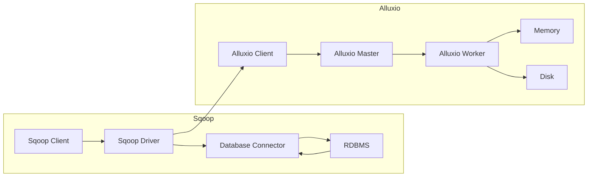

# Sqoop与Alluxio内存计算集成

作者：禅与计算机程序设计艺术

## 1. 背景介绍

### 1.1 大数据时代的数据集成挑战

随着互联网和物联网技术的快速发展，全球数据量呈爆炸式增长，企业内部也积累了海量的结构化、半结构化和非结构化数据。如何高效地将这些分散在不同数据源中的数据进行集成、处理和分析，成为了企业面临的一项重大挑战。

### 1.2 Sqoop：传统关系型数据库到Hadoop的桥梁

Sqoop (SQL-to-Hadoop) 是 Apache 软件基金会旗下的一个开源数据集成工具，主要用于在 Hadoop 生态系统和关系型数据库之间进行高效的数据传输。它可以将关系型数据库中的数据导入到 Hadoop 分布式文件系统 (HDFS) 或其他 Hadoop 生态系统组件中，例如 Hive 和 HBase，也可以将 Hadoop 中的数据导出到关系型数据库中。

### 1.3 Alluxio：内存数据加速层

Alluxio 是一个开源的分布式内存数据加速系统，它为数据密集型应用提供内存级别的速度和可靠性。Alluxio 介于计算框架和存储系统之间，为上层应用提供统一的数据访问视图，并通过将热点数据缓存到内存中，加速数据访问速度，提高应用性能。

### 1.4 Sqoop 与 Alluxio 集成的意义

将 Sqoop 与 Alluxio 集成，可以充分发挥两者的优势，实现更高效、灵活和可靠的数据集成方案。具体来说，集成后的系统可以：

* **提升数据导入速度：** Sqoop 可以将数据直接导入到 Alluxio 内存中，避免了磁盘 I/O 瓶颈，从而显著提升数据导入速度。
* **降低数据访问延迟：** Alluxio 将热点数据缓存到内存中，可以加速数据访问速度，降低应用延迟。
* **提高数据可靠性：** Alluxio 提供数据备份和容错机制，可以保证数据的高可用性和可靠性。

## 2. 核心概念与联系

### 2.1 Sqoop 核心概念

* **连接器 (Connector)：** Sqoop 使用连接器与不同的数据源进行交互，例如 MySQL 连接器、Oracle 连接器等。
* **作业 (Job)：** Sqoop 作业定义了数据传输的任务，包括数据源、目标、传输方式等信息。
* **驱动程序 (Driver)：** Sqoop 驱动程序负责执行 Sqoop 作业，并将数据传输到目标系统。

### 2.2 Alluxio 核心概念

* **客户端 (Client)：** Alluxio 客户端提供 API 供应用程序访问 Alluxio 中的数据。
* **主节点 (Master)：** Alluxio 主节点负责管理 Alluxio 集群的元数据，例如文件系统目录结构、数据块位置等。
* **工作节点 (Worker)：** Alluxio 工作节点负责存储数据块，并将数据块缓存到内存中。

### 2.3 Sqoop 与 Alluxio 集成架构



如图所示，Sqoop 与 Alluxio 的集成架构主要包括以下步骤：

1. Sqoop 客户端将数据导入请求发送给 Sqoop 驱动程序。
2. Sqoop 驱动程序使用数据库连接器连接到关系型数据库。
3. Sqoop 驱动程序从关系型数据库中读取数据，并将其写入 Alluxio 客户端。
4. Alluxio 客户端将数据写入 Alluxio 集群。
5. Alluxio 工作节点将数据块缓存到内存中，并将其持久化到磁盘。

## 3. 核心算法原理具体操作步骤

### 3.1 集成环境搭建

1. **安装 Hadoop 和 Sqoop：** 请参考官方文档安装 Hadoop 和 Sqoop。
2. **安装 Alluxio：** 请参考官方文档安装 Alluxio。
3. **配置 Alluxio：** 在 `conf/alluxio-site.properties` 文件中配置 Alluxio 主节点地址和工作节点地址。
4. **启动 Alluxio：** 使用 `./bin/alluxio format` 格式化 Alluxio 集群，并使用 `./bin/alluxio start` 启动 Alluxio 集群。

### 3.2 使用 Sqoop 将数据导入 Alluxio

1. **创建 Alluxio 目录：** 使用 Alluxio shell 命令 `alluxio fs mkdir /data` 创建数据存储目录。
2. **执行 Sqoop 导入命令：** 使用以下命令将关系型数据库中的数据导入到 Alluxio 目录中：

```
sqoop import \
  --connect jdbc:mysql://<hostname>:<port>/<database> \
  --username <username> \
  --password <password> \
  --table <table> \
  --target-dir alluxio://<alluxio-master>:<port>/data/<table_name> \
  --alluxio-master <alluxio-master>:<port>
```

其中：

* `<hostname>`：关系型数据库主机名。
* `<port>`：关系型数据库端口号。
* `<database>`：关系型数据库名称。
* `<username>`：关系型数据库用户名。
* `<password>`：关系型数据库密码。
* `<table>`：要导入的表名。
* `<alluxio-master>`：Alluxio 主节点主机名。
* `<port>`：Alluxio 主节点端口号。
* `<table_name>`：Alluxio 中存储数据的目录名。

### 3.3 验证数据导入

1. **查看 Alluxio 目录：** 使用 Alluxio shell 命令 `alluxio fs ls /data/<table_name>` 查看数据是否成功导入。
2. **读取 Alluxio 数据：** 使用 Alluxio shell 命令 `alluxio fs cat /data/<table_name>/part-*` 读取导入的数据。

## 4. 数学模型和公式详细讲解举例说明

本节介绍 Sqoop 数据导入过程中的数据分片算法。

### 4.1 数据分片

Sqoop 使用数据分片技术将大型数据集分割成多个小数据集，并行导入到目标系统中，从而提高数据导入效率。数据分片算法基于以下公式：

```
numMappers = max(1, min(numMappers, (inputSize + splitSize - 1) / splitSize))
```

其中：

* `numMappers`：Sqoop 启动的 Mapper 任务数量。
* `inputSize`：输入数据的总大小。
* `splitSize`：每个 Mapper 任务处理的数据块大小。

### 4.2 举例说明

假设我们要将一个 10GB 的数据库表导入到 Alluxio 中，Sqoop 默认的 `splitSize` 为 128MB，则 Sqoop 将启动 80 个 Mapper 任务进行数据导入。

```
numMappers = max(1, min(100, (10 * 1024 + 128 - 1) / 128)) = 80
```

## 5. 项目实践：代码实例和详细解释说明

### 5.1 示例代码

以下是一个使用 Sqoop 将 MySQL 数据库中的数据导入到 Alluxio 的示例代码：

```java
import org.apache.sqoop.client.SqoopClient;
import org.apache.sqoop.model.MConnection;
import org.apache.sqoop.model.MLink;
import org.apache.sqoop.model.MJob;
import org.apache.sqoop.model.MInput;
import org.apache.sqoop.model.MFrom;
import org.apache.sqoop.model.MTo;
import org.apache.sqoop.model.HCatInputFormat;
import org.apache.sqoop.model.HCatOutputFormat;

public class SqoopToAlluxio {

  public static void main(String[] args) throws Exception {

    // 创建 Sqoop 客户端
    String url = "http://<sqoop-server>:<port>/sqoop/";
    SqoopClient client = new SqoopClientBuilder(url).build();

    // 创建连接
    MLink link = client.createLink("generic-jdbc-connector");
    link.setName("mysql-link");
    link.setCreationUser("admin");
    MConnection connection = link.getConnection();
    connection.addProperty("jdbcDriver", "com.mysql.jdbc.Driver");
    connection.addProperty("jdbcUrl",
        "jdbc:mysql://<hostname>:<port>/<database>");
    connection.addProperty("username", "<username>");
    connection.addProperty("password", "<password>");
    client.saveLink(link);

    // 创建作业
    MJob job = client.createJob(link.getName(), "alluxio-job");
    job.setName("import-data");
    job.setCreationUser("admin");

    // 设置输入
    MInput input = job.getInput();
    input.setName("mysql-input");
    MFrom from = input.getFrom();
    from.setName("mysql-from");
    from.setType("TABLE");
    from.setTable("<table>");
    input.setFrom(from);

    // 设置输出
    MTo to = job.getOutput();
    to.setName("alluxio-output");
    to.setType("HCATALOG");
    HCatOutputFormat outputFormat = (HCatOutputFormat) to.getOutputFormat();
    outputFormat.setOutputDirectory(
        "alluxio://<alluxio-master>:<port>/data/<table_name>");
    to.setOutputFormat(outputFormat);

    // 保存作业
    client.saveJob(job);

    // 运行作业
    long jobId = job.getPersistenceId();
    client.startJob(jobId);

    // 等待作业完成
    while (client.getJobStatus(jobId).isRunning()) {
      Thread.sleep(1000);
    }

    // 打印作业结果
    System.out.println(client.getJobLog(jobId));

    // 关闭客户端
    client.close();
  }
}
```

### 5.2 代码解释

* **创建 Sqoop 客户端：** 代码首先创建一个 Sqoop 客户端，并连接到 Sqoop 服务器。
* **创建连接：** 然后，代码创建一个连接，用于连接到 MySQL 数据库。
* **创建作业：** 接下来，代码创建一个 Sqoop 作业，用于将数据从 MySQL 导入到 Alluxio。
* **设置输入：** 在作业中，代码设置了输入，包括要导入的表名。
* **设置输出：** 代码还设置了输出，包括 Alluxio 目录。
* **保存作业：** 代码保存作业到 Sqoop 服务器。
* **运行作业：** 代码启动作业，并等待作业完成。
* **打印作业结果：** 最后，代码打印作业结果，并关闭 Sqoop 客户端。

## 6. 实际应用场景

### 6.1 数据仓库和 ETL

Sqoop 与 Alluxio 的集成可以用于构建高性能的数据仓库和 ETL (Extract, Transform, Load) 流程。例如，可以使用 Sqoop 将关系型数据库中的数据导入到 Alluxio 中，然后使用 Spark 或 Presto 等计算引擎对数据进行清洗、转换和加载到数据仓库中。

### 6.2 实时数据分析

Sqoop 与 Alluxio 的集成还可以用于实时数据分析场景。例如，可以使用 Sqoop 将传感器数据实时导入到 Alluxio 中，然后使用 Spark Streaming 或 Flink 等流处理引擎对数据进行实时分析。

## 7. 工具和资源推荐

### 7.1 Sqoop

* **官方网站：** https://sqoop.apache.org/
* **文档：** https://sqoop.apache.org/docs/

### 7.2 Alluxio

* **官方网站：** https://www.alluxio.io/
* **文档：** https://docs.alluxio.io/

## 8. 总结：未来发展趋势与挑战

### 8.1 未来发展趋势

* **云原生数据集成：** 随着云计算的普及，数据集成平台也逐渐向云原生方向发展。
* **数据湖和数据编织：** 数据湖和数据编织是未来数据管理的重要趋势，Sqoop 和 Alluxio 可以作为数据湖和数据编织架构中的重要组件。
* **人工智能和机器学习：** 人工智能和机器学习技术可以用于优化数据集成流程，例如自动发现数据源、数据质量评估等。

### 8.2 面临挑战

* **数据安全和隐私保护：** 数据集成过程中需要保障数据的安全性和隐私。
* **数据质量管理：** 数据集成需要保证数据的准确性、完整性和一致性。
* **性能优化：** 数据集成需要不断优化性能，以满足日益增长的数据量和处理需求。

## 9. 附录：常见问题与解答

### 9.1 如何解决 Sqoop 导入数据到 Alluxio 速度慢的问题？

可以尝试以下方法优化 Sqoop 数据导入速度：

* **增加 Mapper 任务数量：** 可以通过设置 `-m` 参数增加 Mapper 任务数量，从而提高数据并行导入速度。
* **调整数据块大小：** 可以通过设置 `--split-size` 参数调整每个 Mapper 任务处理的数据块大小，以找到最佳性能。
* **使用压缩：** 可以使用压缩算法压缩数据，例如 Gzip 或 Snappy，以减少数据传输量。

### 9.2 如何解决 Sqoop 导入数据到 Alluxio 数据丢失的问题？

可以尝试以下方法解决数据丢失问题：

* **检查数据源：** 确保数据源中的数据完整无误。
* **检查网络连接：** 确保网络连接稳定，并且没有数据包丢失。
* **检查 Alluxio 集群：** 确保 Alluxio 集群运行正常，并且没有节点故障。

### 9.3 如何监控 Sqoop 数据导入进度？

可以使用 Sqoop 命令行工具或 Web 界面监控数据导入进度。例如，可以使用 `sqoop job -status <job-id>` 命令查看作业状态，或访问 Sqoop Web 界面查看作业进度。