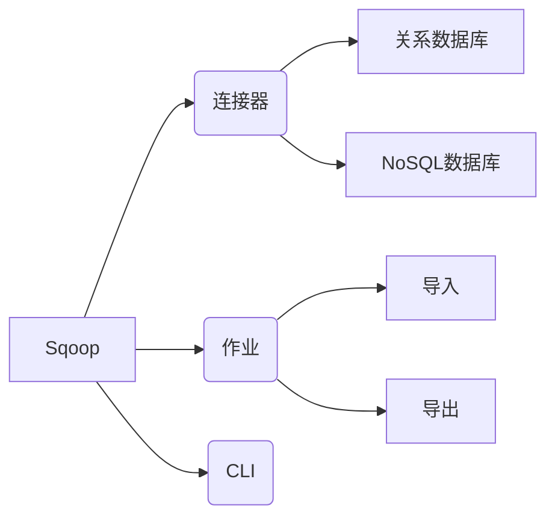
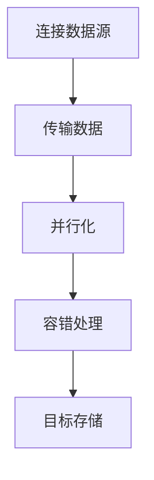
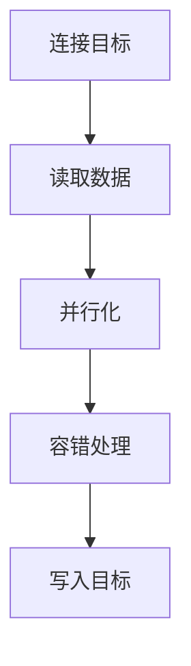

# Sqoop与元宇宙：构建虚拟世界的数据桥梁

## 1.背景介绍

### 1.1 元宇宙的兴起

元宇宙(Metaverse)是一个集成多种新兴技术的虚拟世界,被视为互联网发展的下一个阶段。它旨在创造一个沉浸式的数字环境,模拟现实世界的体验,并提供无缝的用户交互。元宇宙的概念源于科幻小说,但近年来得到了科技巨头和创业公司的大力推动。

### 1.2 数据在元宇宙中的重要性

元宇宙的核心是数据。为了构建一个真实、持久和互联的虚拟世界,需要从多个来源收集和整合大量的结构化和非结构化数据。这些数据包括:

- 用户数据(个人资料、偏好、行为等)
- 虚拟世界的3D模型和资产
- 物联网(IoT)设备数据
- 社交媒体数据
- 企业数据(库存、财务等)

有效地管理和集成这些海量异构数据对于构建一个富有吸引力和身临其境的元宇宙至关重要。

### 1.3 Sqoop在数据集成中的作用

Apache Sqoop是一种用于在Apache Hadoop和结构化数据存储(如关系数据库)之间高效传输大量数据的工具。它支持全量和增量数据传输,并提供并行导入/导出功能,可显著提高性能。

在元宇宙的背景下,Sqoop可以用作数据集成的关键工具,将各种来源的数据有效地加载到大数据平台(如Hadoop或云数据湖)中,为构建虚拟世界提供数据基础。

## 2.核心概念与联系

### 2.1 Sqoop的核心概念

- **连接器(Connector)**: 用于连接到特定的数据源或目标系统,如关系数据库、NoSQL数据库等。
- **作业(Job)**: 表示要执行的导入或导出操作。
- **命令行界面(CLI)**: Sqoop提供了基于命令行的接口来定义和运行作业。



### 2.2 与元宇宙的联系

元宇宙需要从多个异构数据源收集和整合数据。Sqoop可以作为数据管道,高效地将这些数据加载到大数据平台中,为构建虚拟世界提供数据支持。

例如,Sqoop可以:

- 从企业数据库导入用户数据、库存数据等
- 从NoSQL数据库导入社交媒体数据
- 从对象存储导入3D模型和其他资产
- 增量导入更新的数据,保持元宇宙的实时性

通过Sqoop的并行处理和容错能力,可以高效地处理大规模数据集成需求。

## 3.核心算法原理具体操作步骤 

### 3.1 Sqoop导入数据流程

1. **连接数据源**:使用特定的连接器连接到数据源(如关系数据库)。
2. **传输数据**:Sqoop会首先从数据源读取数据到本地,然后将数据传输到HDFS。
3. **并行化**:Sqoop利用多个并行流程(mapper)来提高传输效率。
4. **容错处理**:如果传输过程中出现故障,Sqoop会自动重试失败的任务。
5. **目标存储**:最终将数据存储到HDFS、Hive表或HBase表中。



### 3.2 Sqoop导出数据流程

1. **连接目标**:使用特定的连接器连接到目标系统(如关系数据库)。
2. **读取数据**:从HDFS、Hive表或HBase表中读取数据。
3. **并行化**:Sqoop利用多个并行流程(mapper)来提高传输效率。
4. **容错处理**:如果传输过程中出现故障,Sqoop会自动重试失败的任务。
5. **写入目标**:将数据写入到目标系统中。



### 3.3 Sqoop增量导入

Sqoop支持增量导入,即只导入自上次导入后发生变化的数据。这对于保持元宇宙数据的实时性和减少数据传输开销非常重要。

增量导入的核心算法步骤:

1. **确定增量模式**:基于时间戳、增量列或者增量查询等方式确定增量数据范围。
2. **获取上次导入位置**:从元数据中获取上次导入的终止位置。
3. **导入增量数据**:只导入自上次导入位置之后新增或更新的数据。
4. **更新元数据**:将本次导入的终止位置存储到元数据中,为下次增量导入做准备。

通过增量导入,可以显著减少数据传输量,提高效率并降低成本。

## 4.数学模型和公式详细讲解举例说明

在数据集成过程中,Sqoop利用了并行处理技术来提高性能。我们可以使用一些数学模型来量化并行度对性能的影响。

假设我们需要导入一个包含N条记录的表,每条记录的大小为S字节。导入过程的总时间可以表示为:

$$T = T_r + T_w$$

其中:
- $T_r$是从源系统读取数据的时间
- $T_w$是将数据写入目标系统(如HDFS)的时间

如果使用M个并行映射器(mapper),则:

$$T_r = \frac{N \times S}{B_r \times M}$$
$$T_w = \frac{N \times S}{B_w \times M}$$

这里:
- $B_r$是从源系统读取数据的带宽(bytes/s)
- $B_w$是写入目标系统的带宽(bytes/s)

将上面的公式代入总时间$T$,我们可以得到:

$$T = \frac{N \times S}{B_r \times M} + \frac{N \times S}{B_w \times M}$$

从上面的公式可以看出,增加并行度M可以显著减少总时间T。但是,过高的并行度也可能导致资源竞争和其他开销,因此需要合理设置并行度以获得最佳性能。

另一个需要考虑的因素是数据压缩。如果在传输过程中对数据进行压缩,可以减少传输的数据量,但同时也会增加CPU开销。假设压缩率为C(0<C<1),则有:

$$T = \frac{N \times S \times C}{B_r \times M} + \frac{N \times S}{B_w \times M} + T_c$$

其中$T_c$是数据压缩所需的时间。

通过调整并行度M和压缩率C,可以在传输时间和CPU开销之间做出权衡,从而优化Sqoop的整体性能。

## 4.项目实践:代码实例和详细解释说明

### 4.1 导入关系数据库数据到HDFS

```bash
sqoop import \
--connect jdbc:mysql://hadoop001.mycompany.com/mydb \
--username myuser \
--password mypassword \
--table customers \
--target-dir /user/hdfs/customers \
--fields-terminated-by ','
```

- `--connect`: 指定JDBC连接字符串,连接到MySQL数据库
- `--username`和`--password`: 提供数据库认证凭据
- `--table`: 指定要导入的表名为`customers`
- `--target-dir`: 指定HDFS目标路径为`/user/hdfs/customers`
- `--fields-terminated-by`: 指定字段分隔符为逗号(,)

上面的命令将从MySQL的`mydb`数据库中导入`customers`表到HDFS的`/user/hdfs/customers`路径下,数据文件中的字段由逗号分隔。

### 4.2 导出HDFS数据到HBase

```bash
sqoop import \
--connect jdbc:mysql://hadoop001.mycompany.com/mydb \
--username myuser \
--password mypassword \
--table customers \
--hbase-table customers \
--column-family info \
--hbase-row-key id \
--hbase-create-table
```

- `--hbase-table`: 指定HBase表名为`customers`
- `--column-family`: 指定HBase列族名为`info`
- `--hbase-row-key`: 将`customers`表的`id`列作为HBase行键
- `--hbase-create-table`: 如果HBase表不存在则自动创建

上面的命令将从MySQL的`customers`表导入数据到HBase的`customers`表中,使用`id`列作为行键,其他列存储在`info`列族下。如果HBase表不存在,会自动创建。

### 4.3 增量导入数据

```bash
sqoop import \
--connect jdbc:mysql://hadoop001.mycompany.com/mydb \
--username myuser \
--password mypassword \
--table customers \
--target-dir /user/hdfs/customers \
--check-column updated_at \
--incremental append \
--last-value '2023-05-01 00:00:00'
```

- `--check-column`: 指定用于增量导入的列为`updated_at`
- `--incremental`: 指定增量导入模式
- `--incremental-mode`: 指定增量模式为`append`(追加),而不是覆盖
- `--last-value`: 指定上次导入的终止值为`2023-05-01 00:00:00`

上面的命令将从MySQL的`customers`表中导入自`2023-05-01 00:00:00`之后更新的记录,追加到HDFS的`/user/hdfs/customers`路径下。这样可以避免重复导入未变化的数据,提高效率。

通过这些实例,您可以了解如何使用Sqoop执行不同类型的数据导入和导出操作,以及如何配置增量导入等高级功能。

## 5.实际应用场景

### 5.1 企业数据集成

在企业环境中,Sqoop可以用于将各种业务数据(如ERP、CRM等)从关系数据库或其他结构化存储导入到大数据平台中,为数据分析和商业智能提供支持。

例如,一家零售企业可以使用Sqoop将销售订单数据、库存数据、客户数据等从不同的数据源系统导入到Hadoop或云数据湖中,然后利用大数据分析工具(如Apache Spark)进行数据挖掘和建模,以发现业务洞察力、优化供应链管理、改善客户体验等。

### 5.2 物联网(IoT)数据集成

在物联网场景中,需要从大量的传感器和设备收集时序数据。Sqoop可以与消息队列(如Apache Kafka)或NoSQL数据库(如HBase)集成,将这些IoT数据高效地导入到大数据平台中进行存储和处理。

例如,在智能城市项目中,可以使用Sqoop将来自交通监控摄像头、环境传感器、能源计量设备等的数据导入到Hadoop或云数据湖中,然后应用机器学习算法进行交通流量预测、环境监测、能源优化等分析。

### 5.3 社交媒体数据分析

社交媒体平台上产生了大量的用户生成内容(UGC)数据,如帖子、评论、点赞等。Sqoop可以与这些平台的API集成,将社交媒体数据导入到大数据平台中,为情感分析、用户行为分析、营销策略优化等提供数据支持。

例如,一家营销公司可以使用Sqoop从Facebook、Twitter等社交媒体平台导入与特定产品或服务相关的用户反馈数据,然后应用自然语言处理(NLP)和情感分析技术来了解用户情绪和偏好,从而制定更有针对性的营销策略。

## 6.工具和资源推荐

### 6.1 Apache Sqoop

Apache Sqoop是本文的核心工具,它提供了命令行界面和编程接口,支持多种数据源和目标系统。您可以在Apache软件基金会的官方网站上找到Sqoop的文档、下载链接和社区支持资源。

### 6.2 Hadoop生态系统

由于Sqoop是Hadoop生态系统的一部分,因此了解Hadoop及其相关项目(如HDFS、MapReduce、Hive、HBase等)对于更好地利用Sqoop是很有帮助的。您可以参考Apache Hadoop官方文档和在线培训资源。

### 6.3 云数据集成服务

除