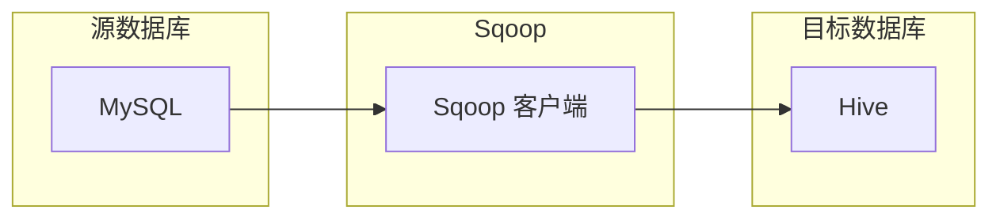

# Sqoop增量导入：四种模式深度解析

作者：禅与计算机程序设计艺术

## 1. 背景介绍

在当今大数据时代，海量数据的处理和分析已经成为各个行业的关键需求。如何高效地将数据从关系型数据库（RDBMS）迁移到 Hadoop 生态系统成为了一个重要的课题。Sqoop 作为 Apache 旗下的一个开源工具，为我们提供了一种可靠、高效的数据传输解决方案。

Sqoop 的全称是 SQL-to-Hadoop，它能够方便地将结构化数据从关系型数据库（如 MySQL、Oracle、PostgreSQL 等）导入到 Hadoop 分布式文件系统（HDFS）、Hive、HBase 等大数据平台。同时，Sqoop 也支持将 Hadoop 中的数据导出到关系型数据库。

在实际应用中，我们经常需要将关系型数据库中的新增数据或变化数据增量地导入到大数据平台，以保证数据的实时性和一致性。Sqoop 提供了多种增量导入模式，可以满足不同的业务需求。

### 1.1. Sqoop 增量导入的必要性

- **实时性需求：** 在许多业务场景下，我们需要及时地将关系型数据库中的最新数据同步到大数据平台，例如实时报表分析、实时推荐系统等。
- **数据一致性：** 增量导入可以避免全量导入带来的数据冗余和数据不一致问题，保证数据的准确性和可靠性。
- **资源效率：** 相比于全量导入，增量导入只需要处理变化的数据，可以节省大量的网络带宽、存储空间和计算资源。

### 1.2. Sqoop 增量导入的挑战

- **数据一致性保证：** 如何保证增量导入过程中数据的一致性，避免数据丢失或重复导入？
- **性能优化：** 如何提高增量导入的效率，降低数据同步延迟？
- **断点续传：** 如何在增量导入过程中断后，能够从断点处继续导入数据？

## 2. 核心概念与联系

在深入了解 Sqoop 增量导入的四种模式之前，我们先来了解一些核心概念：

### 2.1. 全量导入

全量导入是指将关系型数据库中的所有数据一次性导入到大数据平台。这种方式适用于初始数据迁移或历史数据备份等场景。

### 2.2. 增量导入

增量导入是指只将关系型数据库中新增数据或变化数据导入到大数据平台。这种方式适用于需要保持数据实时性和一致性的场景。

### 2.3. 增量标识字段

增量标识字段是指用于标识数据是否发生变化的字段，例如自增 ID、时间戳等。Sqoop 通过比较增量标识字段的值来判断数据是否需要更新。

### 2.4. 四种增量导入模式

Sqoop 提供了四种增量导入模式：

- **追加模式（append）：** 将所有新增数据追加到目标表中。
- **更新插入模式（upsert）：** 如果目标表中存在相同主键的数据，则更新该数据；否则，插入新数据。
- **保存更新插入模式（saveupdate）：** 与更新插入模式类似，但会将更新前的数据保存到一个单独的表或文件中。
- **增量模式（lastmodified）：** 根据增量标识字段的值来判断数据是否发生变化，只导入变化的数据。

## 3. 核心算法原理具体操作步骤

### 3.1. 追加模式（append）

**原理：** 将源数据库中所有数据追加到目标表中。

**操作步骤：**

1. 使用 Sqoop 命令行工具连接到源数据库和目标数据库。
2. 指定要导入的表和目标路径。
3. 设置导入模式为 `--append`。
4. 执行 Sqoop 命令开始导入数据。

**示例：**

```sql
sqoop import \
  --connect jdbc:mysql://localhost:3306/source_db \
  --username root \
  --password password \
  --table source_table \
  --target-dir /user/hive/warehouse/target_table \
  --append
```

### 3.2. 更新插入模式（upsert）

**原理：** 如果目标表中存在相同主键的数据，则更新该数据；否则，插入新数据。

**操作步骤：**

1. 使用 Sqoop 命令行工具连接到源数据库和目标数据库。
2. 指定要导入的表、目标路径和主键字段。
3. 设置导入模式为 `--update-key` 并指定主键字段。
4. 执行 Sqoop 命令开始导入数据。

**示例：**

```sql
sqoop import \
  --connect jdbc:mysql://localhost:3306/source_db \
  --username root \
  --password password \
  --table source_table \
  --target-dir /user/hive/warehouse/target_table \
  --update-key id
```

### 3.3. 保存更新插入模式（saveupdate）

**原理：** 与更新插入模式类似，但会将更新前的数据保存到一个单独的表或文件中。

**操作步骤：**

1. 使用 Sqoop 命令行工具连接到源数据库和目标数据库。
2. 指定要导入的表、目标路径、主键字段和保存更新前数据的路径。
3. 设置导入模式为 `--update-mode` 并指定为 `saveupdate`。
4. 执行 Sqoop 命令开始导入数据。

**示例：**

```sql
sqoop import \
  --connect jdbc:mysql://localhost:3306/source_db \
  --username root \
  --password password \
  --table source_table \
  --target-dir /user/hive/warehouse/target_table \
  --update-key id \
  --update-mode saveupdate \
  --staging-table target_table_staging
```

### 3.4. 增量模式（lastmodified）

**原理：** 根据增量标识字段的值来判断数据是否发生变化，只导入变化的数据。

**操作步骤：**

1. 使用 Sqoop 命令行工具连接到源数据库和目标数据库。
2. 指定要导入的表、目标路径、增量标识字段和上次导入的时间戳。
3. 设置导入模式为 `--incremental` 并指定为 `lastmodified`。
4. 执行 Sqoop 命令开始导入数据。

**示例：**

```sql
sqoop import \
  --connect jdbc:mysql://localhost:3306/source_db \
  --username root \
  --password password \
  --table source_table \
  --target-dir /user/hive/warehouse/target_table \
  --incremental lastmodified \
  --check-column update_time \
  --last-value "2023-05-23 00:00:00"
```

## 4. 数学模型和公式详细讲解举例说明

本节主要介绍 Sqoop 增量导入过程中涉及的一些数学模型和公式，并结合实际例子进行讲解。

### 4.1. 数据量估算

在进行 Sqoop 增量导入之前，我们需要对导入的数据量进行估算，以便为后续的数据存储和处理做好准备。

假设源数据库中每天新增的数据量为 $N$，增量导入的时间间隔为 $T$ 天，则需要导入的数据量为：

$$
\text{导入数据量} = N \times T
$$

**举例说明：**

假设源数据库中每天新增 100 万条数据，增量导入的时间间隔为 7 天，则需要导入的数据量为：

$$
\text{导入数据量} = 100 \text{万} \times 7 = 700 \text{万条}
$$

### 4.2. 性能评估指标

Sqoop 增量导入的性能可以使用以下指标来评估：

- **吞吐量：** 单位时间内导入的数据量，例如 MB/s。
- **延迟：** 数据从源数据库导入到目标数据库所需的时间，例如秒。

**影响性能的因素：**

- **网络带宽：** 网络带宽是影响数据传输速度的重要因素。
- **硬件配置：** 源数据库、目标数据库和 Sqoop 运行节点的硬件配置都会影响导入性能。
- **数据量：** 导入的数据量越大，所需的时间越长。
- **导入模式：** 不同的导入模式会有不同的性能表现。

**举例说明：**

假设我们使用 Sqoop 将 100GB 的数据从 MySQL 导入到 Hive，网络带宽为 100Mbps，则理论上的最大吞吐量为：

$$
\text{最大吞吐量} = \frac{\text{网络带宽}}{\text{数据大小}} = \frac{100 \text{Mbps}}{100 \text{GB}} \approx 10 \text{MB/s}
$$

实际的吞吐量会受到其他因素的影响，例如 CPU、内存、磁盘 IO 等。

## 5. 项目实践：代码实例和详细解释说明

本节将结合实际项目，给出 Sqoop 增量导入的代码实例和详细解释说明。

### 5.1. 项目背景

假设我们有一个电商网站，每天会产生大量的订单数据。这些订单数据存储在 MySQL 数据库中，我们需要将这些数据增量地导入到 Hive 中，以便进行数据分析和报表统计。

### 5.2. 数据表结构

**MySQL 订单表（orders）：**

| 字段名 | 数据类型 | 描述 |
|---|---|---|
| id | int(11) | 订单 ID，主键 |
| order_no | varchar(255) | 订单编号 |
| user_id | int(11) | 用户 ID |
| amount | decimal(10,2) | 订单金额 |
| create_time | timestamp | 订单创建时间 |
| update_time | timestamp | 订单更新时间 |

**Hive 订单表（orders）：**

```sql
CREATE TABLE orders (
  id INT,
  order_no STRING,
  user_id INT,
  amount DECIMAL(10,2),
  create_time TIMESTAMP,
  update_time TIMESTAMP
)
STORED AS PARQUET;
```

### 5.3. 增量导入脚本

```bash
#!/bin/bash

# 设置变量
DATE=`date +%Y-%m-%d`
LAST_VALUE=`hive -e "SELECT MAX(update_time) FROM orders"`

# Sqoop 增量导入
sqoop import \
  --connect jdbc:mysql://localhost:3306/ecommerce \
  --username root \
  --password password \
  --table orders \
  --target-dir /user/hive/warehouse/orders \
  --incremental lastmodified \
  --check-column update_time \
  --last-value "${LAST_VALUE}"

# 更新 Hive 表分区
hive -e "ALTER TABLE orders ADD PARTITION (dt='${DATE}')"
```

**脚本说明：**

1. 获取当前日期和上次导入的时间戳。
2. 使用 Sqoop 命令行工具连接到 MySQL 数据库和 Hive。
3. 指定要导入的表、目标路径、增量标识字段和上次导入的时间戳。
4. 设置导入模式为 `--incremental lastmodified`。
5. 执行 Sqoop 命令开始导入数据。
6. 更新 Hive 表分区。

### 5.4. 定时调度

我们可以使用 crontab 或其他调度工具定时执行该脚本，例如每天凌晨 2 点执行：

```
0 2 * * * /path/to/script.sh
```

## 6. 实际应用场景

Sqoop 增量导入在许多实际应用场景中都有广泛的应用，例如：

### 6.1. 实时数据仓库

在实时数据仓库中，我们需要将业务系统中的数据实时地同步到数据仓库中，以便进行实时分析和决策。Sqoop 增量导入可以帮助我们实现数据的实时同步，保证数据仓库的数据实时性和一致性。

### 6.2. 数据迁移

在将数据从一个数据库迁移到另一个数据库时，我们可以使用 Sqoop 增量导入来同步变化的数据，避免全量迁移带来的数据冗余和性能问题。

### 6.3. 数据备份

我们可以使用 Sqoop 增量导入来备份数据库中的新增数据或变化数据，以便在数据丢失时进行恢复。

## 7. 工具和资源推荐

### 7.1. Apache Sqoop 官方文档

[https://sqoop.apache.org/docs/](https://sqoop.apache.org/docs/)

### 7.2. Sqoop 教程

[https://www.tutorialspoint.com/sqoop/](https://www.tutorialspoint.com/sqoop/)

### 7.3. Sqoop 书籍

- 《Hadoop权威指南》
- 《Hadoop实战》

## 8. 总结：未来发展趋势与挑战

Sqoop 作为一款成熟的数据迁移工具，在未来将会继续发展和完善。

### 8.1. 未来发展趋势

- **支持更多的数据源和目标：** Sqoop 将会支持更多的数据源和目标，例如 NoSQL 数据库、云存储等。
- **性能优化：** Sqoop 将会继续优化性能，提高数据传输速度和效率。
- **易用性提升：** Sqoop 将会提供更加友好和易用的界面，方便用户使用。

### 8.2. 面临的挑战

- **数据一致性保证：** 在分布式环境下，如何保证数据的一致性是一个挑战。
- **安全性：** 在数据传输过程中，如何保证数据的安全性是一个挑战。

## 9. 附录：常见问题与解答

### 9.1. 如何查看 Sqoop 导入的日志？

Sqoop 导入的日志默认输出到控制台，也可以通过 `--verbose` 参数将日志输出到文件中。

### 9.2. 如何处理 Sqoop 导入过程中出现的错误？

可以通过查看 Sqoop 导入的日志来定位错误原因，并根据错误信息进行处理。

### 9.3. 如何提高 Sqoop 导入的性能？

可以通过以下方式提高 Sqoop 导入的性能：

- **增加 Map 任务数量：** 通过 `--num-mappers` 参数可以增加 Map 任务数量，从而提高数据传输的并行度。
- **调整数据块大小：** 通过 `--split-by` 参数可以指定数据切分的字段，并通过 `--chunk-size` 参数可以调整数据块的大小，从而优化数据传输的效率。
- **使用压缩：** 通过 `--compress` 参数可以启用数据压缩，从而减少数据传输量。


## 10. 附录：Mermaid 流程图



该流程图展示了使用 Sqoop 将数据从 MySQL 数据库导入到 Hive 的过程。
