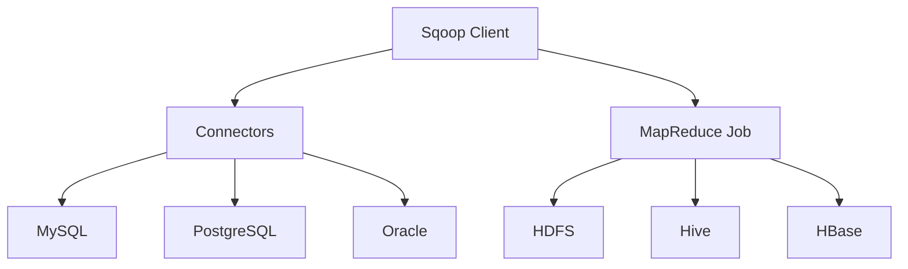

# Sqoop导入导出原理与代码实例讲解

作者：禅与计算机程序设计艺术

## 1. 背景介绍

### 1.1 大数据处理的挑战

随着大数据时代的到来，数据量呈指数级增长，如何高效地处理和分析这些海量数据成为企业面临的重大挑战。传统的关系型数据库（RDBMS）虽然在结构化数据存储和管理方面表现优异，但在处理大规模数据时存在性能瓶颈。另一方面，Hadoop生态系统提供了强大的分布式存储和计算能力，但如何将数据在RDBMS和Hadoop之间高效传输成为一个关键问题。

### 1.2 Sqoop的诞生与发展

Apache Sqoop（SQL-to-Hadoop）应运而生，作为一个开源工具，旨在解决RDBMS与Hadoop之间的数据传输问题。Sqoop能够高效地将数据从关系型数据库导入到Hadoop的HDFS、Hive、HBase等存储系统中，反之亦然。自从Sqoop发布以来，它已成为大数据处理领域的重要工具，被广泛应用于数据迁移、数据集成和数据分析等场景。

### 1.3 文章目的与结构

本文旨在深入解析Sqoop的导入导出原理，并通过具体的代码实例讲解其实际操作步骤。文章结构如下：

- 核心概念与联系
- 核心算法原理具体操作步骤
- 数学模型和公式详细讲解举例说明
- 项目实践：代码实例和详细解释说明
- 实际应用场景
- 工具和资源推荐
- 总结：未来发展趋势与挑战
- 附录：常见问题与解答

## 2. 核心概念与联系

### 2.1 Sqoop的基本概念

Sqoop是一个命令行工具，主要用于将数据在RDBMS和Hadoop之间进行高效传输。其核心功能包括：

- **导入（Import）：** 将RDBMS中的数据导入到HDFS、Hive、HBase等Hadoop存储系统中。
- **导出（Export）：** 将Hadoop存储系统中的数据导出到RDBMS中。

### 2.2 Sqoop的架构

Sqoop的架构主要由以下几个组件构成：

- **Sqoop Client：** 用户交互的入口，通过命令行工具执行导入导出操作。
- **Connectors：** 用于连接不同类型的RDBMS，如MySQL、PostgreSQL、Oracle等。
- **MapReduce Job：** Sqoop将导入导出任务转换为MapReduce作业，以并行处理数据传输任务。

以下是Sqoop的架构图：



### 2.3 Sqoop与其他工具的对比

Sqoop与其他数据传输工具（如Flume、Kafka等）在功能和应用场景上有所不同。Flume主要用于实时数据采集和传输，Kafka则是一个分布式消息系统，而Sqoop则专注于批量数据传输，特别适用于大规模数据迁移和集成。

## 3. 核心算法原理具体操作步骤

### 3.1 数据导入原理

Sqoop的数据导入过程主要包括以下步骤：

1. **连接数据库：** Sqoop通过JDBC连接器连接到RDBMS。
2. **获取元数据：** Sqoop获取目标表的元数据，如列信息、数据类型等。
3. **生成MapReduce作业：** Sqoop根据元数据生成相应的MapReduce作业，将数据分片并行处理。
4. **执行MapReduce作业：** Sqoop执行生成的MapReduce作业，将数据从RDBMS导入到HDFS、Hive或HBase中。

### 3.2 数据导出原理

Sqoop的数据导出过程主要包括以下步骤：

1. **连接数据库：** Sqoop通过JDBC连接器连接到RDBMS。
2. **读取Hadoop数据：** Sqoop读取HDFS、Hive或HBase中的数据。
3. **生成MapReduce作业：** Sqoop根据目标表的结构生成相应的MapReduce作业，将数据分片并行处理。
4. **执行MapReduce作业：** Sqoop执行生成的MapReduce作业，将数据从Hadoop存储系统导出到RDBMS中。

### 3.3 MapReduce作业的优化

为了提高数据传输的效率，Sqoop在MapReduce作业的生成和执行过程中进行了多种优化，如：

- **并行处理：** Sqoop将数据分片后并行处理，充分利用Hadoop的分布式计算能力。
- **批量操作：** Sqoop在导入导出数据时使用批量操作，减少网络传输和数据库操作的开销。
- **压缩和解压缩：** Sqoop支持对数据进行压缩和解压缩，进一步提高传输效率。

## 4. 数学模型和公式详细讲解举例说明

### 4.1 数据分片模型

Sqoop在执行数据导入导出任务时，会将数据分片并行处理。假设目标表有 $N$ 行数据，Sqoop会根据用户指定的分片数 $M$ 将数据分成 $M$ 片，每片约 $N/M$ 行数据。数据分片的数学模型如下：

$$
S_i = \left\{ \text{Row}_{\frac{N}{M} \cdot (i-1) + 1}, \ldots, \text{Row}_{\frac{N}{M} \cdot i} \right\}, \quad i = 1, 2, \ldots, M
$$

其中，$S_i$ 表示第 $i$ 个数据分片。

### 4.2 批量操作模型

在数据导入导出过程中，Sqoop会使用批量操作来提高效率。假设每次批量操作的大小为 $B$ 行数据，总行数为 $N$，则总共需要进行的批量操作次数 $T$ 为：

$$
T = \left\lceil \frac{N}{B} \right\rceil
$$

其中，$\left\lceil x \right\rceil$ 表示向上取整。

### 4.3 并行处理模型

Sqoop通过MapReduce作业进行并行处理。假设有 $M$ 个Map任务，每个Map任务处理 $N/M$ 行数据，总处理时间 $T_{\text{total}}$ 为：

$$
T_{\text{total}} = \max(T_{\text{map}_1}, T_{\text{map}_2}, \ldots, T_{\text{map}_M})
$$

其中，$T_{\text{map}_i}$ 表示第 $i$ 个Map任务的处理时间。

## 5. 项目实践：代码实例和详细解释说明

### 5.1 环境准备

在进行Sqoop数据导入导出操作之前，需要准备好相应的环境，包括：

- 安装Hadoop
- 安装Sqoop
- 配置RDBMS（如MySQL）

### 5.2 数据导入实例

以下是一个将MySQL数据库中的数据导入到HDFS的实例：

```bash
sqoop import \
  --connect jdbc:mysql://localhost/testdb \
  --username root \
  --password root_password \
  --table employees \
  --target-dir /user/hadoop/employees \
  --num-mappers 4
```

#### 5.2.1 参数解释

- `--connect`：指定RDBMS的JDBC连接字符串。
- `--username`：指定数据库用户名。
- `--password`：指定数据库密码。
- `--table`：指定要导入的表名。
- `--target-dir`：指定导入数据的HDFS目标目录。
- `--num-mappers`：指定并行处理的Map任务数。

### 5.3 数据导出实例

以下是一个将HDFS中的数据导出到MySQL数据库的实例：

```bash
sqoop export \
  --connect jdbc:mysql://localhost/testdb \
  --username root \
  --password root_password \
  --table employees_export \
  --export-dir /user/hadoop/employees \
  --num-mappers 4
```

#### 5.3.1 参数解释

- `--connect`：指定RDBMS的JDBC连接字符串。
- `--username`：指定数据库用户名。
- `--password`：指定数据库密码。
- `--table`：指定要导出的表名。
- `--export-dir`：指定导出数据的HDFS目录。
- `--num-mappers`：指定并行处理的Map任务数。

### 5.4 实例解析与优化

在上述实例中，我们