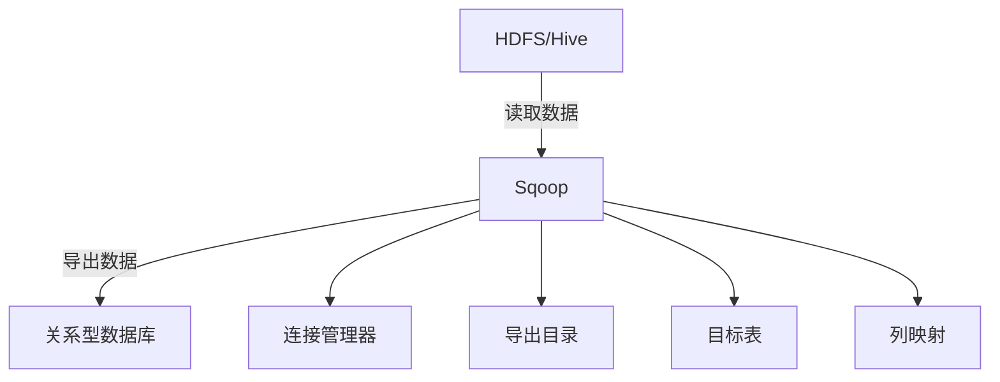

# Sqoop导出数据：高级参数与最佳实践

作者：禅与计算机程序设计艺术

## 1. 背景介绍

随着大数据技术的发展，企业对数据的处理和分析需求越来越高。Hadoop生态系统中的Sqoop工具为数据在Hadoop和关系型数据库之间的传输提供了强有力的支持。Sqoop的导入功能广为人知，但其导出功能同样重要，能够将处理好的大数据从Hadoop集群中导出到关系型数据库中，以便进一步分析和使用。

在这篇文章中，我们将深入探讨Sqoop的导出功能，重点介绍其高级参数和最佳实践，帮助您在实际项目中更高效地使用Sqoop。

## 2. 核心概念与联系

### 2.1 什么是Sqoop？

Sqoop（SQL-to-Hadoop）是一个开源工具，主要用于在Hadoop和关系型数据库（如MySQL、Oracle、PostgreSQL等）之间高效地传输数据。它支持数据的导入和导出功能，能够处理大量数据并保证数据的一致性和完整性。

### 2.2 Sqoop导出功能概述

Sqoop导出功能用于将数据从Hadoop的分布式文件系统（HDFS）或Hive导出到关系型数据库中。导出的数据可以是文本文件、Avro文件、Parquet文件等。导出操作通常用于将处理好的数据从Hadoop集群中导出，以便在关系型数据库中进行进一步的分析和使用。

### 2.3 核心概念

- **连接管理器（Connection Manager）**：Sqoop使用连接管理器来连接不同类型的数据库。每种数据库都有相应的连接管理器。
- **导出目录（Export Directory）**：指存储在HDFS或Hive中的数据目录，Sqoop会从该目录中读取数据进行导出。
- **目标表（Target Table）**：关系型数据库中的表，数据将被导出到该表中。
- **列映射（Column Mapping）**：Sqoop导出过程中，数据列需要映射到目标表的列。

### 2.4 核心联系

Sqoop的导出功能涉及多个组件和参数，它们之间的联系如下图所示：



## 3. 核心算法原理具体操作步骤

### 3.1 Sqoop导出流程

Sqoop导出的基本流程如下：

1. **初始化连接**：使用连接管理器连接到目标关系型数据库。
2. **读取数据**：从HDFS或Hive中读取数据。
3. **数据转换**：将读取的数据转换为目标表的格式。
4. **数据导出**：将转换后的数据插入到目标表中。

### 3.2 具体操作步骤

1. **安装和配置Sqoop**：
   - 安装Sqoop并配置环境变量。
   - 配置JDBC驱动以支持目标数据库。

2. **编写导出命令**：
   - 基本命令格式：
     ```bash
     sqoop export \
     --connect <JDBC连接字符串> \
     --username <数据库用户名> \
     --password <数据库密码> \
     --export-dir <HDFS导出目录> \
     --table <目标表名> \
     [其他参数]
     ```

3. **执行导出命令**：
   - 在命令行中执行导出命令，Sqoop会自动处理数据的读取、转换和导出。

### 3.3 高级参数讲解

1. **--update-key**：
   - 用于指定更新操作的主键列。当目标表中存在相同主键的记录时，进行更新操作而不是插入。

2. **--input-fields-terminated-by**：
   - 指定输入数据的字段分隔符。

3. **--input-lines-terminated-by**：
   - 指定输入数据的行分隔符。

4. **--num-mappers**：
   - 指定并行导出任务的数量，默认值为4。

5. **--batch**：
   - 启用批量导出模式，提高导出效率。

## 4. 数学模型和公式详细讲解举例说明

### 4.1 数据导出模型

Sqoop的数据导出过程可以用以下数学模型来表示：

$$
D_{export} = f(D_{hdfs}, T_{db}, M_{config})
$$

其中：
- $D_{export}$ 表示导出的数据。
- $D_{hdfs}$ 表示HDFS中的数据。
- $T_{db}$ 表示目标数据库表。
- $M_{config}$ 表示导出配置参数。

### 4.2 数据转换公式

在数据导出过程中，数据的转换可以用以下公式表示：

$$
D_{transformed} = T(D_{hdfs}, C_{mapping})
$$

其中：
- $D_{transformed}$ 表示转换后的数据。
- $T$ 表示转换函数。
- $C_{mapping}$ 表示列映射关系。

### 4.3 示例说明

假设我们有一个HDFS目录 `/user/hadoop/export_data`，其中存储了文本文件数据，我们需要将这些数据导出到MySQL数据库中的 `sales` 表中。

导出命令如下：

```bash
sqoop export \
--connect jdbc:mysql://localhost/sales_db \
--username root \
--password password \
--export-dir /user/hadoop/export_data \
--table sales \
--input-fields-terminated-by ',' \
--num-mappers 4 \
--batch
```

在这个例子中：
- $D_{hdfs}$ 是 `/user/hadoop/export_data` 中的数据。
- $T_{db}$ 是 `sales` 表。
- $C_{mapping}$ 是文本文件中的列与 `sales` 表中的列的映射。

## 5. 项目实践：代码实例和详细解释说明

### 5.1 项目背景

假设我们有一个电商平台的销售数据存储在HDFS中，我们需要定期将这些数据导出到MySQL数据库中，以便进行业务分析。

### 5.2 数据准备

在HDFS中，我们有一个目录 `/user/hadoop/sales_data`，其中存储了每日的销售数据，文件格式为CSV，每个文件包含以下字段：`order_id, product_id, user_id, quantity, price, order_date`。

### 5.3 编写导出脚本

我们编写一个Shell脚本 `export_sales_data.sh`，用于自动化导出过程：

```bash
#!/bin/bash

# Sqoop导出命令
sqoop export \
--connect jdbc:mysql://localhost/sales_db \
--username root \
--password password \
--export-dir /user/hadoop/sales_data \
--table sales \
--input-fields-terminated-by ',' \
--num-mappers 4 \
--batch

# 检查导出结果
if [ $? -eq 0 ]; then
  echo "数据导出成功"
else
  echo "数据导出失败"
  exit 1
fi
```

### 5.4 定时任务配置

为了定期导出数据，我们可以使用Linux的 `crontab` 配置定时任务，每天凌晨1点执行导出脚本：

```bash
0 1 * * * /path/to/export_sales_data.sh
```

### 5.5 详细解释

- **连接数据库**：使用 `--connect` 参数指定MySQL数据库的连接字符串。
- **指定用户和密码**：使用 `--username` 和 `--password` 参数指定数据库的用户名和密码。
- **指定导出目录**：使用 `--export-dir` 参数指定HDFS中的数据目录。
- **指定目标表**：使用 `--table` 参数指定MySQL中的目标表。
- **字段分隔符**：使用 `--input-fields-terminated-by` 参数指定CSV文件的字段分隔符。
- **并行任务数**：使用 `--num-mappers` 参数指定并行导出任务的数量。
- **批量模式**：使用 `--batch` 参数启用批量导出模式。

## 6. 实际应用场景

### 6.1 数据仓库建设

在数据仓库建设过程中，通常需要将处理好的数据从Hadoop集群中导出到关系型数据库中，以便BI工具进行分析和展示。Sqoop的导出功能能够高效地完成这一任务。

### 6.2 数据备份与恢复

企业在进行数据备份和恢复时，可以使用Sqoop将HDFS中的数据导出到关系型数据库中，作为备份数据的一部分。这样可以在数据库损坏或数据丢失时，快速恢复数据。

### 6.3 数据迁移

在数据迁移过程中，Sqoop可以帮助企业将数据从一个Hadoop集群导出到另一个关系型数据库中，实现数据的跨平台迁移。

