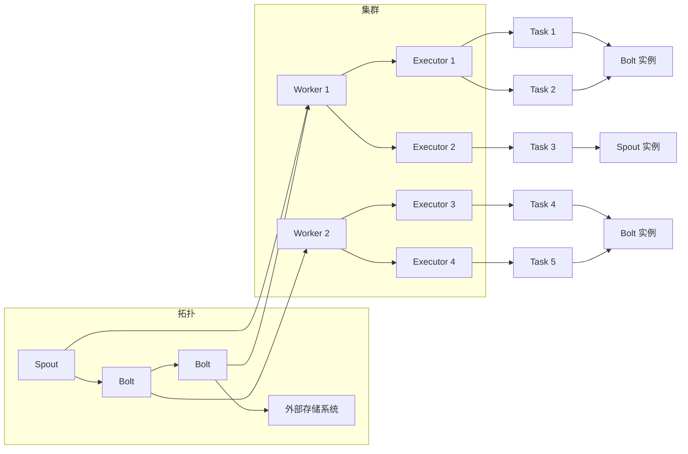

# Storm原理与代码实例讲解

作者：禅与计算机程序设计艺术

## 1. 背景介绍

### 1.1 大数据时代实时流处理的需求

随着互联网和物联网的快速发展，全球数据量呈爆炸式增长，其中蕴含着巨大的商业价值。如何及时有效地处理和分析这些海量数据，成为了企业面临的重大挑战。传统的批处理系统已经无法满足实时性要求，实时流处理应运而生。

实时流处理是指对数据流进行连续不断的处理、分析和响应，并在数据生成的同时进行计算，具有低延迟、高吞吐、可扩展等特点。实时流处理技术广泛应用于实时监控、欺诈检测、风险管理、个性化推荐等领域。

### 1.2 Storm的诞生与发展

Storm 是一个开源的分布式实时计算系统，由 Twitter 开源，用于处理海量数据流。它简单易用、容错性好、性能优异，被广泛应用于实时数据分析、机器学习、在线学习等领域。

Storm 最初由 Nathan Marz 和 BackType 公司的团队开发，于 2011 年开源。2013 年，Storm 加入 Apache 基金会，成为 Apache 顶级项目。近年来，Storm 社区不断发展壮大，推出了许多新特性和改进，例如 Trident API、Storm on YARN、Storm on Mesos 等。

### 1.3 Storm的特点与优势

* **简单易用**: Storm 提供了简单易用的 API，用户可以使用 Java、Scala、Python 等语言编写拓扑逻辑。
* **高性能**: Storm 基于内存计算，数据在内存中进行处理，速度非常快。
* **容错性**: Storm 具有强大的容错机制，可以保证数据处理的可靠性。
* **可扩展**: Storm 支持水平扩展，可以轻松地扩展到更大的集群。
* **活跃的社区**: Storm 拥有活跃的社区支持，用户可以方便地获取帮助和资源。

## 2. 核心概念与联系

### 2.1 拓扑（Topology）

拓扑是 Storm 中最核心的概念，它定义了数据流的处理逻辑。一个拓扑由多个组件（Spout 和 Bolt）组成，这些组件之间通过数据流进行连接。

### 2.2 数据流（Stream）

数据流是 Storm 中数据传输的基本单元，它是一个无界的元组序列。每个元组可以包含多个字段，字段类型可以是基本类型、自定义类型或其他数据结构。

### 2.3 Spout

Spout 是拓扑的数据源，负责从外部数据源读取数据，并将数据转换为数据流发送到拓扑中。常见的 Spout 类型包括：Kafka Spout、Twitter Streaming API Spout、File Spout 等。

### 2.4 Bolt

Bolt 是拓扑的数据处理单元，负责接收来自 Spout 或其他 Bolt 的数据流，对数据进行处理，并将处理结果发送到下一个 Bolt 或外部存储系统。Bolt 可以执行各种数据处理操作，例如：过滤、聚合、连接、机器学习等。

### 2.5 Worker

Worker 是 Storm 集群中的工作节点，负责执行拓扑的一部分。每个 Worker 节点上可以运行多个 Executor 线程。

### 2.6 Executor

Executor 是 Worker 节点上的一个执行线程，负责执行一个或多个 Bolt 或 Spout 的实例。

### 2.7 Task

Task 是 Executor 线程上的一个执行单元，负责执行 Bolt 或 Spout 的一个实例。

### 2.8 核心概念关系图



## 3. 核心算法原理具体操作步骤

### 3.1 数据流分组策略

Storm 支持多种数据流分组策略，用于将数据流分发到不同的 Bolt 实例进行处理。

* **随机分组（Shuffle Grouping）**: 数据流中的每个元组会被随机分配到一个 Bolt 实例。
* **字段分组（Fields Grouping）**: 根据数据流中指定字段的值进行分组，相同字段值的元组会被分配到同一个 Bolt 实例。
* **全局分组（Global Grouping）**: 数据流中的所有元组都会被分配到同一个 Bolt 实例。
* **本地分组（Local Grouping）**: 数据流中的元组会优先分配到同一个 Worker 节点上的 Bolt 实例。
* **直接分组（Direct Grouping）**: 数据流的发送者可以指定将元组发送到哪个 Bolt 实例。
* **全部分组（All Grouping）**: 数据流中的每个元组会被广播到所有 Bolt 实例。

### 3.2 消息可靠性保障机制

Storm 提供了消息可靠性保障机制，确保数据流中的每个元组都能被至少处理一次。

* **消息确认机制**: 每个 Bolt 实例在处理完一个元组后，会向 Spout 发送一个确认消息。如果 Spout 在指定时间内没有收到确认消息，则会重新发送该元组。
* **事务性拓扑**: Storm 支持事务性拓扑，可以保证数据处理的一致性和可靠性。

### 3.3 并行度控制

Storm 的并行度可以通过设置 Worker 数量、Executor 数量和 Task 数量来控制。

* **Worker 数量**: Worker 数量决定了 Storm 集群的规模。
* **Executor 数量**: Executor 数量决定了每个 Worker 节点上可以运行的线程数量。
* **Task 数量**: Task 数量决定了每个 Executor 线程上可以运行的任务数量。

## 4. 数学模型和公式详细讲解举例说明

### 4.1 数据吞吐量计算

Storm 的数据吞吐量可以用以下公式计算：

```
吞吐量 = 元组数量 / 处理时间
```

例如，如果一个 Storm 拓扑每秒钟可以处理 1000 个元组，则其吞吐量为 1000 tuples/s。

### 4.2 数据延迟计算

Storm 的数据延迟可以用以下公式计算：

```
延迟 = 处理时间 - 数据生成时间
```

例如，如果一个元组在 10:00:00 生成，并在 10:00:01 被处理完成，则其延迟为 1 秒。

### 4.3 资源利用率计算

Storm 的资源利用率可以用以下公式计算：

```
CPU 利用率 = CPU 使用时间 / 总时间
内存利用率 = 内存使用量 / 总内存
```

例如，如果一个 Storm 集群的 CPU 使用时间为 80%，则其 CPU 利用率为 80%。

## 5. 项目实践：代码实例和详细解释说明

### 5.1 WordCount 示例

WordCount 是一个经典的实时流处理示例，用于统计数据流中每个单词出现的次数。

#### 5.1.1 代码实现

```java
import org.apache.storm.Config;
import org.apache.storm.LocalCluster;
import org.apache.storm.StormSubmitter;
import org.apache.storm.topology.BasicOutputCollector;
import org.apache.storm.topology.OutputFieldsDeclarer;
import org.apache.storm.topology.TopologyBuilder;
import org.apache.storm.topology.base.BaseBasicBolt;
import org.apache.storm.tuple.Fields;
import org.apache.storm.tuple.Tuple;
import org.apache.storm.tuple.Values;

import java.util.HashMap;
import java.util.Map;

public class WordCountTopology {

    public static class SentenceSpout extends RandomSentenceSpout {
        private static final long serialVersionUID = 1L;

        public SentenceSpout() {
            super(1000);
        }
    }

    public static class SplitSentenceBolt extends BaseBasicBolt {
        private static final long serialVersionUID = 1L;

        @Override
        public void execute(Tuple input, BasicOutputCollector collector) {
            String sentence = input.getString(0);
            for (String word : sentence.split("\\s+")) {
                collector.emit(new Values(word));
            }
        }

        @Override
        public void declareOutputFields(OutputFieldsDeclarer declarer) {
            declarer.declare(new Fields("word"));
        }
    }

    public static class WordCountBolt extends BaseBasicBolt {
        private static final long serialVersionUID = 1L;
        private Map<String, Integer> counts = new HashMap<>();

        @Override
        public void execute(Tuple input, BasicOutputCollector collector) {
            String word = input.getString(0);
            Integer count = counts.getOrDefault(word, 0);
            count++;
            counts.put(word, count);
            collector.emit(new Values(word, count));
        }

        @Override
        public void declareOutputFields(OutputFieldsDeclarer declarer) {
            declarer.declare(new Fields("word", "count"));
        }
    }

    public static void main(String[] args) throws Exception {
        TopologyBuilder builder = new TopologyBuilder();
        builder.setSpout("spout", new SentenceSpout(), 1);
        builder.setBolt("split", new SplitSentenceBolt(), 2).shuffleGrouping("spout");
        builder.setBolt("count", new WordCountBolt(), 1).fieldsGrouping("split", new Fields("word"));

        Config conf = new Config();
        conf.setDebug(true);

        if (args != null && args.length > 0) {
            conf.setNumWorkers(3);
            StormSubmitter.submitTopologyWithProgressBar(args[0], conf, builder.createTopology());
        } else {
            LocalCluster cluster = new LocalCluster();
            cluster.submitTopology("word-count", conf, builder.createTopology());
            Thread.sleep(10000);
            cluster.killTopology("word-count");
            cluster.shutdown();
        }
    }
}
```

#### 5.1.2 代码解释

* **SentenceSpout**: 数据源，随机生成句子。
* **SplitSentenceBolt**: 将句子分割成单词。
* **WordCountBolt**: 统计每个单词出现的次数。
* **TopologyBuilder**: 用于构建拓扑结构。
* **Config**: 配置 Storm 集群。
* **LocalCluster**: 用于在本地模式下运行 Storm 集群。
* **StormSubmitter**: 用于将拓扑提交到远程 Storm 集群。

#### 5.1.3 运行结果

运行 WordCount 拓扑后，可以通过 Storm UI 查看拓扑的运行状态和统计信息。

### 5.2 其他代码实例

除了 WordCount 示例，Storm 还提供了许多其他代码实例，例如：

* **ExclamationTopology**: 将输入数据流中的每个单词转换为感叹句。
* **RollingTopWords**: 统计一段时间内出现频率最高的单词。
* **ReachTopology**: 计算 Twitter 用户的影响力。

## 6. 实际应用场景

Storm 广泛应用于实时数据分析、机器学习、在线学习等领域，例如：

* **实时监控**: 监控网站流量、系统性能、应用程序日志等。
* **欺诈检测**: 检测信用卡欺诈、保险欺诈等。
* **风险管理**: 评估金融风险、信用风险等。
* **个性化推荐**: 根据用户的历史行为推荐商品或服务。

## 7. 工具和资源推荐

* **Storm 官方网站**: https://storm.apache.org/
* **Storm Github 仓库**: https://github.com/apache/storm
* **Storm 文档**: https://storm.apache.org/documentation.html
* **Storm 教程**: https://storm.apache.org/tutorials.html

## 8. 总结：未来发展趋势与挑战

### 8.1 未来发展趋势

* **与云计算平台深度集成**: Storm 将与云计算平台深度集成，提供更便捷的部署和管理服务。
* **支持更多数据源和数据格式**: Storm 将支持更多的数据源和数据格式，例如：NoSQL 数据库、JSON、Avro 等。
* **增强机器学习和人工智能功能**: Storm 将增强机器学习和人工智能功能，提供更强大的数据分析能力。

### 8.2 面临的挑战

* **性能优化**: 随着数据量的不断增长，Storm 需要不断优化性能，以满足实时性要求。
* **安全性**: Storm 需要提供更强大的安全机制，以保护数据安全。
* **易用性**: Storm 需要提供更简单易用的 API 和工具，以降低用户的使用门槛。

## 9. 附录：常见问题与解答

### 9.1 如何监控 Storm 拓扑的运行状态？

可以通过 Storm UI 监控 Storm 拓扑的运行状态，Storm UI 提供了丰富的统计信息，例如：数据吞吐量、数据延迟、资源利用率等。

### 9.2 如何调试 Storm 拓扑？

可以使用 Storm 的调试工具进行调试，例如：Storm UI 的 Debug 模式、远程调试等。

### 9.3 如何保证 Storm 拓扑的消息可靠性？

Storm 提供了消息可靠性保障机制，确保数据流中的每个元组都能被至少处理一次。可以通过设置消息确认机制和使用事务性拓扑来保证消息可靠性。
