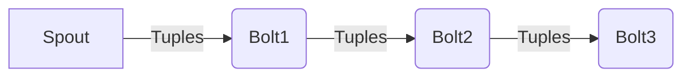

## 1. 背景介绍

在大数据领域，实时流处理已经成为一个重要的需求。企业和研究机构都希望能够实时地从海量数据中提取有价值的信息。为了满足这个需求，出现了一些实时流处理框架，而Storm就是其中最出色的一个。本文将为您详细介绍Storm框架，包括其设计原理，核心概念，以及实际的应用案例。

### 1.1 什么是Storm

Storm是一个免费的开源实时流处理框架，由Nathan Marz于2011年开发，后来被Twitter收购并开源。Storm能够处理大量的数据流，并且具有高度的可扩展性。它的主要功能是将一个复杂的流处理任务分解成多个小的任务，然后分发到集群中的各个节点上并行处理。

### 1.2 Storm的需求场景

实时流处理在以下几种场景中非常有用：

- 实时分析：例如，社交媒体数据分析，股票交易分析，网络流量监控等。
- 实时ETL：例如，从各种源实时提取、转换和加载数据。
- 实时机器学习：例如，对实时产生的数据进行预测、分类、聚类等。

## 2. 核心概念与联系

了解Storm的核心概念及其之间的关系是理解Storm框架的关键。以下是Storm的一些核心概念：

- **Tuple**：Tuple是Storm处理的基本数据单元，它是一种有序的键值对列表。

- **Stream**：Stream是Tuple的序列，它可以是无界的，也可以是有界的。

- **Spout**：Spout是Storm数据处理的起点，它从外部源（例如Kafka，RabbitMQ等）读取数据，并将数据封装为Tuple，然后发射出去。

- **Bolt**：Bolt是Storm数据处理的主体，它接收来自Spout或其他Bolt的Tuple，进行处理，然后可能会发射出新的Tuple。

- **Topology**：Topology是Storm的计算逻辑，它由多个Spout和Bolt组成，并定义了它们之间的数据流。

以上的概念可以通过下图进行简单的理解：

## 3. 核心算法原理具体操作步骤

Storm框架的运行过程可以概括为以下几个步骤：

1. **数据发射**：Spout从外部数据源读取数据，并将数据封装为Tuple，然后发射出去。

2. **数据处理**：Bolt接收来自Spout或其他Bolt的Tuple，进行处理，然后可能会发射出新的Tuple。

3. **数据流转**：Storm框架根据定义的Topology，将Tuple从一个Bolt传递到另一个Bolt。

4. **结果汇总**：最后，结果可能会被写入外部存储系统，或者发送给其他系统。

在Storm框架中，所有的计算都是在Bolt中进行的，而Spout只负责数据的输入。这种设计使得Storm框架可以非常灵活地处理各种复杂的数据流。

## 4. 数学模型和公式详细讲解举例说明

在Storm框架中，我们可以使用一些数学模型来描述和分析其性能和效率，例如，我们可以使用队列理论来分析Storm的处理能力。

假设我们有一个Storm集群，它由$n$个节点组成，每个节点有$m$个Bolt实例。每个Bolt实例每秒可以处理$\lambda$个Tuple，而每个Spout实例每秒产生$\mu$个Tuple。我们可以使用以下公式来计算Storm集群的处理能力：

$$
TPS = n \times m \times \lambda
$$

其中，$TPS$是Storm集群每秒可以处理的Tuple数量。

在理想情况下，我们希望$TPS$大于或等于每秒产生的Tuple数量，即：

$$
TPS \geq \mu
$$

如果$TPS$小于$\mu$，那么Storm集群就会出现处理延迟，Tuple会在队列中积压。

## 4. 项目实践：代码实例和详细解释说明

下面我们来看一个简单的Storm应用示例。这个示例是一个Word Count程序，它读取文本数据，然后统计每个单词的出现次数。