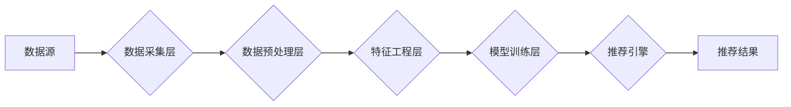
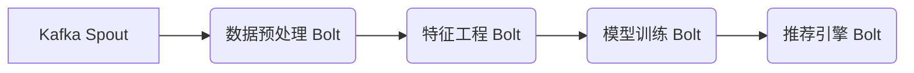

## 1. 背景介绍

### 1.1. 实时推荐系统的兴起

随着互联网的快速发展和普及，海量的数据不断涌现，人们对信息的获取和处理能力提出了更高的要求。传统的推荐系统往往依赖于离线批处理的方式进行模型训练和推荐结果生成，难以满足用户对实时性、个性化的需求。实时推荐系统应运而生，它能够根据用户的实时行为和兴趣偏好，动态地调整推荐策略，提供更加精准、及时的推荐服务。

### 1.2. Storm在大数据处理中的优势

Apache Storm是一个分布式、容错性强、实时计算系统，它能够以秒级甚至毫秒级的延迟处理海量数据流。Storm具有以下优势，使其成为构建实时推荐系统的理想选择：

* **高吞吐量**: Storm能够处理每秒数百万条消息，满足实时推荐系统对高并发请求的处理需求。
* **低延迟**: Storm能够以亚秒级的延迟处理数据流，为用户提供实时推荐服务。
* **容错性**: Storm具有强大的容错机制，即使在节点故障的情况下也能保证数据处理的可靠性。
* **易用性**: Storm提供了简单易用的API，方便开发者快速构建实时数据处理应用程序。

### 1.3. 本文目标

本文将以一个实际的实时推荐系统案例为例，详细介绍如何使用Storm构建一个高性能、可扩展的实时推荐系统。

## 2. 核心概念与联系

### 2.1. 实时推荐系统架构

一个典型的实时推荐系统架构如下图所示：



* **数据源**: 实时推荐系统的数据来源非常广泛，包括用户的浏览历史、点击记录、购买行为、社交网络数据等。
* **数据采集层**: 负责实时地收集和传输来自各个数据源的数据。
* **数据预处理层**: 对原始数据进行清洗、过滤、去重等操作，为后续的特征工程和模型训练提供高质量的数据。
* **特征工程层**: 从预处理后的数据中提取出用户和物品的特征，为模型训练提供输入。
* **模型训练层**: 使用机器学习算法对历史数据进行训练，构建推荐模型。
* **推荐引擎**: 接收用户的实时请求，根据推荐模型生成个性化的推荐结果。

### 2.2. Storm核心组件

Storm集群由一个主节点（Nimbus）和多个工作节点（Supervisor）组成。

* **Nimbus**: 负责资源分配、任务调度和监控整个集群的状态。
* **Supervisor**: 负责接收Nimbus分配的任务，启动和停止工作进程。
* **Worker**: 工作进程，负责执行具体的计算任务。
* **Topology**: Storm应用程序的基本单元，由多个Spout和Bolt组成。
* **Spout**: 数据源，负责从外部数据源读取数据并发送到Topology中。
* **Bolt**: 处理单元，负责接收来自Spout或其他Bolt的数据，进行计算处理后，可以选择性地将结果输出到其他Bolt或外部存储系统中。

### 2.3. 核心概念之间的联系

实时推荐系统的数据流通常采用流式处理的方式进行处理，Storm作为一种流式计算框架，非常适合用于构建实时推荐系统。在实时推荐系统中，数据采集层可以将用户行为数据实时地发送到Storm集群中，由Storm集群中的Spout组件接收数据并进行预处理，然后将预处理后的数据发送到Bolt组件进行特征提取和模型训练，最后将训练好的模型部署到推荐引擎中，为用户提供实时推荐服务。

## 3. 核心算法原理具体操作步骤

### 3.1. 数据预处理

数据预处理是实时推荐系统中非常重要的一环，它直接影响到后续特征工程和模型训练的效果。常用的数据预处理方法包括：

* **数据清洗**: 清除数据中的噪声、异常值和缺失值。
* **数据过滤**: 过滤掉与推荐目标无关的数据。
* **数据去重**: 去除数据中的重复记录。
* **数据格式转换**: 将数据转换为模型训练所需的格式。

### 3.2. 特征工程

特征工程是指从原始数据中提取出用户和物品的特征，为模型训练提供输入。常用的特征工程方法包括：

* **用户特征**: 年龄、性别、职业、兴趣爱好等。
* **物品特征**: 类别、品牌、价格、评分等。
* **行为特征**: 浏览历史、点击记录、购买行为等。

### 3.3. 模型训练

实时推荐系统中常用的模型训练算法包括：

* **协同过滤算法**: 根据用户历史行为数据，计算用户之间的相似度或物品之间的相似度，为用户推荐与其兴趣相似的物品。
* **内容推荐算法**: 根据用户历史行为数据，分析用户的兴趣偏好，为用户推荐与其兴趣相似的物品。
* **混合推荐算法**: 结合协同过滤算法和内容推荐算法的优点，为用户提供更加精准的推荐服务。

### 3.4. 模型评估

模型训练完成后，需要对模型进行评估，常用的评估指标包括：

* **准确率**: 推荐结果中用户真正感兴趣的物品所占的比例。
* **召回率**: 用户真正感兴趣的物品中被推荐出来的比例。
* **F1值**: 准确率和召回率的调和平均数。

## 4. 数学模型和公式详细讲解举例说明

### 4.1. 协同过滤算法

协同过滤算法是推荐系统中应用最为广泛的算法之一，它可以分为基于用户的协同过滤算法和基于物品的协同过滤算法。

#### 4.1.1. 基于用户的协同过滤算法

基于用户的协同过滤算法的基本思想是：找到与目标用户兴趣相似的用户集合，根据这些用户的评分来预测目标用户对某个物品的评分。

假设用户集合为 $U = \{u_1, u_2, ..., u_m\}$，物品集合为 $I = \{i_1, i_2, ..., i_n\}$，用户 $u$ 对物品 $i$ 的评分为 $r_{ui}$。

**1. 计算用户之间的相似度**

常用的用户相似度计算方法包括：

* **余弦相似度**:

$$
sim(u, v) = \frac{\sum_{i \in I_{uv}} r_{ui} r_{vi}}{\sqrt{\sum_{i \in I_{uv}} r_{ui}^2} \sqrt{\sum_{i \in I_{uv}} r_{vi}^2}}
$$

其中，$I_{uv}$ 表示用户 $u$ 和用户 $v$ 共同评分过的物品集合。

* **皮尔逊相关系数**:

$$
sim(u, v) = \frac{\sum_{i \in I_{uv}} (r_{ui} - \bar{r_u}) (r_{vi} - \bar{r_v})}{\sqrt{\sum_{i \in I_{uv}} (r_{ui} - \bar{r_u})^2} \sqrt{\sum_{i \in I_{uv}} (r_{vi} - \bar{r_v})^2}}
$$

其中，$\bar{r_u}$ 表示用户 $u$ 的平均评分。

**2. 找到与目标用户兴趣相似的用户集合**

根据用户之间的相似度，选择相似度最高的前 $k$ 个用户作为目标用户的邻居用户集合 $N(u)$。

**3. 预测目标用户对某个物品的评分**

$$
\hat{r_{ui}} = \bar{r_u} + \frac{\sum_{v \in N(u)} sim(u, v) (r_{vi} - \bar{r_v})}{\sum_{v \in N(u)} |sim(u, v)|}
$$

#### 4.1.2. 基于物品的协同过滤算法

基于物品的协同过滤算法的基本思想是：计算物品之间的相似度，根据目标用户评分过的物品，推荐与其相似的物品。

**1. 计算物品之间的相似度**

常用的物品相似度计算方法包括：

* **余弦相似度**:

$$
sim(i, j) = \frac{\sum_{u \in U_{ij}} r_{ui} r_{uj}}{\sqrt{\sum_{u \in U_{ij}} r_{ui}^2} \sqrt{\sum_{u \in U_{ij}} r_{uj}^2}}
$$

其中，$U_{ij}$ 表示对物品 $i$ 和物品 $j$ 都评分过的用户集合。

* **调整余弦相似度**:

$$
sim(i, j) = \frac{\sum_{u \in U_{ij}} (r_{ui} - \bar{r_u}) (r_{uj} - \bar{r_u})}{\sqrt{\sum_{u \in U_{ij}} (r_{ui} - \bar{r_u})^2} \sqrt{\sum_{u \in U_{ij}} (r_{uj} - \bar{r_u})^2}}
$$

**2. 预测目标用户对某个物品的评分**

$$
\hat{r_{ui}} = \frac{\sum_{j \in I} sim(i, j) r_{uj}}{\sum_{j \in I} |sim(i, j)|}
$$

### 4.2. 内容推荐算法

内容推荐算法的基本思想是：根据用户历史行为数据，分析用户的兴趣偏好，为用户推荐与其兴趣相似的物品。

**1. 提取物品的特征向量**

可以使用自然语言处理技术从物品的文本描述中提取关键词，构建物品的特征向量。

**2. 计算用户对不同特征的兴趣程度**

根据用户历史行为数据，计算用户对不同特征的兴趣程度。

**3. 预测目标用户对某个物品的评分**

根据物品的特征向量和用户对不同特征的兴趣程度，预测目标用户对某个物品的评分。

## 5. 项目实践：代码实例和详细解释说明

### 5.1. 数据集介绍

本案例使用 MovieLens 数据集作为示例数据，该数据集包含了用户对电影的评分信息。

### 5.2. Storm Topology设计



* **Kafka Spout**: 从 Kafka 中读取用户行为数据。
* **数据预处理 Bolt**: 对原始数据进行清洗、过滤、去重等操作。
* **特征工程 Bolt**: 从预处理后的数据中提取出用户和物品的特征。
* **模型训练 Bolt**: 使用协同过滤算法对历史数据进行训练，构建推荐模型。
* **推荐引擎 Bolt**: 接收用户的实时请求，根据推荐模型生成个性化的推荐结果。

### 5.3. 代码实现

```java
// Kafka Spout
public class UserActionSpout extends BaseRichSpout {
    // ...
    @Override
    public void nextTuple() {
        // 从 Kafka 中读取用户行为数据
        // ...
        // 将数据发送到下一个 Bolt
        collector.emit(new Values(userId, movieId, rating));
    }
    // ...
}

// 数据预处理 Bolt
public class DataPreprocessingBolt extends BaseRichBolt {
    // ...
    @Override
    public void execute(Tuple input) {
        // 获取用户 ID、电影 ID 和评分
        // ...
        // 数据清洗、过滤、去重等操作
        // ...
        // 将预处理后的数据发送到下一个 Bolt
        collector.emit(new Values(userId, movieId, rating));
    }
    // ...
}

// 特征工程 Bolt
public class FeatureEngineeringBolt extends BaseRichBolt {
    // ...
    @Override
    public void execute(Tuple input) {
        // 获取用户 ID、电影 ID 和评分
        // ...
        // 从数据库中读取用户和电影的特征
        // ...
        // 将特征数据发送到下一个 Bolt
        collector.emit(new Values(userId, movieId, userFeatures, movieFeatures));
    }
    // ...
}

// 模型训练 Bolt
public class ModelTrainingBolt extends BaseRichBolt {
    // ...
    @Override
    public void execute(Tuple input) {
        // 获取用户 ID、电影 ID、用户特征和电影特征
        // ...
        // 使用协同过滤算法更新推荐模型
        // ...
    }
    // ...
}

// 推荐引擎 Bolt
public class RecommendationEngineBolt extends BaseRichBolt {
    // ...
    @Override
    public void execute(Tuple input) {
        // 获取用户 ID
        // ...
        // 从推荐模型中获取推荐结果
        // ...
        // 将推荐结果发送到外部存储系统
        // ...
    }
    // ...
}
```

## 6. 实际应用场景

实时推荐系统在电商、社交、新闻等领域有着广泛的应用。

* **电商**: 为用户推荐个性化的商品，提高用户购买率。
* **社交**: 为用户推荐好友、群组和内容，增强用户粘性。
* **新闻**: 为用户推荐感兴趣的新闻资讯，提高用户阅读量。

## 7. 工具和资源推荐

* **Apache Storm**: 分布式、容错性强、实时计算系统。
* **Apache Kafka**: 分布式、高吞吐量、低延迟的消息队列系统。
* **Apache Hadoop**: 分布式存储和计算框架，可以用于存储和处理海量数据。
* **Spark MLlib**: 基于 Spark 的机器学习库，提供了丰富的机器学习算法。

## 8. 总结：未来发展趋势与挑战

### 8.1. 未来发展趋势

* **更加个性化的推荐**: 随着人工智能技术的不断发展，未来的实时推荐系统将更加注重用户的个性化需求，提供更加精准的推荐服务。
* **多模态推荐**: 未来的实时推荐系统将整合用户的多维度数据，例如文本、图像、视频等，提供更加全面的推荐服务。
* **跨平台推荐**: 未来的实时推荐系统将打破平台之间的壁垒，为用户提供跨平台的推荐服务。

### 8.2. 面临的挑战

* **数据稀疏性**: 实时推荐系统需要处理海量的用户行为数据，但用户行为数据往往非常稀疏，这给模型训练带来了很大的挑战。
* **冷启动问题**: 对于新用户和新物品，由于缺乏历史行为数据，很难进行准确的推荐。
* **可扩展性**: 随着用户规模和数据量的不断增长，实时推荐系统需要具备良好的可扩展性，才能应对高并发请求的处理需求。

## 9. 附录：常见问题与解答

### 9.1. Storm和Spark Streaming的区别是什么？

Storm和Spark Streaming都是常用的流式计算框架，它们的主要区别在于：

* **处理模型**: Storm采用基于记录的处理模型，每条记录都会被独立地处理；而Spark Streaming采用基于微批次的处理模型，将数据流切分成一个个微批次进行处理。
* **延迟**: Storm的延迟更低，可以达到亚秒级；而Spark Streaming的延迟通常在秒级以上。
* **容错性**: Storm的容错性更强，即使在节点故障的情况下也能保证数据处理的可靠性；而Spark Streaming的容错性相对较弱。

### 9.2. 如何解决实时推荐系统中的数据稀疏性问题？

解决数据稀疏性问题的方法包括：

* **数据增强**: 通过引入外部数据源，例如社交网络数据、用户评论数据等，来丰富用户和物品的信息。
* **模型融合**: 将多个不同的推荐模型进行融合，例如协同过滤算法、内容推荐算法等，来提高推荐结果的准确性。
* **矩阵分解**: 将用户-物品评分矩阵分解成用户特征矩阵和物品特征矩阵，通过填充缺失值来解决数据稀疏性问题。
