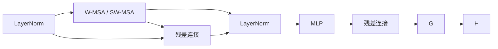

## Swin Transformer原理与代码实例讲解

### 1. 背景介绍

#### 1.1 Transformer 在计算机视觉领域的兴起

Transformer 模型最初在自然语言处理领域取得了巨大成功，例如 BERT、GPT 等模型在各种 NLP 任务中都实现了 SOTA 性能。近年来，研究人员开始探索 Transformer 在计算机视觉领域的应用，并取得了令人瞩目的成果。与传统的卷积神经网络 (CNN) 相比，Transformer 具有以下优势：

* **全局感受野：** Transformer 中的自注意力机制能够捕捉图像中任意两个像素之间的关系，而 CNN 通常只能捕捉局部信息。
* **可并行计算：** Transformer 中的计算可以高度并行化，从而加速训练和推理过程。
* **更强的表征能力：** Transformer 可以学习到更复杂、更抽象的图像特征表示。

#### 1.2 Swin Transformer 的提出

尽管 Transformer 在计算机视觉领域展现出了巨大潜力，但传统的 Transformer 模型在处理高分辨率图像时存在计算复杂度高、内存占用大等问题。为了解决这些问题，微软亚洲研究院的研究人员提出了 Swin Transformer 模型，该模型采用了一种**滑动窗口**机制，将自注意力计算限制在局部窗口内，从而显著降低了计算复杂度和内存占用。

Swin Transformer 在各种计算机视觉任务中都取得了 SOTA 性能，例如图像分类、目标检测、语义分割等。

### 2. 核心概念与联系

#### 2.1 Swin Transformer 的核心思想

Swin Transformer 的核心思想是将图像分割成多个**不重叠的窗口**，并在每个窗口内进行自注意力计算。为了实现窗口之间的信息交互，Swin Transformer 采用了一种**滑动窗口**机制，即在相邻层之间移动窗口的位置。

#### 2.2 Swin Transformer 的结构

Swin Transformer 的整体结构如下图所示：


* **Patch Partition:** 将输入图像分割成多个不重叠的图像块 (patch)。
* **Linear Embedding:** 将每个图像块映射到一个低维向量空间。
* **Swin Transformer Block:** Swin Transformer 的基本模块，包含多头自注意力机制 (Multi-Head Self-Attention, MSA)、多层感知机 (Multi-Layer Perceptron, MLP) 等组件。
* **Patch Merging:** 将相邻的图像块合并成更大的块，以降低分辨率。
* **Class Token:** 一个特殊的 token，用于聚合全局信息。
* **Linear Layer:** 将 Class Token 的特征向量映射到分类器的输入空间。
* **Classification Head:** 用于图像分类的分类器。

#### 2.3 Swin Transformer Block 的结构

Swin Transformer Block 是 Swin Transformer 的基本模块，其结构如下图所示：



* **LayerNorm:** 层归一化，用于稳定训练过程。
* **W-MSA / SW-MSA:** 窗口内的多头自注意力机制 (W-MSA) 或滑动窗口的多头自注意力机制 (SW-MSA)。
* **MLP:** 多层感知机，用于特征变换。
* **残差连接:** 用于缓解梯度消失问题。

### 3. 核心算法原理具体操作步骤

#### 3.1 滑动窗口机制

滑动窗口机制是 Swin Transformer 的关键创新之一，它通过在相邻层之间移动窗口的位置，实现了窗口之间的信息交互。具体来说，假设窗口大小为 $M \times M$，滑动步长为 $S$，则第 $l$ 层的窗口位置为：

$$
\begin{aligned}
W_l &= \{(i \cdot S, j \cdot S) | 0 \le i, j < \lfloor \frac{H}{M} \rfloor \}, \\
\end{aligned}
$$

其中 $H$ 为图像的高度。第 $l+1$ 层的窗口位置为：

$$
\begin{aligned}
W_{l+1} &= \{(i \cdot S + \frac{M}{2}, j \cdot S + \frac{M}{2}) | 0 \le i, j < \lfloor \frac{H}{M} \rfloor \}. \\
\end{aligned}
$$

#### 3.2 多头自注意力机制

多头自注意力机制 (Multi-Head Self-Attention, MSA) 是 Transformer 模型的核心组件之一，它可以捕捉输入序列中任意两个元素之间的关系。在 Swin Transformer 中，MSA 应用于每个窗口内的图像块。

MSA 的计算过程如下：

1. **计算 Query、Key 和 Value 矩阵：**
   $$
   \begin{aligned}
   Q &= X W^Q, \\
   K &= X W^K, \\
   V &= X W^V,
   \end{aligned}
   $$
   其中 $X$ 为输入序列，$W^Q$、$W^K$ 和 $W^V$ 为可学习的参数矩阵。

2. **计算注意力权重：**
   $$
   A = \text{softmax} \left( \frac{QK^T}{\sqrt{d_k}} \right),
   $$
   其中 $d_k$ 是 Key 向量的维度。

3. **加权求和：**
   $$
   \text{Attention}(Q, K, V) = AV.
   $$

#### 3.3 多层感知机

多层感知机 (Multi-Layer Perceptron, MLP) 是一个全连接神经网络，用于特征变换。在 Swin Transformer 中，MLP 应用于 MSA 的输出。

MLP 的结构如下：

```
MLP(x) = \text{GELU}(x W_1 + b_1) W_2 + b_2,
```

其中 $\text{GELU}$ 是 Gaussian Error Linear Unit 激活函数，$W_1$、$b_1$、$W_2$ 和 $b_2$ 是可学习的参数。

### 4. 数学模型和公式详细讲解举例说明

本节以 Swin Transformer Block 中的 W-MSA 为例，详细讲解其数学模型和计算过程。

#### 4.1 输入输出

W-MSA 的输入是一个三维张量 $X \in \mathbb{R}^{N \times M^2 \times C}$，其中 $N$ 是窗口数量，$M^2$ 是每个窗口内的图像块数量，$C$ 是特征维度。W-MSA 的输出是一个相同形状的三维张量 $Y \in \mathbb{R}^{N \times M^2 \times C}$。

#### 4.2 计算过程

1. **将输入张量 reshape 成二维矩阵：**
   $$
   X' = \text{reshape}(X, (N \cdot M^2, C)).
   $$

2. **计算 Query、Key 和 Value 矩阵：**
   $$
   \begin{aligned}
   Q &= X' W^Q, \\
   K &= X' W^K, \\
   V &= X' W^V,
   \end{aligned}
   $$
   其中 $W^Q$、$W^K$ 和 $W^V$ 是可学习的参数矩阵，其形状分别为 $(C, d_k)$、$(C, d_k)$ 和 $(C, d_v)$。

3. **将 Query、Key 和 Value 矩阵 reshape 成三维张量：**
   $$
   \begin{aligned}
   Q' &= \text{reshape}(Q, (N, M^2, d_k)), \\
   K' &= \text{reshape}(K, (N, M^2, d_k)), \\
   V' &= \text{reshape}(V, (N, M^2, d_v)).
   \end{aligned}
   $$

4. **计算注意力权重：**
   $$
   A = \text{softmax} \left( \frac{Q' K'^T}{\sqrt{d_k}} \right).
   $$

5. **加权求和：**
   $$
   Y' = AV'.
   $$

6. **将输出张量 reshape 成三维张量：**
   $$
   Y = \text{reshape}(Y', (N \times M^2, C)).
   $$

#### 4.3 参数量分析

W-MSA 的参数量主要来自于线性变换矩阵 $W^Q$、$W^K$ 和 $W^V$。假设 $C = d_k = d_v$，则 W-MSA 的参数量为 $3C^2$。

### 5. 项目实践：代码实例和详细解释说明

本节将使用 PyTorch 实现一个简单的 Swin Transformer 模型，并使用 CIFAR-10 数据集进行图像分类任务的训练和测试。

#### 5.1 安装依赖库

```python
!pip install torch torchvision einops timm
```

#### 5.2 定义 Swin Transformer 模型

```python
import torch
import torch.nn as nn
from einops import rearrange
from timm.models.layers import DropPath, to_2tuple, trunc_normal_

class Mlp(nn.Module):
    def __init__(self, in_features, hidden_features=None, out_features=None, act_layer=nn.GELU, drop=0.):
        super().__init__()
        out_features = out_