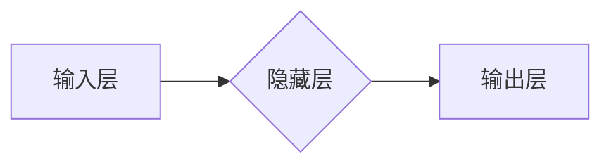

## TensorFlow实战：构建全连接网络

作者：禅与计算机程序设计艺术

## 1. 背景介绍

### 1.1 人工智能与深度学习的兴起

近年来，人工智能 (AI) 正在以前所未有的速度改变着我们的世界。从自动驾驶汽车到智能家居，AI 已经渗透到我们生活的方方面面。而深度学习作为 AI 的一个重要分支，更是凭借其强大的学习能力在图像识别、自然语言处理、语音识别等领域取得了突破性进展。

### 1.2 神经网络与全连接网络

深度学习的核心是神经网络，它是一种模拟人脑神经元结构和功能的计算模型。神经网络由多个层级的神经元组成，每个神经元接收来自上一层神经元的输入，经过加权求和和非线性变换后，将输出传递给下一层神经元。全连接网络是最基本的神经网络结构之一，其特点是相邻两层之间的神经元全部连接，信息在网络中层层传递，最终输出预测结果。

### 1.3 TensorFlow：强大的深度学习框架

TensorFlow 是由 Google 开发的开源深度学习框架，它提供了丰富的 API 和工具，方便开发者构建、训练和部署各种类型的神经网络模型。TensorFlow 的灵活性和可扩展性使其成为当前最流行的深度学习框架之一。

## 2. 核心概念与联系

### 2.1 张量 (Tensor)

在 TensorFlow 中，数据以张量的形式表示。张量可以理解为多维数组，例如标量可以看作 0 维张量，向量可以看作 1 维张量，矩阵可以看作 2 维张量，以此类推。

### 2.2 计算图 (Computational Graph)

TensorFlow 使用计算图来表示神经网络的计算过程。计算图是一个有向无环图，节点表示计算操作，边表示数据流动。在构建神经网络时，我们首先需要定义计算图，然后将数据输入计算图进行计算。

### 2.3 会话 (Session)

会话是 TensorFlow 执行计算图的环境。在创建会话后，我们可以将数据输入计算图，并执行计算图得到输出结果。

### 2.4 变量 (Variable)

变量是存储神经网络参数的可训练张量。在训练过程中，TensorFlow 会根据损失函数的梯度不断更新变量的值，以使模型的预测结果更加准确。

## 3. 核心算法原理具体操作步骤

### 3.1 前向传播 (Forward Propagation)

前向传播是指将输入数据从神经网络的第一层传递到最后一层，并计算出模型预测结果的过程。

1. 将输入数据 $x$ 输入到神经网络的第一层。
2. 计算每一层的加权和：$z^{(l)} = W^{(l)}a^{(l-1)} + b^{(l)}$，其中 $W^{(l)}$ 是第 $l$ 层的权重矩阵，$a^{(l-1)}$ 是第 $l-1$ 层的激活值，$b^{(l)}$ 是第 $l$ 层的偏置向量。
3. 对加权和进行非线性变换，得到激活值：$a^{(l)} = \sigma(z^{(l)})$，其中 $\sigma$ 是激活函数。
4. 重复步骤 2-3，直到计算出最后一层的输出 $y$。

### 3.2 反向传播 (Backpropagation)

反向传播是指根据模型预测结果与真实标签之间的误差，计算损失函数对每个参数的梯度，并更新参数的过程。

1. 计算损失函数：$L = \frac{1}{m}\sum_{i=1}^{m}l(y^{(i)}, \hat{y}^{(i)})$，其中 $m$ 是样本数量，$y^{(i)}$ 是第 $i$ 个样本的真实标签，$\hat{y}^{(i)}$ 是模型对第 $i$ 个样本的预测结果，$l$ 是损失函数。
2. 计算损失函数对输出层的梯度：$\frac{\partial L}{\partial z^{(L)}} = \frac{\partial L}{\partial a^{(L)}}\frac{\partial a^{(L)}}{\partial z^{(L)}}$。
3. 利用链式法则，计算损失函数对每一层的梯度：$\frac{\partial L}{\partial z^{(l)}} = \frac{\partial L}{\partial z^{(l+1)}}\frac{\partial z^{(l+1)}}{\partial a^{(l)}}\frac{\partial a^{(l)}}{\partial z^{(l)}}$。
4. 利用梯度下降法更新参数：$W^{(l)} = W^{(l)} - \alpha\frac{\partial L}{\partial W^{(l)}}$，$b^{(l)} = b^{(l)} - \alpha\frac{\partial L}{\partial b^{(l)}}$，其中 $\alpha$ 是学习率。

### 3.3 梯度下降 (Gradient Descent)

梯度下降是一种迭代优化算法，用于寻找函数的最小值。在深度学习中，我们使用梯度下降来最小化损失函数，从而找到最优的参数值。

梯度下降的迭代公式为：

$$
\theta = \theta - \alpha\nabla_{\theta}J(\theta)
$$

其中，$\theta$ 是模型参数，$\alpha$ 是学习率，$\nabla_{\theta}J(\theta)$ 是损失函数关于参数 $\theta$ 的梯度。

## 4. 数学模型和公式详细讲解举例说明

### 4.1 线性回归

线性回归是一种用于预测连续值的模型。其数学模型为：

$$
y = wx + b
$$

其中，$y$ 是预测值，$x$ 是输入特征，$w$ 是权重，$b$ 是偏置。

### 4.2 逻辑回归

逻辑回归是一种用于预测二分类问题的模型。其数学模型为：

$$
p = \frac{1}{1 + e^{-(wx + b)}}
$$

其中，$p$ 是预测为正类的概率，$x$ 是输入特征，$w$ 是权重，$b$ 是偏置。

### 4.3 Softmax 回归

Softmax 回归是一种用于预测多分类问题的模型。其数学模型为：

$$
p_i = \frac{e^{z_i}}{\sum_{j=1}^{K}e^{z_j}}
$$

其中，$p_i$ 是预测为第 $i$ 类的概率，$z_i$ 是第 $i$ 类的线性预测值，$K$ 是类别数量。

## 5. 项目实践：代码实例和详细解释说明

### 5.1 导入必要的库

```python
import tensorflow as tf
import numpy as np
```

### 5.2 准备数据

```python
# 生成随机数据
x_data = np.random.rand(100).astype(np.float32)
y_data = x_data * 0.1 + 0.3

# 将数据分为训练集和测试集
x_train = x_data[:80]
y_train = y_data[:80]
x_test = x_data[80:]
y_test = y_data[80:]
```

### 5.3 创建模型

```python
# 创建占位符
X = tf.placeholder(tf.float32)
Y = tf.placeholder(tf.float32)

# 创建权重和偏置
W = tf.Variable(tf.random_uniform([1], -1.0, 1.0))
b = tf.Variable(tf.zeros([1]))

# 定义模型
y = W * X + b
```

### 5.4 定义损失函数

```python
# 定义损失函数
loss = tf.reduce_mean(tf.square(y - Y))
```

### 5.5 选择优化器

```python
# 选择优化器
optimizer = tf.train.GradientDescentOptimizer(0.5)
train = optimizer.minimize(loss)
```

### 5.6 训练模型

```python
# 初始化变量
init = tf.global_variables_initializer()

# 创建会话
sess = tf.Session()
sess.run(init)

# 训练模型
for step in range(201):
    sess.run(train, feed_dict={X: x_train, Y: y_train})
    if step % 20 == 0:
        print(step, sess.run(loss, feed_dict={X: x_train, Y: y_train}))
```

### 5.7 评估模型

```python
# 评估模型
print("Testing... (Mean square loss Comparison)")
testing_cost = sess.run(
    tf.reduce_sum(tf.pow(y - Y, 2)) / (2 * x_test.shape[0]),
    feed_dict={X: x_test, Y: y_test},
)
print("Testing cost=", testing_cost)
print("Absolute mean square loss difference:", abs(
    training_cost - testing_cost))
```

## 6. 实际应用场景

全连接网络可以应用于各种领域，例如：

* 图像分类
* 自然语言处理
* 语音识别
* 推荐系统

## 7. 工具和资源推荐

* TensorFlow 官方网站：https://www.tensorflow.org/
* TensorFlow 中文文档：https://tensorflow.google.cn/
* Keras：https://keras.io/

## 8. 总结：未来发展趋势与挑战

### 8.1 未来发展趋势

* 模型压缩和加速
* 自动机器学习
* 强化学习

### 8.2 挑战

* 数据集偏差
* 模型可解释性
* 模型安全性和隐私保护

## 9. 附录：常见问题与解答

### 9.1 什么是激活函数？

激活函数是神经网络中的一种非线性函数，它可以将神经元的输出值映射到一个特定的范围内，例如 sigmoid 函数将输出值映射到 0 到 1 之间。激活函数的非线性特性使得神经网络能够学习复杂的非线性关系。

### 9.2 什么是学习率？

学习率是梯度下降算法中的一个超参数，它控制着每次迭代时参数更新的步长。学习率过大会导致模型难以收敛，学习率过小会导致模型收敛速度过慢。

### 9.3 如何选择合适的网络结构？

选择合适的网络结构需要考虑多个因素，例如数据集大小、任务复杂度、计算资源等。一般来说，对于复杂的任务，可以使用更深的网络结构；对于简单任务，可以使用更浅的网络结构。


## 10. Mermaid流程图


