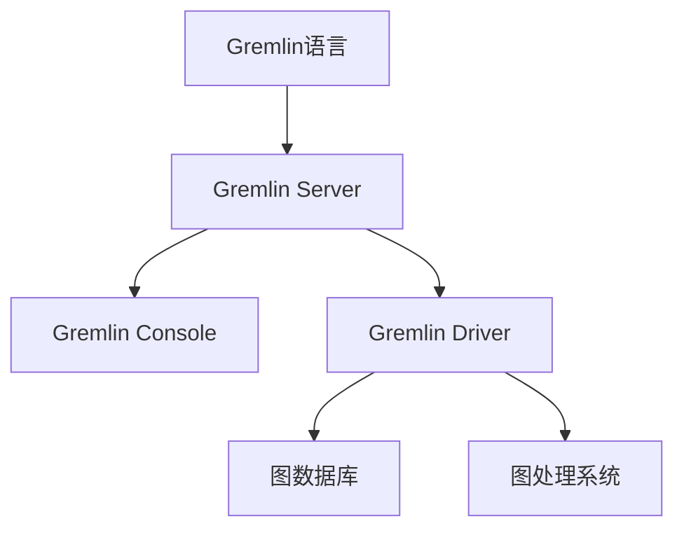

# TinkerPop原理与代码实例讲解

作者：禅与计算机程序设计艺术

## 1. 背景介绍

### 1.1 什么是TinkerPop

Apache TinkerPop是一个开源的图计算框架，旨在为图数据的处理提供一套通用的API和工具。它的核心是Gremlin，一个图遍历语言，能够在多种图数据库和图处理系统上运行。TinkerPop的目标是简化图数据的处理，使开发者能够更加专注于业务逻辑，而不是底层实现。

### 1.2 为什么选择TinkerPop

在大数据和复杂关系网络中，图数据结构因其直观性和强大的表达能力，越来越受到重视。TinkerPop通过提供统一的API和强大的遍历语言Gremlin，使得处理图数据变得更加简单和高效。其跨平台特性和广泛的社区支持，使得TinkerPop成为处理图数据的首选工具之一。

### 1.3 TinkerPop的历史与发展

TinkerPop最初由Marko A. Rodriguez和Stephen Mallette在2009年创建，目的是为图数据库和图处理系统提供一个通用的遍历语言和API。随着时间的推移，TinkerPop逐渐发展成为一个强大的图计算框架，并于2016年成为Apache基金会的顶级项目。

## 2. 核心概念与联系

### 2.1 图的基本概念

在计算机科学中，图是一种用于表示对象及其关系的数据结构。图由节点（Node）和边（Edge）组成，节点表示对象，边表示对象之间的关系。图可以是有向的或无向的，根据边的方向性来区分。

### 2.2 TinkerPop中的图

TinkerPop中的图由顶点（Vertex）和边（Edge）组成，顶点和边都可以包含属性（Property）。顶点用于表示实体，边用于表示实体之间的关系。每个顶点和边都有唯一的ID，用于标识和引用。

### 2.3 Gremlin遍历语言

Gremlin是TinkerPop的核心遍历语言，支持声明式和命令式的图遍历操作。Gremlin遍历可以在多个图数据库和图处理系统上运行，具有很强的灵活性和扩展性。Gremlin的语法类似于函数式编程语言，通过链式调用来实现复杂的图遍历操作。

### 2.4 TinkerPop架构

TinkerPop架构由以下几个核心组件组成：

- **Gremlin语言**：用于图遍历和操作的声明式语言。
- **Gremlin Server**：用于处理Gremlin请求的服务器。
- **Gremlin Console**：交互式的Gremlin命令行工具。
- **Gremlin Driver**：用于与Gremlin Server通信的客户端库。



## 3. 核心算法原理具体操作步骤

### 3.1 图遍历的基本操作

图遍历是图计算的核心操作，Gremlin提供了丰富的遍历操作符来支持各种复杂的图遍历需求。基本的图遍历操作包括：

- **V()**：获取所有顶点。
- **E()**：获取所有边。
- **has()**：根据属性过滤顶点或边。
- **out()**：获取出边的目标顶点。
- **in()**：获取入边的源顶点。

### 3.2 图遍历的高级操作

除了基本的遍历操作，Gremlin还提供了一些高级操作，用于处理复杂的图遍历需求：

- **repeat()**：重复执行遍历操作。
- **until()**：设置遍历的终止条件。
- **path()**：获取遍历路径。
- **select()**：选择特定的遍历结果。
- **group()**：对遍历结果进行分组。

### 3.3 图算法的实现

TinkerPop支持多种常见的图算法，如最短路径、连通分量、PageRank等。通过Gremlin，可以方便地实现这些图算法。以下是一些常见图算法的Gremlin实现示例：

#### 3.3.1 最短路径算法

最短路径算法用于查找图中两个顶点之间的最短路径。Gremlin提供了内置的最短路径算法，可以直接使用。

```gremlin
g.V(startVertexId).repeat(out().simplePath()).until(hasId(endVertexId)).path()
```

#### 3.3.2 连通分量算法

连通分量算法用于查找图中的连通子图。Gremlin可以通过递归遍历来实现连通分量算法。

```gremlin
g.V().hasLabel('component').repeat(out().simplePath()).emit().path()
```

#### 3.3.3 PageRank算法

PageRank算法用于评估图中顶点的重要性。Gremlin提供了PageRank的实现，可以直接使用。

```gremlin
g.V().pageRank().by('rank').iterate()
```

## 4. 数学模型和公式详细讲解举例说明

### 4.1 图的数学表示

在数学上，图通常表示为 $G = (V, E)$，其中 $V$ 是顶点的集合，$E$ 是边的集合。每条边可以表示为一个顶点对 $(u, v)$，其中 $u, v \in V$。

### 4.2 最短路径算法的数学模型

最短路径算法的目标是找到从起点到终点的路径，使得路径上的边权重之和最小。常见的最短路径算法包括Dijkstra算法和Bellman-Ford算法。

Dijkstra算法的时间复杂度为 $O((|V| + |E|) \log |V|)$，其中 $|V|$ 是顶点数，$|E|$ 是边数。

### 4.3 PageRank算法的数学模型

PageRank算法通过迭代计算每个顶点的PageRank值来评估其重要性。PageRank值的计算公式为：

$$
PR(v) = \frac{1 - d}{N} + d \sum_{u \in M(v)} \frac{PR(u)}{L(u)}
$$

其中，$PR(v)$ 是顶点 $v$ 的PageRank值，$d$ 是阻尼因子（通常取0.85），$N$ 是顶点总数，$M(v)$ 是指向顶点 $v$ 的顶点集合，$L(u)$ 是顶点 $u$ 的出边数。

### 4.4 数学公式示例

#### 4.4.1 最短路径算法公式

最短路径算法的目标是找到路径 $P = (v_1, v_2, ..., v_k)$，使得路径上的边权重之和最小。公式表示为：

$$
\text{minimize} \sum_{i=1}^{k-1} w(v_i, v_{i+1})
$$

其中，$w(v_i, v_{i+1})$ 是边 $(v_i, v_{i+1})$ 的权重。

#### 4.4.2 PageRank算法公式

PageRank值的迭代计算公式为：

$$
PR(v) = \frac{1 - d}{N} + d \sum_{u \in M(v)} \frac{PR(u)}{L(u)}
$$

通过多次迭代计算，最终收敛到稳定的PageRank值。

## 5. 项目实践：代码实例和详细解释说明

### 5.1 环境准备

在开始项目实践之前，需要准备好开发环境。以下是一些必要的工具和依赖：

- Java 8或更高版本
- Apache TinkerPop 3.x
- 图数据库（如JanusGraph、Neo4j等）
- Gremlin Console

### 5.2 创建图数据库

首先，我们需要创建一个图数据库，并添加一些顶点和边。以下是使用JanusGraph的示例代码：

```java
import org.janusgraph.core.JanusGraph;
import org.janusgraph.core.JanusGraphFactory;
import org.janusgraph.core.JanusGraphTransaction;
import org.janusgraph.core.schema.JanusGraphManagement;
import org.apache.tinkerpop.gremlin.structure.Vertex;

public class GraphExample {
    public static void main(String[] args) {
        JanusGraph graph = JanusGraphFactory.open("inmemory");
        JanusGraphManagement management = graph.openManagement();
        management.makeVertexLabel("person").make();
        management.commit();

        JanusGraphTransaction tx = graph.newTransaction();
        Vertex alice = tx.addVertex("person");
        alice.property("name", "Alice");
        Vertex bob = tx.addVertex("person");
        bob.property("name", "Bob");
        alice.addEdge("knows", bob);
        tx.commit();

        graph.close();
    }
}
```

### 5.3 使用