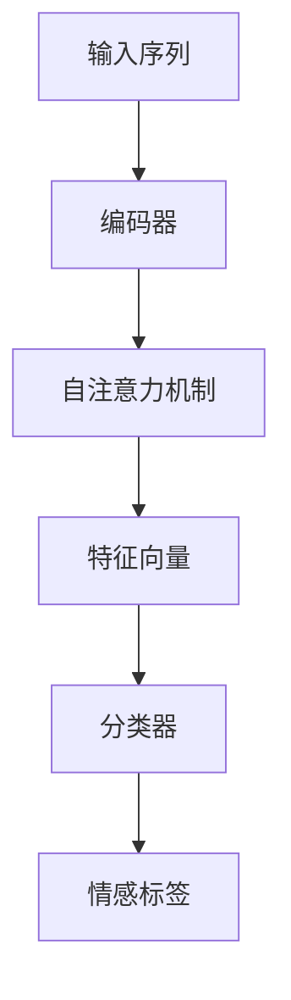
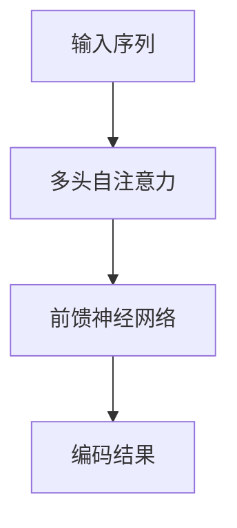

# Transformer在情感分析中的应用

作者：禅与计算机程序设计艺术

## 1.背景介绍

### 1.1 现代自然语言处理的挑战

自然语言处理（NLP）领域的一个主要挑战在于如何理解和处理人类语言的复杂性。情感分析作为NLP的一个重要分支，旨在通过分析文本内容来识别和分类情感状态。传统的情感分析方法，如词袋模型（Bag of Words）和TF-IDF，虽然在某些应用中取得了一定的成功，但它们在处理上下文关系和长距离依赖方面存在显著不足。

### 1.2 深度学习的崛起

随着深度学习技术的发展，特别是卷积神经网络（CNN）和循环神经网络（RNN）的引入，情感分析的效果有了显著提升。然而，RNN在处理长文本时存在梯度消失和梯度爆炸的问题，限制了其在实际应用中的效果。为了克服这些问题，Transformer模型应运而生。

### 1.3 Transformer的引入

Transformer模型由Vaswani等人在2017年提出，最初用于机器翻译任务。与RNN不同，Transformer完全依赖于注意力机制（Attention Mechanism），能够更好地捕捉文本中的长距离依赖关系。由于其在多个NLP任务中的优异表现，Transformer迅速成为了研究和应用的热点。

## 2.核心概念与联系

### 2.1 Transformer模型概述

Transformer模型的核心在于其独特的架构设计，主要由编码器（Encoder）和解码器（Decoder）组成。编码器负责将输入序列编码为一组特征向量，解码器则根据这些特征向量生成输出序列。在情感分析任务中，我们通常只使用编码器部分。

### 2.2 注意力机制

注意力机制是Transformer模型的关键组件，它允许模型在处理每个单词时关注输入序列中的不同部分。通过计算查询（Query）、键（Key）和值（Value）之间的相似度，注意力机制能够动态调整每个单词的重要性。

### 2.3 自注意力（Self-Attention）

自注意力机制是Transformer模型中最重要的部分，它允许每个单词在编码过程中与输入序列中的其他单词进行交互。这种机制不仅能够捕捉长距离依赖关系，还能并行处理输入序列中的所有单词，大大提高了训练效率。

### 2.4 多头注意力（Multi-Head Attention）

多头注意力机制通过并行计算多个注意力机制，能够捕捉输入序列中的不同特征。每个头（Head）独立计算注意力权重，然后将结果拼接起来进行进一步处理。这种设计增强了模型的表达能力。

## 3.核心算法原理具体操作步骤

### 3.1 数据预处理

在进行情感分析之前，我们需要对原始文本数据进行预处理。这包括去除停用词、分词、词嵌入等步骤。常用的词嵌入方法包括Word2Vec、GloVe和BERT等。

### 3.2 构建Transformer模型

#### 3.2.1 编码器层

编码器层由多个相同的子层堆叠而成，每个子层包括一个多头自注意力机制和一个前馈神经网络（Feed-Forward Neural Network）。

#### 3.2.2 自注意力计算

自注意力机制通过以下公式计算：

$$
\text{Attention}(Q, K, V) = \text{softmax}\left(\frac{QK^T}{\sqrt{d_k}}\right)V
$$

其中，$Q$、$K$、$V$分别表示查询、键和值，$d_k$是键的维度。

#### 3.2.3 多头注意力计算

多头注意力机制通过以下公式计算：

$$
\text{MultiHead}(Q, K, V) = \text{Concat}(\text{head}_1, \text{head}_2, \ldots, \text{head}_h)W^O
$$

每个头的计算方式为：

$$
\text{head}_i = \text{Attention}(QW_i^Q, KW_i^K, VW_i^V)
$$

### 3.3 模型训练

#### 3.3.1 损失函数

在情感分析任务中，我们通常使用交叉熵损失函数（Cross-Entropy Loss）来衡量模型的预测结果与真实标签之间的差异。

$$
\mathcal{L} = -\sum_{i=1}^{N} y_i \log(\hat{y}_i)
$$

其中，$y_i$是实际标签，$\hat{y}_i$是模型预测的概率。

#### 3.3.2 优化器

常用的优化器包括Adam和SGD等。Adam优化器结合了动量和自适应学习率调整的优点，能够加速模型的收敛。

### 3.4 模型评估

#### 3.4.1 评价指标

常用的情感分析评价指标包括准确率（Accuracy）、精确率（Precision）、召回率（Recall）和F1-score等。

$$
\text{Accuracy} = \frac{TP + TN}{TP + TN + FP + FN}
$$

$$
\text{Precision} = \frac{TP}{TP + FP}
$$

$$
\text{Recall} = \frac{TP}{TP + FN}
$$

$$
\text{F1-score} = \frac{2 \times \text{Precision} \times \text{Recall}}{\text{Precision} + \text{Recall}}
$$

## 4.数学模型和公式详细讲解举例说明

### 4.1 自注意力机制的数学原理

自注意力机制通过计算查询、键和值之间的相似度来决定每个单词的重要性。具体计算步骤如下：

#### 4.1.1 计算查询、键和值

给定输入序列 $X$，我们首先通过线性变换得到查询矩阵 $Q$、键矩阵 $K$ 和值矩阵 $V$：

$$
Q = XW^Q, \quad K = XW^K, \quad V = XW^V
$$

其中，$W^Q, W^K, W^V$ 是可学习的权重矩阵。

#### 4.1.2 计算注意力权重

接下来，我们计算查询和键之间的点积相似度，并通过 softmax 函数归一化得到注意力权重：

$$
\text{Attention}(Q, K, V) = \text{softmax}\left(\frac{QK^T}{\sqrt{d_k}}\right)V
$$

其中，$d_k$ 是键的维度。

#### 4.1.3 应用注意力权重

最后，我们将注意力权重应用到值矩阵上，得到输出矩阵：

$$
\text{Output} = \text{Attention}(Q, K, V)
$$

### 4.2 多头注意力机制的数学原理

多头注意力机制通过并行计算多个自注意力机制，增强了模型的表达能力。具体计算步骤如下：

#### 4.2.1 计算多个头的自注意力

给定输入序列 $X$，我们首先通过线性变换得到多个查询、键和值矩阵：

$$
Q_i = XW_i^Q, \quad K_i = XW_i^K, \quad V_i = XW_i^V
$$

其中，$i$ 表示第 $i$ 个头。

#### 4.2.2 计算多个头的注意力输出

接下来，我们计算每个头的自注意力输出：

$$
\text{head}_i = \text{Attention}(Q_i, K_i, V_i)
$$

#### 4.2.3 拼接多个头的输出

最后，我们将多个头的输出拼接起来，并通过线性变换得到最终输出：

$$
\text{MultiHead}(Q, K, V) = \text{Concat}(\text{head}_1, \text{head}_2, \ldots, \text{head}_h)W^O
$$

其中，$W^O$ 是可学习的权重矩阵。

## 5.项目实践：代码实例和详细解释说明

### 5.1 数据集准备

我们以IMDb电影评论数据集为例，该数据集包含大量标