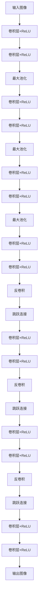

# U-Net：医学图像分割利器

作者：禅与计算机程序设计艺术

## 1.背景介绍

### 1.1 医学图像分割的意义

医学图像分割是指将医学图像划分为若干个具有特定解剖学或病理学意义的区域，例如分割出肿瘤、器官或组织。精确的分割对于诊断、治疗规划和术后评估至关重要。传统的手工分割方法耗时且依赖于专家经验，自动化分割技术的出现大大提高了效率和准确性。

### 1.2 深度学习在医学图像分割中的应用

近年来，深度学习，特别是卷积神经网络（CNN），在图像处理领域取得了显著进展。深度学习方法能够自动从数据中学习特征，减少了对手工特征工程的依赖。U-Net作为一种专门用于图像分割的深度学习网络，因其在医学图像分割中的卓越表现而备受关注。

### 1.3 U-Net的诞生

U-Net由Olaf Ronneberger等人在2015年提出，最初用于生物医学图像的分割。其独特的U型架构结合了卷积和反卷积操作，能够有效地捕捉图像的多尺度信息。U-Net不仅在医学图像分割中表现出色，还被广泛应用于其他领域的图像分割任务。

## 2.核心概念与联系

### 2.1 U-Net的架构

U-Net的架构由编码器（下采样路径）和解码器（上采样路径）组成，中间通过跳跃连接（skip connection）将编码器和解码器连接起来。编码器提取图像的特征，解码器将特征映射回原始图像的分辨率。



### 2.2 编码器与解码器

#### 2.2.1 编码器

编码器由多个卷积层和最大池化层组成，每次池化操作都会减少图像的分辨率，同时增加特征图的深度。这种设计使得网络能够提取到更加抽象和高层次的特征。

#### 2.2.2 解码器

解码器通过一系列的反卷积层将特征图恢复到原始图像的分辨率。反卷积层的作用是将低分辨率的特征图逐步放大，同时恢复空间信息。

### 2.3 跳跃连接

跳跃连接将编码器中的特征图直接传递给解码器的对应层，帮助恢复高分辨率的空间信息。这种设计不仅提高了分割的精度，还加快了网络的收敛速度。

## 3.核心算法原理具体操作步骤

### 3.1 数据预处理

在训练U-Net之前，需要对医学图像进行预处理，包括图像的归一化、数据增强和标签的处理。归一化可以提高训练的稳定性，数据增强可以增加数据的多样性，减少过拟合。

### 3.2 网络初始化

U-Net的权重通常使用He初始化方法，这种方法对于ReLU激活函数的网络效果较好。初始化的目的是为了打破对称性，并使得每一层的输入输出保持在合理的范围内。

### 3.3 前向传播

在前向传播过程中，输入图像依次通过编码器、跳跃连接和解码器，最终输出分割结果。编码器提取特征，解码器恢复空间信息，跳跃连接帮助融合多尺度特征。

### 3.4 损失函数

常用的损失函数包括交叉熵损失和Dice损失。交叉熵损失适用于像素级的分类任务，而Dice损失对不平衡数据更为鲁棒。损失函数的选择对模型的性能有重要影响。

### 3.5 反向传播与参数更新

通过反向传播算法计算梯度，并使用优化算法（如Adam）更新网络参数。反向传播的关键在于链式法则，通过逐层计算梯度，最终更新网络的权重。

## 4.数学模型和公式详细讲解举例说明

### 4.1 卷积操作

卷积操作是U-Net的核心，定义为输入图像 $I$ 和卷积核 $K$ 的点积：

$$
(I * K)(i,j) = \sum_m \sum_n I(i+m, j+n) \cdot K(m,n)
$$

其中，$(i,j)$ 是输出特征图的位置，$m$ 和 $n$ 是卷积核的大小。

### 4.2 最大池化

最大池化操作用于下采样，定义为在池化窗口内取最大值：

$$
P(i,j) = \max_{(m,n) \in W} I(i+m, j+n)
$$

其中，$W$ 是池化窗口的大小。

### 4.3 反卷积

反卷积用于上采样，恢复图像的分辨率。其定义与卷积相似，但卷积核的作用方向相反：

$$
(I * K^{-1})(i,j) = \sum_m \sum_n I(i-m, j-n) \cdot K(m,n)
$$

### 4.4 损失函数

#### 4.4.1 交叉熵损失

交叉熵损失用于衡量预测值与真实值之间的差异，定义为：

$$
L_{CE} = -\sum_{i=1}^N [y_i \log(p_i) + (1 - y_i) \log(1 - p_i)]
$$

其中，$y_i$ 是真实标签，$p_i$ 是预测概率，$N$ 是样本数。

#### 4.4.2 Dice损失

Dice损失用于衡量预测结果与真实标签的重叠程度，定义为：

$$
L_{Dice} = 1 - \frac{2 \sum_i y_i p_i}{\sum_i y_i + \sum_i p_i}
$$

其中，$y_i$ 是真实标签，$p_i$ 是预测概率。

## 5.项目实践：代码实例和详细解释说明

### 5.1 数据集准备

首先，选择一个合适的医学图像分割数据集，例如ISBI Challenge数据集。将数据集划分为训练集、验证集和测试集。

```python
import os
import numpy as np
import cv2
from sklearn.model_selection import train_test_split

# 加载数据
def load_data(data_path):
    images = []
    masks = []
    for file_name in os.listdir(data_path):
        if file_name.endswith('.png'):
            image = cv2.imread(os.path.join(data_path, file_name), cv2.IMREAD_GRAYSCALE)
            mask = cv2.imread(os.path.join(data_path, file_name.replace('image', 'mask')), cv2.IMREAD_GRAYSCALE)
            images.append(image)
            masks.append(mask)
    return np.array(images), np.array(masks)

data_path = 'path/to/dataset'
images, masks = load_data(data_path)

# 数据集划分
train_images, val_images, train_masks, val_masks = train_test_split(images, masks, test_size=0.2, random_state=42)
```

### 5.2 模型构建

使用Keras框架构建U-Net模型。

```python
from tensorflow.keras.models import Model
from tensorflow.keras.layers import Input, Conv2D, MaxPooling2D, UpSampling2D, concatenate

def unet_model(input_size=(256, 256, 1)):
    inputs = Input(input_size)
    
    # 编码器
    conv1 = Conv2D(64, 3, activation='relu', padding='same')(inputs)
   