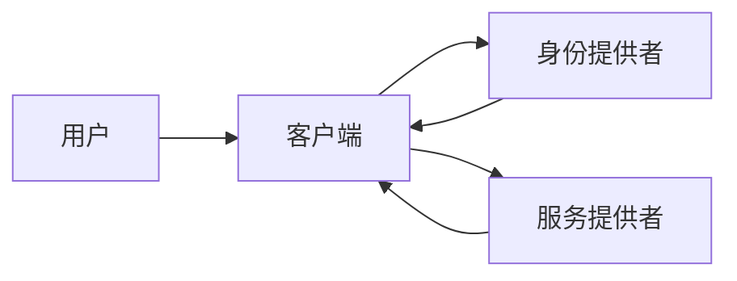

## 1. 背景介绍

### 1.1. Web 服务的兴起与挑战

近年来，随着互联网技术的快速发展，Web 服务已经成为了一种重要的软件开发和部署模式。Web 服务的出现，使得不同平台、不同语言开发的应用程序之间可以进行相互通信和数据交换，极大地促进了软件复用和系统集成。

然而，随着 Web 服务应用的普及，安全问题也日益突出。传统的 Web 应用通常采用基于 Cookie 或 Session 的身份认证机制，但在分布式环境下，这种机制存在着许多缺陷，例如：

* **单点故障:**  如果认证服务器出现故障，整个系统将无法正常工作。
* **安全性问题:**  Cookie 和 Session 信息容易被窃取或篡改，导致用户身份被盗用。
* **可扩展性差:**  随着用户规模的扩大，传统的认证机制难以满足性能要求。

### 1.2. 统一身份认证的需求

为了解决上述问题，统一身份认证应运而生。统一身份认证旨在为用户提供一种安全、便捷、可靠的身份认证服务，其主要目标包括：

* **单点登录 (SSO):**  用户只需登录一次，即可访问所有授权的 Web 服务，无需重复输入用户名和密码。
* **安全性提升:**  采用更加安全的身份认证机制，例如基于令牌的认证，有效防止身份盗用和信息泄露。
* **可扩展性:**  支持分布式部署，可以轻松应对大规模用户访问。

## 2. 核心概念与联系

### 2.1. 身份认证协议

身份认证协议是实现统一身份认证的核心机制，它定义了用户、客户端和认证服务器之间进行身份认证的流程和数据格式。常见的身份认证协议包括：

* **SAML (Security Assertion Markup Language):**  基于 XML 的安全断言标记语言，主要用于企业级 Web 应用的单点登录。
* **OAuth 2.0 (Open Authorization):**  开放授权协议，主要用于第三方应用获取用户授权访问受保护资源。
* **OpenID Connect:**  建立在 OAuth 2.0 基础之上的身份认证协议，提供更加完善的用户身份信息和认证流程。

### 2.2. 身份提供者 (IdP)

身份提供者 (IdP) 负责管理和验证用户的身份信息，并向客户端颁发身份令牌。身份提供者通常是一个独立的服务器或服务，它维护着用户的身份信息数据库，并提供身份认证接口。

### 2.3. 服务提供者 (SP)

服务提供者 (SP) 是指提供 Web 服务的应用程序，它依赖于身份提供者进行用户身份认证。服务提供者接收到客户端的请求后，会将用户重定向到身份提供者进行身份认证，认证通过后，身份提供者会将身份令牌返回给服务提供者，服务提供者验证令牌后，允许用户访问受保护资源。

### 2.4. 身份令牌 (Token)

身份令牌是身份提供者颁发给客户端的凭证，用于证明用户身份。身份令牌通常包含用户的身份信息、访问权限、有效期等信息。常见的身份令牌格式包括：

* **JWT (JSON Web Token):**  基于 JSON 格式的安全令牌，易于使用和解析。
* **SAML 断言:**  基于 XML 格式的安全断言，包含更加详细的用户身份信息。

### 2.5. 核心概念关系图



## 3. 核心算法原理具体操作步骤

### 3.1. 基于 OAuth 2.0 的身份认证流程

以 OAuth 2.0 授权码模式为例，其身份认证流程如下：

1. **用户访问服务提供者:**  用户尝试访问服务提供者提供的受保护资源。
2. **服务提供者重定向到身份提供者:**  服务提供者检测到用户未经身份认证，将用户重定向到身份提供者的授权页面，并携带客户端 ID、回调地址等参数。
3. **用户输入用户名和密码:**  用户在身份提供者的授权页面输入用户名和密码进行身份认证。
4. **身份提供者颁发授权码:**  身份认证通过后，身份提供者向客户端颁发授权码，并重定向到服务提供者指定的回调地址。
5. **客户端使用授权码获取访问令牌:**  客户端接收到授权码后，使用授权码、客户端密钥等信息向身份提供者请求访问令牌。
6. **身份提供者颁发访问令牌:**  身份提供者验证授权码后，向客户端颁发访问令牌。
7. **客户端使用访问令牌访问资源:**  客户端使用访问令牌访问服务提供者提供的受保护资源。

### 3.2. JWT 令牌的生成与验证

JWT 令牌由三部分组成：头部 (Header)、负载 (Payload) 和签名 (Signature)。

**1. 头部:**  头部通常包含令牌类型和签名算法等信息，例如：

```json
{
  "alg": "HS256",
  "typ": "JWT"
}
```

**2. 负载:**  负载包含用户的身份信息、访问权限、有效期等信息，例如：

```json
{
  "sub": "1234567890",
  "name": "John Doe",
  "iat": 1516239022
}
```

**3. 签名:**  签名用于保证令牌的完整性，防止令牌被篡改。签名使用头部和负载的 Base64Url 编码字符串，以及密钥进行签名，例如：

```
HMACSHA256(
  base64UrlEncode(header) + "." +
  base64UrlEncode(payload),
  secret
)
```

### 3.3. 核心算法流程图

```mermaid
graph LR
    客户端 --> 身份提供者: 请求授权码
    身份提供者 --> 客户端: 颁发授权码
    客户端 --> 身份提供者: 使用授权码获取访问令牌
    身份提供者 --> 客户端: 颁发访问令牌
    客户端 --> 服务提供者: 使用访问令牌访问资源
```

## 4. 数学模型和公式详细讲解举例说明

### 4.1. RSA 算法

RSA 算法是一种非对称加密算法，它使用一对密钥：公钥和私钥。公钥可以公开，私钥必须保密。使用公钥加密的数据只能使用私钥解密，使用私钥加密的数据只能使用公钥解密。

**密钥生成:**

1. 选择两个大素数 $p$ 和 $q$。
2. 计算 $n = p * q$。
3. 计算欧拉函数 $\phi(n) = (p-1) * (q-1)$。
4. 选择一个整数 $e$，满足 $1 < e < \phi(n)$，且 $e$ 与 $\phi(n)$ 互素。
5. 计算 $d$，满足 $d * e \equiv 1 \pmod{\phi(n)}$。
6. 公钥为 $(n, e)$，私钥为 $(n, d)$。

**加密:**

1. 将明文 $M$ 转换为一个整数 $m$，满足 $0 \le m < n$。
2. 计算密文 $c = m^e \pmod{n}$。

**解密:**

1. 计算明文 $m = c^d \pmod{n}$。
2. 将整数 $m$ 转换为明文 $M$。

**举例说明:**

假设选择 $p = 61$，$q = 53$，则 $n = 3233$，$\phi(n) = 3120$。选择 $e = 17$，则 $d = 2753$。

加密明文 $M = "hello"$：

1. 将 "hello" 转换为 ASCII 码：104 101 108 108 111。
2. 将每个 ASCII 码转换为一个整数：104, 101, 108, 108, 111。
3. 加密每个整数：
    * $104^{17} \pmod{3233} = 1993$
    * $101^{17} \pmod{3233} = 1471$
    * $108^{17} \pmod{3233} = 2158$
    * $108^{17} \pmod{3233} = 2158$
    * $111^{17} \pmod{3233} = 2806$
4. 密文为：1993 1471 2158 2158 2806。

解密密文 1993 1471 2158 2158 2806：

1. 解密每个整数：
    * $1993^{2753} \pmod{3233} = 104$
    * $1471^{2753} \pmod{3233} = 101$
    * $2158^{2753} \pmod{3233} = 108$
    * $2158^{2753} \pmod{3233} = 108$
    * $2806^{2753} \pmod{3233} = 111$
2. 将每个整数转换为 ASCII 码：104 101 108 108 111。
3. 将 ASCII 码转换为字符串："hello"。

### 4.2.  HMAC 算法

HMAC 算法是一种使用加密哈希函数进行消息认证的算法。它可以与任何迭代加密哈希函数（例如 MD5、SHA-1、SHA-256 等）组合使用，并使用密钥来进行计算。

**算法流程:**

1. 使用密钥 $K$ 和哈希函数 $H$ 计算第一个哈希值：$h1 = H((K \oplus opad) || message)$，其中 $opad$ 是一个填充字符串。
2. 使用密钥 $K$ 和哈希函数 $H$ 计算第二个哈希值：$h2 = H((K \oplus ipad) || h1)$，其中 $ipad$ 是另一个填充字符串。
3. 返回 $h2$ 作为 HMAC 值。

**举例说明:**

假设密钥 $K = "secret"$，消息 $message = "hello"$，哈希函数 $H = SHA256$，填充字符串 $opad = 0x5c5c5c...$，$ipad = 0x363636...$。

1. 计算 $h1 = SHA256(("secret" \oplus 0x5c5c5c...) || "hello") = 0x4994d13...$。
2. 计算 $h2 = SHA256(("secret" \oplus 0x363636...) || 0x4994d13...) = 0x8728c49...$。
3. HMAC 值为：0x8728c49...。

## 5. 项目实践：代码实例和详细解释说明

### 5.1. 基于 Spring Security OAuth2 实现统一身份认证

**1. 添加依赖:**

```xml
<dependency>
  <groupId>org.springframework.boot</groupId>
  <artifactId>spring-boot-starter-security</artifactId>
</dependency>
<dependency>
  <groupId>org.springframework.security</groupId>
  <artifactId>spring-security-oauth2-client</artifactId>
</dependency>
<dependency>
  <groupId>org.springframework.security</groupId>
  <artifactId>spring-security-oauth2-jose</artifactId>
</dependency>
```

**2. 配置身份提供者:**

```java
@Configuration
@EnableWebSecurity
public class SecurityConfig extends WebSecurityConfigurerAdapter {

  @Override
  protected void configure(HttpSecurity http) throws Exception {
    http
      .authorizeRequests()
        .anyRequest().authenticated()
        .and()
      .oauth2Login()
        .userInfoEndpoint()
          .userService(oauth2UserService());
  }

  @Bean
  public OAuth2UserService<OAuth2UserRequest, OAuth2User> oauth2UserService() {
    DefaultOAuth2UserService delegate = new DefaultOAuth2UserService();
    return request -> {
      OAuth2User user = delegate.loadUser(request);
      // 处理用户信息
      return user;
    };
  }
}
```

**3. 配置服务提供者:**

```java
@Configuration
public class ResourceServerConfig extends ResourceServerConfigurerAdapter {

  @Override
  public void configure(ResourceServerSecurityConfigurer resources) throws Exception {
    resources.resourceId("api");
  }

  @Override
  public void configure(HttpSecurity http) throws Exception {
    http
      .authorizeRequests()
        .antMatchers("/api/**").authenticated();
  }
}
```

**4. 访问受保护资源:**

```java
@GetMapping("/api/hello")
public String hello() {
  return "Hello, World!";
}
```

### 5.2.  JWT 令牌的生成与验证

**1. 生成 JWT 令牌:**

```java
public String generateToken(String subject, Map<String, Object> claims) {
  // 设置令牌头部
  JwtHeader header = Jwts.header();
  header.setAlgorithm("HS256");
  header.setType("JWT");

  // 设置令牌负载
  JwtPayload payload = Jwts.claims();
  payload.setSubject(subject);
  payload.putAll(claims);

  // 生成签名
  String token = Jwts.builder()
    .setHeader(header)
    .setPayload(payload)
    .signWith(SignatureAlgorithm.HS256, "secret")
    .compact();

  return token;
}
```

**2. 验证 JWT 令牌:**

```java
public boolean validateToken(String token) {
  try {
    Jwts.parser()
      .setSigningKey("secret")
      .parseClaimsJws(token);
    return true;
  } catch (Exception e) {
    return false;
  }
}
```

## 6. 实际应用场景

### 6.1. 单点登录

统一身份认证可以实现单点登录，用户只需登录一次，即可访问所有授权的 Web 服务，无需重复输入用户名和密码。例如，在一个企业内部，可以使用统一身份认证系统来管理员工对各种应用程序的访问权限，员工只需登录一次公司 intranet，即可访问所有授权的应用程序。

### 6.2.  API 授权

统一身份认证可以用于 API 授权，第三方应用可以通过统一身份认证系统获取用户的授权，访问用户的受保护资源。例如，一个社交网站可以使用统一身份认证系统来允许第三方应用访问用户的个人信息、好友列表等数据。

### 6.3.  移动应用认证

统一身份认证可以用于移动应用认证，移动应用可以通过统一身份认证系统来验证用户的身份，并获取用户的授权。例如，一个银行的手机银行应用可以使用统一身份认证系统来验证用户的身份，并允许用户进行转账、查询余额等操作。

## 7. 总结：未来发展趋势与挑战

### 7.1.  无密码认证

随着生物识别技术的发展，无密码认证成为了未来身份认证的发展趋势。无密码认证可以使用指纹、人脸、虹膜等生物特征来验证用户的身份，更加安全便捷。

### 7.2.  人工智能与身份认证

人工智能技术可以用于身份认证，例如，可以使用机器学习算法来检测异常登录行为，识别虚假身份信息等。

### 7.3.  隐私保护

随着用户隐私意识的提高，身份认证系统需要更加注重用户隐私的保护。例如，可以使用差分隐私等技术来保护用户的身份信息不被泄露。

## 8. 附录：常见问题与解答

### 8.1.  什么是单点登录？

单点登录 (SSO) 是一种身份认证机制，用户只需登录一次，即可访问所有授权的 Web 服务，无需重复输入用户名和密码。

### 8.2.  什么是 OAuth 2.0？

OAuth 2.0 (Open Authorization) 是一种开放授权协议，主要用于第三方应用获取用户授权访问受保护资源。

### 8.3.  什么是 JWT？

JWT (JSON Web Token) 是一种基于 JSON 格式的安全令牌，易于使用和解析。