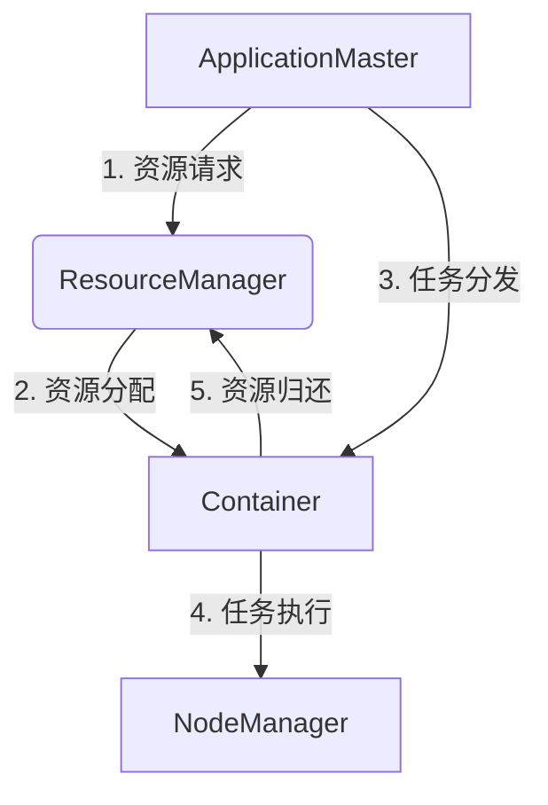
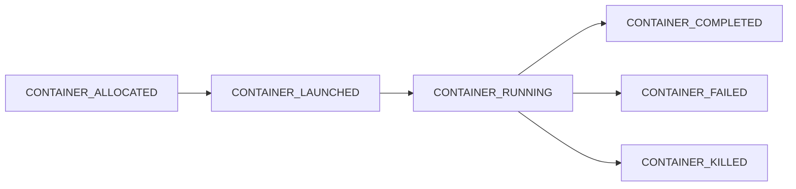
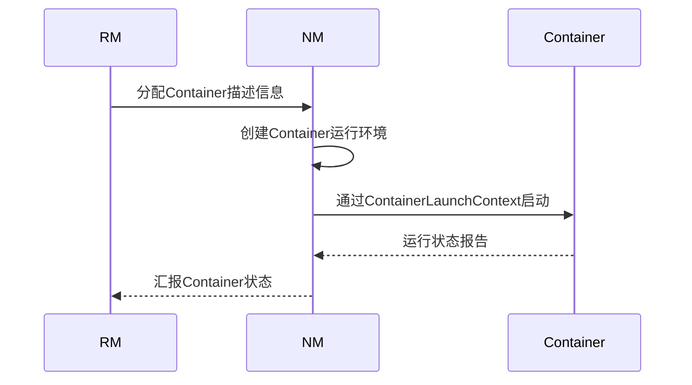

# YARN Container原理与代码实例讲解

## 1.背景介绍

在大数据时代,Apache Hadoop作为开源分布式计算框架,得到了广泛的应用和发展。YARN(Yet Another Resource Negotiator)是Hadoop的资源管理和调度系统,负责集群资源管理和作业调度。YARN将资源管理与作业调度/监控分离,提高了系统的可伸缩性和可用性。

YARN的核心组件是ResourceManager(RM)和NodeManager(NM)。RM是整个集群的资源管理和调度总控制器,NM运行在每个节点上,负责容器(Container)的生命周期管理。Container是YARN中的资源抽象,封装了CPU、内存等多维资源,用于运行特定的任务。

掌握YARN Container的原理对于理解YARN的运行机制、优化集群性能、开发YARN应用程序等都至关重要。本文将深入探讨YARN Container的工作原理、实现细节和实践应用。

## 2.核心概念与联系  

### 2.1 YARN架构  

YARN采用主从架构,主要由ResourceManager(RM)、ApplicationMaster(AM)、NodeManager(NM)和Container四个核心组件组成。

- **ResourceManager(RM)**:整个集群的资源管理和调度总控制器,负责资源分配和调度。
- **ApplicationMaster(AM)**: 每个应用程序的驱动器,负责应用内的资源协商、任务监控等。
- **NodeManager(NM)**: 运行在每个节点上,负责容器的生命周期管理。
- **Container**: YARN中的资源抽象,封装了CPU、内存等多维资源,用于运行特定的任务。

### 2.2 Container工作原理

Container是YARN中最小的资源分配和调度单位,封装了CPU、内存等多维资源,用于运行特定的任务。它的工作原理如下:

1. **资源请求**:应用程序的AM向RM申请资源,以Container为单位。
2. **资源分配**:RM根据集群资源状况,为AM分配Container。
3. **任务分发**:AM将任务分发到已分配的Container中运行。
4. **任务执行**:NM启动Container,运行相应的任务。
5. **资源归还**:任务完成后,Container释放占用的资源。

Container实现了YARN中资源的统一抽象和隔离,保证了资源的高效利用和应用之间的相互隔离。



## 3.核心算法原理具体操作步骤

### 3.1 Container生命周期

Container的生命周期由NM管理,主要包括以下几个阶段:

1. **容器分配(CONTAINER_ALLOCATED)**:RM成功为AM分配了Container资源。
2. **容器启动(CONTAINER_LAUNCHED)**:NM成功启动了Container。
3. **容器运行(CONTAINER_RUNNING)**:Container正在运行任务。
4. **容器完成(CONTAINER_COMPLETED)**:任务成功完成,Container释放资源。
5. **容器异常(CONTAINER_FAILED)**:任务执行异常,Container释放资源。
6. **容器杀死(CONTAINER_KILLED)**:用户主动终止Container,强制释放资源。



### 3.2 Container分配算法

RM使用各种调度算法为AM分配Container,常用算法包括:

1. **FIFO调度器**: 先来先服务,按照应用程序的提交顺序进行调度。
2. **公平调度器**: 根据应用程序运行的容器数量和权重,实现资源的公平分配。
3. **容量调度器**: 基于队列的资源分配,为每个队列分配一定的资源容量。
4. **延迟调度器**: 考虑数据本地性,尽量将任务调度到存储数据的节点上。

RM根据集群资源状况和调度策略,选择合适的节点为Container分配资源。

### 3.3 Container启动流程

Container由NM进行启动和管理,主要流程如下:

1. NM接收到RM分配的Container描述信息。
2. NM在本地创建Container运行环境,包括设置CPU、内存等资源限制。
3. NM通过ContainerLaunchContext启动Container,并运行用户指定的命令。
4. NM监控Container的运行状态,并将状态报告给RM。

Container启动流程涉及多个关键组件的交互,如Localizer(本地化资源)、ContainerExecutor(容器执行器)等,确保了Container的安全性和资源隔离性。



## 4.数学模型和公式详细讲解举例说明

在YARN中,资源的分配和调度是一个复杂的优化问题,需要考虑多个目标,如资源利用率、公平性、本地性等。这些目标通常存在权衡和矛盾,需要使用数学模型进行建模和求解。

### 4.1 资源模型

YARN采用多维度资源模型,将CPU、内存、磁盘、网络等资源统一抽象为一个资源向量:

$$
R = (r_1, r_2, \ldots, r_n)
$$

其中,$ r_i $表示第i种资源的数量。对于Container,它的资源需求也可以表示为一个向量:

$$
C = (c_1, c_2, \ldots, c_n)
$$

当且仅当对所有的$ i $,都有$ c_i \leq r_i $时,Container的资源需求才能被满足。

### 4.2 公平性模型

YARN的公平调度器旨在实现集群资源的公平分配。设有m个活跃的应用,第i个应用的资源使用量为$ u_i $,理想情况下,每个应用应获得相同的资源份额$ \frac{C}{m} $,其中C是集群的总资源量。

我们定义公平性度量$ \text{fairness} $为所有应用的资源使用量与其理想份额之差的平方和:

$$
\text{fairness} = \sum_{i=1}^m \left( u_i - \frac{C}{m} \right)^2
$$

公平调度器的目标是最小化这个公平性度量,从而实现资源的最大公平分配。

### 4.3 数据本地性模型

为了提高计算效率,YARN的延迟调度器会尽量将任务调度到存储数据的节点上,以减少数据传输开销。我们定义数据本地性得分$ \text{locality}(n, t) $,表示将任务t调度到节点n的本地性程度。

常见的本地性得分计算方法包括:

- 节点本地: $ \text{locality}(n, t) = \max \{0, 1 - \frac{\text{dataTransferCost}(n, t)}{\text{maxTransferCost}} \} $
- 机架本地: $ \text{locality}(n, t) = \max \{0, \frac{1}{2} - \frac{\text{dataTransferCost}(n, t)}{\text{maxTransferCost}} \} $
- 非本地: $ \text{locality}(n, t) = 0 $

其中,$ \text{dataTransferCost}(n, t) $是将任务t的输入数据传输到节点n的开销,$ \text{maxTransferCost} $是最大的数据传输开销。

延迟调度器的目标是最大化所有任务的数据本地性得分之和,从而减少数据传输开销。

通过建立数学模型,我们可以更好地理解和优化YARN的资源分配和调度策略,满足不同的优化目标。

## 4.项目实践:代码实例和详细解释说明  

### 4.1 提交YARN应用程序

以下代码示例展示了如何使用Java代码提交一个YARN应用程序:

```java
// 创建YARN客户端
YarnClient yarnClient = YarnClient.createYarnClient();
yarnClient.init(conf);
yarnClient.start();

// 创建应用程序提交上下文
YarnClientApplication app = yarnClient.createApplication();
GetNewApplicationResponse appResponse = app.getNewApplicationResponse();
ApplicationSubmissionContext appContext = app.getApplicationSubmissionContext();

// 设置应用程序详情
ApplicationId appId = appResponse.getApplicationId();
appContext.setApplicationName("MyApp");
appContext.setApplicationType("YARN");

// 设置AM资源需求
Resource capability = Resource.newInstance(1024, 1);
appContext.setResource(capability);
appContext.setQueue("default");

// 设置AM命令
String cmd = "$JAVA_HOME/bin/java" + " -Xmx256M" + " my.app.AppMaster" + " 1>" + System.getenv("LOG_DIR") + "/AppMaster.stdout" + " 2>" + System.getenv("LOG_DIR") + "/AppMaster.stderr";
appContext.setAppMasterCmd(cmd);

// 提交应用程序
yarnClient.submitApplication(appContext);
```

1. 创建YarnClient对象,用于与YARN交互。
2. 调用createApplication()方法创建一个新的应用程序。
3. 设置应用程序的名称、类型、运行队列等详情。
4. 设置AM的资源需求,包括内存和虚拟CPU核数。
5. 设置AM的启动命令,指定AM类及其参数。
6. 调用submitApplication()方法提交应用程序。

提交应用程序后,YARN会为AM分配Container资源,AM再向RM申请其他任务所需的Container。

### 4.2 实现ApplicationMaster

ApplicationMaster(AM)是应用程序的驱动器,负责向RM申请Container资源并监控任务执行。以下代码示例展示了AM的基本实现:

```java
public class AppMaster {
    public static void main(String[] args) {
        // 初始化配置和AM服务
        Configuration conf = new YarnConfiguration();
        YarnRPC rpc = YarnRPC.create(conf);
        String appHostStr = System.getenv(ApplicationConstants.APP_SUBMIT_HOST_ENV);
        int appHostPort = Integer.parseInt(System.getenv(ApplicationConstants.APP_SUBMIT_HOST_PORT_ENV));
        ApplicationId appId = ConverterUtils.toApplicationId(System.getenv(ApplicationConstants.ENV_APP_ID));
        AMRMClientAsync<AMRMClient.ContainerRequest> rmClient = AMRMClientAsync.createAMRMClientAsync(appId, 1000, rmTrackerAddr, appHostStr, appHostPort);

        // 注册AM
        rmClient.init(conf);
        rmClient.start();
        rmClient.registerApplicationMaster("", 0, "");

        // 申请Container资源
        Resource capability = Resource.newInstance(1024, 1);
        for (int i = 0; i < 5; i++) {
            AMRMClient.ContainerRequest containerAsk = new AMRMClient.ContainerRequest(capability, null, null, RM_REQUEST_PRIORITY);
            rmClient.addContainerRequest(containerAsk);
        }

        // 监控Container状态
        NMCallbackHandler containerListener = new NMCallbackHandler();
        while (true) {
            AllocateResponse response = rmClient.allocate(0.1f);
            for (Container container : response.getAllocatedContainers()) {
                // 启动Container执行任务
            }
            for (ContainerStatus status : response.getCompletedContainersStatuses()) {
                // 处理完成的Container
            }
        }
    }
}
```

1. 初始化配置和AM服务,包括YarnRPC、ApplicationId等。
2. 调用registerApplicationMaster()方法注册AM。
3. 调用addContainerRequest()方法向RM申请Container资源。
4. 实现NMCallbackHandler,监控Container的状态变化。
5. 在循环中调用allocate()方法,处理已分配和已完成的Container。
6. 启动Container执行任务,或处理已完成的Container。

AM作为应用程序的驱动器,负责资源申请、任务分发和监控,是YARN应用程序的核心组件。

### 4.3 实现NodeManager

NodeManager(NM)运行在每个节点上,负责容器的生命周期管理。以下代码示例展示了NM的基本实现:

```java
public class NodeManager extends CompositeService {
    private NodeHealthCheckerService healthChecker;
    private LocalDirsHandlerService dirsHandler;
    private ContainerManagerImpl containerManager;

    public NodeManager() {
        super("NodeManager");
    }

    @Override
    public void init(Configuration conf) {
        // 初始化各个服务组件
        healthChecker = new NodeHealthCheckerService();
        addService(healthChecker);
        dirsHandler = new LocalDirsHandlerService();
        addService(dirsHandler);
        containerManager = new ContainerManagerImpl(conf, dirsHandler);
        addService(containerManager);
        super.init(conf);
    }

    