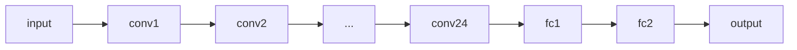

# YOLOv1原理与代码实例讲解

作者：禅与计算机程序设计艺术

## 1. 背景介绍

### 1.1 目标检测的挑战

目标检测是计算机视觉领域的一项重要任务，其目标是在图像或视频中识别和定位特定类别的物体。这项任务面临着诸多挑战，例如：

* **目标的尺度变化**:  现实世界中的物体大小不一，从很小的物体（例如昆虫）到很大的物体（例如汽车）都有。
* **目标的姿态变化**:  物体可以以不同的角度和姿态出现，例如旋转、遮挡和变形。
* **背景的复杂性**:  图像背景可能包含各种复杂的纹理、光照和杂波，这些都会干扰目标的检测。
* **实时性要求**:  许多应用场景，例如自动驾驶和视频监控，需要实时或接近实时的目标检测速度。

### 1.2  YOLOv1的诞生

在 YOLOv1 之前，主流的目标检测算法主要基于滑动窗口或区域提议的方法。这些方法通常速度较慢，并且难以处理多尺度目标。

2015年，Joseph Redmon 等人提出了 You Only Look Once (YOLO) 算法，该算法采用了一种全新的思路来解决目标检测问题。YOLOv1 将目标检测视为一个回归问题，直接从图像中预测目标的边界框和类别概率。

### 1.3 YOLOv1的优势

相比于之前的目标检测算法，YOLOv1 具有以下优势：

* **速度快**:  YOLOv1 可以达到实时或接近实时的检测速度，因为它只需要对图像进行一次前向传播。
* **全局推理**:  YOLOv1 在进行预测时会考虑整个图像的上下文信息，因此可以更好地处理目标之间的关系。
* **泛化能力强**:  YOLOv1 对新环境和新目标的泛化能力较强。

## 2. 核心概念与联系

### 2.1  将目标检测转换为回归问题

YOLOv1 的核心思想是将目标检测问题转换为一个回归问题。具体来说，YOLOv1 将输入图像划分为 $S \times S$ 个网格，每个网格负责预测目标的边界框和类别概率。

如果一个目标的中心落入某个网格，那么该网格就负责预测该目标。每个网格预测 $B$ 个边界框，每个边界框包含 5 个预测值：

* $(x, y)$:  边界框中心相对于网格单元格左上角的偏移量，取值范围为 $[0, 1]$。
* $(w, h)$:  边界框的宽度和高度相对于整个图像的比例，取值范围为 $[0, 1]$。
* $confidence$:  该边界框包含目标的置信度，取值范围为 $[0, 1]$。

此外，每个网格还预测 $C$ 个类别的条件概率，表示该网格中存在各个类别的目标的概率。

### 2.2  网络结构

YOLOv1 的网络结构借鉴了 GoogLeNet 的设计思想，使用了 24 个卷积层和 2 个全连接层。

其中，卷积层用于提取图像特征，全连接层用于进行预测。

### 2.3  损失函数

YOLOv1 使用一个多任务损失函数来训练网络，该损失函数包含三个部分：

* **边界框损失**:  使用平方和误差来度量预测边界框和真实边界框之间的差异。
* **置信度损失**:  使用交叉熵损失来度量预测置信度和真实置信度之间的差异。
* **类别概率损失**:  使用交叉熵损失来度量预测类别概率和真实类别概率之间的差异。

## 3. 核心算法原理具体操作步骤

### 3.1  图像预处理

在将图像输入 YOLOv1 网络之前，需要进行以下预处理步骤：

* **调整图像大小**:  将输入图像调整为固定大小，例如 $448 \times 448$。
* **归一化**:  将图像像素值归一化到 $[0, 1]$ 之间。

### 3.2  特征提取

预处理后的图像被送入 YOLOv1 网络进行特征提取。网络的前 24 层是卷积层，用于提取图像的各种特征，例如边缘、纹理和形状。

### 3.3  目标预测

特征提取完成后，网络的最后两层是全连接层，用于进行目标预测。

* **边界框预测**:  全连接层输出 $S \times S \times B \times 5$ 个值，表示每个网格预测的 $B$ 个边界框的 $(x, y, w, h, confidence)$。
* **类别概率预测**:  全连接层输出 $S \times S \times C$ 个值，表示每个网格预测的 $C$ 个类别的条件概率。

### 3.4  非极大值抑制

由于每个网格会预测多个边界框，因此需要使用非极大值抑制 (NMS) 来去除冗余的边界框。NMS 的基本思想是，对于每个类别，首先选择置信度最高的边界框，然后去除与其重叠度超过一定阈值的边界框。

### 3.5  结果输出

经过 NMS 后，就可以得到最终的检测结果，包括目标的边界框和类别。

## 4. 数学模型和公式详细讲解举例说明

### 4.1  边界框预测

每个边界框的预测值 $(x, y, w, h)$ 都是相对于网格单元格左上角的偏移量或比例。为了将这些预测值转换为相对于整个图像的坐标，需要进行以下转换：

$$
\begin{aligned}
b_x &= \sigma(t_x) + c_x \\
b_y &= \sigma(t_y) + c_y \\
b_w &= p_w e^{t_w} \\
b_h &= p_h e^{t_h}
\end{aligned}
$$

其中：

* $(b_x, b_y)$ 是边界框中心相对于整个图像的坐标。
* $(b_w, b_h)$ 是边界框的宽度和高度。
* $(t_x, t_y, t_w, t_h)$ 是网络预测的边界框参数。
* $(c_x, c_y)$ 是网格单元格左上角相对于整个图像的坐标。
* $(p_w, p_h)$ 是预先设定的锚框的宽度和高度。
* $\sigma()$ 是 sigmoid 函数，用于将预测值限制在 $[0, 1]$ 之间。

### 4.2  置信度预测

每个边界框的置信度预测值表示该边界框包含目标的概率。置信度预测值的计算公式如下：

$$
confidence = Pr(Object) \times IOU_{pred}^{truth}
$$

其中：

* $Pr(Object)$ 表示该边界框包含目标的概率，如果边界框包含目标，则为 1，否则为 0。
* $IOU_{pred}^{truth}$ 表示预测边界框和真实边界框之间的交并比 (Intersection over Union)。

### 4.3  类别概率预测

每个网格的类别概率预测值表示该网格中存在各个类别的目标的概率。类别概率预测值的计算公式如下：

$$
Pr(Class_i | Object) = \frac{e^{t_i}}{\sum_{j=1}^C e^{t_j}}
$$

其中：

* $t_i$ 是网络预测的第 $i$ 个类别的分数。
* $C$ 是类别的数量。

### 4.4  损失函数

YOLOv1 的损失函数是一个多任务损失函数，包含三个部分：

$$
\begin{aligned}
Loss &= \lambda_{coord} \sum_{i=0}^{S^2} \sum_{j=0}^{B} \mathbb{1}_{ij}^{obj} [(x_i - \hat{x}_i)^2 + (y_i - \hat{y}_i)^2 + (\sqrt{w_i} - \sqrt{\hat{w}_i})^2 + (\sqrt{h_i} - \sqrt{\hat{h}_i})^2] \\
&+ \sum_{i=0}^{S^2} \sum_{j=0}^{B} \mathbb{1}_{ij}^{obj} (C_i - \hat{C}_i)^2 + \lambda_{noobj} \sum_{i=0}^{S^2} \sum_{j=0}^{B} \mathbb{1}_{ij}^{noobj} (C_