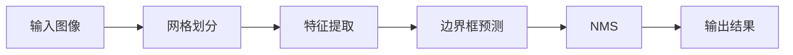
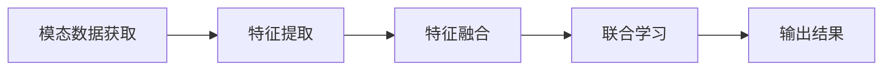
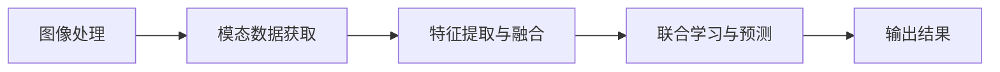

# YOLOv8与多模态学习：探索跨领域的信息融合

作者：禅与计算机程序设计艺术

## 1. 背景介绍

### 1.1 引言

在当今的科技领域，人工智能（AI）和深度学习正在迅速改变我们理解和处理信息的方式。尤为突出的是计算机视觉领域，近年来取得了飞跃式的进展。YOLO（You Only Look Once）作为一种实时目标检测算法，因其高效性和准确性而广受欢迎。随着YOLOv8的发布，目标检测技术又迈上了一个新的台阶。

与此同时，多模态学习（Multimodal Learning）作为一种融合多种信息源（如图像、文本、音频等）的方法，正在引起越来越多的关注。多模态学习能够更全面地理解和处理复杂的场景信息，为许多应用场景提供了更强大的支持。

### 1.2 研究背景

YOLOv8的出现不仅仅是目标检测技术的一次进化，更是与多模态学习结合的一个重要契机。通过将YOLOv8与多模态学习技术相结合，我们可以实现跨领域的信息融合，从而提升系统的智能化水平和应用效果。

### 1.3 文章结构

本文将详细介绍YOLOv8与多模态学习的核心概念、算法原理、数学模型及公式，并通过项目实例和代码解释来展示其实际应用。最后，我们将探讨这一技术的未来发展趋势与挑战，并附上常见问题与解答。

## 2. 核心概念与联系

### 2.1 YOLOv8简介

YOLOv8是YOLO系列的最新版本，它在前几代的基础上进行了多项改进，包括更高的检测精度和更快的处理速度。YOLOv8的核心思想是将目标检测问题转化为一个回归问题，通过单次神经网络前向传播来预测目标的类别和位置。

### 2.2 多模态学习简介

多模态学习是一种融合多种信息源的方法，旨在通过结合不同模态的信息来提升模型的理解能力和预测性能。常见的模态包括图像、文本、音频、视频等。多模态学习的关键在于如何有效地进行模态间的信息融合和交互。

### 2.3 YOLOv8与多模态学习的联系

将YOLOv8与多模态学习相结合，我们可以利用YOLOv8的强大目标检测能力来处理图像信息，同时通过多模态学习技术融合其他模态的信息。这种结合可以显著提升系统的智能化水平，使其在复杂场景下表现更加出色。

## 3. 核心算法原理具体操作步骤

### 3.1 YOLOv8的工作原理

YOLOv8的核心算法主要包括以下几个步骤：

1. **输入图像分割**：将输入图像划分为多个网格单元。
2. **特征提取**：通过卷积神经网络（CNN）提取每个网格单元的特征。
3. **边界框预测**：在每个网格单元内预测多个边界框及其置信度。
4. **非极大值抑制（NMS）**：去除重叠的边界框，保留置信度最高的框。



### 3.2 多模态学习的工作原理

多模态学习的核心步骤包括：

1. **模态数据获取**：获取不同模态的数据，如图像、文本、音频等。
2. **特征提取**：分别对每种模态的数据进行特征提取。
3. **特征融合**：将不同模态的特征进行有效融合。
4. **联合学习**：通过联合学习模型进行训练和预测。



### 3.3 YOLOv8与多模态学习的结合

将YOLOv8与多模态学习相结合的具体操作步骤如下：

1. **图像处理**：使用YOLOv8对图像进行目标检测，提取目标的类别和位置。
2. **模态数据获取**：获取其他模态的数据，如文本描述、音频信息等。
3. **特征提取与融合**：对各模态的数据进行特征提取，并将图像特征与其他模态的特征进行融合。
4. **联合学习与预测**：通过联合学习模型进行训练和预测，输出最终结果。



## 4. 数学模型和公式详细讲解举例说明

### 4.1 YOLOv8的数学模型

YOLOv8的数学模型主要包括目标检测的损失函数和边界框回归。

1. **损失函数**：YOLOv8的损失函数由分类损失、定位损失和置信度损失组成。

$$
L = L_{cls} + L_{loc} + L_{conf}
$$

其中，$L_{cls}$ 是分类损失，$L_{loc}$ 是定位损失，$L_{conf}$ 是置信度损失。

2. **边界框回归**：YOLOv8使用以下公式进行边界框的预测：

$$
\hat{b}_x = \sigma(t_x) + c_x
$$

$$
\hat{b}_y = \sigma(t_y) + c_y
$$

$$
\hat{b}_w = p_w e^{t_w}
$$

$$
\hat{b}_h = p_h e^{t_h}
$$

其中，$\sigma$ 是 sigmoid 函数，$t_x, t_y, t_w, t_h$ 是网络预测的偏移量，$c_x, c_y$ 是网格单元的坐标，$p_w, p_h$ 是锚框的宽度和高度。

### 4.2 多模态学习的数学模型

多模态学习的数学模型主要包括特征提取、特征融合和联合学习。

1. **特征提取**：对于每种模态的数据，使用相应的特征提取方法，如卷积神经网络（CNN）用于图像，循环神经网络（RNN）用于文本。

2. **特征融合**：将不同模态的特征向量进行融合，常见的方法包括加权平均、拼接和注意力机制。

$$
h = f(h_1, h_2, \ldots, h_n)
$$

其中，$h$ 是融合后的特征向量，$h_i$ 是第 $i$ 种模态的特征向量，$f$ 是融合函数。

3. **联合学习**：使用融合后的特征向量进行联合学习，常见的方法包括多模态神经网络和多模态变分自编码器。

$$
y = g(h)
$$

其中，$y$ 是预测结果，$g$ 是联合学习模型。

### 4.3 具体案例分析

假设我们有一个图像和文本描述的多模态数据集，我们希望通过YOLOv8和多模态学习技术来进行目标检测和文本分析。

1. **图像处理**：使用YOLOv8对图像进行目标检测，得到目标的类别和位置。
2. **文本处理**：使用RNN对文本描述进行特征提取，得到文本特征向量。
3. **特征融合**：将图像特征和文本特征进行拼接，得到融合后的特征向量。
4. **联合学习**：使用多模态神经网络对融合后的特征向量进行训练和预测，输出最终结果。

## 5. 项目实践：代码实例和详细解释说明

### 5.1 项目简介

在本节中，我们将通过一个具体的项目实例来展示如何将YOLOv8与多模态学习相结合。我们将使用YOLOv8进行图像目标检测，并结合文本描述进行多模态学习。

### 5.2 环境配置

首先，我们需要配置项目环境，包括安装必要的库和工具。

```bash
# 安装YOLOv8所需的库
pip install torch torchvision
pip install yolo

# 安装多模态学习所需的库
pip install transformers
pip install sentence-transformers
```

### 5.3 数据准备

我们需要准备一个包含图像和文本描述的多模态数据集。假设我们有一个包含