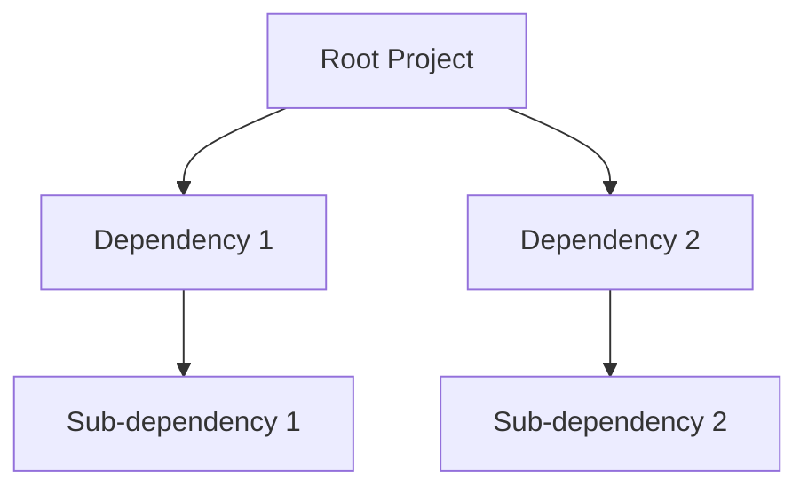

# Yarn的未来：新特性与发展方向

作者：禅与计算机程序设计艺术

## 1.背景介绍

### 1.1 Yarn简介

Yarn是由Facebook开发的一个新的JavaScript包管理器，旨在解决NPM在性能、安全性和一致性方面的不足。自2016年发布以来，Yarn迅速获得了广泛的关注和使用，成为了前端开发者手中的一把利器。Yarn的核心特性包括离线模式、确定性依赖解析和并行安装，使其在处理大型代码库和复杂依赖关系时表现出色。

### 1.2 发展历程

Yarn的发布标志着包管理器领域的一次重大革新。它不仅改进了NPM的缺点，还引入了一些新的理念，如锁文件（yarn.lock）和工作区（workspaces）。这些特性使开发者能够更加高效地管理项目依赖，提升开发体验。随着时间的推移，Yarn不断迭代更新，推出了多个版本，每个版本都带来了新的功能和改进。

### 1.3 现状分析

截至2024年，Yarn已经成为前端开发领域的重要工具之一。其稳定性和性能得到了广泛认可，社区也在不断壮大。然而，随着技术的不断发展，Yarn也面临着新的挑战和机遇。如何在保持现有优势的同时，不断创新，满足开发者不断变化的需求，是Yarn未来发展的关键。

## 2.核心概念与联系

### 2.1 Yarn的核心特性

#### 2.1.1 离线模式

Yarn的离线模式允许开发者在没有网络连接的情况下安装依赖。所有安装过的包都会被缓存到本地，后续安装时可以直接从缓存中获取。这不仅提升了安装速度，还减少了对网络的依赖。

#### 2.1.2 确定性依赖解析

Yarn通过yarn.lock文件确保每次安装的依赖版本一致，避免了“它在我机器上可以运行”的问题。这个锁文件记录了所有依赖的确切版本，确保团队成员之间的开发环境一致。

#### 2.1.3 并行安装

与NPM的串行安装不同，Yarn采用并行安装的方式，大大提升了安装速度。通过同时下载和安装多个包，Yarn能够更快地完成依赖的安装过程。

### 2.2 Yarn与NPM的对比

#### 2.2.1 性能对比

Yarn在性能上有显著优势，特别是在处理大型项目时。其并行安装和离线模式使得依赖安装速度更快，而NPM在这方面相对较慢。

#### 2.2.2 安全性对比

Yarn在安全性上也有所改进。它引入了包检查（integrity checks）和自动审计（automatic audits）机制，帮助开发者发现并修复潜在的安全漏洞。

#### 2.2.3 一致性对比

Yarn的锁文件机制确保了依赖的一致性，而NPM在这方面则相对较弱。虽然NPM也引入了package-lock.json文件，但其确定性和稳定性仍不如Yarn。

### 2.3 Yarn的生态系统

#### 2.3.1 插件系统

Yarn 2.0引入了插件系统，使得开发者可以根据需要扩展Yarn的功能。通过编写和使用插件，开发者能够实现更多自定义功能，提升开发效率。

#### 2.3.2 工作区

Yarn的工作区特性允许在一个单一的仓库中管理多个包。这对于大型项目和单体仓库（monorepo）非常有用，能够显著简化依赖管理和版本控制。

## 3.核心算法原理具体操作步骤

### 3.1 依赖解析算法

Yarn的依赖解析算法是其核心竞争力之一。它通过构建依赖树，确保每个包的依赖关系都能被正确解析和安装。

#### 3.1.1 依赖树的构建

Yarn首先会读取package.json文件中的依赖信息，然后递归地解析每个依赖的依赖，直到构建出完整的依赖树。这棵树记录了所有包及其版本信息。



#### 3.1.2 版本冲突的解决

当多个依赖之间存在版本冲突时，Yarn会根据依赖树的结构和锁文件中的信息，选择一个合适的版本进行安装。这一过程确保了依赖的一致性和稳定性。

### 3.2 缓存机制

Yarn的缓存机制是其提升性能的重要手段之一。通过将已安装的包缓存到本地，Yarn能够在后续安装时直接从缓存中获取，避免了重复下载。

#### 3.2.1 缓存目录

Yarn会在本地创建一个缓存目录，存储所有安装过的包。这个目录可以在配置文件中指定，也可以使用默认路径。

#### 3.2.2 缓存命中

在安装依赖时，Yarn首先会检查缓存目录中是否已经存在所需的包。如果存在，则直接从缓存中获取；否则，才会从远程仓库下载并缓存到本地。

### 3.3 并行安装算法

Yarn通过并行安装算法提升了依赖安装的速度。它采用多线程的方式，同时下载和安装多个包，从而减少了总安装时间。

#### 3.3.1 任务队列

Yarn会将所有需要安装的包放入一个任务队列中，然后使用多个线程同时处理这些任务。每个线程负责下载和安装一个或多个包，直到队列为空。

#### 3.3.2 依赖关系的处理

在并行安装过程中，Yarn会确保依赖关系的正确性。即使多个包同时安装，也不会出现依赖缺失或版本冲突的问题。

## 4.数学模型和公式详细讲解举例说明

### 4.1 依赖解析模型

Yarn的依赖解析可以用图论中的有向无环图（DAG）来表示。每个节点代表一个包，每条边代表一个依赖关系。

#### 4.1.1 有向无环图

有向无环图是一种特殊的图，其中不存在从一个节点出发经过若干条边又回到该节点的路径。用数学语言表示，即对于图中的任意节点 \( v \)，不存在 \( v \rightarrow v \) 的路径。

$$
G = (V, E)
$$

其中，\( V \) 表示节点集合，\( E \) 表示边集合。

### 4.2 版本冲突解决模型

版本冲突的解决可以看作是一个约束满足问题（CSP）。每个依赖包的版本是一个变量，版本号之间的兼容性是约束条件。

#### 4.2.1 约束满足问题

约束满足问题可以用数学公式表示为：

$$
\text{Given} \quad X = \{x_1, x_2, \ldots, x_n\}
$$

$$
\text{Find} \quad D = \{d_1, d_2, \ldots, d_n\}
$$

$$
\text{Such that} \quad C(x_1, x_2, \ldots, x_n)
$$

其中，\( X \) 是变量集合，\( D \) 是每个变量的取值域，\( C \) 是约束条件。

### 4.3 并行安装模型

并行安装可以用多线程模型来表示。每个线程负责处理一个或多个安装任务，所有线程共同工作以减少总安装时间。

#### 4.3.1 多线程模型

多线程模型可以用以下公式表示：

$$
T_{\text{total}} = \max(T_1, T_2, \ldots, T_n)
$$

其中，\( T_{\text{total}} \) 是总安装时间，\( T_i \) 是第 \( i \) 个线程的执行时间。

## 5.项目实践：代码实例和详细解释说明

### 5.1 初始化项目

在开始使用Yarn之前，需要先初始化一个新的项目。可以使用以下命令：

```bash
yarn init
```

这将创建一个新的package.json文件，包含项目的基本信息。

### 5.2 安装依赖

使用Yarn安装依赖非常简单。可以使用以下命令：

```bash
yarn add <package-name>
```

例如，要安装React，可以使用：

```bash
yarn add react
```

### 5.3 使用离线模式

Yarn的离线模式允许在没有网络连接的情况下安装依赖。可以使用以下