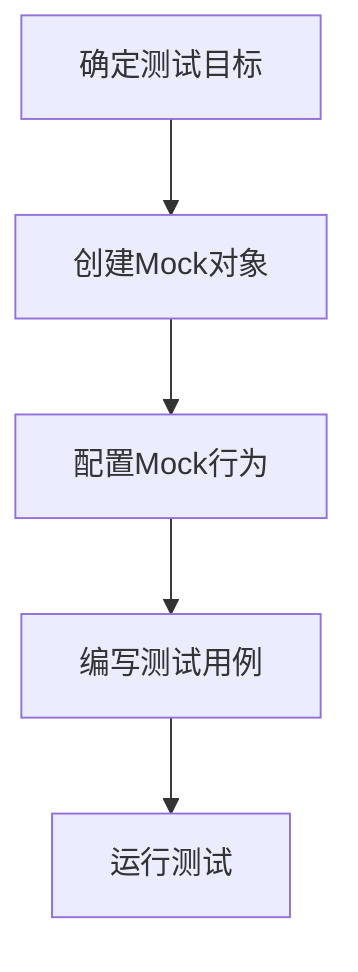

# Yarn的测试框架：Mocking与模拟

作者：禅与计算机程序设计艺术

## 1. 背景介绍

在现代软件开发过程中，测试是确保软件质量和稳定性的重要环节。随着前端开发的复杂性增加，测试框架的选择和使用变得尤为重要。Yarn作为一个强大的包管理工具，不仅在依赖管理方面表现出色，还为测试框架的集成和使用提供了便利。本文将深入探讨Yarn的测试框架，特别是Mocking与模拟技术的应用。

### 1.1 测试的重要性

测试不仅仅是为了找出代码中的错误，更是为了确保代码在各种场景下的稳定性和可靠性。通过有效的测试，可以：
- 提高代码质量
- 降低维护成本
- 确保功能按预期运行
- 提高开发效率

### 1.2 Yarn的优势

Yarn是由Facebook推出的一个快速、可靠和安全的依赖管理工具。与其他包管理工具相比，Yarn具有以下优势：
- **速度快**：Yarn采用并行化安装，极大地提高了安装速度。
- **一致性**：Yarn锁定依赖版本，确保在不同环境下安装结果一致。
- **安全性**：Yarn通过校验包的完整性，确保下载的包未被篡改。

### 1.3 Mocking与模拟技术概述

在测试过程中，尤其是单元测试和集成测试中，Mocking与模拟技术是不可或缺的。通过这些技术，可以：
- 隔离待测试模块
- 模拟外部依赖行为
- 提供可控的测试环境

## 2. 核心概念与联系

为了更好地理解Yarn测试框架中的Mocking与模拟技术，我们需要先了解一些核心概念及其之间的联系。

### 2.1 单元测试

单元测试是对软件中最小可测试单元进行验证的过程。它通常由开发人员编写，用于验证单个函数或模块的正确性。

### 2.2 集成测试

集成测试是将多个单元模块组合在一起进行测试，以验证它们之间的交互是否正确。它侧重于发现模块之间的接口问题。

### 2.3 Mocking

Mocking是一种测试技术，通过创建模拟对象来替代真实对象，以便隔离待测试模块。Mock对象可以预定义行为和返回值，从而提供可控的测试环境。

### 2.4 模拟

模拟（Stubbing）与Mocking类似，但更侧重于替代部分功能。模拟对象通常用于替代复杂的依赖，以简化测试过程。

### 2.5 Yarn与测试框架的集成

Yarn作为一个包管理工具，支持多种测试框架的集成，如Jest、Mocha、Chai等。通过Yarn，可以轻松安装和管理这些测试框架及其依赖。

## 3. 核心算法原理具体操作步骤

在进行Mocking与模拟时，我们需要遵循一定的步骤和算法。以下是常见的操作步骤：

### 3.1 确定测试目标

首先，需要明确测试的目标模块和功能。确定哪些部分需要Mocking，哪些部分需要模拟。

### 3.2 创建Mock对象

根据测试需求，创建Mock对象。可以使用现有的Mocking库，如Sinon.js 或 Jest中的Mock功能。

### 3.3 配置Mock行为

为Mock对象配置预定义的行为和返回值，以便在测试过程中替代真实对象的行为。

### 3.4 编写测试用例

编写测试用例，调用待测试模块，并验证其行为是否符合预期。

### 3.5 运行测试

使用Yarn运行测试框架，执行测试用例，并查看测试结果。



## 4. 数学模型和公式详细讲解举例说明

在Mocking与模拟的过程中，我们可以使用数学模型和公式来描述和分析其行为。以下是一些常见的模型和公式。

### 4.1 Mock对象的行为模型

假设我们有一个函数 $f(x)$，它依赖于另一个函数 $g(y)$。在测试 $f(x)$ 时，我们可以使用Mock对象替代 $g(y)$。

$$
f(x) = \begin{cases} 
      \text{Mock}(y) & \text{if } y \text{ is mocked} \\
      g(y) & \text{otherwise}
   \end{cases}
$$

### 4.2 模拟对象的行为模型

模拟对象的行为可以用一个简单的函数来描述：

$$
\text{Stub}(x) = \begin{cases} 
      \text{predefined value} & \text{if } x \text{ is stubbed} \\
      \text{original value} & \text{otherwise}
   \end{cases}
$$

### 4.3 举例说明

假设我们有一个函数 $calculateTotal(price, tax)$，它依赖于一个外部服务 $getTaxRate()$。我们可以使用Mock对象来替代 $getTaxRate()$，以便在测试 $calculateTotal$ 时提供可控的税率。

```javascript
// 真实函数
function calculateTotal(price, tax) {
    const taxRate = getTaxRate();
    return price + (price * taxRate);
}

// 测试用例
test('calculateTotal with mocked tax rate', () => {
    const mockGetTaxRate = jest.fn().mockReturnValue(0.1);
    const total = calculateTotal(100, mockGetTaxRate);
    expect(total).toBe(110);
});
```

## 5. 项目实践：代码实例和详细解释说明

为了更好地理解Yarn测试框架中的Mocking与模拟技术，我们将通过一个实际项目来演示其应用。

### 5.1 项目背景

假设我们正在开发一个电商平台，其中包含一个订单管理模块。我们需要对订单创建功能进行测试，确保其在各种场景下的正确性。

### 5.2 项目结构

项目结构如下：

```
ecommerce-platform/
├── src/
│   ├── order.js
│   └── taxService.js
├── tests/
│   ├── order.test.js
│   └── __mocks__/
│       └── taxService.js
├── package.json
└── yarn.lock
```

### 5.3 代码实例

#### 5.3.1 订单模块代码

```javascript
// src/order.js
const taxService = require('./taxService');

function createOrder(price) {
    const taxRate = taxService.getTaxRate();
    const total = price + (price * taxRate);
    return {
        price,
        taxRate,
        total
    };
}

module.exports = { createOrder };
```

#### 5.3.2 税率服务代码

```javascript
// src/taxService.js
function getTaxRate() {
    // 模拟外部服务调用
    return 0.2;
}

module.exports = { getTaxRate };
```

#### 5.3.3 测试代码

```javascript
// tests/order.test.js
const { createOrder } = require('../src/order');
const taxService = require('../src/taxService');

jest.mock('../src/taxService');

test('createOrder with mocked tax rate', () => {
    taxService.getTaxRate.mockReturnValue(0.1);
    const order = createOrder(100);
    expect(order.total).toBe(110);
    expect(order.taxRate).toBe(0.1);
});
```

### 5.4 详细解释

在上述代码中，我们使用了Jest的Mock功能来替代 `taxService` 的 `getTaxRate` 方法。通过这种方式，我们可以在测试过程中控制税率的返回值，从而验证订单创建功能在不同税率下的表现。

## 6. 实际应用场景

Mocking与模拟技术在实际开发中有广泛的应用。以下是一些常见的应用场景：

### 6.1 外部服务调用

在测试时，外部服务调用往往是不可控的。通过Mocking，可以替代这些调用，提供可控的测试环境。

### 6.2 数据库操作

数据库操作通常涉及复杂的事务和数据一致性问题。通过模拟数据库操作，可以简化测试过程，避免对真实数据库的依赖。

### 6.3 第三方库依赖

在使用第三方库时，可能会遇到一些难以测试的场景。通过Mocking，可以替代这些库的部分功能，确保测试的独立性。

## 7. 工具和资源推荐

在进行Mocking与模拟时，有许多工具和资源可以帮助我们提高效率。以下是一些推荐的工具和资源：

### 7.1 Jest

Jest是一个强大的JavaScript测试框架，内置了Mocking功能，