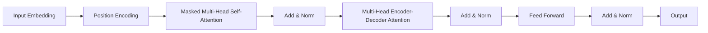

# Transformer架构

作者：禅与计算机程序设计艺术

## 1.背景介绍

### 1.1 人工智能与自然语言处理的演变

在过去的几十年里，人工智能（AI）和自然语言处理（NLP）领域经历了巨大的变革。从早期的规则驱动系统到基于统计的模型，再到深度学习的兴起，NLP技术不断进步。传统的RNN（循环神经网络）和LSTM（长短期记忆网络）在处理序列数据方面表现出色，但它们在处理长距离依赖关系时存在瓶颈。为了解决这些问题，Transformer架构应运而生。

### 1.2 Transformer的诞生

Transformer架构由Vaswani等人在2017年的论文《Attention is All You Need》中首次提出。它通过完全抛弃RNN结构，采用基于注意力机制的模型，显著提升了序列到序列任务的性能。自此，Transformer成为NLP领域的主流架构，并在机器翻译、文本生成、问答系统等多个任务中取得了突破性成果。

## 2.核心概念与联系

### 2.1 注意力机制

注意力机制是Transformer架构的核心。它通过计算输入序列中每个元素与其他元素之间的相关性，有效捕捉长距离依赖关系。注意力机制的基本公式如下：

$$
\text{Attention}(Q, K, V) = \text{softmax}\left(\frac{QK^T}{\sqrt{d_k}}\right)V
$$

其中，$Q$ 是查询矩阵，$K$ 是键矩阵，$V$ 是值矩阵，$d_k$ 是键的维度。

### 2.2 多头注意力机制

多头注意力机制通过并行计算多个不同的注意力矩阵，进一步提升了模型的表达能力。公式如下：

$$
\text{MultiHead}(Q, K, V) = \text{Concat}(\text{head}_1, \text{head}_2, ..., \text{head}_h)W^O
$$

其中，每个 $\text{head}_i$ 是独立的注意力头，$W^O$ 是线性变换矩阵。

### 2.3 位置编码

由于Transformer架构没有RNN的顺序信息，位置编码用于为输入序列添加位置信息。位置编码的公式如下：

$$
PE_{(pos, 2i)} = \sin\left(\frac{pos}{10000^{2i/d_{model}}}\right)
$$

$$
PE_{(pos, 2i+1)} = \cos\left(\frac{pos}{10000^{2i/d_{model}}}\right)
$$

其中，$pos$ 是位置，$i$ 是维度索引，$d_{model}$ 是模型的维度。

## 3.核心算法原理具体操作步骤

### 3.1 编码器-解码器结构

Transformer架构采用编码器-解码器结构。编码器将输入序列编码为固定长度的表示，解码器则将该表示解码为目标序列。编码器和解码器均由多个层堆叠而成，每层包含多头注意力机制和前馈神经网络。

### 3.2 编码器

编码器由 $N$ 个相同的层组成。每层包括两个子层：多头自注意力机制和前馈神经网络。每个子层后均有残差连接和层归一化。


### 3.3 解码器

解码器也由 $N$ 个相同的层组成。每层包括三个子层：多头自注意力机制、编码器-解码器注意力机制和前馈神经网络。与编码器类似，每个子层后均有残差连接和层归一化。



## 4.数学模型和公式详细讲解举例说明

### 4.1 自注意力机制

自注意力机制的核心在于计算注意力权重。给定输入矩阵 $X$，首先通过线性变换得到查询矩阵 $Q$、键矩阵 $K$ 和值矩阵 $V$：

$$
Q = XW^Q, \quad K = XW^K, \quad V = XW^V
$$

其中，$W^Q$、$W^K$ 和 $W^V$ 是可训练的权重矩阵。

接下来，计算注意力权重：

$$
\text{Attention}(Q, K, V) = \text{softmax}\left(\frac{QK^T}{\sqrt{d_k}}\right)V
$$

### 4.2 多头注意力机制

多头注意力机制通过多个自注意力头并行计算，捕捉不同子空间的信息。具体步骤如下：

1. 将输入 $X$ 通过线性变换得到多个查询矩阵 $Q_i$、键矩阵 $K_i$ 和值矩阵 $V_i$。
2. 对每个头分别计算自注意力：
   
   $$
   \text{head}_i = \text{Attention}(Q_i, K_i, V_i)
   $$

3. 将所有头的输出拼接，并通过线性变换得到最终输出：
   
   $$
   \text{MultiHead}(Q, K, V) = \text{Concat}(\text{head}_1, \text{head}_2, ..., \text{head}_h)W^O
   $$

## 5.项目实践：代码实例和详细解释说明

### 5.1 基础实现

以下是一个简化的Transformer编码器的PyTorch实现：

```python
import torch
import torch.nn as nn
import torch.nn.functional as F

class MultiHeadAttention(nn.Module):
    def __init__(self, d_model, num_heads):
        super(MultiHeadAttention, self).__init__()
        self.num_heads = num_heads
        self.d_model = d_model
        
        assert d_model % num_heads == 0
        
        self.depth = d_model // num_heads
        self.wq = nn.Linear(d_model, d_model)
        self.wk = nn.Linear(d_model, d_model)
        self.wv = nn.Linear(d_model, d_model)
        self.dense = nn.Linear(d_model, d_model)
        
    def split_heads(self, x, batch_size):
        x = x.view(batch_size, -1, self.num_heads, self.depth)
        return x.permute(0, 2, 1, 3)
    
    def forward(self, q, k, v, mask):
        batch_size = q.size(0)
        
        q = self.split_heads(self.wq(q), batch_size)
        k = self.split_heads(self.wk(k), batch_size)
        v = self.split_heads(self.wv(v), batch_size)
        
        scaled_attention, _ = self.scaled_dot_product_attention(q, k, v, mask)
        scaled_attention = scaled_attention.permute(0, 2, 1, 3).contiguous()
        original_size_attention = scaled_attention.view(batch_size, -1, self.d_model)
        
        output = self.dense(original_size_attention)
        return output
    
    def scaled_dot_product_attention(self, q, k, v, mask):
        matmul_qk = torch.matmul(q, k.transpose(-2, -1))
        dk = k.size(-1)
        scaled_attention_logits = matmul_qk / torch.sqrt(torch.tensor(dk, dtype=torch.float32))
        
        if mask is not None:
            scaled_attention_logits += (mask * -1e9)
        
        attention_weights = F.softmax(scaled_attention_logits, dim=-1)
        output = torch.matmul(attention_weights, v)
        return output, attention_weights
```

### 5.2 位置编码实现

```python
class PositionalEncoding(nn.Module):
    def __init__(self, d_model, max_len=5000):
        super(PositionalEncoding, self).__init__()
        pe = torch.zeros(max_len, d_model)
        position = torch.arange(0, max_len, dtype=torch.float).unsqueeze(1)
        div_term = torch.exp(torch.arange(0, d_model, 2).float() * (-torch.log(torch.tensor(10000.0)) / d_model))
        pe[:, 0::2] = torch.sin(position * div_term)
        pe[:, 1::2] = torch.cos(position * div_term)
        pe =