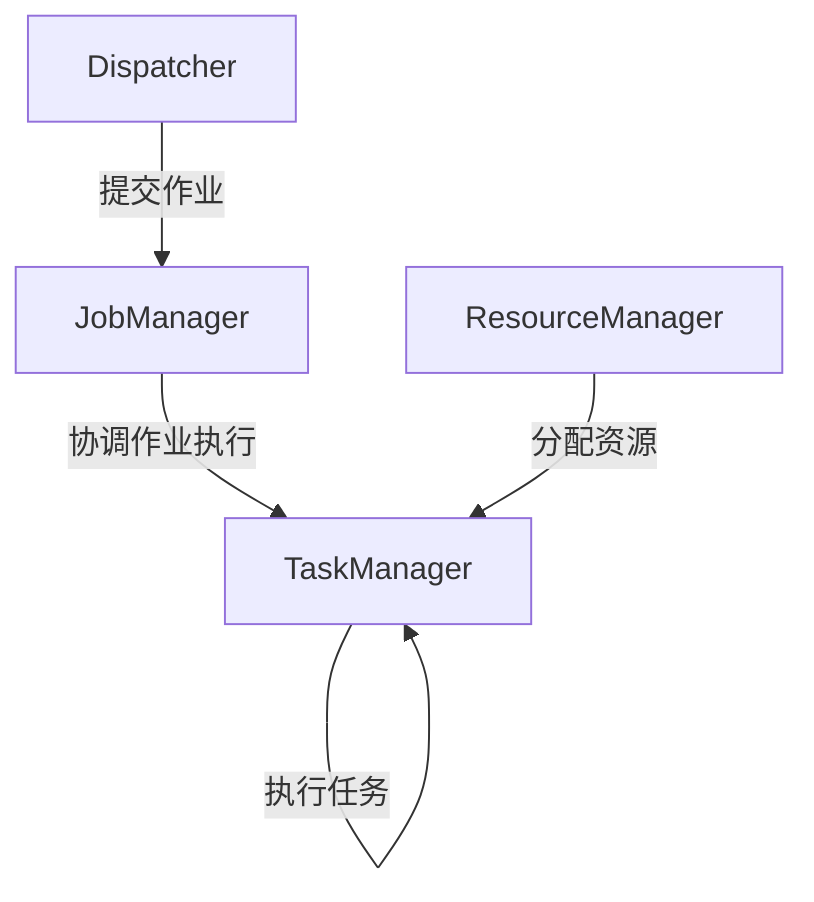

# 【AI大数据计算原理与代码实例讲解】Flink专栏文章标题

作者：禅与计算机程序设计艺术

## 1.背景介绍

### 1.1 大数据时代的到来

大数据时代的到来，改变了各行各业的数据处理和分析方式。数据量的爆炸性增长对传统的数据处理工具提出了巨大的挑战。为了应对这些挑战，新的数据处理框架和工具应运而生，其中Apache Flink作为一款高效的分布式流处理框架，受到了广泛关注。

### 1.2 Apache Flink简介

Apache Flink是一款开源的流处理框架，提供了高吞吐量、低延迟的流处理能力。它不仅支持流处理，还支持批处理，能够处理大规模的数据集。Flink的核心优势在于其强大的数据处理能力、灵活的编程模型和高可扩展性，使其成为大数据处理领域的重要工具。

### 1.3 Flink的应用场景

Flink在多个领域都有广泛的应用，包括实时数据分析、事件驱动应用、机器学习、数据管道和ETL（Extract, Transform, Load）等。它能够处理各种数据源的数据，并提供高效的实时计算能力，帮助企业快速做出数据驱动的决策。

## 2.核心概念与联系

### 2.1 流处理与批处理

流处理和批处理是大数据处理的两种主要模式。流处理是一种实时处理数据流的方法，数据在生成后立即被处理。批处理则是将数据分批次进行处理，通常用于处理大规模的数据集。

### 2.2 Flink的编程模型

Flink的编程模型基于数据流图（Dataflow Graph），其中每个节点表示一个操作（如map、filter、reduce），边表示数据流。Flink的编程模型支持有状态计算，允许在数据流处理过程中保存中间状态。

### 2.3 Flink的架构

Flink的架构包括以下几个核心组件：

- **JobManager**：负责管理和协调Flink作业的执行。
- **TaskManager**：负责执行具体的任务。
- **Dispatcher**：负责接收和提交作业。
- **ResourceManager**：负责资源管理和分配。



### 2.4 数据流与状态管理

Flink的数据流模型支持有状态计算，允许在处理数据流的过程中保存和更新状态。状态管理是Flink的核心功能之一，支持一致性检查点（Checkpointing）和保存点（Savepoint），确保数据处理的准确性和可靠性。

## 3.核心算法原理具体操作步骤

### 3.1 数据流处理的基本操作

Flink提供了一系列基本的流处理操作，包括map、filter、reduce、flatMap等。这些操作可以组合使用，构建复杂的数据处理逻辑。

#### 3.1.1 Map操作

Map操作用于将输入数据映射为另一种形式。它对每个输入元素应用一个函数，并将结果作为新的数据流输出。

```java
DataStream<String> text = // 输入数据流
DataStream<Integer> counts = text
    .map(new MapFunction<String, Integer>() {
        @Override
        public Integer map(String value) throws Exception {
            return Integer.parseInt(value);
        }
    });
```

#### 3.1.2 Filter操作

Filter操作用于过滤数据流中的元素，只保留满足条件的元素。

```java
DataStream<String> text = // 输入数据流
DataStream<String> filtered = text
    .filter(new FilterFunction<String>() {
        @Override
        public boolean filter(String value) throws Exception {
            return value.startsWith("Flink");
        }
    });
```

#### 3.1.3 Reduce操作

Reduce操作用于对数据流中的元素进行聚合，生成一个单一的结果。

```java
DataStream<Integer> numbers = // 输入数据流
DataStream<Integer> sum = numbers
    .keyBy(value -> 1)
    .reduce(new ReduceFunction<Integer>() {
        @Override
        public Integer reduce(Integer value1, Integer value2) throws Exception {
            return value1 + value2;
        }
    });
```

### 3.2 时间和窗口

时间和窗口是流处理中的关键概念。Flink支持事件时间（Event Time）和处理时间（Processing Time），并提供了丰富的窗口操作。

#### 3.2.1 滚动窗口

滚动窗口（Tumbling Window）是固定大小、不重叠的时间窗口。

```java
DataStream<String> text = // 输入数据流
DataStream<Tuple2<String, Integer>> windowCounts = text
    .keyBy(value -> value)
    .window(TumblingProcessingTimeWindows.of(Time.seconds(5)))
    .sum(1);
```

#### 3.2.2 滑动窗口

滑动窗口（Sliding Window）是固定大小、可以重叠的时间窗口。

```java
DataStream<String> text = // 输入数据流
DataStream<Tuple2<String, Integer>> windowCounts = text
    .keyBy(value -> value)
    .window(SlidingProcessingTimeWindows.of(Time.seconds(5), Time.seconds(1)))
    .sum(1);
```

### 3.3 状态管理

Flink支持丰富的状态管理功能，允许在流处理过程中保存和更新状态。状态可以是键控状态（Keyed State）或操作状态（Operator State）。

#### 3.3.1 键控状态

键控状态与数据流中的键关联，用于保存每个键的状态。

```java
public class CountWithKeyedState extends RichFlatMapFunction<String, Tuple2<String, Integer>> {
    private transient ValueState<Integer> count;

    @Override
    public void open(Configuration parameters) throws Exception {
        ValueStateDescriptor<Integer> descriptor = 
            new ValueStateDescriptor<>("count", Integer.class, 0);
        count = getRuntimeContext().getState(descriptor);
    }

    @Override
    public void flatMap(String value, Collector<Tuple2<String, Integer>> out) throws Exception {
        Integer currentCount = count.value();
        currentCount += 1;
        count.update(currentCount);
        out.collect(new Tuple2<>(value, currentCount));
    }
}
```

#### 3.3.2 操作状态

操作状态与具体的操作关联，用于保存操作的状态。

```java
public class CountWithOperatorState extends RichFlatMapFunction<String, Tuple2<String, Integer>> {
    private transient ListState<Integer> count;

    @Override
    public void open(Configuration parameters) throws Exception {
        ListStateDescriptor<Integer> descriptor = 
            new ListStateDescriptor<>("count", Integer.class);
        count = getRuntimeContext().getListState(descriptor);
    }

    @Override
    public void flatMap(String value, Collector<Tuple2<String, Integer>> out) throws Exception {
        Iterable<Integer> currentState = count.get();
        int currentCount = 0;
        for (Integer val : currentState) {
            currentCount += val;
        }
        currentCount += 1;
        count.update(Collections.singletonList(currentCount));
        out.collect(new Tuple2<>(value, currentCount));
    }
}
```

## 4.数学模型和公式详细讲解举例说明

### 4.1 数据流模型

Flink的数据流模型可以用有向无环图（DAG）表示，其中每个节点表示一个操作，边表示数据流。假设有一个简单的数据流图，包含三个操作：map、filter和reduce。

$$
G = (V, E)
$$

其中，$V$ 表示操作节点集合，$E$ 表示数据流边集合。

$$
V = \{map, filter, reduce\}
$$

$$
E = \{(map, filter), (filter, reduce)\}
$$

### 4.2 状态管理模型

状态管理模型可以表示为一个状态转换函数 $f$，它接受当前状态 $s$ 和输入数据 $x$，返回新的状态 $s'$。

$$
s' = f(s, x)
$$

假设有一个简单的计数器状态 $count$，初始状态为 $0$，每次输入数据 $x$ 都会使计数器加 $1$。

$$
f(count, x) = count + 1
$$

### 4.3 窗口函数模型

窗口函数模型可以表示为一个时间窗口 $W$，它包含一组时间戳 $T$ 和对应的数据 $D$。

$$
W = (T, D)
$$

假设有一个滚动窗口，窗口大小为 $5$ 秒，每秒钟生成一个数据点。窗口 $W$ 包含的数据点集合 $D$ 可以表示为：

$$
D = \{d_1, d_2, d_3, d_4, d_5\}
$$

## 4.项目实践：代码实例和详细解释说明

### 4.1 实时数据流处理示例

以下是一个简单的实时数据流处理