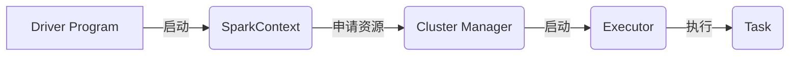

# 【AI大数据计算原理与代码实例讲解】Spark

作者：禅与计算机程序设计艺术

## 1. 背景介绍

### 1.1 大数据时代与AI的兴起

步入21世纪，信息技术以前所未有的速度发展，互联网、移动互联网、物联网等新兴技术的应用，以及社交网络、电子商务、移动支付等新兴商业模式的兴起，导致数据规模呈爆炸式增长，人类社会正式迈入了大数据时代。与此同时，人工智能(AI)作为模拟、延伸和扩展人类智能的新兴技术，近年来也取得了突破性进展，特别是在深度学习、强化学习等领域，AI展现出强大的数据分析和处理能力，为解决大数据时代面临的各种挑战提供了新的思路和方法。

### 1.2 大数据计算的挑战

面对海量、高维、快速增长的数据，传统的计算模式和工具已经难以满足需求，大数据计算面临着诸多挑战：

* **数据规模巨大：** PB级甚至EB级的数据量对存储、处理和分析都提出了严峻考验。
* **数据类型多样：** 结构化、半结构化和非结构化数据并存，需要灵活的数据处理方式。
* **数据实时性要求高：** 许多应用场景需要对数据进行实时处理和分析，例如实时推荐、欺诈检测等。
* **计算复杂度高：** 许多AI算法需要进行大量的迭代计算，对计算资源的需求非常高。

### 1.3 Spark：大规模数据处理的利器

为了应对大数据计算的挑战，各种分布式计算框架应运而生，其中Apache Spark凭借其高效、灵活、易用等优势，成为了大数据处理领域最受欢迎的开源框架之一。Spark提供了一套丰富的API和工具，支持多种编程语言，可以运行在各种集群环境中，能够高效地处理各种类型的大规模数据。

## 2. 核心概念与联系

### 2.1 Spark生态系统

Spark生态系统包含多个组件，共同构成了一个完整的大数据处理解决方案：

* **Spark Core:** Spark的核心组件，提供分布式计算的基础功能，包括任务调度、内存管理、容错机制等。
* **Spark SQL:** 提供结构化数据处理能力，支持SQL查询和DataFrame API，可以与Hive等数据仓库集成。
* **Spark Streaming:**  提供实时数据流处理能力，支持从各种数据源接收数据流，并进行实时分析和处理。
* **Spark MLlib:**  提供机器学习库，包含各种常用的机器学习算法，可以用于构建各种AI应用。
* **Spark GraphX:**  提供图计算能力，支持对大规模图数据进行分析和处理。

### 2.2  RDD：Spark的核心抽象

弹性分布式数据集（Resilient Distributed Dataset，RDD）是Spark的核心抽象，它代表一个不可变的、可分区的数据集，可以分布在集群的多个节点上进行并行处理。RDD支持两种类型的操作：

* **转换（Transformation）：** 转换操作会生成一个新的RDD，例如map、filter、reduceByKey等。
* **行动（Action）：** 行动操作会触发RDD的计算，并将结果返回给驱动程序，例如count、collect、saveAsTextFile等。

### 2.3 Spark运行架构

Spark应用程序以独立的进程集运行，由驱动程序（Driver Program）中的`SparkContext`进行协调。

* **驱动程序:** 运行应用程序的主函数并创建`SparkContext`，负责协调应用程序的执行。
* **执行器:** 运行在工作节点上的进程，负责执行任务并存储数据。
* **集群管理器:** 负责在集群中获取资源并启动执行器，例如Standalone、YARN、Mesos等。

Spark运行架构如下图所示：



## 3. 核心算法原理具体操作步骤

### 3.1 WordCount案例分析

WordCount是大数据领域最经典的案例之一，用于统计文本文件中每个单词出现的次数。下面以WordCount为例，介绍Spark的核心算法原理和具体操作步骤：

**3.1.1 算法描述:**

1. 将文本数据加载到RDD中。
2. 将每行文本分割成单词。
3. 按照单词进行分组。
4. 统计每个单词出现的次数。

**3.1.2 代码实现:**

```scala
import org.apache.spark.{SparkConf, SparkContext}

object WordCount {
  def main(args: Array[String]): Unit = {
    // 创建 Spark 配置对象
    val conf = new SparkConf().setAppName("WordCount").setMaster("local[*]")

    // 创建 Spark 上下文对象
    val sc = new SparkContext(conf)

    // 读取文本文件
    val lines = sc.textFile("input.txt")

    // 分割单词
    val words = lines.flatMap(_.split(" "))

    // 统计单词出现次数
    val wordCounts = words.map(word => (word, 1)).reduceByKey(_ + _)

    // 打印结果
    wordCounts.foreach(println)

    // 关闭 Spark 上下文
    sc.stop()
  }
}
```

**3.1.3 代码解释:**

* `sc.textFile("input.txt")`: 从文本文件"input.txt"中读取数据，创建RDD。
* `lines.flatMap(_.split(" "))`: 将每行文本分割成单词，并使用flatMap操作将所有单词合并到一个RDD中。
* `words.map(word => (word, 1))`: 将每个单词映射成一个键值对，键为单词，值为1。
* `reduceByKey(_ + _)`: 按照键（单词）进行分组，并对每个组的值（出现次数）进行累加。
* `wordCounts.foreach(println)`: 遍历结果RDD，打印每个单词及其出现次数。

### 3.2  其他常用算法

除了WordCount，Spark还支持许多其他常用的数据处理算法，例如：

* **排序:**  sortByKey、sortBy
* **过滤:**  filter
* **连接:**  join、cogroup
* **聚合:**  reduceByKey、groupByKey、aggregateByKey
* **机器学习:**  LogisticRegression、LinearRegression、KMeans

## 4. 数学模型和公式详细讲解举例说明

### 4.1  TF-IDF算法

TF-IDF（Term Frequency-Inverse Document Frequency）是一种常用的文本挖掘算法，用于评估一个词语对于一个文档集或语料库中的其中一份文档的重要程度。字词的重要性随着它在文件中出现的次数成正比增加，但同时会随着它在语料库中出现的频率成反比下降。

**4.1.1  TF:** 词频（Term Frequency），指的是某一个给定的词语在该文件中出现的频率。

$$
TF(t,d) = \frac{f_{t,d}}{\sum_{t' \in d} f_{t',d}}
$$

其中，$f_{t,d}$ 表示词语 $t$ 在文档 $d$ 中出现的次数，$\sum_{t' \in d} f_{t',d}$ 表示文档 $d$ 中所有词语的出现次数之和。

**4.1.2  IDF:** 逆向文件频率（Inverse Document Frequency），是一个词语普遍重要性的度量。某一特定词语的IDF，可以由该词语在语料库所有文档中出现的次数除以包含该词语的文档数，再求对数得到：

$$
IDF(t,D) = \log \frac{|D|}{|\{d \in D: t \in d\}|}
$$

其中，$|D|$ 表示语料库中的文档总数，$|\{d \in D: t \in d\}|$ 表示包含词语 $t$ 的文档数。

**4.1.3  TF-IDF:**  TF-IDF 算法就是将 TF 和 IDF 两个值相乘，得到一个词语在文档中的权重：

$$
TF-IDF(t,d,D) = TF(t,d) \cdot IDF(t,D)
$$

**4.1.4  代码实现:**

```scala
import org.apache.spark.mllib.feature.{HashingTF, IDF}

// 创建 Spark 上下文对象
val sc = new SparkContext(conf)

// 加载文本数据
val documents: RDD[Seq[String]] = sc.textFile("documents.txt")
  .map(_.split(" ").toSeq)

// 创建 HashingTF 对象
val hashingTF = new HashingTF()

// 计算 TF 向量
val tf: RDD[Vector] = hashingTF.transform(documents)

// 创建 IDF 对象
val idf = new IDF().fit(tf)

// 计算 IDF 向量
val idfModel: Vector = idf.idf

// 计算 TF-IDF 向量
val tfidf: RDD[Vector] = idf.transform(tf)

// 打印结果
tfidf.foreach(println)
```

### 4.2  其他常用算法

* **PageRank:** 用于评估网页重要性的算法。
* **K-Means:**  一种常用的聚类算法。
* **协同过滤:**  一种常用的推荐算法。

## 5. 项目实践：代码实例和详细解释说明

### 5.1  电影推荐系统

本节将介绍如何使用 Spark MLlib 构建一个简单的电影推荐系统。

**5.1.1  数据集:**

使用 MovieLens 数据集，该数据集包含用户对电影的评分信息。

**5.1.2  代码实现:**

```scala
import org.apache.spark.mllib.recommendation.{ALS, MatrixFactorizationModel, Rating}
import org.apache.spark.{SparkConf, SparkContext}

object MovieRecommendation {
  def main(args: Array[String]): Unit = {
    // 创建 Spark 配置对象
    val conf = new SparkConf().setAppName("MovieRecommendation").setMaster("local[*]")

    // 创建 Spark 上下文对象
    val sc = new SparkContext(conf)

    // 加载数据
    val data = sc.textFile("ratings.dat")

    // 将数据转换为 Rating 对象
    val ratings = data.map(_.split("::") match {
      case Array(user, movie, rating, timestamp) =>
        Rating(user.toInt, movie.toInt, rating.toDouble)
    })

    // 将数据分为训练集和测试集
    val splits = ratings.randomSplit(Array(0.8, 0.2))
    val training = splits(0)
    val test = splits(1)

    // 创建 ALS 模型
    val rank = 10
    val numIterations = 10
    val model = ALS.train(training, rank, numIterations)

    // 在测试集上进行预测
    val predictions = model.predict(test.map(x => (x.user, x.product)))

    // 计算均方根误差
    val rmse = math.sqrt(predictions.map(x => math.pow(x.rating - x.rating, 2)).mean())

    // 打印结果
    println(s"RMSE = $rmse")

    // 关闭 Spark 上下文
    sc.stop()
  }
}
```

**5.1.3  代码解释:**

* `Rating(user.toInt, movie.toInt, rating.toDouble)`: 创建 Rating 对象，表示用户对电影的评分。
* `ALS.train(training, rank, numIterations)`: 使用 ALS 算法训练模型，rank 表示隐含特征的数量，numIterations 表示迭代次数。
* `model.predict(test.map(x => (x.user, x.product)))`: 使用模型对测试集进行预测。
* `math.sqrt(predictions.map(x => math.pow(x.rating - x.rating, 2)).mean())`: 计算均方根误差。

## 6.  实际应用场景

Spark在大数据和AI领域有着广泛的应用，例如：

* **电商推荐:**  根据用户的历史行为和兴趣偏好，推荐相关的商品或服务。
* **金融风控:**  分析用户的交易记录、信用记录等信息，识别潜在的风险。
* **医疗诊断:**  分析患者的病历、影像学检查等数据，辅助医生进行诊断。
* **社交网络分析:** 分析用户之间的关系、互动等信息，挖掘潜在的价值。

## 7. 工具和资源推荐

### 7.1 开发工具

* **IntelliJ IDEA:**  一款功能强大的 Java IDE，支持 Scala 开发。
* **Eclipse:**  一款开源的 Java IDE，支持 Scala 开发。
* **Spark Shell:**  Spark 提供的交互式命令行工具，可以方便地进行数据探索和代码测试。

### 7.2 学习资源

* **Spark 官方文档:**  https://spark.apache.org/docs/latest/
* **Spark 编程指南:**  https://spark.apache.org/docs/latest/programming-guide.html
* **Spark MLlib 文档:**  https://spark.apache.org/docs/latest/ml-guide.html

## 8. 总结：未来发展趋势与挑战

Spark作为大数据处理领域最受欢迎的开源框架之一，未来将继续朝着更加高效、灵活、智能的方向发展，以下是一些发展趋势：

* **与深度学习框架的融合:** Spark 将与 TensorFlow、PyTorch 等深度学习框架更加紧密地集成，方便用户构建端到端的 AI 应用。
* **实时数据处理能力的提升:** Spark Streaming 将得到进一步优化，以满足实时性要求更高的应用场景。
* **云原生架构的演进:** Spark 将更加适应云计算环境，支持 Kubernetes 等容器编排平台。

当然，Spark也面临着一些挑战：

* **处理超大规模数据的效率:** 随着数据规模的不断增长，Spark需要不断优化其性能，以应对更大的挑战。
* **与其他大数据技术的融合:** Spark需要与其他大数据技术，例如 Flink、Kafka 等，更好地集成，构建更加完整的大数据生态系统。
* **人才培养:**  Spark 的学习曲线相对较陡峭，需要投入一定的时间和精力才能掌握，因此人才培养也是一个重要的挑战。

## 9. 附录：常见问题与解答

### 9.1  Spark与Hadoop的区别是什么？

Spark 和 Hadoop 都是开源的大数据处理框架，但它们的设计目标和应用场景有所不同。

* **Hadoop:** Hadoop 是一个分布式存储和处理框架，其核心组件是 HDFS（分布式文件系统）和 MapReduce（分布式计算模型）。Hadoop 适用于批处理任务，例如数据清洗、ETL 等。
* **Spark:** Spark 是一个基于内存的分布式计算框架，支持批处理、流处理、交互式查询和机器学习等多种应用场景。Spark 的运行速度比 Hadoop 更快，因为它将数据缓存在内存中，避免了磁盘 I/O 的开销。

### 9.2  Spark支持哪些编程语言？

Spark 主要支持 Scala、Java、Python 和 R 四种编程语言。

### 9.3  如何学习 Spark？

学习 Spark 可以参考官方文档、编程指南以及相关的书籍和教程。此外，还可以通过实践项目来加深对 Spark 的理解和掌握。