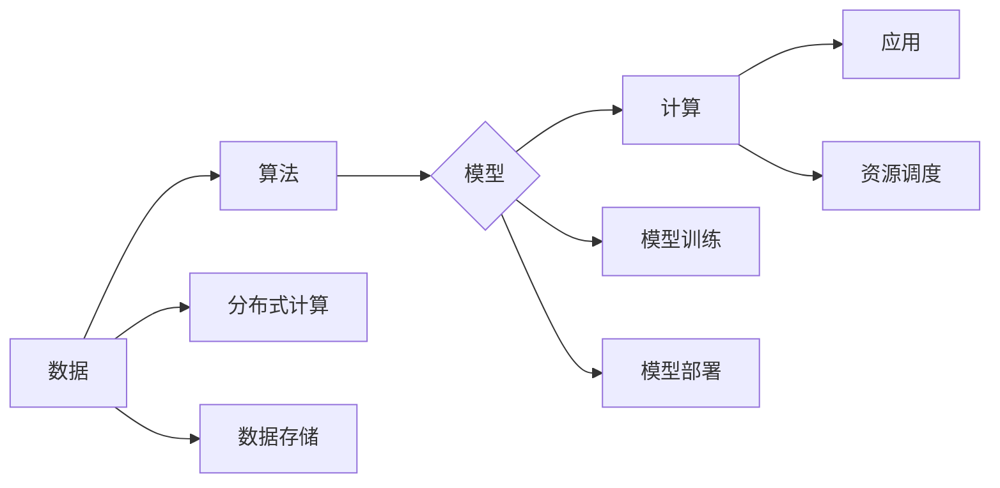

# 【AI大数据计算原理与代码实例讲解】容器

## 1. 背景介绍

### 1.1 大数据与AI的融合趋势

近年来，随着数据规模的爆炸式增长和计算能力的飞速提升，人工智能(AI)技术取得了突破性进展，并在各个领域展现出巨大的应用潜力。与此同时，大数据技术也日趋成熟，为AI的发展提供了强大的数据支撑。大数据与AI的融合已成为不可阻挡的趋势，两者相辅相成，共同推动着科技进步和社会发展。

### 1.2 容器技术带来的变革

容器技术作为一种轻量级虚拟化技术，能够将应用程序及其依赖项打包成一个独立的运行环境，具有快速部署、易于迁移、资源隔离等优势。在AI大数据领域，容器技术能够有效解决环境配置复杂、资源利用率低、模型部署困难等问题，为AI应用的开发、测试、部署和运维带来了极大的便利。

### 1.3 本文目标

本文旨在深入浅出地介绍AI大数据计算的基本原理，并结合容器技术，详细讲解如何利用容器构建高效、灵活、可扩展的AI大数据计算平台。文章将从以下几个方面展开：

* 阐述AI大数据计算的核心概念和关键技术；
* 介绍常用的AI大数据计算框架和工具；
* 深入剖析容器技术在AI大数据计算中的应用；
* 通过具体代码实例，演示如何利用容器构建和部署AI大数据应用；
* 探讨AI大数据计算的未来发展趋势和挑战。

## 2. 核心概念与联系

### 2.1 AI大数据计算

AI大数据计算是指利用大数据技术和AI算法，从海量数据中提取有价值的信息，并应用于实际场景的过程。它涉及数据采集、存储、处理、分析、建模、预测等多个环节，涵盖了机器学习、深度学习、自然语言处理、计算机视觉等多个领域。

### 2.2 核心概念

* **数据**:  AI大数据计算的基础，包括结构化数据、半结构化数据和非结构化数据。
* **算法**:  用于分析和处理数据的规则和方法，例如分类算法、回归算法、聚类算法等。
* **模型**:  对数据进行抽象和概括的数学或逻辑表示，例如决策树、神经网络等。
* **计算**:  对数据进行处理和分析的过程，需要强大的计算能力和高效的算法。
* **应用**:  将AI大数据计算的结果应用于实际场景，例如图像识别、语音识别、推荐系统等。

### 2.3 关键技术

* **分布式计算**:  将计算任务分解成多个子任务，并分配给多个节点进行并行处理，以提高计算效率。
* **数据存储**:  高效地存储和管理海量数据，例如分布式文件系统、NoSQL数据库等。
* **资源调度**:  合理地分配计算资源，以保证各个任务的顺利执行。
* **模型训练**:  利用大量数据训练AI模型，以提高模型的准确性和泛化能力。
* **模型部署**:  将训练好的AI模型部署到生产环境，提供实时预测服务。

### 2.4 概念联系图



## 3. 核心算法原理具体操作步骤

### 3.1 机器学习算法

#### 3.1.1 监督学习

监督学习是指利用已知标签的训练数据训练模型，然后用训练好的模型对未知标签的数据进行预测。常见的监督学习算法包括：

* **线性回归**:  用于预测连续值，例如房价预测、股票预测等。
* **逻辑回归**:  用于预测二分类问题，例如垃圾邮件分类、疾病诊断等。
* **支持向量机**:  用于分类和回归问题，能够处理高维数据和非线性问题。
* **决策树**:  用于分类和回归问题，易于理解和解释。
* **随机森林**:  由多个决策树组成，能够有效防止过拟合。

#### 3.1.2 无监督学习

无监督学习是指利用没有标签的训练数据训练模型，然后用训练好的模型对数据进行聚类、降维等操作. 常见的无监督学习算法包括：

* **K-Means聚类**:  将数据分成K个簇，使得簇内数据相似度高，簇间数据相似度低。
* **主成分分析**:  将高维数据降维到低维空间，保留数据的主要信息。

### 3.2 深度学习算法

深度学习是机器学习的一个分支，其核心是神经网络。神经网络是由多个神经元组成的网络结构，能够模拟人脑的学习过程。常见的深度学习算法包括：

* **卷积神经网络**:  用于图像识别、目标检测等领域。
* **循环神经网络**:  用于自然语言处理、语音识别等领域。
* **生成对抗网络**:  用于生成图像、文本等数据。

### 3.3 算法操作步骤

以线性回归为例，介绍机器学习算法的操作步骤：

1. **数据准备**:  收集并清洗数据，将数据分成训练集和测试集。
2. **特征工程**:  对数据进行特征提取和特征选择，构建特征向量。
3. **模型训练**:  利用训练集数据训练线性回归模型，得到模型参数。
4. **模型评估**:  利用测试集数据评估模型的性能，例如均方误差、R方值等。
5. **模型预测**:  利用训练好的模型对新的数据进行预测。

## 4. 数学模型和公式详细讲解举例说明

### 4.1 线性回归模型

线性回归模型假设目标变量与自变量之间存在线性关系，其数学模型如下：

$$
y = w_0 + w_1x_1 + w_2x_2 + ... + w_nx_n + \epsilon
$$

其中：

* $y$ 是目标变量；
* $x_1, x_2, ..., x_n$ 是自变量；
* $w_0, w_1, w_2, ..., w_n$ 是模型参数；
* $\epsilon$ 是误差项。

### 4.2 模型训练

线性回归模型的训练目标是找到一组最优的模型参数，使得模型的预测值与真实值之间的误差最小。常用的损失函数是均方误差(MSE)：

$$
MSE = \frac{1}{m}\sum_{i=1}^{m}(y_i - \hat{y_i})^2
$$

其中：

* $m$ 是样本数量；
* $y_i$ 是第 $i$ 个样本的真实值；
* $\hat{y_i}$ 是第 $i$ 个样本的预测值。

### 4.3 模型求解

线性回归模型的求解方法有很多，例如最小二乘法、梯度下降法等。

#### 4.3.1 最小二乘法

最小二乘法是线性回归模型的一种解析解法，其基本思想是找到一组模型参数，使得损失函数最小。

#### 4.3.2 梯度下降法

梯度下降法是一种迭代优化算法，其基本思想是沿着损失函数梯度的反方向不断更新模型参数，直到损失函数达到最小值。

### 4.4 举例说明

假设我们要预测房价，收集了以下数据：

| 面积(平方米) | 房价(万元) |
|---|---|
| 50 | 300 |
| 60 | 350 |
| 70 | 400 |
| 80 | 450 |
| 90 | 500 |

我们可以利用线性回归模型来预测房价。首先，将数据分成训练集和测试集：

* 训练集: (50, 300), (60, 350), (70, 400)
* 测试集: (80, 450), (90, 500)

然后，利用最小二乘法求解模型参数：

$$
w_0 = 100, w_1 = 5
$$

因此，线性回归模型为：

$$
y = 100 + 5x
$$

其中：

* $y$ 是房价(万元)；
* $x$ 是面积(平方米)。

利用该模型，我们可以预测面积为80平方米的房价为：

$$
y = 100 + 5 \times 80 = 500
$$

## 5. 项目实践：代码实例和详细解释说明

### 5.1 数据集介绍

本节将以手写数字识别为例，介绍如何利用容器构建和部署AI大数据应用。我们将使用MNIST数据集，该数据集包含60000张训练图片和10000张测试图片，每张图片都是一个28x28像素的手写数字灰度图像。

### 5.2 构建Docker镜像

首先，我们需要构建一个Docker镜像，用于运行手写数字识别应用。Dockerfile如下：

```dockerfile
FROM python:3.7

# 安装依赖库
RUN pip install tensorflow keras numpy

# 复制代码文件到镜像中
COPY . /app

# 设置工作目录
WORKDIR /app

# 暴露端口
EXPOSE 8080

# 启动应用
CMD ["python", "app.py"]
```

### 5.3 编写代码

接下来，编写手写数字识别应用的代码，app.py：

```python
import tensorflow as tf
from tensorflow import keras
import numpy as np
from flask import Flask, request, jsonify

# 加载MNIST数据集
(x_train, y_train), (x_test, y_test) = keras.datasets.mnist.load_data()

# 数据预处理
x_train = x_train.astype('float32') / 255.0
x_test = x_test.astype('float32') / 255.0

